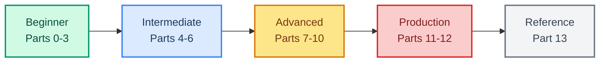
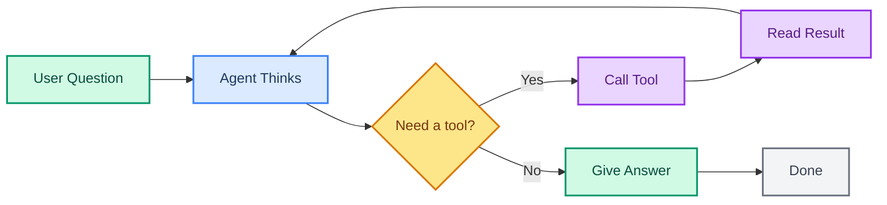

# Learn Agentic AI with LangChain - A Beginner's Complete Guide

> Build production-grade AI agents using LangChain 1.x, Groq (openai/gpt-oss-120b), and 100% free tools.
> From your first "hello agent" to multi-agent infrastructure systems.
> No prior LangChain experience needed. Python basics recommended.

---

## Quick Info

| | |
|---|---|
| **Audience** | Beginners to Agentic AI (Python basics) |
| **Model** | Groq `openai/gpt-oss-120b` (free tier) |
| **Framework** | LangChain 1.x + LangGraph |
| **Cost** | All examples use free tiers only |
| **Style** | Simple English, every code block is runnable |
| **Last Updated** | August 2026 |

---

## Course Map (Visual)

```mermaid
graph TD
    Start([Start Here]) --> P0

    subgraph P0["Part 0: Foundations"]
        P0A["00: How to Learn Agentic AI"] --> P0B["01: Setup and Installation"]
    end

    P0 --> P1

    subgraph P1["Part 1: Core Agent Building (ch 02-06)"]
        direction TB
        P1A["02: Understanding LLMs"] --> P1B["03: Messages"]
        P1B --> P1C["04: Your First Agent"]
        P1C --> P1D["05: Tools Basics"]
        P1D --> P1E["06: Advanced Tool Patterns"]
    end

    P1 --> P2

    subgraph P2["Part 2: Memory and State (ch 07-10)"]
        direction TB
        P2A["07: Short-Term Memory"] --> P2B["08: Long-Term Memory"]
        P2B --> P2C["09: Context and Runtime"]
        P2C --> P2D["10: Summarization"]
    end

    P2 --> P3

    subgraph P3["Part 3: Tools Deep Dive (ch 11-13)"]
        direction TB
        P3A["11: Tool Error Handling"] --> P3B["12: Dynamic Tool Selection"]
        P3B --> P3C["13: Real-World Tools"]
    end

    P3 --> P4

    subgraph P4["Part 4: Middleware and Harness (ch 14-18)"]
        direction TB
        P4A["14: Middleware Overview"] --> P4B["15: Fault Tolerance"]
        P4B --> P4C["16: Guardrails"]
        P4C --> P4D["17: Custom Middleware"]
        P4D --> P4E["18: Human-in-the-Loop"]
    end

    P4 --> P5

    subgraph P5["Part 5: Advanced Capabilities (ch 19-24)"]
        direction TB
        P5A["19: Structured Output"] --> P5B["20: Streaming"]
        P5B --> P5C["21: RAG"]
        P5C --> P5D["22: MCP Tools"]
        P5D --> P5E["23: FastMCP Servers"]
        P5E --> P5F["24: Agent Skills"]
    end

    P5 --> P6

    subgraph P6["Part 6: Multi-Agent Systems (ch 25-27)"]
        direction TB
        P6A["25: Multi-Agent Overview"] --> P6B["26: Subagents"]
        P6B --> P6C["27: LangGraph Orchestration"]
    end

    P6 --> P7

    subgraph P7["Part 7: Evaluation and Performance (ch 28-30)"]
        direction TB
        P7A["28: Observability with LangSmith"] --> P7B["29: Agent Evaluation"]
        P7B --> P7C["30: Performance Optimization"]
    end

    P7 --> P8

    subgraph P8["Part 8: Security (ch 31-34)"]
        direction TB
        P8A["31: Security Overview"] --> P8B["32: Prompt Injection Defense"]
        P8B --> P8C["33: Tool Security"]
        P8C --> P8D["34: Data Security and Privacy"]
    end

    P8 --> P9

    subgraph P9["Part 9: System Design and Architecture (ch 35-38)"]
        direction TB
        P9A["35: System Design Overview"] --> P9B["36: Architecture Patterns"]
        P9B --> P9C["37: Designing for Scale"]
        P9C --> P9D["38: Production Readiness"]
    end

    P9 --> P10

    subgraph P10["Part 10: AI Infrastructure (ch 39-43)"]
        direction TB
        P10A["39: Infrastructure Overview"] --> P10B["40: Model Serving and Routing"]
        P10B --> P10C["41: Vector DB Infrastructure"]
        P10C --> P10D["42: Caching and Queues"]
        P10D --> P10E["43: Deployment Platforms"]
    end

    P10 --> P11

    subgraph P11["Part 11: Testing and Deployment (ch 44-46)"]
        direction TB
        P11A["44: Testing Agents"] --> P11B["45: Deployment Guide"]
        P11B --> P11C["46: CI/CD for AI Agents"]
    end

    P11 --> P12

    subgraph P12["Part 12: Advanced Real-World Projects (ch 47-51)"]
        direction TB
        P12A["47: Podman Troubleshooting Agent"] --> P12B["48: ETL Pipeline Agent"]
        P12B --> P12C["49: Unified Multi-Source Search"]
        P12C --> P12D["50: Infra Drift Detection"]
        P12D --> P12E["51: PLC Diagnostic Agent"]
    end

    P12 --> P13

    subgraph P13["Part 13: Appendices (A-D)"]
        P13A["A: API Reference"]
        P13B["B: Troubleshooting"]
        P13C["C: Directory Structure"]
        P13D["D: Glossary"]
    end

    classDef startClass fill:#b3ffe0,stroke:#00a36c,stroke-width:3px,color:#003d2b
    classDef part0 fill:#dbeafe,stroke:#3b82f6,stroke-width:2px,color:#1e3a5f
    classDef part1 fill:#fde68a,stroke:#d97706,stroke-width:2px,color:#78350f
    classDef part2 fill:#c7d2fe,stroke:#6366f1,stroke-width:2px,color:#312e81
    classDef part3 fill:#bcf5d4,stroke:#059669,stroke-width:2px,color:#064e3b
    classDef part4 fill:#fbcccc,stroke:#dc2626,stroke-width:2px,color:#7f1d1d
    classDef part5 fill:#e9d5ff,stroke:#9333ea,stroke-width:2px,color:#581c87
    classDef part6 fill:#dbeafe,stroke:#2563eb,stroke-width:2px,color:#1e3a8a
    classDef part7 fill:#fef3c7,stroke:#f59e0b,stroke-width:2px,color:#78351f
    classDef part8 fill:#fecaca,stroke:#dc2626,stroke-width:2px,color:#7f1d1d
    classDef part9 fill:#d1fae5,stroke:#059669,stroke-width:2px,color:#064e3b
    classDef part10 fill:#e0e7ff,stroke:#4f46e5,stroke-width:2px,color:#312e81
    classDef part11 fill:#fce7f3,stroke:#db2777,stroke-width:2px,color:#831843
    classDef part12 fill:#fff7ed,stroke:#ea580c,stroke-width:2px,color:#7c2d12
    classDef part13 fill:#f3f4f6,stroke:#6b7280,stroke-width:2px,color:#374151

    class Start startClass
    class P0,P0A,P0B part0
    class P1A,P1B,P1C,P1D,P1E part1
    class P2A,P2B,P2C,P2D part2
    class P3A,P3B,P3C part3
    class P4A,P4B,P4C,P4D,P4E part4
    class P5A,P5B,P5C,P5D,P5E,P5F part5
    class P6A,P6B,P6C part6
    class P7A,P7B,P7C part7
    class P8A,P8B,P8C,P8D part8
    class P9A,P9B,P9C,P9D part9
    class P10A,P10B,P10C,P10D,P10E part10
    class P11A,P11B,P11C part11
    class P12A,P12B,P12C,P12D,P12E part12
    class P13A,P13B,P13C,P13D part13
```

---

## Learning Path

**If you are completely new** - Read Parts 0 to 6 in order. Code every example.  
**If you know LangChain basics** - Start at Part 4 (Middleware).  
**If you are preparing for production** - Focus on Parts 7 to 11.  
**If you want portfolio projects** - Go straight to Part 12 (but read Part 8 Security first).

---

## Complete Chapter Index

### Part 0: Foundations

| # | File | What You Learn |
|---|------|---------------|
| 00 | `00-README.md` | This document - course map, how to learn, what you will build |
| 01 | `01-setup-and-installation.md` | Python venv, pip install, .env, Groq API key, hello agent |

### Part 1: Core Agent Building (ch 02-06)

| # | File | What You Learn |
|---|------|---------------|
| 02 | `02-llm-and-models.md` | ChatGroq, init_chat_model, temperature, model switching |
| 03 | `03-messages.md` | HumanMessage, AIMessage, SystemMessage, ToolMessage, content_blocks |
| 04 | `04-creating-your-first-agent.md` | create_agent, the agent loop, invoke, pretty_print |
| 05 | `05-tools-basics.md` | @tool decorator, type hints, docstrings, simple tools |
| 06 | `06-tools-advanced.md` | Pydantic schemas, ToolRuntime, return types, multimodal |

### Part 2: Memory and State (ch 07-10)

| # | File | What You Learn |
|---|------|---------------|
| 07 | `07-short-term-memory.md` | InMemorySaver, thread_id, multi-turn persistence |
| 08 | `08-long-term-memory-and-store.md` | InMemoryStore, namespace/key, cross-session memory |
| 09 | `09-context-and-runtime.md` | context_schema, ToolRuntime (state, context, store, stream) |
| 10 | `10-summarization-middleware.md` | SummarizationMiddleware, context compression |

### Part 3: Tools Deep Dive (ch 11-13)

| # | File | What You Learn |
|---|------|---------------|
| 11 | `11-tool-error-handling.md` | @wrap_tool_call, ToolRetryMiddleware, graceful failures |
| 12 | `12-dynamic-tool-selection.md` | ToolListMiddleware, filtering, lazy-loading tools |
| 13 | `13-real-world-tools.md` | Calculator, SQLite, weather, web search (Tavily free) |

### Part 4: Middleware and Harness (ch 14-18)

| # | File | What You Learn |
|---|------|---------------|
| 14 | `14-middleware-overview.md` | What middleware is, 6 categories, composing |
| 15 | `15-fault-tolerance.md` | ModelRetryMiddleware, ToolRetryMiddleware, fallbacks |
| 16 | `16-guardrails.md` | PII detection, content controls, validation |
| 17 | `17-custom-middleware.md` | wrap_model_call, wrap_tool_call, audit logging |
| 18 | `18-human-in-the-loop.md` | interrupt(), approval gates, resume after review |

### Part 5: Advanced Capabilities (ch 19-24)

| # | File | What You Learn |
|---|------|---------------|
| 19 | `19-structured-output.md` | response_format=PydanticModel, structured_response |
| 20 | `20-streaming.md` | stream_events(v3), stream(), real-time UI patterns |
| 21 | `21-retrieval-rag.md` | Loaders, splitters, embeddings, Chroma local, retriever tools |
| 22 | `22-mcp-tools.md` | Model Context Protocol, langchain-mcp-adapters, remote servers |
| 23 | `23-fastmcp-building-servers.md` | FastMCP library, defining tools as MCP endpoints |
| 24 | `24-agent-skills.md` | SkillsMiddleware, skill packs, on-demand knowledge |

### Part 6: Multi-Agent Systems (ch 25-27)

| # | File | What You Learn |
|---|------|---------------|
| 25 | `25-multi-agent-overview.md` | Supervisor, swarm, hierarchical architectures |
| 26 | `26-subagents.md` | SubAgentMiddleware, parallel isolated work |
| 27 | `27-langgraph-orchestration.md` | State, nodes, edges, conditional routing, custom graphs |

### Part 7: Agent Evaluation and Performance (ch 28-30)

| # | File | What You Learn |
|---|------|---------------|
| 28 | `28-observability-langsmith.md` | LangSmith tracing (free), inspecting traces, token costs |
| 29 | `29-agent-evaluation.md` | Datasets, evaluators, LLM-as-judge, regression testing, CI eval |
| 30 | `30-performance-optimization.md` | Model routing, prompt caching, parallel tools, latency profiling |

### Part 8: Security (ch 31-34)

| # | File | What You Learn |
|---|------|---------------|
| 31 | `31-security-overview.md` | Threat model, OWASP for LLMs, defense-in-depth |
| 32 | `32-prompt-injection-defense.md` | System prompt hardening, input/output validation, trust boundaries |
| 33 | `33-tool-security.md` | Least privilege, tool scoping, sandboxing, audit logging |
| 34 | `34-data-security-privacy.md` | PII redaction, encryption, GDPR patterns, secrets management |

### Part 9: System Design and Architecture (ch 35-38)

| # | File | What You Learn |
|---|------|---------------|
| 35 | `35-system-design-overview.md` | Agents vs pipelines, stateful vs stateless, tradeoffs |
| 36 | `36-agent-architecture-patterns.md` | Patterns with Mermaid diagrams, selection guide |
| 37 | `37-designing-for-scale.md` | Horizontal scaling, externalized state, multi-tenant |
| 38 | `38-production-readiness-checklist.md` | Eval gates, security audit, monitoring, runbook template |

### Part 10: AI Infrastructure (ch 39-43)

| # | File | What You Learn |
|---|------|---------------|
| 39 | `39-ai-infrastructure-overview.md` | Full stack map, self-hosted vs managed, cost architecture |
| 40 | `40-model-serving-and-routing.md` | Groq vs OpenAI vs Ollama, model gateway, fallback chains |
| 41 | `41-vector-db-infrastructure.md` | Chroma vs Qdrant/Weaviate/Pinecone, index tuning, sharding |
| 42 | `42-caching-and-queue-infrastructure.md` | Semantic cache, Redis, message queues, DLQ, checkpoint backends |
| 43 | `43-deployment-platforms.md` | LangGraph Platform, Docker, Kubernetes, free hosting comparison |

### Part 11: Testing and Deployment (ch 44-46)

| # | File | What You Learn |
|---|------|---------------|
| 44 | `44-testing-agents.md` | Unit tests, mocking models, pytest fixtures, snapshot tests |
| 45 | `45-deployment-guide.md` | FastAPI wrapping, Docker, health checks, zero-downtime |
| 46 | `46-cicd-for-ai-agents.md` | CI/CD pipeline, eval gates, rollback, API gateway, LLM routing, model tiers |

### Part 12: Advanced Real-World Projects (ch 47-51)

| # | File | What You Learn | Portfolio Value |
|---|------|---------------|-----------------|
| 47 | `project-1-podman-troubleshooting-agent.md` | Multi-agent diagnostics + HITL approval for destructive actions | DevOps + AI |
| 48 | `project-2-etl-pipeline-agent.md` | Agentic ETL with extract/transform/load subagents + checkpointing | Data Engineering + AI |
| 49 | `project-3-unified-search-agent.md` | Multi-source: SQL + vector DB + web + memory store, ranked merge | Search + AI |
| 50 | `project-4-infra-drift-detection-agent.md` | Live vs declared config comparison, HITL before fixes, audit trail | Infra + AI |
| 51 | `project-5-plc-diagnostic-agent.md` | PLC telemetry via MCP, iterative hypothesis-test diagnosis loop, HITL before writes | Industrial + AI |

### Part 13: Appendices

| # | File | What You Learn |
|---|------|---------------|
| A | `appendix-A-api-reference.md` | All create_agent params, @tool options, middleware quick ref |
| B | `appendix-B-troubleshooting.md` | Common errors, Groq issues, rate limits, MCP connection issues |
| C | `appendix-C-directory-structure.md` | Full conceptual production layout with folder explanations |
| D | `appendix-D-glossary.md` | Plain-English definitions for every agentic AI term |

---

## Reference Directory Structure

> This is a conceptual layout shown in chapters for how to organize real-world code. The actual repository contains only the `docs/` folder with these Markdown files.

```mermaid
graph TD
    Root["langchain_agents_01/"] --> Docs["docs/<br/>All .md learning chapters"]
    Docs --> Chapters["51 chapters (00-51)"]
    Docs --> Appendices["4 appendices (A-D)"]

    Root -.-> Concept["(Conceptual layout<br/>shown in chapters)"]
    Concept --> Agents["agents/<br/>Agent factory functions"]
    Concept --> Core["core/<br/>Config, model setup, base state"]
    Concept --> Tools["tools/<br/>@tool definitions"]
    Concept --> Memory["memory/<br/>Checkpointer and store setup"]
    Concept --> MW["middleware/<br/>Custom middleware, guardrails, HITL"]
    Concept --> SkillsDir["skills/<br/>Agent skills definitions"]
    Concept --> MCPServ["mcp_servers/<br/>FastMCP server definitions"]
    Concept --> Data["data/<br/>RAG docs, SQLite DBs, vector DB files"]
    Concept --> Projects["projects/<br/>Full project entry points"]

    style Root fill:#f3f4f6,stroke:#374151,stroke-width:2px,color:#1f2937
    style Docs fill:#dbeafe,stroke:#3b82f6,stroke-width:2px,color:#1e3a5f
    style Concept fill:#fde68a,stroke:#d97706,stroke-width:2px,color:#78350f,stroke-dasharray: 5 5
    style Chapters fill:#e0e7ff,stroke:#6366f1,stroke-width:1px,color:#312e81
    style Appendices fill:#e0e7ff,stroke:#6366f1,stroke-width:1px,color:#312e81
    style Agents fill:#d1fae5,stroke:#059669,stroke-width:1px,color:#064e3b
    style Core fill:#d1fae5,stroke:#059669,stroke-width:1px,color:#064e3b
    style Tools fill:#d1fae5,stroke:#059669,stroke-width:1px,color:#064e3b
    style Memory fill:#d1fae5,stroke:#059669,stroke-width:1px,color:#064e3b
    style MW fill:#d1fae5,stroke:#059669,stroke-width:1px,color:#064e3b
    style SkillsDir fill:#d1fae5,stroke:#059669,stroke-width:1px,color:#064e3b
    style MCPServ fill:#d1fae5,stroke:#059669,stroke-width:1px,color:#064e3b
    style Data fill:#d1fae5,stroke:#059669,stroke-width:1px,color:#064e3b
    style Projects fill:#d1fae5,stroke:#059669,stroke-width:1px,color:#064e3b
```

---

## Prerequisites Checklist

Before starting, make sure you have:

- [ ] Python 3.11+ installed
- [ ] A free [Groq API key](https://console.groq.com)
- [ ] A free [Tavily API key](https://tavily.com) (for web search chapters)
- [ ] A free [LangSmith account](https://smith.langchain.com) (for tracing chapters)
- [ ] Basic Python knowledge (functions, classes, imports)
- [ ] A terminal or IDE (VS Code recommended)

---

## Official Documentation Links

| Topic | Link |
|-------|------|
| LangChain Overview | https://docs.langchain.com/oss/python/langchain/overview |
| LangChain Agents | https://docs.langchain.com/oss/python/langchain/agents |
| LangChain Tools | https://docs.langchain.com/oss/python/langchain/tools |
| LangChain Models | https://docs.langchain.com/oss/python/langchain/models |
| LangChain Messages | https://docs.langchain.com/oss/python/langchain/messages |
| LangChain Middleware | https://docs.langchain.com/oss/python/langchain/middleware |
| LangChain Streaming | https://docs.langchain.com/oss/python/langchain/streaming |
| LangChain Structured Output | https://docs.langchain.com/oss/python/langchain/structured-output |
| LangGraph Overview | https://docs.langchain.com/oss/python/langgraph/overview |
| LangSmith Observability | https://docs.langchain.com/langsmith/observability |
| Deep Agents | https://docs.langchain.com/oss/python/deepagents/overview |
| Multi-Agent Systems | https://docs.langchain.com/oss/python/langchain/multi-agent |
| MCP | https://docs.langchain.com/oss/python/langchain/mcp |
| Retrieval/RAG | https://docs.langchain.com/oss/python/langchain/retrieval |

---

## What You Will Be Able to Build

By the end of this course:

- [ ] Build a single-agent that uses tools to answer questions
- [ ] Add memory so your agent remembers across conversations
- [ ] Create custom tools for any API or database
- [ ] Build a multi-agent system with subagents working in parallel
- [ ] Connect your agent to external services via MCP
- [ ] Build your own MCP tool server with FastMCP
- [ ] Give your agent domain knowledge with skills
- [ ] Evaluate and benchmark your agent's quality
- [ ] Optimize agent performance for speed and cost
- [ ] Secure your agent against prompt injection and tool abuse
- [ ] Design a production-grade agent architecture
- [ ] Deploy your agent with Docker and monitoring
- [ ] Build a portfolio with 4 advanced real-world projects

---

## What Is Agentic AI? (Quick Intro)

An **agent** is an AI system that does more than just generate text. It can:

1. **Think** - Understand a task and plan how to solve it
2. **Act** - Call tools (search, calculate, query databases, run code)
3. **Observe** - Read the results from those tools
4. **Repeat** - Keep going until the task is done

LangChain calls this the **Agent Loop**. The agent keeps looping through Think -> Act -> Observe until it has enough information to answer the user's question.

---

## How Each Chapter Is Structured

Every chapter follows the same format so you always know what to expect:

1. **Title and Summary** - What this chapter covers and why it matters
2. **Key Concepts** - The main ideas explained in simple English
3. **Visual Diagram** - A Mermaid diagram showing how the pieces fit together
4. **Code Example** - Complete, runnable Python code you can copy and paste
5. **Step-by-Step Explanation** - Line-by-line walkthrough of the code
6. **Try It Yourself** - A small exercise to practice what you learned
7. **Common Mistakes** - Errors beginners make and how to fix them
8. **Next Steps** - Link to the next chapter

---

> **Total: 51 chapters + 4 appendices = 55 Markdown files**