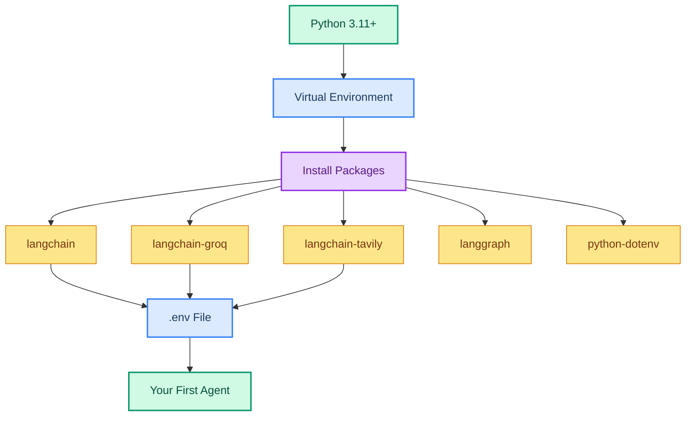

# Setting Up Your Development Environment

> **Goal:** Get a working Python environment with LangChain, Groq, and your first running agent.  
> **Time needed:** 15-20 minutes  
> **Previous chapter:** [00 - How to Learn Agentic AI](./00-README.md)  
> **Next chapter:** [02 - Understanding Language Models](./02-llm-and-models.md)

---

## What You Will Build

By the end of this chapter, you will have:
1. A Python virtual environment with all needed packages
2. A `.env` file with your API keys
3. A working "hello agent" that answers questions using Groq

---

## Architecture Overview



---

## Step 1: Check Your Python Version

Open a terminal and run:

```bash
python3 --version
```

You need **Python 3.11 or higher**. If you have an older version, upgrade it first.

To check on macOS:

```bash
brew install python@3.11
```

To check on Ubuntu/Linux:

```bash
sudo apt update && sudo apt install python3.11 python3.11-venv
```

---

## Step 2: Create a Project Folder

```bash
mkdir langchain_agents_01
cd langchain_agents_01
```

---

## Step 3: Create a Virtual Environment

A virtual environment keeps your project packages separate from your system Python.

**On macOS/Linux:**

```bash
python3 -m venv .venv
source .venv/bin/activate
```

**On Windows (PowerShell):**

```powershell
python -m venv .venv
.venv\Scripts\Activate.ps1
```

You should see `(.venv)` at the start of your terminal prompt. This means the virtual environment is active.

**To deactivate later (do not run this now):**

```bash
deactivate
```

---

## Step 4: Install Packages

Run this single command to install everything you need:

```bash
pip install langchain langchain-groq langchain-tavily langgraph python-dotenv
```

Here is what each package does:

| Package | What It Does |
|---------|-------------|
| `langchain` | The main LangChain framework (agents, tools, memory) |
| `langchain-groq` | Connects LangChain to Groq's fast model API |
| `langchain-tavily` | Web search tool (free tier available) |
| `langgraph` | The orchestration engine under LangChain agents |
| `python-dotenv` | Loads API keys from a `.env` file |

**Verify the installation:**

```bash
pip list | grep langchain
```

You should see something like:

```
langchain                1.3.x
langchain-groq           0.x.x
langchain-tavily         0.x.x
langgraph                1.x.x
```

---

## Step 5: Get Your API Keys

You need **two free API keys** to start:

### Groq API Key (Required)

1. Go to https://console.groq.com
2. Sign up for a free account
3. Go to **API Keys** in the left sidebar
4. Click **Create API Key**
5. Copy the key (starts with `gsk_...`)

### Tavily API Key (Required for web search chapters)

1. Go to https://tavily.com
2. Sign up for a free account
3. Go to **API Keys** in the dashboard
4. Copy the key (starts with `tvly-...`)

> Both Groq and Tavily have generous free tiers. You do not need a credit card.

---

## Step 6: Create Your `.env` File

In your project folder, create a file named `.env`:

```bash
touch .env
```

Open it in your editor and add:

```env
GROQ_API_KEY=gsk_your_groq_key_here
TAVILY_API_KEY=tvly_your_tavily_key_here
```

**Never share your `.env` file or commit it to Git.** If you set up Git later, create a `.gitignore` file with:

```
.env
.venv/
__pycache__/
```

---

## Step 7: Test Your First Agent

Create a file called `main.py`:

```python
from dotenv import load_dotenv
load_dotenv()

from langchain_groq import ChatGroq
from langchain_tavily import TavilySearch
from langchain.agents import create_agent

# Step 1: Create the LLM (Language Model)
llm = ChatGroq(
    model="openai/gpt-oss-120b",
    temperature=0,
)

# Step 2: Create a web search tool
web_search = TavilySearch(
    max_results=2,
    include_raw_content=False,
    include_answer=True,
)

# Step 3: Create an agent with the model and tool
agent = create_agent(
    model=llm,
    tools=[web_search],
    system_prompt="You are a helpful assistant. Answer questions clearly.",
    verbose=True,
)

# Step 4: Ask the agent a question
query = "What is Agentic AI and what are the latest trends in 2026?"
result = agent.invoke({"messages": [{"role": "user", "content": query}]})

# Step 5: Print all messages in the conversation
for msg in result["messages"]:
    msg.pretty_print()
```

---

## Step 8: Run the Agent

```bash
python main.py
```

You should see output like:

```
================================ [1/4] ================================
Human: What is Agentic AI and what are the latest trends in 2026?
================================ [2/4] ================================
AI: [calls tavily_search tool]
================================ [3/4] ================================
Tool: Agentic AI refers to AI systems that can autonomously...
================================ [3/4] ================================
AI: Agentic AI is a type of artificial intelligence that...
```

---

## How It Works (Step-by-Step)

```mermaid
sequenceDiagram
    participant U as User
    participant A as Agent
    participant M as Model (Groq)
    participant T as Tool (Tavily)

    U->>A: "What is Agentic AI?"
    A->>M: Here is the question and my tools
    M->>A: I should search the web first
    A->>T: search("Agentic AI 2026")
    T->>A: Here are the results
    A->>M: Here are the search results
    M->>A: Here is my answer based on results
    A->>U: Agentic AI is...

    style U fill:#d1fae5,stroke:#059669,stroke-width:2px,color:#064e3b
    style A fill:#dbeafe,stroke:#3b82f6,stroke-width:2px,color:#1e3a5f
    style M fill:#fde68a,stroke:#d97706,stroke-width:2px,color:#78350f
    style T fill:#e9d5ff,stroke:#9333ea,stroke-width:2px,color:#581c87
```

Here is what each line of the code does:

- **`from dotenv import load_dotenv; load_dotenv()`** — Loads your API keys from the `.env` file
- **`ChatGroq(model="openai/gpt-oss-120b", ...)`** — Creates the Groq language model
  - `temperature=0` means no randomness (same question = same answer)
- **`TavilySearch(...)`** — Creates a web search tool
  - `max_results=2` limits results to 2 pages (saves API calls)
  - `include_answer=True` adds a summary answer from Tavily
- **`create_agent(model=llm, tools=[web_search], ...)`** — Creates the agent by combining the model and tools
  - `system_prompt` tells the agent how to behave
  - `verbose=True` prints each step so you can see what the agent does
- **`agent.invoke(...)`** — Sends the user's question to the agent
- **`result["messages"]`** — Contains the full conversation (human, AI, and tool messages)
- **`msg.pretty_print()`** — Prints each message in a readable format

---

## Try It Yourself

1. Change the question to something you are curious about
2. Change `temperature` to `0.7` and see how the answer changes
3. Remove `verbose=True` and notice the difference in output
4. Change `max_results` to `5` and see if the answer improves

---

## Common Mistakes

### Mistake 1: API Key Not Loaded

**Error:**
```
AuthenticationError: 401 Unauthorized
```

**Fix:** Make sure `.env` file exists in the same folder as `main.py` and has the correct keys. Run `load_dotenv()` before anything else.

### Mistake 2: Package Not Found

**Error:**
```
ModuleNotFoundError: No module named 'langchain_groq'
```

**Fix:** Your virtual environment is not active. Run `source .venv/bin/activate` first.

### Mistake 3: Wrong Model Name

**Error:**
```
NotFoundError: Model 'gpt-4' not found
```

**Fix:** Use `"openai/gpt-oss-120b"` for Groq. Do not use OpenAI model names directly.

### Mistake 4: Terminal Not in Project Folder

**Error:**
```
FileNotFoundError: .env file not found
```

**Fix:** Make sure you are in the `langchain_agents_01` folder when running `python main.py`. Use `pwd` to check.

---

## What You Learned

- How to set up a Python virtual environment
- How to install LangChain, Groq, and Tavily packages
- How to get and store free API keys
- How to create and run your first AI agent
- The agent loop: think, act, observe, repeat

---

## Next Steps

Now that your agent works, let's understand what the **language model** does and how to configure it.

Go to: [02 - Understanding Language Models](./02-llm-and-models.md)