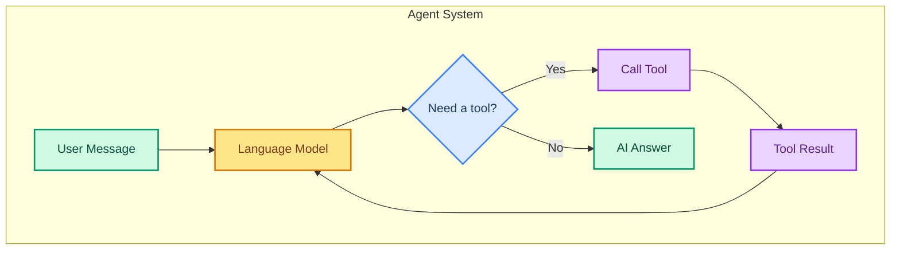
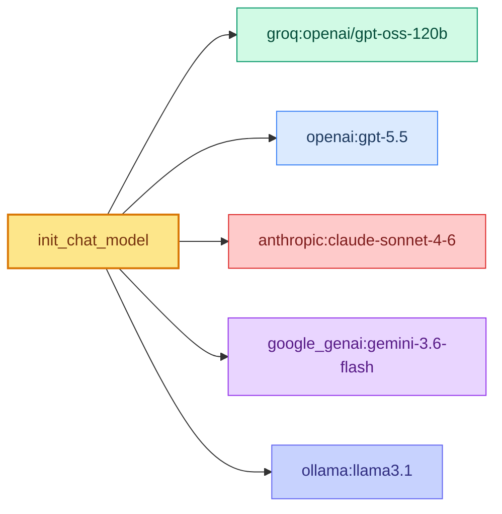

# Understanding Language Models in LangChain

> **Goal:** Learn how to create and configure language models in LangChain using Groq's `openai/gpt-oss-120b`.  
> **Previous chapter:** [01 - Setup and Installation](./01-setup-and-installation.md)  
> **Next chapter:** [03 - Messages: How Your Agent Talks](./03-messages.md)

---

## What Is a Language Model?

A **language model (LLM)** is the brain of your agent. It can:

1. **Read** text and understand what it means
2. **Think** about a question and decide what to do
3. **Write** responses, tool calls, and plans
4. **Choose** which tools to use and when

LangChain gives you one standard way to use models from many providers (Groq, OpenAI, Anthropic, Google, etc.). You write the same code and just change the model name.

---

## The Model's Role in an Agent



---

## Creating a Model with ChatGroq

The most direct way to create a model is using the `ChatGroq` class:

```python
from dotenv import load_dotenv
load_dotenv()

from langchain_groq import ChatGroq

# Create the model
llm = ChatGroq(
    model="openai/gpt-oss-120b",
    temperature=0,
)

# Use the model directly (no agent yet)
response = llm.invoke("What is 2 + 2?")
print(response.content)
# Output: 4
```

---

## Model Parameters Explained

### temperature (0 to 2)

Controls how random the model's answer is:

```python
# Low temperature = focused and predictable
llm_focused = ChatGroq(model="openai/gpt-oss-120b", temperature=0)

# High temperature = creative and random
llm_creative = ChatGroq(model="openai/gpt-oss-120b", temperature=1.5)
```

| Temperature Value | Behavior | Use Case |
|-------------------|----------|----------|
| 0 | Same answer every time | Facts, math, code |
| 0.3 | Mostly focused, slight variation | Helpful responses |
| 0.7 | Balanced | General chat |
| 1.0 | Creative | Brainstorming, ideas |
| 1.5+ | Very random | Creative writing |

### max_tokens

Limits how long the answer can be:

```python
llm = ChatGroq(
    model="openai/gpt-oss-120b",
    temperature=0,
    max_tokens=500,  # Maximum 500 tokens in the response
)
```

> **What is a token?** A token is roughly 4 characters or 3/4 of a word. "Hello world" is about 2 tokens.

### stop (Stop Sequences)

Tell the model to stop generating when it sees a specific string:

```python
llm = ChatGroq(
    model="openai/gpt-oss-120b",
    temperature=0,
    stop=["\n---\n"],  # Stop when it sees this separator
)
```

---

## init_chat_model: The Universal Model Loader

LangChain has a `init_chat_model` function that works with any provider:

```python
from dotenv import load_dotenv
load_dotenv()

from langchain.chat_models import init_chat_model

# Use Groq (what we use in this course)
llm_groq = init_chat_model("groq:openai/gpt-oss-120b", temperature=0)

# Use OpenAI (needs different API key)
# llm_openai = init_chat_model("openai:gpt-5.5", temperature=0)

# Use Anthropic (needs different API key)
# llm_anthropic = init_chat_model("anthropic:claude-sonnet-4-6", temperature=0)
```

The format is always `"provider:model_name"`:



The benefit of `init_chat_model` is that you can switch providers with a one-line change.

---

## Model Comparison Table

| Provider | Model String | Free Tier | Speed | Quality |
|----------|-------------|-----------|-------|---------|
| **Groq** | `groq:openai/gpt-oss-120b` | Yes | Very Fast | High |
| OpenAI | `openai:gpt-5.5` | No | Fast | Very High |
| Anthropic | `anthropic:claude-sonnet-4-6` | No | Medium | Very High |
| Google | `google_genai:gemini-3.6-flash` | Limited | Fast | High |
| Ollama | `ollama:llama3.1` | Self-hosted | Depends on hardware | Medium |

> We use **Groq** throughout this course because it is free, fast, and works well for learning.

---

## Testing Different Configurations

### Example: Temperature Comparison

```python
from dotenv import load_dotenv
load_dotenv()

from langchain_groq import ChatGroq

question = "Write a one-sentence story about a robot."

for temp in [0, 0.5, 1.0, 1.5]:
    llm = ChatGroq(model="openai/gpt-oss-120b", temperature=temp)
    response = llm.invoke(question)
    print(f"Temperature {temp}: {response.content}\n")
```

**Output (will vary):**

```
Temperature 0: A robot woke up and realized its purpose was to serve humanity.

Temperature 0.5: In a quiet lab, a robot danced with joy beneath fluorescent lights.

Temperature 1.0: The rusty robot whispered secrets to the moon while counting electric sheep.

Temperature 1.5: Robot spaghetti flew pancake dreams through quantum banana thunderstorms.
```

---

## Real-World Pattern: Model in a Config File

For real projects, keep your model setup in one place (conceptually `core/model.py`):

```python
from dotenv import load_dotenv
load_dotenv()

from langchain_groq import ChatGroq


def get_model(temperature: float = 0) -> ChatGroq:
    """Create the default Groq model for the whole project.

    Keep this in one place so you can change models easily.
    In a real project, this would live in core/model.py
    """
    return ChatGroq(
        model="openai/gpt-oss-120b",
        temperature=temperature,
        max_tokens=2000,
    )


# Usage:
llm = get_model()
response = llm.invoke("Explain what an API is in simple words.")
print(response.content)
```

> Why do this? If you ever switch from Groq to another provider, you only change one file.

---

## Can a Model Use Tools?

Yes. You can give tools directly to a model (without an agent) to see if it decides to call them:

```python
from dotenv import load_dotenv
load_dotenv()

from langchain_groq import ChatGroq
from langchain.tools import tool


@tool
def calculate(expression: str) -> str:
    """Calculate a math expression. Input should be a valid math expression."""
    try:
        result = eval(expression)
        return str(result)
    except Exception as e:
        return f"Error: {e}"


llm = ChatGroq(model="openai/gpt-oss-120b", temperature=0)

# Bind the tool to the model
llm_with_tools = llm.bind_tools([calculate])

# Ask a math question
response = llm_with_tools.invoke("What is 15 * 37?")
print(response.content)
print("Tool calls:", response.tool_calls)
```

**Output:**

```
Tool calls: [{'name': 'calculate', 'args': {'expression': '15 * 37'}, 'id': 'call_xxx'}]
```

The model decided to call the `calculate` tool. But without an agent, the tool does not actually run. You need an agent to execute the tool and return the result.

---

## Try It Yourself

1. Run the temperature comparison example and compare the outputs
2. Change `max_tokens` to 50 and see how the model truncates long answers
3. Try `init_chat_model` with the Groq provider
4. Create a simple function that returns different model configs based on a task type (like "creative" uses temperature 1.0, "factual" uses temperature 0)

---

## Common Mistakes

### Mistake 1: Using the Wrong Model String

**Wrong:**
```python
llm = ChatGroq(model="gpt-4")  # This is an OpenAI model, not Groq
```

**Correct:**
```python
llm = ChatGroq(model="openai/gpt-oss-120b")  # Groq-hosted model
```

### Mistake 2: Forgetting to Load Environment

**Wrong:**
```python
from langchain_groq import ChatGroq
llm = ChatGroq(model="openai/gpt-oss-120b")
# Error: Missing API key
```

**Correct:**
```python
from dotenv import load_dotenv
load_dotenv()  # Must come first!

from langchain_groq import ChatGroq
llm = ChatGroq(model="openai/gpt-oss-120b")
```

### Mistake 3: Very High Max Tokens with High Temperature

Setting `max_tokens=4000` and `temperature=2.0` will produce very long, nonsensical text. Use high temperature only for creative tasks.

---

## What You Learned

- What a language model does in an agent system
- How to create a model with `ChatGroq` and `init_chat_model`
- What temperature, max_tokens, and stop do
- How to switch between model providers
- How to bind tools to a model directly

---

## Next Steps

The model works with **messages** - human messages, AI messages, and tool messages. Let's understand how these messages flow through the agent.

Go to: [03 - Messages: How Your Agent Talks](./03-messages.md)