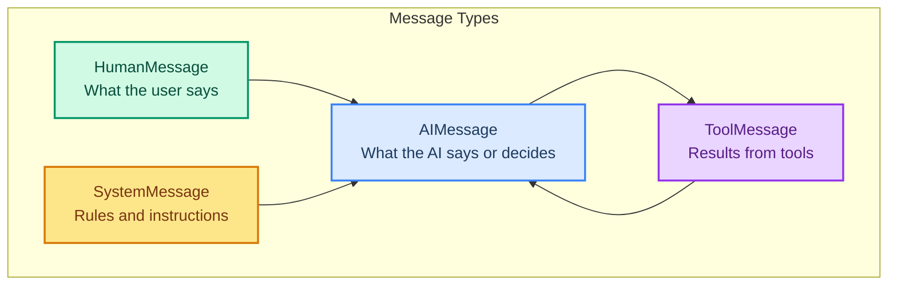
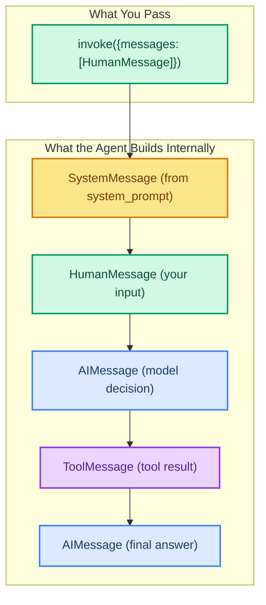

# Messages: How Your Agent Talks

> **Goal:** Understand the different message types in LangChain and how they flow through an agent.  
> **Previous chapter:** [02 - Understanding Language Models](./02-llm-and-models.md)  
> **Next chapter:** [04 - Creating Your First Agent](./04-creating-your-first-agent.md)

---

## Why Do Messages Matter?

An agent conversation is not just "user asks, AI answers." It is a sequence of messages:

1. The **Human** asks a question
2. The **AI** decides to call a tool
3. The **Tool** returns a result
4. The **AI** reads the result and answers

Each step is a **message**. LangChain has a message type for each role.

---

## The Four Message Types



| Message Type | Who Sends It | What It Contains | Example |
|--------------|-------------|------------------|---------|
| `HumanMessage` | The user | A question or instruction | "What is 2 + 2?" |
| `AIMessage` | The language model | An answer or a tool call decision | "I should use the calculator tool" |
| `SystemMessage` | The developer | Rules and context | "You are a helpful math tutor." |
| `ToolMessage` | A tool after running | The result of the tool call | "The answer is 4" |

---

## How Messages Flow in an Agent

```mermaid
sequenceDiagram
    participant S as SystemMessage
    participant H as HumanMessage
    participant AI as AIMessage
    participant T as ToolMessage

    S->>AI: "You are a helpful assistant"
    H->>AI: "What is 15 * 37?"
    AI->>T: [tool_call: calculate("15 * 37")]
    T->>AI: "555"
    AI->>H: "15 * 37 = 555"

    style S fill:#fde68a,stroke:#d97706,stroke-width:2px,color:#78350f
    style H fill:#d1fae5,stroke:#059669,stroke-width:2px,color:#064e3b
    style AI fill:#dbeafe,stroke:#3b82f6,stroke-width:2px,color:#1e3a5f
    style T fill:#e9d5ff,stroke:#9333ea,stroke-width:2px,color:#581c87
```

---

## Creating Messages Directly

You can create messages without an agent to understand how they work:

```python
from dotenv import load_dotenv
load_dotenv()

from langchain_groq import ChatGroq
from langchain.messages import HumanMessage, SystemMessage, AIMessage, ToolMessage

# Create individual messages
system_msg = SystemMessage(content="You are a friendly math tutor. Keep answers short.")
human_msg = HumanMessage(content="What is 15 * 37?")

# Create the model
llm = ChatGroq(model="openai/gpt-oss-120b", temperature=0)

# Send messages to the model
response = llm.invoke([system_msg, human_msg])
print(type(response))  # <class 'AIMessage'>
print(response.content)  # "15 * 37 = 555"
```

---

## Message Properties

### content (string)

The text of the message:

```python
msg = HumanMessage(content="Hello there!")
print(msg.content)  # "Hello there!"
```

### role (string)

The role of the message sender:

```python
msg = HumanMessage(content="Hi")
print(msg.type)  # "human"

ai_msg = AIMessage(content="Hello!")
print(ai_msg.type)  # "ai"

sys_msg = SystemMessage(content="You are helpful.")
print(sys_msg.type)  # "system"
```

### tool_calls (list, AI messages only)

When the AI decides to call a tool, the tool call is stored in the message:

```python
# After the model decides to call a tool:
ai_msg = AIMessage(
    content="",
    tool_calls=[{
        "name": "calculate",
        "args": {"expression": "15 * 37"},
        "id": "call_abc123",
    }]
)
print(ai_msg.tool_calls)
# [{'name': 'calculate', 'args': {'expression': '15 * 37'}, 'id': 'call_abc123'}]
```

---

## Building a Conversation Manually

Here is how a full conversation looks as a list of messages:

```python
from dotenv import load_dotenv
load_dotenv()

from langchain_groq import ChatGroq
from langchain.messages import HumanMessage, SystemMessage, AIMessage

llm = ChatGroq(model="openai/gpt-oss-120b", temperature=0)

# Build a conversation as a list of messages
conversation = [
    SystemMessage(content="You are a helpful assistant. Keep answers to one sentence."),
    HumanMessage(content="What is Python?"),
    AIMessage(content="Python is a popular programming language known for its simple syntax."),
    HumanMessage(content="Who created it?"),
]

response = llm.invoke(conversation)
print(response.content)
# "Python was created by Guido van Rossum and released in 1991."
```

> The model can see the entire conversation history. It remembers what was said before.

---

## content_blocks: Normalized Output

When the AI responds, the content might include text, tool calls, and other blocks. LangChain normalizes this with `content_blocks`:

```python
from dotenv import load_dotenv
load_dotenv()

from langchain_groq import ChatGroq
from langchain.messages import HumanMessage

llm = ChatGroq(model="openai/gpt-oss-120b", temperature=0)
response = llm.invoke([HumanMessage(content="Hello!")])

# content is the raw text
print(response.content)
# "Hello! How can I help you today?"

# content_blocks is the normalized list of content parts
print(response.content_blocks)
# [{'type': 'text', 'text': 'Hello! How can I help you today?'}]
```

`content_blocks` is useful when the response includes mixed content (text + images, for example).

---

## How Agents Use Messages

When you call `agent.invoke(...)`, you pass messages. The agent manages the full message list internally:



```python
from dotenv import load_dotenv
load_dotenv()

from langchain_groq import ChatGroq
from langchain.tools import tool
from langchain.agents import create_agent


@tool
def calculate(expression: str) -> str:
    """Calculate a math expression."""
    try:
        return str(eval(expression))
    except Exception as e:
        return f"Error: {e}"


llm = ChatGroq(model="openai/gpt-oss-120b", temperature=0)

agent = create_agent(
    model=llm,
    tools=[calculate],
    system_prompt="You are a helpful math assistant.",
)

result = agent.invoke({
    "messages": [{"role": "user", "content": "What is 15 * 37?"}]
})

# See ALL messages in the conversation
for msg in result["messages"]:
    print(f"{type(msg).__name__}: {msg.content}")
    if hasattr(msg, 'tool_calls') and msg.tool_calls:
        print(f"  Tool calls: {msg.tool_calls}")
```

**Output:**

```
HumanMessage: What is 15 * 37?
AIMessage: (empty - just a tool call)
  Tool calls: [{'name': 'calculate', 'args': {'expression': '15 * 37'}, 'id': 'call_xxx'}]
ToolMessage: 555
AIMessage: 15 * 37 = 555
```

---

## Pretty-Printing Messages

The easiest way to see the full conversation:

```python
for msg in result["messages"]:
    msg.pretty_print()
```

This formats each message with clear headers showing the message type and content.

---

## Using Dicts Instead of Message Objects

LangChain also lets you pass messages as simple dicts (which is what we do in most examples):

```python
# These two are the same:

# Using dicts:
result = agent.invoke({
    "messages": [
        {"role": "user", "content": "What is 2 + 2?"},
        {"role": "assistant", "content": "It's 4."},
        {"role": "user", "content": "What about 3 + 3?"},
    ]
})

# Using message objects:
from langchain.messages import HumanMessage, AIMessage
result = agent.invoke({
    "messages": [
        HumanMessage(content="What is 2 + 2?"),
        AIMessage(content="It's 4."),
        HumanMessage(content="What about 3 + 3?"),
    ]
})
```

Dicts are easier to write, message objects give you more control.

---

## Try It Yourself

1. Create a conversation with 3 human messages and 2 AI messages, then send it to the model
2. Print the `content` and `type` of each message in `result["messages"]` after an agent call
3. Create a `ToolMessage` manually and print it
4. Change the system prompt and see how the agent's behavior changes

---

## Common Mistakes

### Mistake 1: Missing the `messages` Key

**Wrong:**
```python
agent.invoke({"content": "Hello"})  # Missing 'messages' key
```

**Correct:**
```python
agent.invoke({"messages": [{"role": "user", "content": "Hello"}]})
```

### Mistake 2: Wrong Role in Dict

**Wrong:**
```python
{"role": "assistant", "content": "..."}  # Use 'assistant' not 'ai' for dicts
# Actually LangChain accepts both, but 'assistant' is standard
```

---

## What You Learned

- The four message types: Human, AI, System, Tool
- How messages flow in a conversation
- How to create messages manually
- How agents build the internal message list
- How to read results with `content`, `content_blocks`, and `pretty_print()`

---

## Next Steps

Now let's put it all together and create your first real agent with tools.

Go to: [04 - Creating Your First Agent](./04-creating-your-first-agent.md)