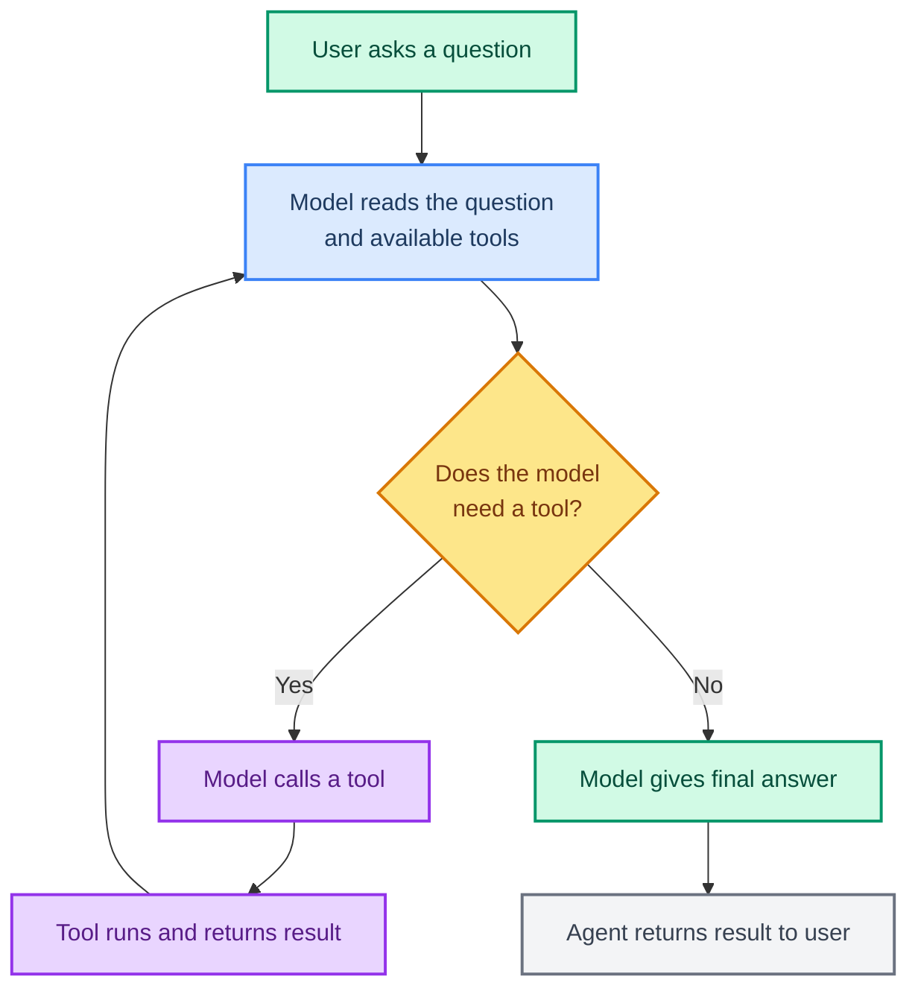

# Creating Your First Agent

> **Goal:** Create an agent using `create_agent`, understand the agent loop, and see how it thinks and acts.  
> **Previous chapter:** [03 - Messages](./03-messages.md)  
> **Next chapter:** [05 - Tools Basics](./05-tools-basics.md)

---

## What Is an Agent?

An **agent** is a system where a language model decides what to do, calls tools to get information, and repeats until it has an answer.

LangChain uses this formula:

```
Agent = Model + Harness
```

- **Model** = the brain (Groq `openai/gpt-oss-120b`)
- **Harness** = everything around the brain (system prompt, tools, middleware, memory)

The `create_agent` function builds this for you.

---

## The Agent Loop



The agent keeps looping: **Think -> Act -> Observe** until it has enough information.

---

## Creating Your First Agent (No Tools)

Let's start with the simplest possible agent - just a model and a system prompt:

```python
from dotenv import load_dotenv
load_dotenv()

from langchain_groq import ChatGroq
from langchain.agents import create_agent

# Step 1: Create the model
llm = ChatGroq(model="openai/gpt-oss-120b", temperature=0)

# Step 2: Create the agent
agent = create_agent(
    model=llm,
    tools=[],  # No tools yet
    system_prompt="You are a helpful assistant. Keep answers concise.",
)

# Step 3: Invoke the agent
result = agent.invoke({
    "messages": [{"role": "user", "content": "Explain what a database is in 2 sentences."}]
})

# Step 4: Read the result
for msg in result["messages"]:
    msg.pretty_print()
```

**Output:**

```
Human: Explain what a database is in 2 sentences.
AI: A database is an organized collection of data stored electronically.
It allows you to store, search, and update large amounts of information quickly and reliably.
```

Without tools, the agent just passes your question to the model and returns the answer. Simple, but this is the foundation.

---

## Adding Your First Tool

Now let's give the agent a **tool** - a function it can call to get information:

```python
from dotenv import load_dotenv
load_dotenv()

from langchain_groq import ChatGroq
from langchain.tools import tool
from langchain.agents import create_agent


# Step 1: Define a tool
@tool
def get_word_count(text: str) -> str:
    """Count the number of words in a text string.

    Args:
        text: The text to count words in.
    """
    words = text.split()
    return f"The text has {len(words)} words."


# Step 2: Create the model
llm = ChatGroq(model="openai/gpt-oss-120b", temperature=0)

# Step 3: Create the agent WITH the tool
agent = create_agent(
    model=llm,
    tools=[get_word_count],
    system_prompt="You are a helpful assistant. Use tools when needed.",
)

# Step 4: Ask a question that needs the tool
result = agent.invoke({
    "messages": [{"role": "user", "content": "How many words are in 'The quick brown fox jumps over the lazy dog'?"}]
})

# Step 5: See the full interaction
for msg in result["messages"]:
    msg.pretty_print()
```

**Output:**

```
Human: How many words are in 'The quick brown fox jumps over the lazy dog'?
AI: 
Tool: The text has 9 words.
AI: The sentence "The quick brown fox jumps over the lazy dog" has 9 words.
```

The agent:
1. **Thought** about the question
2. **Decided** to call the `get_word_count` tool
3. **Called** the tool with the text
4. **Read** the result (9 words)
5. **Answered** the user with the tool's information

---

## The create_agent Function: All Parameters

Here is the full signature with the most common parameters:

```python
from langchain.agents import create_agent

agent = create_agent(
    model=llm,                    # Required: the language model
    tools=[tool1, tool2],         # Optional: list of tools
    system_prompt="You are...",   # Optional: instructions for the agent
    middleware=[middleware1],     # Optional: behavior modifiers
    response_format=MyPydanticModel,  # Optional: structured output schema
    checkpointer=InMemorySaver(), # Optional: conversation memory
    context_schema=MyContext,     # Optional: per-run context data
    name="my_agent",              # Optional: agent identifier
    store=InMemoryStore(),        # Optional: long-term memory
)
```

| Parameter | What It Does | Required? |
|-----------|-------------|-----------|
| `model` | The language model | Yes |
| `tools` | Functions the agent can call | No |
| `system_prompt` | Instructions for the agent | No |
| `middleware` | Modifies agent behavior | No |
| `response_format` | Returns structured data | No |
| `checkpointer` | Saves conversation history | No |
| `context_schema` | Passes data to tools | No |
| `name` | Identifier for the agent | No |
| `store` | Long-term memory storage | No |

You only need `model`. Everything else is optional and adds features.

---

## Reading the Result

When you call `agent.invoke(...)`, it returns a dictionary with everything:

```python
result = agent.invoke({
    "messages": [{"role": "user", "content": "Hello!"}]
})

# All messages in the conversation
print(result["messages"])

# The last message (the final answer)
last_msg = result["messages"][-1]
print(last_msg.content)

# If you used response_format (covered in chapter 19)
# print(result["structured_response"])
```

---

## Agent with Web Search (Real Example)

This is the real-world example from your project's `main.py`:

```python
from dotenv import load_dotenv
load_dotenv()

from langchain_groq import ChatGroq
from langchain_tavily import TavilySearch
from langchain.agents import create_agent

# Model
llm = ChatGroq(model="openai/gpt-oss-120b", temperature=0)

# Web search tool (free tier)
web_search = TavilySearch(
    max_results=2,
    include_raw_content=False,
    include_answer=True,
)

# Agent
agent = create_agent(
    model=llm,
    tools=[web_search],
    system_prompt="You are a helpful research assistant. Search the web for current information.",
)

# Ask a question that needs current information
query = "What are the latest AI trends in 2026?"
result = agent.invoke({"messages": [{"role": "user", "content": query}]})

for msg in result["messages"]:
    msg.pretty_print()
```

---

## Asking Follow-Up Questions

You can pass previous messages to continue a conversation. Without a checkpointer (covered in chapter 07), you must manually include history:

```python
from dotenv import load_dotenv
load_dotenv()

from langchain_groq import ChatGroq
from langchain.agents import create_agent

llm = ChatGroq(model="openai/gpt-oss-120b", temperature=0)
agent = create_agent(model=llm, tools=[], system_prompt="You are a helpful assistant.")

# First question
result1 = agent.invoke({
    "messages": [{"role": "user", "content": "My name is Alice."}]
})
print("Answer 1:", result1["messages"][-1].content)

# Second question WITH the history
result2 = agent.invoke({
    "messages": [
        {"role": "user", "content": "My name is Alice."},
        {"role": "assistant", "content": result1["messages"][-1].content},
        {"role": "user", "content": "What is my name?"},
    ]
})
print("Answer 2:", result2["messages"][-1].content)
# "Your name is Alice."
```

> In chapter 07, you will learn how to use checkpointers so you don't have to manually pass history.

---

## verbose Parameter

When debugging, use `verbose=True` (if available) or print messages manually:

```python
agent = create_agent(
    model=llm,
    tools=[web_search],
    system_prompt="You are helpful.",
)

result = agent.invoke({
    "messages": [{"role": "user", "content": "What is the capital of France?"}]
})

# Manually print each step
for i, msg in enumerate(result["messages"]):
    print(f"\n--- Message {i+1} ---")
    print(f"Type: {type(msg).__name__}")
    print(f"Content: {msg.content}")
    if hasattr(msg, 'tool_calls') and msg.tool_calls:
        print(f"Tool calls: {msg.tool_calls}")
```

---

## Try It Yourself

1. Create an agent with no tools and ask it to explain quantum computing
2. Create an agent with the `get_word_count` tool and ask it about different sentences
3. Build a conversation with 3 back-and-forth messages (no tools)
4. Change the system prompt to "You are a pirate. Speak like a pirate." and see how the answer changes

---

## Common Mistakes

### Mistake 1: Passing a String Instead of the Messages Dict

**Wrong:**
```python
result = agent.invoke("What is 2+2?")
```

**Correct:**
```python
result = agent.invoke({"messages": [{"role": "user", "content": "What is 2+2?"}]})
```

### Mistake 2: Forgetting to Import create_agent

**Wrong:**
```python
from langchain.agents import create_agent  # Sometimes wrong import path in older versions
```

If you get an import error, make sure you have `langchain >= 1.0`:
```bash
pip install --upgrade langchain
```

### Mistake 3: Not Loading Environment Variables

Always run `load_dotenv()` at the top of your file before importing LangChain components.

---

## What You Learned

- What an agent is (Model + Harness)
- The agent loop: Think -> Act -> Observe -> Repeat
- How to create an agent with `create_agent`
- How to add tools to an agent
- How to read results from an agent invocation
- How to continue a conversation manually

---

## Next Steps

Now let's learn how to build useful tools that your agent can use to do real work.

Go to: [05 - Tools Basics: Giving Your Agent Hands](./05-tools-basics.md)