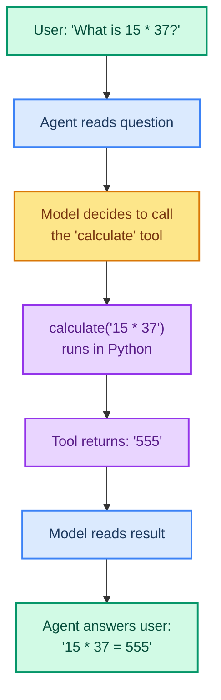

# Building Tools: Giving Your Agent Hands

> **Goal:** Learn to create tools with the `@tool` decorator that your agent can call.  
> **Previous chapter:** [04 - Creating Your First Agent](./04-creating-your-first-agent.md)  
> **Next chapter:** [06 - Advanced Tool Patterns](./06-tools-advanced.md)

---

## What Is a Tool?

A **tool** is a Python function that your agent can call to do real work. Tools let your agent go beyond just talking - they can:

- Do math
- Read files
- Search the web
- Query databases
- Call APIs
- Run code

Without tools, an agent is just a chatbot. With tools, it can take action.

---

## How Tools Work



---

## The @tool Decorator

The simplest way to create a tool is with the `@tool` decorator:

```python
from langchain.tools import tool


@tool
def add_numbers(a: int, b: int) -> str:
    """Add two numbers together and return the result.

    Args:
        a: The first number.
        b: The second number.
    """
    result = a + b
    return f"The sum of {a} and {b} is {result}."
```

Three things make this a valid tool:

1. **The `@tool` decorator** - Tells LangChain this is a tool
2. **Type hints** (`a: int, b: int`) - Define the input schema for the model
3. **The docstring** - Becomes the tool description the model reads to decide when to use it

---

## Anatomy of a Tool

```mermaid
graph TD
    subgraph Tool["@tool function"]
        N["Function name -> tool name<br/>'add_numbers'"]
        D["Docstring -> tool description<br/>'Add two numbers...'"
        T["Type hints -> input schema<br/>'a: int, b: int'"]
        R["Return value -> tool result<br/>'The sum is 5'"]
    end

    style N fill:#dbeafe,stroke:#3b82f6,stroke-width:2px,color:#1e3a5f
    style D fill:#fde68a,stroke:#d97706,stroke-width:2px,color:#78350f
    style T fill:#d1fae5,stroke:#059669,stroke-width:2px,color:#064e3b
    style R fill:#e9d5ff,stroke:#9333ea,stroke-width:2px,color:#581c87
```

---

## Real Examples

### Example 1: Calculator Tool

```python
from dotenv import load_dotenv
load_dotenv()

from langchain_groq import ChatGroq
from langchain.tools import tool
from langchain.agents import create_agent


@tool
def calculate(expression: str) -> str:
    """Calculate a mathematical expression. Use this for any math problem.

    Args:
        expression: A valid Python math expression like '15 * 37' or '100 / 4'.
    """
    try:
        result = eval(expression, {"__builtins__": {}}, {})
        return f"{expression} = {result}"
    except Exception as e:
        return f"Error calculating '{expression}': {e}"


llm = ChatGroq(model="openai/gpt-oss-120b", temperature=0)
agent = create_agent(
    model=llm,
    tools=[calculate],
    system_prompt="You are a helpful math assistant. Use the calculate tool for math.",
)

result = agent.invoke({
    "messages": [{"role": "user", "content": "What is 256 * 89 + 15?"}]
})
for msg in result["messages"]:
    msg.pretty_print()
```

### Example 2: File Reader Tool

```python
from dotenv import load_dotenv
load_dotenv()

from langchain_groq import ChatGroq
from langchain.tools import tool
from langchain.agents import create_agent


@tool
def read_file(filepath: str) -> str:
    """Read the contents of a text file.

    Args:
        filepath: The path to the file to read.
    """
    try:
        with open(filepath, "r") as f:
            return f.read()
    except FileNotFoundError:
        return f"Error: File '{filepath}' not found."
    except Exception as e:
        return f"Error reading file: {e}"


llm = ChatGroq(model="openai/gpt-oss-120b", temperature=0)
agent = create_agent(
    model=llm,
    tools=[read_file],
    system_prompt="You are a helpful file assistant. Use the read_file tool to read files.",
)

# Create a test file first
with open("test.txt", "w") as f:
    f.write("Hello from the file!\nThis is line 2.\nThis is line 3.")

result = agent.invoke({
    "messages": [{"role": "user", "content": "Read the file test.txt and tell me what's in it."}]
})
for msg in result["messages"]:
    msg.pretty_print()
```

### Example 3: Word Count Tool

```python
from dotenv import load_dotenv
load_dotenv()

from langchain_groq import ChatGroq
from langchain.tools import tool
from langchain.agents import create_agent


@tool
def count_words(text: str) -> str:
    """Count the number of words in a text.

    Args:
        text: The text to count words in.
    """
    word_count = len(text.split())
    char_count = len(text)
    return f"Words: {word_count}, Characters: {char_count}"


@tool
def count_sentences(text: str) -> str:
    """Count the number of sentences in a text.

    Args:
        text: The text to count sentences in.
    """
    import re
    sentences = re.split(r'[.!?]+', text)
    sentences = [s.strip() for s in sentences if s.strip()]
    return f"Sentences: {len(sentences)}"


llm = ChatGroq(model="openai/gpt-oss-120b", temperature=0)
agent = create_agent(
    model=llm,
    tools=[count_words, count_sentences],
    system_prompt="You are a text analysis assistant. Use your tools to analyze text.",
)

result = agent.invoke({
    "messages": [{"role": "user", "content": "Analyze this text: 'Hello world. This is a test. How are you today?'"}]
})
for msg in result["messages"]:
    msg.pretty_print()
```

---

## Tool Naming Rules

| Rule | Good Example | Bad Example |
|------|-------------|-------------|
| Use snake_case | `web_search` | `Web Search` |
| Be descriptive | `calculate_expression` | `calc` |
| Keep it short | `read_file` | `read_the_contents_of_a_file` |
| No spaces or special chars | `get_weather` | `get weather!` |

> LangChain recommends snake_case because some model providers reject names with spaces or special characters.

---

## Inspecting Your Tool

You can see what the model sees:

```python
from langchain.tools import tool


@tool
def get_weather(city: str) -> str:
    """Get the current weather for a city.

    Args:
        city: The name of the city.
    """
    return f"Sunny in {city}"


print("Name:", get_weather.name)
# 'get_weather'
print("Description:", get_weather.description)
# 'Get the current weather for a city.\n\nArgs:\n    city: The name of the city.'
print("Args schema:", get_weather.args_schema.model_json_schema())
# {'type': 'object', 'properties': {'city': {'type': 'string', ...}}, 'required': ['city']}
```

---

## Using Multiple Tools Together

```python
from dotenv import load_dotenv
load_dotenv()

from langchain_groq import ChatGroq
from langchain.tools import tool
from langchain.agents import create_agent


@tool
def add(a: int, b: int) -> str:
    """Add two numbers.

    Args:
        a: First number.
        b: Second number.
    """
    return str(a + b)


@tool
def multiply(a: int, b: int) -> str:
    """Multiply two numbers.

    Args:
        a: First number.
        b: Second number.
    """
    return str(a * b)


@tool
def read_file(filepath: str) -> str:
    """Read a file's contents.

    Args:
        filepath: Path to the file.
    """
    with open(filepath, "r") as f:
        return f.read()


llm = ChatGroq(model="openai/gpt-oss-120b", temperature=0)

agent = create_agent(
    model=llm,
    tools=[add, multiply, read_file],
    system_prompt="You are a helpful assistant. Use tools to answer questions.",
)

result = agent.invoke({
    "messages": [{"role": "user", "content": "What is 5 + 3, and what is 7 * 4?"}]
})
for msg in result["messages"]:
    msg.pretty_print()
```

The agent can call multiple tools in one turn. The model decides which tools to use and in what order.

---

## Tool Docstring Format

A good docstring has two parts:

1. **First line** - A clear description of what the tool does (the model reads this)
2. **Args section** - What each parameter means

```python
@tool
def search_pokemon(name: str, detailed: bool = False) -> str:
    """Search for a Pokemon by name and return its basic info.

    Args:
        name: The Pokemon name to search for (e.g., 'pikachu').
        detailed: If True, include extra stats and abilities. Default is False.
    """
    # ... function body
```

> The docstring is your BEST way to control when the model uses the tool. Write it clearly.

---

## Reserved Parameter Names

Do NOT name your parameters `config` or `runtime` - these are reserved by LangChain:

```python
# WRONG - 'config' is reserved
@tool
def my_tool(query: str, config: dict) -> str:
    """This will error."""
    return query

# CORRECT
@tool
def my_tool(query: str, settings: dict) -> str:
    """This works fine."""
    return query
```

---

## Try It Yourself

1. Create a `temperature_converter` tool that converts between Celsius and Fahrenheit
2. Create a `reverse_string` tool that reverses any string
3. Create an agent with both tools and ask it to "Convert 25C to Fahrenheit and reverse the result"
4. Print your tool's `name`, `description`, and `args_schema` to see what the model sees

---

## Common Mistakes

### Mistake 1: Missing Type Hints

**Wrong:**
```python
@tool
def calculate(expression):  # No type hint!
    """Calculate math."""
    return eval(expression)
```

**Correct:**
```python
@tool
def calculate(expression: str) -> str:  # Type hints required!
    """Calculate math."""
    return str(eval(expression))
```

### Mistake 2: Vague Docstring

**Wrong:**
```python
@tool
def do_stuff(x: str) -> str:
    """Does stuff."""""
    return x
```

The model will not know when to use it. Write a clear description.

### Mistake 3: Not Returning a Result

The model needs the return value to answer. Always return something (even an error message):

**Wrong:**
```python
@tool
def save_data(data: str) -> str:
    """Save data."""
    with open("data.txt", "w") as f:
        f.write(data)
    # No return! The model gets nothing
```

**Correct:**
```python
@tool
def save_data(data: str) -> str:
    """Save data to a file."""
    with open("data.txt", "w") as f:
        f.write(data)
    return f"Data saved successfully ({len(data)} characters)."
```

---

## What You Learned

- What a tool is and why agents need them
- How to create tools with the `@tool` decorator
- Why type hints and docstrings matter
- How to build calculator, file reader, and text analysis tools
- Tool naming rules
- How to use multiple tools in one agent

---

## Next Steps

Now let's learn advanced tool patterns - Pydantic schemas, custom names, runtime access, and different return types.

Go to: [06 - Advanced Tool Patterns](./06-tools-advanced.md)