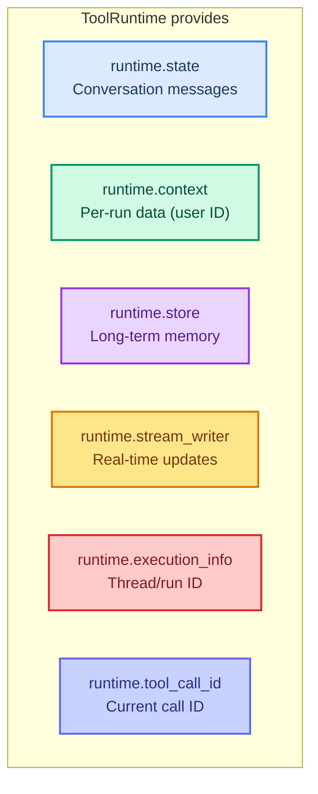

# Advanced Tool Patterns

> **Goal:** Learn Pydantic schemas, custom tool names, ToolRuntime, return types, and multimodal tools.  
> **Previous chapter:** [05 - Tools Basics](./05-tools-basics.md)  
> **Next chapter:** [07 - Short-Term Memory](./07-short-term-memory.md)

---

## What You Will Learn

1. Custom tool names and descriptions
2. Pydantic schemas for complex inputs
3. `ToolRuntime` for accessing agent state, context, and store
4. Different return types: string, dict, Command, return_direct
5. Multimodal tool results (text + images)

---

## Custom Tool Names and Descriptions

### Custom Name

```python
from langchain.tools import tool


@tool("web_search")
def search(query: str) -> str:
    """Search the web for information.

    Args:
        query: What to search for.
    """
    return f"Results for: {query}"

print(search.name)  # 'web_search' (not 'search')
```

### Custom Description

```python
@tool(
    "calculator",
    description="Performs arithmetic calculations. Use this for any math problems. Input must be a valid math expression."
)
def calc(expression: str) -> str:
    """Evaluate mathematical expressions."""
    return str(eval(expression))
```

The custom `description` overrides the docstring. The model reads this to decide when to use the tool.

---

## Pydantic Schemas for Complex Inputs

When your tool has many parameters or needs validation, use a Pydantic model:

```python
from langchain.tools import tool
from pydantic import BaseModel, Field
from typing import Literal


class WeatherInput(BaseModel):
    """Input for weather queries."""
    city: str = Field(description="City name like 'London' or 'Tokyo'")
    units: Literal["celsius", "fahrenheit"] = Field(
        default="celsius",
        description="Temperature unit preference"
    )
    include_forecast: bool = Field(
        default=False,
        description="If True, include a 5-day forecast"
    )


@tool(args_schema=WeatherInput)
def get_weather(city: str, units: str = "celsius", include_forecast: bool = False) -> str:
    """Get current weather and optional forecast."""
    temp = 22 if units == "celsius" else 72
    result = f"Current weather in {city}: {temp} degrees {units[0].upper()}"
    if include_forecast:
        result += "\nNext 5 days: Sunny, Sunny, Rain, Sunny, Cloudy"
    return result
```

### Why Use Pydantic?

| Feature | Without Pydantic | With Pydantic |
|---------|-----------------|---------------|
| Validation | None | Validates input types |
| Default values | Basic | Full default support |
| Complex types | Hard | Easy (Literal, List, Nested) |
| Documentation | Just docstring | Auto-generated schema |

---

## ToolRuntime: Accessing Agent State

`ToolRuntime` lets your tools access the agent's internal state, conversation history, and context.



### Accessing State (Conversation History)

```python
from dotenv import load_dotenv
load_dotenv()

from langchain_groq import ChatGroq
from langchain.tools import tool, ToolRuntime
from langchain.messages import HumanMessage
from langchain.agents import create_agent


@tool
def get_last_user_message(runtime: ToolRuntime) -> str:
    """Get the most recent message from the user.

    Use this when you need to know what the user just asked.
    """
    messages = runtime.state["messages"]

    for message in reversed(messages):
        if isinstance(message, HumanMessage):
            return f"Last user message: {message.content}"

    return "No user messages found"


llm = ChatGroq(model="openai/gpt-oss-120b", temperature=0)
agent = create_agent(
    model=llm,
    tools=[get_last_user_message],
    system_prompt="You are a helpful assistant.",
)

result = agent.invoke({
    "messages": [{"role": "user", "content": "What did I just say?"}]
})
for msg in result["messages"]:
    msg.pretty_print()
```

> The `runtime` parameter is hidden from the model. The model does not see it in the tool schema.

### Streaming Progress Updates

```python
from dotenv import load_dotenv
load_dotenv()

from langchain_groq import ChatGroq
from langchain.tools import tool, ToolRuntime
from langchain.agents import create_agent
import time


@tool
def slow_search(query: str, runtime: ToolRuntime) -> str:
    """Search for information (simulated slow operation).

    Args:
        query: What to search for.
    """
    writer = runtime.stream_writer

    writer(f"Starting search for: {query}")
    time.sleep(1)  # Simulate slow work

    writer(f"Found 3 results...")
    time.sleep(1)

    writer(f"Done!")
    return f"Search completed for '{query}'. Found 3 results."


llm = ChatGroq(model="openai/gpt-oss-120b", temperature=0)
agent = create_agent(
    model=llm,
    tools=[slow_search],
    system_prompt="You are a helpful assistant.",
)

# Use streaming to see progress updates
for event in agent.stream_events(
    {"messages": [{"role": "user", "content": "Search for latest AI news"}]},
    version="v3",
):
    if event.get("event") == "on_custom_event":
        print(f"[Progress] {event['data']}")
```

---

## Accessing Context (Per-Run Data)

Context is data passed to the agent at invocation time (like a user ID):

```python
from dotenv import load_dotenv
load_dotenv()

from dataclasses import dataclass
from langchain_groq import ChatGroq
from langchain.tools import tool, ToolRuntime
from langchain.agents import create_agent
from langchain_core.utils.uuid import uuid7
from langgraph.checkpoint.memory import InMemorySaver


# Simulated user database
USER_DB = {
    "user1": {"name": "Alice", "balance": 5000},
    "user2": {"name": "Bob", "balance": 1200},
}


@dataclass
class UserContext:
    user_id: str


@tool
def get_balance(runtime: ToolRuntime[UserContext]) -> str:
    """Get the current user's account balance."""
    user_id = runtime.context.user_id
    user = USER_DB.get(user_id)
    if user:
        return f"Account holder: {user['name']}, Balance: ${user['balance']}"
    return "User not found"


llm = ChatGroq(model="openai/gpt-oss-120b", temperature=0)
agent = create_agent(
    model=llm,
    tools=[get_balance],
    context_schema=UserContext,
    checkpointer=InMemorySaver(),
)

result = agent.invoke(
    {"messages": [{"role": "user", "content": "What is my balance?"}]},
    config={"configurable": {"thread_id": str(uuid7())}},
    context=UserContext(user_id="user1"),
)
print(result["messages"][-1].content)
# "Account holder: Alice, Balance: $5000"
```

---

## Return Types

### Return a String (Default)

The return value becomes a `ToolMessage` the model reads:

```python
@tool
def get_time() -> str:
    """Get the current time."""
    from datetime import datetime
    return f"Current time: {datetime.now().strftime('%H:%M:%S')}"
```

### Return a Dict (Structured Data)

```python
@tool
def get_weather_data(city: str) -> dict:
    """Get structured weather data for a city.

    Args:
        city: City name.
    """
    return {
        "city": city,
        "temperature_c": 22,
        "conditions": "sunny",
        "humidity": 45,
    }
```

The model can read individual fields and reason about them.

### Return a Command (Update State)

When a tool needs to change agent state:

```python
from langchain.messages import ToolMessage
from langchain.tools import ToolRuntime, tool
from langgraph.types import Command
from langchain.agents import AgentState


class CustomState(AgentState):
    user_name: str


@tool
def set_name(new_name: str, runtime: ToolRuntime[None, CustomState]) -> Command:
    """Set the user's name in the conversation.

    Args:
        new_name: The name to set.
    """
    return Command(
        update={
            "user_name": new_name,
            "messages": [
                ToolMessage(
                    content=f"User name set to {new_name}.",
                    tool_call_id=runtime.tool_call_id,
                )
            ],
        }
    )
```

### return_direct (Skip Model)

When the tool's output IS the final answer (no need for the model to process it):

```python
from dotenv import load_dotenv
load_dotenv()

from langchain_groq import ChatGroq
from langchain.tools import tool
from langchain.agents import create_agent


@tool(return_direct=True)
def get_system_status() -> str:
    """Get the current system status. Returns the status directly to the user."""
    return "System Status: All services running. Uptime: 99.9%. Last check: OK."


llm = ChatGroq(model="openai/gpt-oss-120b", temperature=0)
agent = create_agent(model=llm, tools=[get_system_status])

result = agent.invoke({
    "messages": [{"role": "user", "content": "What is the system status?"}]
})
print(result["messages"][-1].content)
# "System Status: All services running. Uptime: 99.9%. Last check: OK."
# The agent returns this directly WITHOUT another model call
```

> Use `return_direct=True` when the tool's output is the complete answer. This saves an extra model call (faster + cheaper).

### Return Multimodal Content (Text + Images)

```python
@tool
def get_chart() -> list[dict]:
    """Get a chart with explanatory text.

    Returns a chart image with description.
    """
    return [
        {"type": "text", "text": "Here is the sales chart for Q4 2026:"},
        {"type": "image", "url": "https://example.com/chart.png"},
    ]
```

> The model must support multimodal input to process image results.

---

## Complete Example: Personal Assistant with Multiple Return Types

```python
from dotenv import load_dotenv
load_dotenv()

from dataclasses import dataclass
from langchain_groq import ChatGroq
from langchain.tools import tool, ToolRuntime
from langchain.agents import create_agent
from langchain_core.utils.uuid import uuid7
from langgraph.checkpoint.memory import InMemorySaver


# Health database
HEALTH_DB = {
    "alice": {"steps": 8500, "calories": 1800, "sleep_hours": 7.5},
    "bob": {"steps": 3200, "calories": 2200, "sleep_hours": 5.0},
}


@dataclass
class UserContext:
    user_id: str


@tool
def get_health_summary(runtime: ToolRuntime[UserContext]) -> dict:
    """Get a health summary for the current user.

    Returns steps, calories, and sleep data.
    """
    user_id = runtime.context.user_id
    data = HEALTH_DB.get(user_id, {"steps": 0, "calories": 0, "sleep_hours": 0})
    return {
        "user": user_id,
        "steps": data["steps"],
        "goal_steps": 10000,
        "calories": data["calories"],
        "goal_calories": 2000,
        "sleep_hours": data["sleep_hours"],
        "goal_sleep": 8,
    }


llm = ChatGroq(model="openai/gpt-oss-120b", temperature=0)
agent = create_agent(
    model=llm,
    tools=[get_health_summary],
    context_schema=UserContext,
    system_prompt="You are a personal health assistant. Give advice based on health data.",
    checkpointer=InMemorySaver(),
)

result = agent.invoke(
    {"messages": [{"role": "user", "content": "How am I doing with my health goals today?"}]},
    config={"configurable": {"thread_id": str(uuid7())}},
    context=UserContext(user_id="bob"),
)

for msg in result["messages"]:
    msg.pretty_print()
```

**Output:**

```
Human: How am I doing with my health goals today?
AI: [calls get_health_summary]
Tool: {'user': 'bob', 'steps': 3200, 'goal_steps': 10000, ...}
AI: Based on your health data today:
- Steps: 3,200 out of 10,000 (32%) - You need 6,800 more steps
- Calories: 2,200 out of 2,000 (110%) - You're over your calorie goal
- Sleep: 5.0 out of 8 hours (63%) - Try to get more sleep tonight
```

---

## Try It Yourself

1. Create a tool with a Pydantic schema that validates a date input (year, month, day)
2. Create a `return_direct=True` tool that returns a formatted greeting
3. Create a tool that uses `runtime.state` to count the total messages in the conversation
4. Create a tool that returns a dict with 3 fields and have the agent summarize them

---

## Common Mistakes

### Mistake 1: Using Reserved Parameter Names

```python
# WRONG - 'config' and 'runtime' are reserved unless typed as ToolRuntime
@tool
def bad_tool(query: str, config: dict) -> str:
    """This will cause runtime errors."""

# CORRECT
@tool
def good_tool(query: str, runtime: ToolRuntime) -> str:
    """This is correct - runtime is injected."""
    state = runtime.state
```

### Mistake 2: Forgetting runtime Parameter

```python
# If you add runtime to ToolRuntime, it MUST be in the function signature
@tool
def my_tool(query: str) -> str:
    """This works but cannot access runtime."""
    return query

# To access runtime:
@tool
def my_tool(query: str, runtime: ToolRuntime) -> str:
    """Now you can access state, context, store."""
    messages = runtime.state["messages"]
    return query
```

---

## What You Learned

- How to set custom tool names and descriptions
- How to use Pydantic schemas for complex, validated inputs
- How to use `ToolRuntime` to access state, context, store, and stream_writer
- Four return types: string, dict, Command, return_direct, multimodal
- When to use each return type

---

## Next Steps

Now let's learn how to give your agent **memory** so it remembers across conversation turns.

Go to: [07 - Short-Term Memory: Remembering the Conversation](./07-short-term-memory.md)