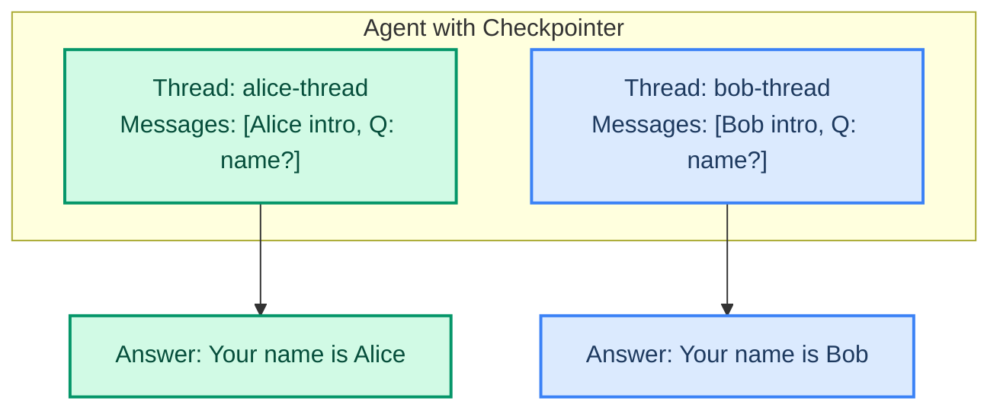

# Short-Term Memory: Remembering the Conversation

> **Goal:** Use checkpointers and thread_id to make your agent remember past conversation turns.  
> **Previous chapter:** [06 - Advanced Tool Patterns](./06-tools-advanced.md)  
> **Next chapter:** [08 - Long-Term Memory and Store](./08-long-term-memory-and-store.md)

---

## The Problem: Agents Forget Everything

Without memory, every call to `agent.invoke()` starts fresh. The agent has no idea what you said before:

```python
from dotenv import load_dotenv
load_dotenv()

from langchain_groq import ChatGroq
from langchain.agents import create_agent

llm = ChatGroq(model="openai/gpt-oss-120b", temperature=0)
agent = create_agent(model=llm, tools=[], system_prompt="You are helpful.")

# First message
r1 = agent.invoke({"messages": [{"role": "user", "content": "My name is Alice."}]})
print(r1["messages"][-1].content)
# "Nice to meet you, Alice!"

# Second message - does NOT remember the first
r2 = agent.invoke({"messages": [{"role": "user", "content": "What is my name?"}]})
print(r2["messages"][-1].content)
# "I don't know your name because you haven't told me."
```

---

## The Solution: Checkpointer + thread_id

A **checkpointer** saves the conversation after each turn. A **thread_id** groups messages into a conversation, like a chat thread.

```mermaid
graph TD
    subgraph "Without Checkpointer"
        A1["invoke: My name is Alice"] --> B1["Answer: Nice to meet you"]
        A2["invoke: What is my name?"] --> B2["Answer: I don't know"]
        B1 -.->|"NOT saved"| A2
    end

    subgraph "With Checkpointer"
        C1["invoke: My name is Alice"] --> D1["Checkpoint saved<br/>thread_id='conv1'"]
        D1["Answer: Nice to meet you"] --> E1["invoke: What is my name?<br/>same thread_id='conv1'"]
        E1 --> F1["Agent loads checkpoint<br/>remembers Alice"]
        F1 --> G1["Answer: Your name is Alice"]
    end

    style A1 fill:#fecaca,stroke:#dc2626,stroke-width:2px,color:#7f1d1d
    style B1 fill:#fecaca,stroke:#dc2626,stroke-width:2px,color:#7f1d1d
    style A2 fill:#fecaca,stroke:#dc2626,stroke-width:2px,color:#7f1d1d
    style B2 fill:#fecaca,stroke:#dc2626,stroke-width:2px,color:#7f1d1d

    style C1 fill:#d1fae5,stroke:#059669,stroke-width:2px,color:#064e3b
    style D1 fill:#dbeafe,stroke:#3b82f6,stroke-width:2px,color:#1e3a5f
    style E1 fill:#d1fae5,stroke:#059669,stroke-width:2px,color:#064e3b
    style F1 fill:#dbeafe,stroke:#3b82f6,stroke-width:2px,color:#1e3a5f
    style G1 fill:#d1fae5,stroke:#059669,stroke-width:2px,color:#064e3b
```



---

## How It Works

```python
from dotenv import load_dotenv
load_dotenv()

from langchain_groq import ChatGroq
from langchain.agents import create_agent
from langchain_core.utils.uuid import uuid7
from langgraph.checkpoint.memory import InMemorySaver

# Step 1: Create a checkpointer (saves conversation in memory)
checkpointer = InMemorySaver()

llm = ChatGroq(model="openai/gpt-oss-120b", temperature=0)

# Step 2: Add the checkpointer to the agent
agent = create_agent(
    model=llm,
    tools=[],
    system_prompt="You are a helpful assistant.",
    checkpointer=checkpointer,
)

# Step 3: Generate a unique thread ID for this conversation
thread_id = str(uuid7())
config = {"configurable": {"thread_id": thread_id}}

# Step 4: First message (same thread_id)
r1 = agent.invoke(
    {"messages": [{"role": "user", "content": "My name is Alice."}]},
    config=config,
)
print("First answer:", r1["messages"][-1].content)

# Step 5: Second message (SAME thread_id - agent remembers!)
r2 = agent.invoke(
    {"messages": [{"role": "user", "content": "What is my name?"}]},
    config=config,  # Same config with the same thread_id
)
print("Second answer:", r2["messages"][-1].content)
# "Your name is Alice."
```

**Output:**

```
First answer: Nice to meet you, Alice!
Second answer: Your name is Alice.
```

---

## Key Concepts

| Concept | What It Does |
|---------|-------------|
| `checkpointer` | Saves conversation state after each message |
| `thread_id` | Unique ID for a conversation (like a chat room ID) |
| `InMemorySaver()` | Saves conversations in RAM (lost when program stops) |

> `InMemorySaver` is for development. When you restart your program, all conversations are lost. For production, use `SqliteSaver` or `PostgresSaver` (covered in chapter 08).

---

## Multiple Conversations

Each `thread_id` creates a separate conversation:

```python
from dotenv import load_dotenv
load_dotenv()

from langchain_groq import ChatGroq
from langchain.agents import create_agent
from langchain_core.utils.uuid import uuid7
from langgraph.checkpoint.memory import InMemorySaver

checkpointer = InMemorySaver()
llm = ChatGroq(model="openai/gpt-oss-120b", temperature=0)
agent = create_agent(model=llm, tools=[], checkpointer=checkpointer)

# Conversation 1: Alice
config_alice = {"configurable": {"thread_id": "alice-thread"}}

agent.invoke(
    {"messages": [{"role": "user", "content": "My name is Alice."}]},
    config=config_alice,
)

# Conversation 2: Bob (different thread)
config_bob = {"configurable": {"thread_id": "bob-thread"}}

agent.invoke(
    {"messages": [{"role": "user", "content": "My name is Bob."}]},
    config=config_bob,
)

# Alice asks a follow-up
r_alice = agent.invoke(
    {"messages": [{"role": "user", "content": "What is my name?"}]},
    config=config_alice,
)
print("Alice's agent:", r_alice["messages"][-1].content)
# "Your name is Alice."

# Bob asks a follow-up
r_bob = agent.invoke(
    {"messages": [{"role": "user", "content": "What is my name?"}]},
    config=config_bob,
)
print("Bob's agent:", r_bob["messages"][-1].content)
# "Your name is Bob."
```



---

## Real-World Example: Multi-Turn Chat Assistant

```python
from dotenv import load_dotenv
load_dotenv()

from langchain_groq import ChatGroq
from langchain.tools import tool
from langchain.agents import create_agent
from langchain_core.utils.uuid import uuid7
from langgraph.checkpoint.memory import InMemorySaver


@tool
def calculate(expression: str) -> str:
    """Calculate a math expression.

    Args:
        expression: A math expression like '2 + 2' or '10 * 5'.
    """
    try:
        return str(eval(expression, {"__builtins__": {}}, {}))
    except Exception as e:
        return f"Error: {e}"


checkpointer = InMemorySaver()
llm = ChatGroq(model="openai/gpt-oss-120b", temperature=0)

agent = create_agent(
    model=llm,
    tools=[calculate],
    system_prompt="You are a math tutor. Use the calculate tool for calculations.",
    checkpointer=checkpointer,
)

thread_id = str(uuid7())
config = {"configurable": {"thread_id": thread_id}}

# Simulate a multi-turn conversation
conversation = [
    "I need help with math.",
    "What is 15 * 37?",
    "Now add 100 to that result.",
    "What was the original number I asked about?",
]

for user_msg in conversation:
    print(f"\nUser: {user_msg}")
    result = agent.invoke(
        {"messages": [{"role": "user", "content": user_msg}]},
        config=config,
    )
    print(f"Agent: {result['messages'][-1].content}")
```

**Output:**

```
User: I need help with math.
Agent: Of course! What would you like help with?

User: What is 15 * 37?
Agent: [calls calculate] 15 * 37 = 555

User: Now add 100 to that result.
Agent: [calls calculate] 555 + 100 = 655

User: What was the original number I asked about?
Agent: The original calculation was 15 * 37, which equals 555.
```

The agent remembers the entire conversation thanks to the checkpointer.

---

## How Much History Is Saved?

The checkpointer saves **everything** - all messages, all tool calls, all results. Over time, the conversation can become very long.

This is where **SummarizationMiddleware** comes in (chapter 10). It compresses old messages so the context window doesn't overflow.

---

## Checkpointer Types

| Checkpointer | Storage | Best For |
|--------------|---------|----------|
| `InMemorySaver()` | RAM (lost on restart) | Development, testing |
| `SqliteSaver(...)` | SQLite file | Local production, small apps |
| `PostgresSaver(...)` | PostgreSQL database | Production, multi-user |

**Using SqliteSaver (local file persistence):**

```python
from langgraph.checkpoint.sqlite import SqliteSaver

# Saves to a local file - survives restarts!
checkpointer = SqliteSaver.from_conn_string("conversations.db")

agent = create_agent(
    model=llm,
    tools=[],
    checkpointer=checkpointer,
)
```

> With SqliteSaver, conversations survive even if you restart your program. The same `thread_id` will load the same conversation.

---

## Try It Yourself

1. Create an agent with `InMemorySaver()` and have a 5-turn conversation about any topic
2. Create two threads with different names and test that they don't mix up
3. Ask the agent a factual question, then ask a follow-up that references the first answer
4. Use `SqliteSaver` and restart your program - verify the conversation persists

---

## Common Mistakes

### Mistake 1: Different thread_id for Each Message

```python
# WRONG - different thread_id each time = no memory
r1 = agent.invoke(
    {"messages": [{"role": "user", "content": "My name is Alice."}]},
    config={"configurable": {"thread_id": str(uuid7())}},  # New ID each time!
)
r2 = agent.invoke(
    {"messages": [{"role": "user", "content": "What is my name?"}]},
    config={"configurable": {"thread_id": str(uuid7())}},  # Different ID!
)
# Agent does NOT remember
```

```python
# CORRECT - same thread_id
thread_id = str(uuid7())
r1 = agent.invoke(
    {"messages": [{"role": "user", "content": "My name is Alice."}]},
    config={"configurable": {"thread_id": thread_id}},
)
r2 = agent.invoke(
    {"messages": [{"role": "user", "content": "What is my name?"}]},
    config={"configurable": {"thread_id": thread_id}},  # Same ID!
)
```

### Mistake 2: Forgetting the checkpointer

Without `checkpointer=InMemorySaver()` (or similar), the `thread_id` has no effect.

---

## What You Learned

- Why agents forget without memory
- What a checkpointer is and how it saves conversations
- How `thread_id` groups messages into conversations
- How to run multiple parallel conversations
- Checkpointer types: InMemory, Sqlite, Postgres

---

## Next Steps

Short-term memory (checkpointer) only saves within a conversation. What if you want the agent to remember facts **across different conversations**? That is long-term memory.

Go to: [08 - Long-Term Memory and Store](./08-long-term-memory-and-store.md)