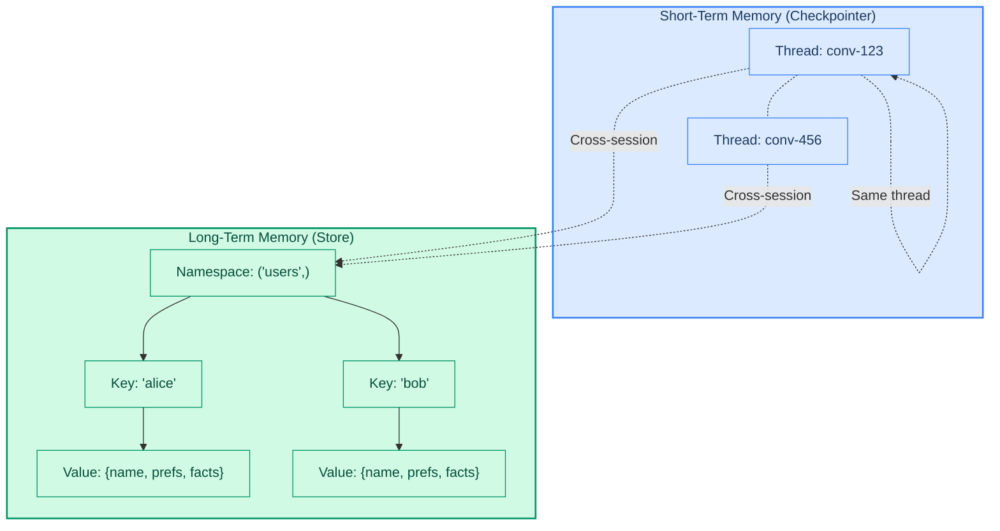
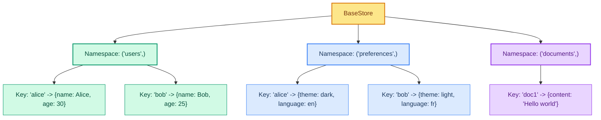
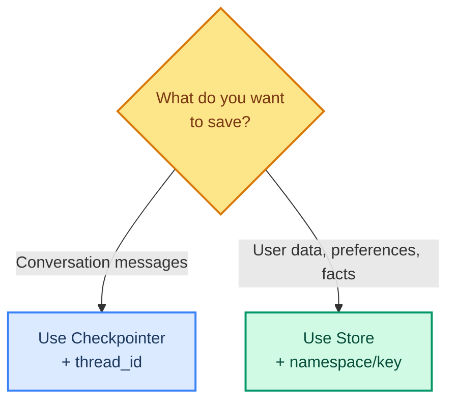

# Long-Term Memory: Knowledge Across Sessions

> **Goal:** Use the Store to save and retrieve data that persists across different conversations and sessions.  
> **Previous chapter:** [07 - Short-Term Memory](./07-short-term-memory.md)  
> **Next chapter:** [09 - Context and Runtime](./09-context-and-runtime.md)

---

## Short-Term vs Long-Term Memory



| Feature | Short-Term (Checkpointer) | Long-Term (Store) |
|---------|--------------------------|-------------------|
| Scope | One conversation (thread) | All conversations |
| Data type | Messages, tool calls | User preferences, facts, documents |
| Lifetime | Until program restart (InMemory) or saved to DB | Permanent |
| Access | Automatic per thread | Manual (via tools) |

---

## What Is the Store?

The **Store** is a key-value database that lives alongside your agent. It uses a **namespace** (category) and **key** (unique item) pattern:



---

## Creating an Agent with a Store

```python
from dotenv import load_dotenv
load_dotenv()

from typing import Any
from langchain_groq import ChatGroq
from langchain.tools import tool, ToolRuntime
from langchain.agents import create_agent
from langgraph.store.memory import InMemoryStore
from langchain_core.utils.uuid import uuid7
from langgraph.checkpoint.memory import InMemorySaver


# Step 1: Create a store
store = InMemoryStore()

# Step 2: Create tools that read and write to the store
@tool
def save_user_info(user_id: str, user_info: dict[str, Any], runtime: ToolRuntime) -> str:
    """Save user information to long-term memory.

    Args:
        user_id: The user's unique ID.
        user_info: A dictionary with user info (name, preferences, etc.).
    """
    runtime.store.put(("users",), user_id, user_info)
    return f"Saved user info for '{user_id}'."


@tool
def get_user_info(user_id: str, runtime: ToolRuntime) -> str:
    """Retrieve user information from long-term memory.

    Args:
        user_id: The user's unique ID.
    """
    user_info = runtime.store.get(("users",), user_id)
    if user_info:
        return str(user_info.value)
    return f"No info found for user '{user_id}'."


# Step 3: Create the agent with the store
llm = ChatGroq(model="openai/gpt-oss-120b", temperature=0)
agent = create_agent(
    model=llm,
    tools=[save_user_info, get_user_info],
    system_prompt="You are a helpful assistant with long-term memory.",
    store=store,  # Add the store here
    checkpointer=InMemorySaver(),
)

# Step 4: Session 1 - Save user info
thread_id = str(uuid7())
config = {"configurable": {"thread_id": thread_id}}

result1 = agent.invoke(
    {"messages": [{"role": "user", "content": "Save this user: ID=abc123, name=Foo, age=25, email=foo@example.com"}]},
    config=config,
)
print("Session 1:", result1["messages"][-1].content)
# "Saved user info for 'abc123'."

# Step 5: Session 2 - Different thread, same store - retrieves the saved info
thread_id2 = str(uuid7())
config2 = {"configurable": {"thread_id": thread_id2}}

result2 = agent.invoke(
    {"messages": [{"role": "user", "content": "Get user info for user with id 'abc123'"}]},
    config=config2,
)
print("Session 2:", result2["messages"][-1].content)
# "Here is the user info for abc123: name=Foo, age=25, email=foo@example.com"
```

> Session 2 uses a completely different `thread_id`, but the agent still remembers the user because the data is in the **store**, not the checkpointer.

---

## Store Types

| Store | Storage | Best For |
|-------|---------|----------|
| `InMemoryStore()` | RAM (lost on restart) | Development, testing |
| `PostgresStore(...)` | PostgreSQL | Production, multi-user |
| `RedisStore(...)` | Redis | High-speed production |
| `MongoDBStore(...)` | MongoDB | Document-oriented data |

> `InMemoryStore` is fine for learning. For production, use `PostgresStore` or `RedisStore`.

---

## Namespace Patterns

Namespaces organize your data. Think of them as folders:

```python
# Store user profiles under ('users',)
store.put(("users",), "alice", {"name": "Alice", "preferences": {"theme": "dark"}})

# Store documents under ('documents',)
store.put(("documents",), "doc1", {"title": "Report", "content": "..."})

# Store conversation summaries under ('summaries',)
store.put(("summaries",), "conv-123", {"summary": "User asked about Python basics."})

# Nested namespaces for organization
store.put(("users", "alice", "preferences"), "theme", {"value": "dark"})
store.put(("users", "alice", "preferences"), "language", {"value": "en"})
```

---

## Real-World Example: User Preference Memory

```python
from dotenv import load_dotenv
load_dotenv()

from langchain_groq import ChatGroq
from langchain.tools import tool, ToolRuntime
from langchain.agents import create_agent
from langgraph.store.memory import InMemoryStore
from langchain_core.utils.uuid import uuid7
from langgraph.checkpoint.memory import InMemorySaver

store = InMemoryStore()


@tool
def save_preference(preference_name: str, preference_value: str, runtime: ToolRuntime) -> str:
    """Save a user preference (like theme, language, or timezone).

    Args:
        preference_name: The name of the preference (e.g., 'theme', 'language').
        preference_value: The value to save (e.g., 'dark', 'en').
    """
    runtime.store.put(("preferences",), preference_name, {"value": preference_value})
    return f"Preference '{preference_name}' saved as '{preference_value}'."


@tool
def get_preference(preference_name: str, runtime: ToolRuntime) -> str:
    """Retrieve a user preference from memory.

    Args:
        preference_name: The name of the preference to look up.
    """
    pref = runtime.store.get(("preferences",), preference_name)
    if pref:
        return f"Preference '{preference_name}' = '{pref.value['value']}'"
    return f"Preference '{preference_name}' not found."


@tool
def list_all_preferences(runtime: ToolRuntime) -> str:
    """List all saved user preferences.
    """
    items = runtime.store.search(("preferences",))
    if not items:
        return "No preferences saved yet."
    prefs = [f"{item.key}: {item.value['value']}" for item in items]
    return "\n".join(prefs)


llm = ChatGroq(model="openai/gpt-oss-120b", temperature=0)
agent = create_agent(
    model=llm,
    tools=[save_preference, get_preference, list_all_preferences],
    system_prompt="You are a helpful assistant that remembers user preferences.",
    store=store,
    checkpointer=InMemorySaver(),
)

# Session 1: Save some preferences (thread 1)
config1 = {"configurable": {"thread_id": str(uuid7())}}
agent.invoke(
    {"messages": [{"role": "user", "content": "Set my theme preference to dark mode."}]},
    config=config1,
)
agent.invoke(
    {"messages": [{"role": "user", "content": "Set my language preference to English."}]},
    config=config1,
)

# Session 2: Read preferences (completely different thread!)
config2 = {"configurable": {"thread_id": str(uuid7())}}
result = agent.invoke(
    {"messages": [{"role": "user", "content": "What are all my preferences?"}]},
    config=config2,
)
print(result["messages"][-1].content)
# "Your preferences are:
#  theme: dark
#  language: English"
```

---

## When to Use Store vs Checkpointer



| Need | Use |
|------|-----|
| Remember conversation within a chat | Checkpointer |
| Remember user preferences across chats | Store |
| Remember facts the user told you | Store |
| Let tools access saved data | Store |
| Multi-turn conversation with tools | Both (Checkpointer + Store) |

---

## Try It Yourself

1. Create a store that saves "facts" about a topic (like "Python was created in 1991")
2. Have one session save facts, another session retrieve them using a different thread_id
3. Create a tool that searches all items in a namespace and returns a formatted list
4. Create a "forget" tool that deletes a key from the store

---

## Common Mistakes

### Mistake 1: Forgetting to Pass store to create_agent

```python
# WRONG - store exists but agent doesn't know about it
store = InMemoryStore()
agent = create_agent(model=llm, tools=[save_tool, get_tool])
# runtime.store will be None!

# CORRECT
store = InMemoryStore()
agent = create_agent(model=llm, tools=[save_tool, get_tool], store=store)
```

### Mistake 2: Using InMemoryStore for Production

`InMemoryStore` disappears when the program restarts. Use `PostgresStore` or `RedisStore` for real applications.

---

## What You Learned

- What long-term memory (Store) is and how it differs from short-term memory
- How to use `InMemoryStore` for development
- How to create tools that read and write to the store
- How namespaces and keys organize stored data
- How to save and retrieve data across different conversations

---

## Next Steps

Now let's learn how to pass per-run data (like user IDs) to your tools using context_schema and ToolRuntime.

Go to: [09 - Context and Runtime](./09-context-and-runtime.md)