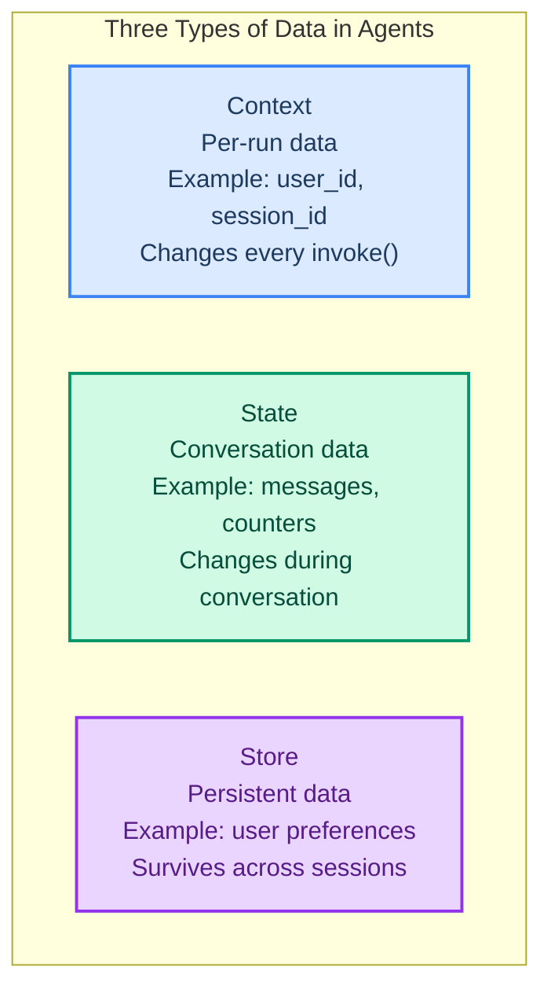
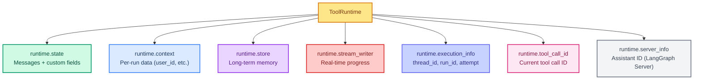

# Context and Runtime: Passing Data to Tools

> **Goal:** Use `context_schema` and `ToolRuntime` to pass per-run data and access agent internals from tools.  
> **Previous chapter:** [08 - Long-Term Memory and Store](./08-long-term-memory-and-store.md)  
> **Next chapter:** [10 - Summarization Middleware](./10-summarization-middleware.md)

---

## What Is Context vs State vs Store?



| Data Type | What It Is | Lifetime | Mutable? |
|-----------|-----------|----------|----------|
| **Context** | Per-invoke data (user_id, session info) | One invoke() call | No (immutable) |
| **State** | Conversation data (messages, custom fields) | One thread | Yes (tools can update) |
| **Store** | Persistent data (preferences, facts) | All sessions | Yes (tools can update) |

---

## What Is ToolRuntime?

`ToolRuntime` is a special parameter your tools can accept to access the agent's internals:

```python
from langchain.tools import tool, ToolRuntime

@tool
def my_tool(query: str, runtime: ToolRuntime) -> str:
    """A tool that can access runtime data."""
    state = runtime.state           # Conversation messages
    context = runtime.context       # Per-run data
    store = runtime.store           # Long-term memory
    writer = runtime.stream_writer  # Send real-time updates
    info = runtime.execution_info   # Thread ID, run ID
    return query
```

> The `runtime` parameter is **hidden from the model**. The model does not see it in the tool schema.

---

## Accessing State (Conversation Messages)

```python
from dotenv import load_dotenv
load_dotenv()

from langchain_groq import ChatGroq
from langchain.tools import tool, ToolRuntime
from langchain.messages import HumanMessage
from langchain.agents import create_agent
from langchain_core.utils.uuid import uuid7
from langgraph.checkpoint.memory import InMemorySaver


@tool
def count_messages(runtime: ToolRuntime) -> str:
    """Count how many messages are in the conversation so far.

    Use this when you want to know how long the conversation has been.
    """
    messages = runtime.state["messages"]
    human_count = sum(1 for m in messages if isinstance(m, HumanMessage))
    total_count = len(messages)
    return f"Total messages: {total_count}, Human messages: {human_count}"


llm = ChatGroq(model="openai/gpt-oss-120b", temperature=0)
agent = create_agent(
    model=llm,
    tools=[count_messages],
    system_prompt="You are a helpful assistant.",
    checkpointer=InMemorySaver(),
)

thread_id = str(uuid7())
config = {"configurable": {"thread_id": thread_id}}

# Turn 1
r1 = agent.invoke(
    {"messages": [{"role": "user", "content": "Hi! Say hello to count our messages."}]},
    config=config,
)
print(r1["messages"][-1].content)

# Turn 2
r2 = agent.invoke(
    {"messages": [{"role": "user", "content": "How many messages do we have now?"}]},
    config=config,
)
print(r2["messages"][-1].content)
# "Total messages: 4, Human messages: 2"
```

---

## Passing Context (Per-Run Data)

Context is data you pass **once** at invoke time. Use it for user IDs, session info, or feature flags:

```python
from dotenv import load_dotenv
load_dotenv()

from dataclasses import dataclass
from langchain_groq import ChatGroq
from langchain.tools import tool, ToolRuntime
from langchain.agents import create_agent
from langchain_core.utils.uuid import uuid7
from langgraph.checkpoint.memory import InMemorySaver


# Step 1: Define the context shape
@dataclass
class UserContext:
    user_id: str
    name: str
    role: str  # 'admin' or 'user'


# Simulated database
USER_DB = {
    "admin1": {"name": "Admin Alice", "permissions": ["read", "write", "delete"]},
    "user1": {"name": "Regular Bob", "permissions": ["read"]},
}


# Step 2: Access context in tools
@tool
def show_my_info(runtime: ToolRuntime[UserContext]) -> str:
    """Show the current user's information and permissions.
    """
    ctx = runtime.context
    user = USER_DB.get(ctx.user_id, {})
    return f"User: {ctx.name} ({ctx.user_id}), Role: {ctx.role}, Permissions: {user.get('permissions', [])}"


@tool
def check_permission(permission: str, runtime: ToolRuntime[UserContext]) -> str:
    """Check if the current user has a specific permission.

    Args:
        permission: The permission to check ('read', 'write', or 'delete').
    """
    ctx = runtime.context
    user = USER_DB.get(ctx.user_id, {})
    perms = user.get("permissions", [])
    if permission in perms:
        return f"Yes, {ctx.name} has '{permission}' permission."
    return f"No, {ctx.name} does NOT have '{permission}' permission."


# Step 3: Create agent with context_schema
llm = ChatGroq(model="openai/gpt-oss-120b", temperature=0)
agent = create_agent(
    model=llm,
    tools=[show_my_info, check_permission],
    context_schema=UserContext,
    system_prompt="You are a helpful assistant with user information access.",
    checkpointer=InMemorySaver(),
)

# Step 4: Invoke with context
config = {"configurable": {"thread_id": str(uuid7())}}

# As admin
result = agent.invoke(
    {"messages": [{"role": "user", "content": "Do I have delete permission?"}]},
    config=config,
    context=UserContext(user_id="admin1", name="Alice", role="admin"),
)
print(result["messages"][-1].content)
# "Yes, Admin Alice has 'delete' permission."

# As regular user (same agent, different context)
config2 = {"configurable": {"thread_id": str(uuid7())}}
result2 = agent.invoke(
    {"messages": [{"role": "user", "content": "Do I have delete permission?"}]},
    config=config2,
    context=UserContext(user_id="user1", name="Bob", role="user"),
)
print(result2["messages"][-1].content)
# "No, Regular Bob does NOT have 'delete' permission."
```

---

## Updating State from Tools

Tools can update the agent's state using `Command`:

```python
from dotenv import load_dotenv
load_dotenv()

from langchain_groq import ChatGroq
from langchain.agents import create_agent, AgentState
from langchain.messages import ToolMessage
from langchain.tools import tool, ToolRuntime
from langgraph.types import Command
from langchain_core.utils.uuid import uuid7
from langgraph.checkpoint.memory import InMemorySaver


# Step 1: Define custom state with extra fields
class MyState(AgentState):
    user_name: str
    visit_count: int


# Step 2: Tool that updates state
@tool
def set_user_name(new_name: str, runtime: ToolRuntime[None, MyState]) -> Command:
    """Set the user's name in the conversation state.

    Args:
        new_name: The name to set.
    """
    return Command(
        update={
            "user_name": new_name,
            "messages": [
                ToolMessage(
                    content=f"User name set to '{new_name}'.",
                    tool_call_id=runtime.tool_call_id,
                )
            ],
        }
    )


@tool
def get_user_name(runtime: ToolRuntime[None, MyState]) -> str:
    """Get the user's name from the conversation state."""
    name = runtime.state.get("user_name", "not set")
    return f"User name is: {name}"


llm = ChatGroq(model="openai/gpt-oss-120b", temperature=0)
agent = create_agent(
    model=llm,
    tools=[set_user_name, get_user_name],
    system_prompt="You are a helpful assistant.",
    state_schema=MyState,
    checkpointer=InMemorySaver(),
)

config = {"configurable": {"thread_id": str(uuid7())}}

# Set the name
r1 = agent.invoke(
    {"messages": [{"role": "user", "content": "Set my name to Alice."}]},
    config=config,
)
print(r1["messages"][-1].content)

# Get the name
r2 = agent.invoke(
    {"messages": [{"role": "user", "content": "What is my name?"}]},
    config=config,
)
print(r2["messages"][-1].content)
```

---

## Stream Writer: Real-Time Updates

Send progress messages while a long-running tool works:

```python
from dotenv import load_dotenv
load_dotenv()

from langchain_groq import ChatGroq
from langchain.tools import tool, ToolRuntime
from langchain.agents import create_agent
import time


@tool
def process_data(filename: str, runtime: ToolRuntime) -> str:
    """Process a large data file step by step.

    Args:
        filename: The name of the file to process.
    """
    writer = runtime.stream_writer

    writer(f"Step 1: Opening file '{filename}'...")
    time.sleep(0.5)

    writer(f"Step 2: Reading data...")
    time.sleep(0.5)

    writer(f"Step 3: Validating schema...")
    time.sleep(0.5)

    writer(f"Step 4: Processing records...")
    time.sleep(0.5)

    writer(f"Done!")

    return f"Successfully processed file '{filename}'. 1000 records processed."


llm = ChatGroq(model="openai/gpt-oss-120b", temperature=0)
agent = create_agent(
    model=llm,
    tools=[process_data],
    system_prompt="You are a data processing assistant.",
)

# Stream events to see progress
for event in agent.stream_events(
    {"messages": [{"role": "user", "content": "Process the file 'data.csv'"}]},
    version="v3",
):
    event_type = event.get("event", "")
    if event_type == "on_custom_event":
        print(f"[Progress] {event['data']}")
    elif event_type == "on_chat_model_stream":
        chunk = event["data"].get("chunk")
        if chunk and chunk.content:
            print(f"[AI] {chunk.content}", end="")
```

---

## ToolRuntime Summary



---

## Try It Yourself

1. Create a tool that reads `runtime.state` and returns how many AI messages exist
2. Create a context with a `timezone` field and use it in a tool that returns the current time
3. Create a tool that updates state with a "mood" field (happy, sad, neutral)
4. Create a long-running tool with `stream_writer` that downloads 3 files one by one

---

## What You Learned

- The difference between Context (per-run), State (per-thread), and Store (persistent)
- How to define `context_schema` with a dataclass
- How to access all runtime data via `ToolRuntime`
- How to update state from tools using `Command`
- How to stream progress updates with `runtime.stream_writer`

---

## Next Steps

As conversations get long, the message history grows too big for the model's context window. Let's learn how to compress it.

Go to: [10 - Summarization Middleware](./10-summarization-middleware.md)