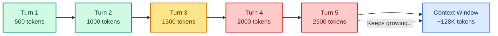
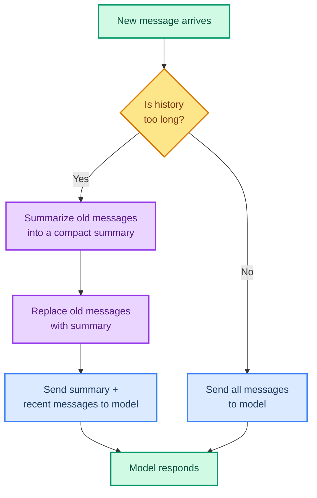

# Summarization: Keeping Long Conversations Manageable

> **Goal:** Use SummarizationMiddleware to compress old messages so conversations stay within the model's context window.  
> **Previous chapter:** [09 - Context and Runtime](./09-context-and-runtime.md)  
> **Next chapter:** [11 - Tool Error Handling](./11-tool-error-handling.md)

---

## The Problem: Growing Conversations

Every model has a **context window** - a maximum number of tokens it can process at once. As conversations grow, the message list grows:



Without compression:
- Longer conversations = slower responses
- Too long = model errors ("context length exceeded")
- More tokens = higher cost

---

## The Solution: SummarizationMiddleware

`SummarizationMiddleware` watches the conversation and automatically summarizes old messages when they get too long:



---

## Using SummarizationMiddleware

```python
from dotenv import load_dotenv
load_dotenv()

from langchain_groq import ChatGroq
from langchain.agents import create_agent
from langchain.agents.middleware import SummarizationMiddleware
from langchain.tools import tool
from langchain_core.utils.uuid import uuid7
from langgraph.checkpoint.memory import InMemorySaver


# A simple tool so the agent has something to do
@tool
def calculate(expression: str) -> str:
    """Calculate a math expression.

    Args:
        expression: A math expression like '2 + 2'.
    """
    try:
        return str(eval(expression, {"__builtins__": {}}, {}))
    except Exception as e:
        return f"Error: {e}"


llm = ChatGroq(model="openai/gpt-oss-120b", temperature=0)

# Create the summarization middleware
summarizer = SummarizationMiddleware(
    model=llm,                    # Model to use for summarization
    max_tokens_before_summary=1000,  # Summarize when messages exceed 1000 tokens
)

agent = create_agent(
    model=llm,
    tools=[calculate],
    system_prompt="You are a helpful math assistant. Keep answers short.",
    middleware=[summarizer],
    checkpointer=InMemorySaver(),
)

config = {"configurable": {"thread_id": str(uuid7())}}

# Have a long conversation
questions = [
    "What is 2 + 2?",
    "What is 10 * 5?",
    "What is 100 / 3?",
    "What is 7 * 8?",
    "What is 45 + 55?",
    "What is 1000 - 250?",
    "What is 3 squared?",
    "What is the square root of 144?",
]

for q in questions:
    result = agent.invoke(
        {"messages": [{"role": "user", "content": q}]},
        config=config,
    )
    print(f"Q: {q}")
    print(f"A: {result['messages'][-1].content}\n")
```

Without SummarizationMiddleware, all 8 questions plus all 8 answers plus all tool calls would keep growing in the message list. With it, when the history gets too long, old messages are replaced by a summary like "The user asked several math questions about basic arithmetic."

---

## How Summarization Works Behind the Scenes

```mermaid
sequenceDiagram
    participant U as User
    participant SM as SummarizationMiddleware
    participant M as Model
    participant T as Tool

    U->>SM: New message
    SM->>SM: Check token count
    alt Too long
        SM->>M: Summarize old messages
        M->>SM: Return summary
        SM->>SM: Replace old messages with summary
    end
    SM->>M: Send summary + recent messages
    M->>T: Maybe call tool
    T->>SM: Tool result
    SM->>M: Send result
    M->>U: Final answer

    style U fill:#d1fae5,stroke:#059669,stroke-width:2px,color:#064e3b
    style SM fill:#e9d5ff,stroke:#9333ea,stroke-width:2px,color:#581c87
    style M fill:#fde68a,stroke:#d97706,stroke-width:2px,color:#78350f
    style T fill:#dbeafe,stroke:#3b82f6,stroke-width:2px,color:#1e3a5f
```

---

## Configuration Options

```python
summarizer = SummarizationMiddleware(
    model=llm,                        # Model for summarization (can be different/cheaper)
    max_tokens_before_summary=2000,   # Trigger when history exceeds 2000 tokens
    messages_to_keep=10,              # Keep last 10 messages as-is (don't summarize recent ones)
)
```

| Parameter | What It Does | Default |
|-----------|-------------|---------|
| `model` | Model used for summarization | Required |
| `max_tokens_before_summary` | Token threshold to trigger summarization | Varies |
| `messages_to_keep` | How many recent messages to never summarize | Varies |

> **Tip:** Use a cheaper or faster model for summarization. The summarization doesn't need to be perfect - it just needs to capture the key points. You can even use a smaller Groq model for summaries while using `openai/gpt-oss-120b` for the main agent.

---

## Real-World Example: Long Research Conversation

```python
from dotenv import load_dotenv
load_dotenv()

from langchain_groq import ChatGroq
from langchain_tavily import TavilySearch
from langchain.agents import create_agent, create_agent
from langchain.agents.middleware import SummarizationMiddleware
from langchain_core.utils.uuid import uuid7
from langgraph.checkpoint.memory import InMemorySaver

llm = ChatGroq(model="openai/gpt-oss-120b", temperature=0)

web_search = TavilySearch(
    max_results=2,
    include_answer=True,
)

summarizer = SummarizationMiddleware(
    model=llm,
    max_tokens_before_summary=500,  # Low threshold for demo
    messages_to_keep=4,              # Keep last 4 messages
)

agent = create_agent(
    model=llm,
    tools=[web_search],
    system_prompt="You are a research assistant. Answer questions based on web search results.",
    middleware=[summarizer],
    checkpointer=InMemorySaver(),
)

config = {"configurable": {"thread_id": str(uuid7())}}

topics = [
    "What are the latest AI trends in 2026?",
    "What is quantum computing?",
    "What is the difference between ML and AI?",
    "What are large language models?",
]

for topic in topics:
    print(f"\n=== Question: {topic} ===")
    result = agent.invoke(
        {"messages": [{"role": "user", "content": topic}]},
        config=config,
    )
    print(result["messages"][-1].content[:200] + "...")
    
    # Count messages in state
    msg_count = len(result["messages"])
    print(f"[Messages in conversation: {msg_count}]")
```

---

## When to Use Summarization

| Use Case | Use Summarization? | Reason |
|----------|-------------------|--------|
| Short Q&A (3-5 turns) | No | Messages fit easily in context window |
| Long chat conversations | Yes | Messages grow over time |
| Research agents with many tool calls | Yes | Tool results add up quickly |
| Code analysis (reading large files) | Yes | File contents are large |
| Single question, single answer | No | Not enough history to compress |

---

## Try It Yourself

1. Create an agent with SummarizationMiddleware and have a 20-turn conversation
2. Set `max_tokens_before_summary=100` (very low) and observe when summaries trigger
3. Try using a different (cheaper) model for the summarizer vs the main agent
4. Print the number of messages before and after summarization triggers

---

## Common Mistakes

### Mistake 1: Summarizing Too Aggressively

Setting `max_tokens_before_summary=50` will summarize almost every turn, which can lose important details. Use a reasonable threshold (1000+ tokens).

### Mistake 2: Forgetting to Add Middleware to Agent

```python
# WRONG - summarizer created but never used
summarizer = SummarizationMiddleware(model=llm)
agent = create_agent(model=llm, tools=[...])  # No middleware!

# CORRECT
agent = create_agent(model=llm, tools=[...], middleware=[summarizer])
```

### Mistake 3: No Checkpointer

Without a checkpointer, the agent doesn't persist messages, so summarization has nothing to compress across turns. Always combine with `checkpointer=InMemorySaver()`.

---

## What You Learned

- Why long conversations cause context window overflow
- How SummarizationMiddleware compresses old messages
- How to configure the summarizer with model, threshold, and messages_to_keep
- When to use summarization and when not to

---

## Next Steps

Now let's learn how to handle tool errors gracefully so your agent doesn't crash when something goes wrong.

Go to: [11 - Tool Error Handling](./11-tool-error-handling.md)