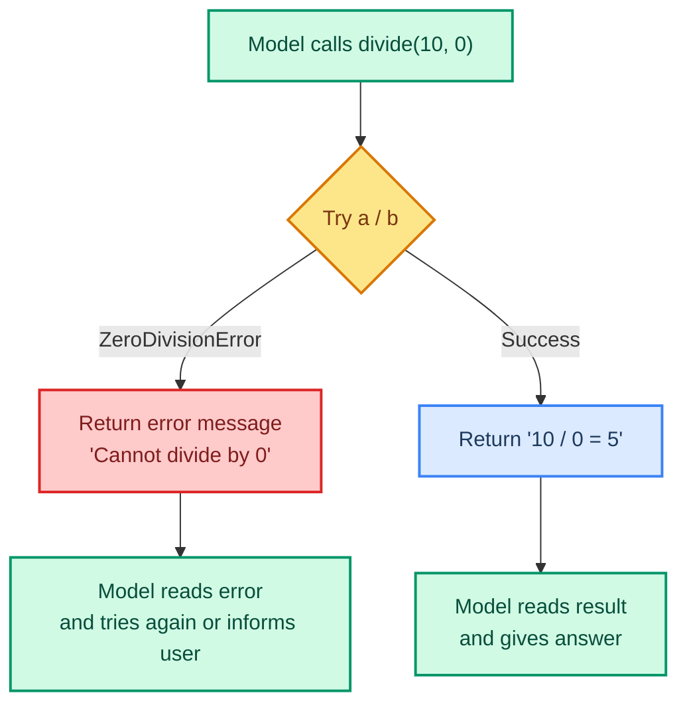
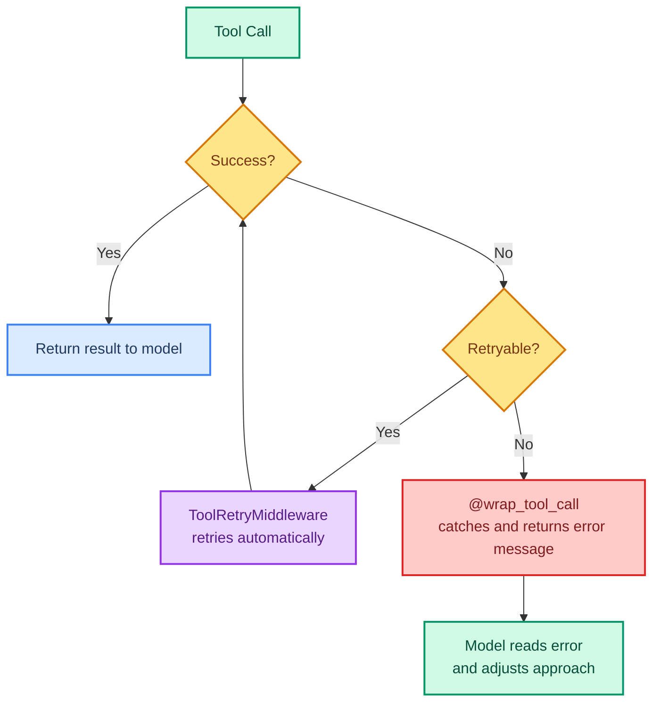

# Handling Tool Errors Gracefully

> **Goal:** Learn to catch tool errors, retry failed calls, and give the model useful error messages.  
> **Previous chapter:** [10 - Summarization Middleware](./10-summarization-middleware.md)  
> **Next chapter:** [12 - Dynamic Tool Selection](./12-dynamic-tool-selection.md)

---

## What Happens When Tools Fail?

Without error handling, a tool failure crashes the agent:

```python
@tool
def divide(a: int, b: int) -> str:
    """Divide a by b."""
    return str(a / b)  # CRASHES if b = 0!
```

If the model calls `divide(10, 0)`, Python raises `ZeroDivisionError`, and the agent stops working.

---

## Solution: Try/Except in Tools

```python
from langchain.tools import tool


@tool
def divide(a: int, b: int) -> str:
    """Divide a by b.

    Args:
        a: The numerator.
        b: The denominator (must not be zero).
    """
    try:
        result = a / b
        return f"{a} / {b} = {result}"
    except ZeroDivisionError:
        return f"Error: Cannot divide {a} by 0. Please provide a non-zero denominator."
    except TypeError as e:
        return f"Error: Both arguments must be numbers. ({e})"
```

Now instead of crashing, the model gets a helpful error message and can try again with different inputs.



---

## Using @wrap_tool_call Middleware

For systematic error handling across ALL tools, use `@wrap_tool_call`:

```python
from dotenv import load_dotenv
load_dotenv()

from collections.abc import Callable
from langchain_groq import ChatGroq
from langchain.agents import create_agent
from langchain.agents.middleware import wrap_tool_call
from langchain.messages import ToolMessage
from langchain.tools.tool_node import ToolCallRequest
from langchain.tools import tool


# This middleware wraps EVERY tool call
@wrap_tool_call
def handle_tool_errors(
    request: ToolCallRequest,
    handler: Callable[[ToolCallRequest], ToolMessage],
) -> ToolMessage:
    """Convert tool exceptions into ToolMessages the model can handle."""
    try:
        return handler(request)  # Run the actual tool
    except Exception as e:
        return ToolMessage(
            content=f"Tool error: Please check your input and try again. ({e})",
            tool_call_id=request.tool_call["id"],
        )


@tool
def divide(a: int, b: int) -> str:
    """Divide a by b.

    Args:
        a: The numerator.
        b: The denominator.
    """
    return str(a / b)  # Will crash if b=0, but middleware catches it


@tool
def read_file(filepath: str) -> str:
    """Read a file's contents.

    Args:
        filepath: The path to the file.
    """
    with open(filepath, "r") as f:  # Will crash if file missing, but middleware catches it
        return f.read()


llm = ChatGroq(model="openai/gpt-oss-120b", temperature=0)
agent = create_agent(
    model=llm,
    tools=[divide, read_file],
    system_prompt="You are a helpful assistant.",
    middleware=[handle_tool_errors],
)

result = agent.invoke({
    "messages": [{"role": "user", "content": "Read the file 'nonexistent.txt' and divide 10 by 0."}]
})
for msg in result["messages"]:
    msg.pretty_print()
```

> With `@wrap_tool_call`, you write ONE error handler and it applies to every tool in the agent.

---

## ToolRetryMiddleware: Automatic Retries

Sometimes a tool fails temporarily (network timeout, API rate limit). `ToolRetryMiddleware` automatically retries failed calls:

```python
from dotenv import load_dotenv
load_dotenv()

from langchain_groq import ChatGroq
from langchain.agents import create_agent
from langchain.agents.middleware import ToolRetryMiddleware
from langchain.tools import tool
import random


@tool
def fetch_data(url: str) -> str:
    """Fetch data from a URL (simulated, may fail randomly).

    Args:
        url: The URL to fetch data from.
    """
    # Simulate a flaky API that fails 50% of the time
    if random.random() < 0.5:
        raise ConnectionError(f"Failed to connect to {url}")
    return f"Data from {url}: 42 records"


llm = ChatGroq(model="openai/gpt-oss-120b", temperature=0)
agent = create_agent(
    model=llm,
    tools=[fetch_data],
    system_prompt="You are a helpful assistant.",
    middleware=[
        ToolRetryMiddleware(max_retries=3),  # Retry up to 3 times
    ],
)

result = agent.invoke({
    "messages": [{"role": "user", "content": "Fetch data from https://api.example.com/data"}]
})
print(result["messages"][-1].content)
# The tool will retry up to 3 times if it fails
```

---

## ModelRetryMiddleware: Retrying Model Calls

Model calls can also fail (rate limits, timeout). `ModelRetryMiddleware` handles that:

```python
from langchain_groq import ChatGroq
from langchain.agents import create_agent
from langchain.agents.middleware import ModelRetryMiddleware, ToolRetryMiddleware

llm = ChatGroq(model="openai/gpt-oss-120b", temperature=0)
agent = create_agent(
    model=llm,
    tools=[],
    system_prompt="You are a helpful assistant.",
    middleware=[
        ModelRetryMiddleware(max_retries=3),  # Retry model calls up to 3 times
        ToolRetryMiddleware(max_retries=2),   # Retry tool calls up to 2 times
    ],
)
```

---

## Error Handling Strategy



---

## Complete Example: Robust File Processor

```python
from dotenv import load_dotenv
load_dotenv()

from collections.abc import Callable
from langchain_groq import ChatGroq
from langchain.agents import create_agent
from langchain.agents.middleware import (
    wrap_tool_call,
    ToolRetryMiddleware,
)
from langchain.messages import ToolMessage
from langchain.tools.tool_node import ToolCallRequest
from langchain.tools import tool
import json
import os


@wrap_tool_call
def safe_tool_execution(
    request: ToolCallRequest,
    handler: Callable[[ToolCallRequest], ToolMessage],
) -> ToolMessage:
    """Catch any tool error and give the model a useful message."""
    try:
        return handler(request)
    except FileNotFoundError:
        return ToolMessage(
            content="Error: File not found. Please check the file path and try again.",
            tool_call_id=request.tool_call["id"],
        )
    except PermissionError:
        return ToolMessage(
            content="Error: Permission denied. You don't have access to this file.",
            tool_call_id=request.tool_call["id"],
        )
    except json.JSONDecodeError as e:
        return ToolMessage(
            content=f"Error: Invalid JSON format. Details: {e}",
            tool_call_id=request.tool_call["id"],
        )
    except Exception as e:
        return ToolMessage(
            content=f"Error: An unexpected error occurred: {type(e).__name__}: {e}",
            tool_call_id=request.tool_call["id"],
        )


@tool
def read_json_file(filepath: str) -> str:
    """Read and parse a JSON file.

    Args:
        filepath: Path to the JSON file.
    """
    with open(filepath, "r") as f:
        data = json.load(f)
    return json.dumps(data, indent=2)


@tool
def write_json_file(filepath: str, data: str) -> str:
    """Write data to a JSON file.

    Args:
        filepath: Path to write the JSON file.
        data: JSON string to write.
    """
    parsed = json.loads(data)  # Validate JSON
    with open(filepath, "w") as f:
        json.dump(parsed, f, indent=2)
    return f"Successfully wrote JSON to '{filepath}'."


@tool
def list_files(directory: str) -> str:
    """List files in a directory.

    Args:
        directory: The directory path to list.
    """
    files = os.listdir(directory)
    return f"Files in {directory}: {', '.join(files)}"


llm = ChatGroq(model="openai/gpt-oss-120b", temperature=0)
agent = create_agent(
    model=llm,
    tools=[read_json_file, write_json_file, list_files],
    system_prompt="You are a file management assistant. Handle errors gracefully.",
    middleware=[
        safe_tool_execution,
        ToolRetryMiddleware(max_retries=2),
    ],
)

result = agent.invoke({
    "messages": [{"role": "user", "content": "Read the JSON file at '/nonexistent/config.json' and tell me what's in it."}]
})
print(result["messages"][-1].content)
# "The file '/nonexistent/config.json' was not found. Please check the path..."
```

---

## Try It Yourself

1. Create a tool that divides two numbers with proper ZeroDivisionError handling
2. Create an agent with `@wrap_tool_call` that catches all exceptions and returns friendly messages
3. Add `ToolRetryMiddleware` to an agent with a flaky tool (randomly fails)
4. Test: does the model adjust its approach after receiving an error message?

---

## What You Learned

- Why unhandled tool errors crash agents
- How to use try/except in individual tools
- How to use `@wrap_tool_call` for global error handling
- How `ToolRetryMiddleware` automatically retries failed tool calls
- How `ModelRetryMiddleware` retries failed model calls
- How to build a robust file processing agent

---

## Next Steps

Not every tool is needed all the time. Let's learn how to dynamically choose which tools the agent can use.

Go to: [12 - Dynamic Tool Selection](./12-dynamic-tool-selection.md)