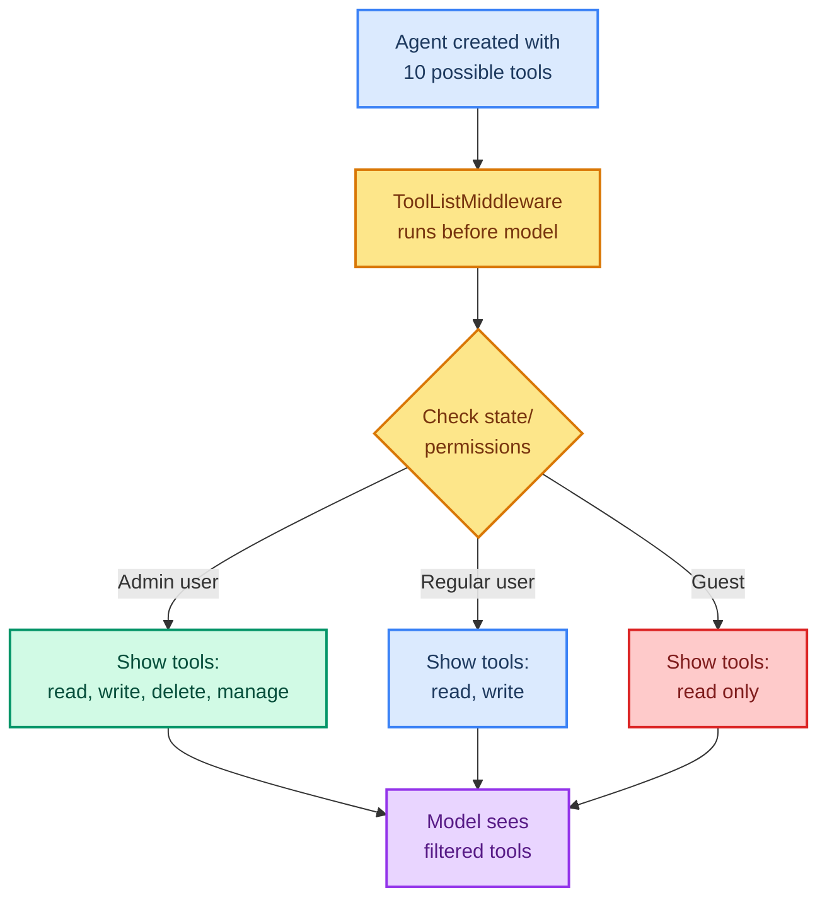

# Dynamic Tool Selection

> **Goal:** Use ToolListMiddleware to filter and change which tools are available to the agent at runtime.  
> **Previous chapter:** [11 - Tool Error Handling](./11-tool-error-handling.md)  
> **Next chapter:** [13 - Real-World Tools](./13-real-world-tools.md)

---

## Why Dynamic Tools?

Not every tool is needed all the time:

- **Too many tools** = model gets confused, calls wrong tools, increases errors
- **Too few tools** = agent can't do everything it needs
- **Different users** need different tools (admin vs regular user)
- **Different stages** of a conversation need different tools

Dynamic tool selection lets you **change the available tools at runtime** based on state, context, or permissions.

---

## How Dynamic Tool Selection Works



---

## Approach 1: Filtering Pre-Registered Tools

Register all tools, then filter which ones the model sees:

```python
from dotenv import load_dotenv
load_dotenv()

from dataclasses import dataclass
from langchain_groq import ChatGroq
from langchain.agents import create_agent, AgentState
from langchain.agents.middleware import ToolListMiddleware
from langchain.tools import tool, ToolRuntime
from langchain.messages import HumanMessage
from langchain_core.utils.uuid import uuid7
from langgraph.checkpoint.memory import InMemorySaver


@dataclass
class UserContext:
    user_id: str
    role: str  # "admin", "user", or "guest"


@tool
def read_data(query: str) -> str:
    """Read data from the database.

    Args:
        query: What to look up.
    """
    return f"Data for '{query}': 42 records found."


@tool
def write_data(query: str, value: str) -> str:
    """Write data to the database.

    Args:
        query: What to write.
        value: The value to write.
    """
    return f"Wrote '{value}' for '{query}'."


@tool
def delete_data(query: str) -> str:
    """Delete data from the database. Admin only.

    Args:
        query: What to delete.
    """
    return f"Deleted data for '{query}'."


@tool
def manage_users(action: str) -> str:
    """Manage user accounts (create, suspend, delete). Admin only.

    Args:
        action: The management action to take.
    """
    return f"User management: {action}"


# ToolListMiddleware that filters based on user role
def filter_tools_by_role(state, runtime_context):
    """Filter tools based on the user's role from context."""
    role = runtime_context.role if runtime_context else "guest"

    all_tools = [read_data, write_data, delete_data, manage_users]

    if role == "admin":
        return all_tools  # Admin sees all tools
    elif role == "user":
        return [read_data, write_data]  # User sees read + write
    else:
        return [read_data]  # Guest sees only read


llm = ChatGroq(model="openai/gpt-oss-120b", temperature=0)

agent = create_agent(
    model=llm,
    tools=[read_data, write_data, delete_data, manage_users],
    context_schema=UserContext,
    system_prompt="You are a database assistant. Only use tools you have access to.",
    middleware=[
        ToolListMiddleware(tool_list=filter_tools_by_role),
    ],
    checkpointer=InMemorySaver(),
)

# Admin can delete
config_admin = {"configurable": {"thread_id": str(uuid7())}}
result_admin = agent.invoke(
    {"messages": [{"role": "user", "content": "Delete all records for user 'test_user'."}]},
    config=config_admin,
    context=UserContext(user_id="admin1", role="admin"),
)
print("Admin:", result_admin["messages"][-1].content)

# Guest cannot delete (tool not available)
config_guest = {"configurable": {"thread_id": str(uuid7())}}
result_guest = agent.invoke(
    {"messages": [{"role": "user", "content": "Delete all records for user 'test_user'."}]},
    config=config_guest,
    context=UserContext(user_id="guest1", role="guest"),
)
print("Guest:", result_guest["messages"][-1].content)
# "I don't have access to delete data. I can only read data."
```

---

## Approach 2: State-Based Filtering

Show advanced tools only after certain conversation milestones:

```python
from dotenv import load_dotenv
load_dotenv()

from langchain_groq import ChatGroq
from langchain.agents import create_agent, AgentState
from langchain.agents.middleware import ToolListMiddleware
from langchain.tools import tool
from langchain_core.utils.uuid import uuid7
from langgraph.checkpoint.memory import InMemorySaver


class ChatState(AgentState):
    verified: bool  # Whether the user has been verified


@tool
def public_info(query: str) -> str:
    """Search for public information. Available to all users.

    Args:
        query: What to search for.
    """
    return f"Public info for '{query}': This is public data."


@tool
def sensitive_info(query: str) -> str:
    """Search for sensitive information. Available only after verification.

    Args:
        query: What to search for.
    """
    return f"Sensitive info for '{query}': This is confidential data."


@tool
def verify_user(user_id: str) -> str:
    """Verify a user's identity to unlock sensitive tools.

    Args:
        user_id: The user ID to verify.
    """
    return f"User '{user_id}' has been verified successfully."


def filter_by_verification(state, runtime_context):
    """Show sensitive tools only after verification."""
    verified = state.get("verified", False)
    if verified:
        return [public_info, sensitive_info, verify_user]
    return [public_info, verify_user]


llm = ChatGroq(model="openai/gpt-oss-120b", temperature=0)
agent = create_agent(
    model=llm,
    tools=[public_info, sensitive_info, verify_user],
    system_prompt="You are an information assistant. Some tools require verification first.",
    state_schema=ChatState,
    middleware=[
        ToolListMiddleware(tool_list=filter_by_verification),
    ],
    checkpointer=InMemorySaver(),
)

config = {"configurable": {"thread_id": str(uuid7())}}

# Turn 1: Try to access sensitive info (not verified yet)
r1 = agent.invoke(
    {"messages": [{"role": "user", "content": "Show me sensitive info about the project."}]},
    config=config,
)
print("Turn 1:", r1["messages"][-1].content)
# Agent uses verify_user first or says it needs verification

# Turn 2: Verify
r2 = agent.invoke(
    {"messages": [{"role": "user", "content": "Verify my user ID: alice123"}]},
    config=config,
)
print("Turn 2:", r2["messages"][-1].content)
```

---

## Approach 3: Lazy Loading Tools

Load tools on-demand based on the conversation topic:

```python
from dotenv import load_dotenv
load_dotenv()

from langchain_groq import ChatGroq
from langchain.agents import create_agent
from langchain.agents.middleware import ToolListMiddleware
from langchain.tools import tool
from langchain_core.utils.uuid import uuid7
from langgraph.checkpoint.memory import InMemorySaver


@tool
def general_chat(message: str) -> str:
    """Respond to general conversation.

    Args:
        message: The message to respond to.
    """
    return f"I received your message: {message}"


@tool
def math_calculate(expression: str) -> str:
    """Calculate a math expression.

    Args:
        expression: A math expression.
    """
    try:
        return str(eval(expression, {"__builtins__": {}}, {}))
    except Exception as e:
        return f"Error: {e}"


@tool
def translate(text: str, language: str) -> str:
    """Translate text to another language (simulated).

    Args:
        text: Text to translate.
        language: Target language.
    """
    return f"[{language}] {text}"  # Simulated translation


# Define tool groups
MATH_TOOLS = [math_calculate]
CHAT_TOOLS = [general_chat]
TRANSLATE_TOOLS = [translate]
ALL_TOOLS = MATH_TOOLS + CHAT_TOOLS + TRANSLATE_TOOLS


def select_relevant_tools(state, runtime_context):
    """Select tools based on the latest user message."""
    messages = state["messages"]
    if not messages:
        return ALL_TOOLS

    # Get the last user message
    last_user_msg = ""
    for msg in reversed(messages):
        if hasattr(msg, 'type') and msg.type == "human":
            last_user_msg = msg.content.lower()
            break
        elif isinstance(msg, dict) and msg.get("role") == "user":
            last_user_msg = msg.get("content", "").lower()
            break

    # Simple keyword matching to select tools
    if any(kw in last_user_msg for kw in ["calculate", "add", "multiply", "divide", "subtract", "math"]):
        return MATH_TOOLS + CHAT_TOOLS
    elif any(kw in last_user_msg for kw in ["translate", "language", "spanish", "french"]):
        return TRANSLATE_TOOLS + CHAT_TOOLS
    else:
        return CHAT_TOOLS  # Default: just chat


llm = ChatGroq(model="openai/gpt-oss-120b", temperature=0)
agent = create_agent(
    model=llm,
    tools=ALL_TOOLS,
    system_prompt="You are a helpful assistant with math and translation skills.",
    middleware=[
        ToolListMiddleware(tool_list=select_relevant_tools),
    ],
    checkpointer=InMemorySaver(),
)

config = {"configurable": {"thread_id": str(uuid7())}}

# Math question - math tools available
r1 = agent.invoke(
    {"messages": [{"role": "user", "content": "Calculate 25 * 4"}]},
    config=config,
)
print("Math:", r1["messages"][-1].content)
```

---

## Try It Yourself

1. Create an agent with 5 tools and filter to show only 2 based on context (user role)
2. Create a state-based filter that unlocks an "admin" tool only after a password is verified
3. Build a lazy-loading system that selects translation tools when the user mentions "translate" or a language name

---

## What You Learned

- Why too many tools confuse the model
- How `ToolListMiddleware` dynamically filters tools
- Three approaches: role-based, state-based, and topic-based filtering
- How to lazy-load only relevant tools per conversation

---

## Next Steps

Let's build some real-world tools that you would actually use in production: calculators, file readers, database queries, web search, and HTTP APIs.

Go to: [13 - Real-World Tools](./13-real-world-tools.md)