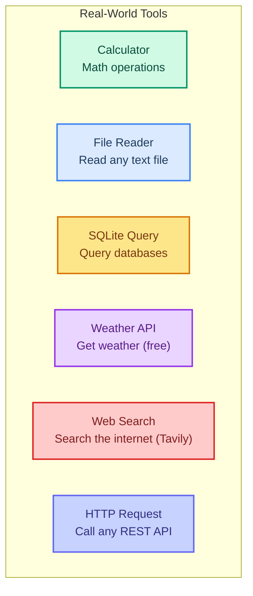

# Building Real-World Tools

> **Goal:** Build practical tools you would use in real applications: calculator, file reader, SQLite query, weather API, and web search.  
> **Previous chapter:** [12 - Dynamic Tool Selection](./12-dynamic-tool-selection.md)  
> **Next chapter:** [14 - Middleware Overview](./14-middleware-overview.md)

---

## What You Will Build



All tools use **free** libraries and APIs only.

---

## Tool 1: Calculator

```python
from langchain.tools import tool


@tool
def calculate(expression: str) -> str:
    """Calculate a mathematical expression safely.

    Use this for any math problem: addition, subtraction, multiplication,
    division, exponents, etc.

    Args:
        expression: A valid math expression like '15 * 37', '2 ** 10', or '100 / 4'.
    """
    # Safe eval - only allows math operations, no dangerous functions
    allowed_names = {"__builtins__": {}}
    try:
        result = eval(expression, allowed_names, {})
        return f"Result: {expression} = {result}"
    except Exception as e:
        return f"Error: Could not calculate '{expression}'. {type(e).__name__}: {e}"
```

---

## Tool 2: File Reader

```python
from langchain.tools import tool
import os


@tool
def read_file(filepath: str) -> str:
    """Read the contents of a text file.

    Supports .txt, .md, .json, .csv, .py, and other text files.
    Maximum file size: 10KB.

    Args:
        filepath: The path to the file to read.
    """
    try:
        if not os.path.exists(filepath):
            return f"Error: File '{filepath}' does not exist."
        
        size = os.path.getsize(filepath)
        if size > 10240:  # 10KB limit
            return f"Error: File is too large ({size} bytes). Maximum is 10KB."
        
        with open(filepath, "r", encoding="utf-8") as f:
            content = f.read()
        
        return f"File '{filepath}' ({size} bytes):\n{content}"
    except PermissionError:
        return f"Error: Permission denied for '{filepath}'."
    except Exception as e:
        return f"Error reading file: {e}"


@tool
def write_file(filepath: str, content: str) -> str:
    """Write content to a text file.

    Args:
        filepath: The path to write to.
        content: The content to write.
    """
    try:
        with open(filepath, "w", encoding="utf-8") as f:
            f.write(content)
        return f"Successfully wrote {len(content)} characters to '{filepath}'."
    except Exception as e:
        return f"Error writing file: {e}"


@tool
def list_directory(path: str = ".") -> str:
    """List files in a directory.

    Args:
        path: The directory path (default is current directory).
    """
    try:
        items = os.listdir(path)
        files = [f for f in items if os.path.isfile(os.path.join(path, f))]
        dirs = [d for d in items if os.path.isdir(os.path.join(path, d))]
        
        result = f"Directory: {path}\n"
        if dirs:
            result += f"\nFolders ({len(dirs)}):\n" + "\n".join(f"  {d}/" for d in sorted(dirs))
        if files:
            result += f"\nFiles ({len(files)}):\n" + "\n".join(f"  {f}" for f in sorted(files))
        return result
    except Exception as e:
        return f"Error: {e}"
```

---

## Tool 3: SQLite Query

```python
from langchain.tools import tool
import sqlite3
import os


@tool
def query_sqlite(database: str, query: str) -> str:
    """Run a SQL query on a SQLite database.

    Args:
        database: Path to the SQLite database file.
        query: A SQL query (SELECT only for safety).
    """
    if not os.path.exists(database):
        return f"Error: Database '{database}' not found."

    # Safety: only allow SELECT queries
    if not query.strip().upper().startswith("SELECT"):
        return "Error: Only SELECT queries are allowed for safety."

    try:
        conn = sqlite3.connect(database)
        cursor = conn.cursor()
        cursor.execute(query)
        rows = cursor.fetchall()
        columns = [desc[0] for desc in cursor.description] if cursor.description else []
        conn.close()

        if not rows:
            return "Query returned no results."

        # Format results as a table
        result = f"Columns: {', '.join(columns)}\n"
        result += f"Rows: {len(rows)}\n\n"
        for row in rows[:20]:  # Limit to 20 rows
            result += " | ".join(str(v) for v in row) + "\n"
        if len(rows) > 20:
            result += f"... and {len(rows) - 20} more rows."
        return result
    except sqlite3.Error as e:
        return f"Database error: {e}"


@tool
def create_sqlite_table(database: str, table_name: str, schema: str) -> str:
    """Create a table in a SQLite database.

    Args:
        database: Path to the SQLite database file.
        table_name: Name of the table to create.
        schema: Column definitions, e.g., "id INTEGER PRIMARY KEY, name TEXT, age INTEGER".
    """
    try:
        conn = sqlite3.connect(database)
        cursor = conn.cursor()
        cursor.execute(f"CREATE TABLE IF NOT EXISTS {table_name} ({schema})")
        conn.commit()
        conn.close()
        return f"Table '{table_name}' created successfully in '{database}'."
    except sqlite3.Error as e:
        return f"Error: {e}"
```

### Complete Example with SQLite

```python
from dotenv import load_dotenv
load_dotenv()

from langchain_groq import ChatGroq
from langchain.agents import create_agent
from langchain.tools import tool
import sqlite3


# Create a test database first
conn = sqlite3.connect("test.db")
conn.execute("CREATE TABLE IF NOT EXISTS users (id INTEGER PRIMARY KEY, name TEXT, age INTEGER, city TEXT)")
conn.execute("INSERT OR REPLACE INTO users VALUES (1, 'Alice', 30, 'London')")
conn.execute("INSERT OR REPLACE INTO users VALUES (2, 'Bob', 25, 'Paris')")
conn.execute("INSERT OR REPLACE INTO users VALUES (3, 'Charlie', 35, 'Tokyo')")
conn.commit()
conn.close()


@tool
def query_sqlite(query: str) -> str:
    """Run a SELECT query on the test database.

    Args:
        query: A SQL SELECT query.
    """
    if not query.strip().upper().startswith("SELECT"):
        return "Error: Only SELECT queries allowed."
    try:
        conn = sqlite3.connect("test.db")
        cursor = conn.cursor()
        cursor.execute(query)
        rows = cursor.fetchall()
        columns = [desc[0] for desc in cursor.description]
        conn.close()
        if not rows:
            return "No results."
        result = " | ".join(columns) + "\n"
        result += "-" * 40 + "\n"
        for row in rows:
            result += " | ".join(str(v) for v in row) + "\n"
        return result
    except Exception as e:
        return f"Error: {e}"


llm = ChatGroq(model="openai/gpt-oss-120b", temperature=0)
agent = create_agent(
    model=llm,
    tools=[query_sqlite],
    system_prompt="You are a database assistant. Use the query_sqlite tool to answer questions.",
)

result = agent.invoke({
    "messages": [{"role": "user", "content": "Who are all the users in the database and what are their ages?"}]
})
print(result["messages"][-1].content)
# "There are 3 users: Alice (30), Bob (25), and Charlie (35)."
```

---

## Tool 4: Weather API (Free)

Using the free Open-Meteo API (no API key needed):

```python
from langchain.tools import tool
import urllib.request
import json


@tool
def get_weather(latitude: float, longitude: float) -> str:
    """Get current weather for a location using coordinates.

    Args:
        latitude: The latitude of the location.
        longitude: The longitude of the location.
    """
    try:
        url = (
            f"https://api.open-meteo.com/v1/forecast?"
            f"latitude={latitude}&longitude={longitude}"
            f"&current=temperature_2m,relative_humidity_2m,wind_speed_10m"
        )
        with urllib.request.urlopen(url) as response:
            data = json.loads(response.read())
        
        current = data.get("current", {})
        temp = current.get("temperature_2m", "N/A")
        humidity = current.get("relative_humidity_2m", "N/A")
        wind = current.get("wind_speed_10m", "N/A")
        
        return (
            f"Current weather at ({latitude}, {longitude}):\n"
            f"  Temperature: {temp}°C\n"
            f"  Humidity: {humidity}%\n"
            f"  Wind Speed: {wind} km/h"
        )
    except Exception as e:
        return f"Error getting weather: {e}"


@tool
def get_weather_by_city(city: str) -> str:
    """Get weather by city name (uses free geocoding API).

    Args:
        city: The name of the city.
    """
    try:
        # Free geocoding API
        geo_url = f"https://geocoding-api.open-meteo.com/v1/search?name={city}&count=1"
        with urllib.request.urlopen(geo_url) as response:
            geo_data = json.loads(response.read())
        
        if not geo_data.get("results"):
            return f"City '{city}' not found."
        
        loc = geo_data["results"][0]
        lat = loc["latitude"]
        lon = loc["longitude"]
        
        # Now get weather
        weather_url = (
            f"https://api.open-meteo.com/v1/forecast?"
            f"latitude={lat}&longitude={lon}"
            f"&current=temperature_2m,relative_humidity_2m,wind_speed_10m"
        )
        with urllib.request.urlopen(weather_url) as response:
            data = json.loads(response.read())
        
        current = data.get("current", {})
        return (
            f"Weather in {loc['name']}, {loc.get('country', '')}:\n"
            f"  Temperature: {current.get('temperature_2m', 'N/A')}°C\n"
            f"  Humidity: {current.get('relative_humidity_2m', 'N/A')}%\n"
            f"  Wind: {current.get('wind_speed_10m', 'N/A')} km/h"
        )
    except Exception as e:
        return f"Error: {e}"
```

---

## Tool 5: Web Search (Tavily Free Tier)

```python
from langchain_tavily import TavilySearch


# TavilySearch is already a LangChain tool
web_search = TavilySearch(
    max_results=3,
    include_raw_content=False,
    include_answer=True,
    topic="general",  # or "news" for news search
)

# Use directly in an agent
from dotenv import load_dotenv
load_dotenv()

from langchain_groq import ChatGroq
from langchain.agents import create_agent

llm = ChatGroq(model="openai/gpt-oss-120b", temperature=0)
agent = create_agent(
    model=llm,
    tools=[web_search],
    system_prompt="You are a research assistant. Search the web for current information.",
)

result = agent.invoke({
    "messages": [{"role": "user", "content": "What are the most popular Python libraries in 2026?"}]
})
print(result["messages"][-1].content)
```

---

## Tool 6: HTTP Request (Call Any API)

```python
from langchain.tools import tool
import urllib.request
import json


@tool
def http_get(url: str) -> str:
    """Make an HTTP GET request to any URL and return the response.

    Use this to call REST APIs.

    Args:
        url: The URL to request.
    """
    try:
        req = urllib.request.Request(url, headers={"User-Agent": "LangChain-Agent/1.0"})
        with urllib.request.urlopen(req, timeout=10) as response:
            data = response.read().decode("utf-8")
            
            # Try to parse as JSON for pretty printing
            try:
                parsed = json.loads(data)
                return json.dumps(parsed, indent=2)[:2000]  # Limit output
            except json.JSONDecodeError:
                return data[:2000]
    except Exception as e:
        return f"Error: {type(e).__name__}: {e}"


@tool
def http_post(url: str, body: str) -> str:
    """Make an HTTP POST request with a JSON body.

    Args:
        url: The URL to send the request to.
        body: A JSON string to send as the request body.
    """
    try:
        data = body.encode("utf-8")
        req = urllib.request.Request(
            url,
            data=data,
            headers={"Content-Type": "application/json", "User-Agent": "LangChain-Agent/1.0"},
            method="POST",
        )
        with urllib.request.urlopen(req, timeout=10) as response:
            result = response.read().decode("utf-8")
            return result[:2000]
    except Exception as e:
        return f"Error: {type(e).__name__}: {e}"
```

---

## All Tools Together: Swiss Army Agent

```python
from dotenv import load_dotenv
load_dotenv()

from langchain_groq import ChatGroq
from langchain_tavily import TavilySearch
from langchain.agents import create_agent
from langchain.tools import tool
import sqlite3
import os
import urllib.request
import json
import math


@tool
def calculate(expression: str) -> str:
    """Calculate a math expression.

    Args:
        expression: A math expression like '15 * 37' or 'sqrt(144)'.
    """
    allowed = {"__builtins__": {}, "sqrt": math.sqrt, "pi": math.pi, "log": math.log}
    try:
        return str(eval(expression, allowed, {}))
    except Exception as e:
        return f"Error: {e}"


@tool
def read_file(filepath: str) -> str:
    """Read a text file.

    Args:
        filepath: Path to the file.
    """
    try:
        with open(filepath, "r") as f:
            return f.read()[:5000]
    except Exception as e:
        return f"Error: {e}"


@tool
def get_weather_by_city(city: str) -> str:
    """Get current weather for a city. No API key needed.

    Args:
        city: City name.
    """
    try:
        geo_url = f"https://geocoding-api.open-meteo.com/v1/search?name={city}&count=1"
        with urllib.request.urlopen(geo_url) as r:
            geo = json.loads(r.read())
        if not geo.get("results"):
            return f"City '{city}' not found."
        loc = geo["results"][0]
        w_url = f"https://api.open-meteo.com/v1/forecast?latitude={loc['latitude']}&longitude={loc['longitude']}&current=temperature_2m,relative_humidity_2m"
        with urllib.request.urlopen(w_url) as r:
            w = json.loads(r.read())
        c = w.get("current", {})
        return f"Weather in {loc['name']}: {c.get('temperature_2m', 'N/A')}°C, Humidity: {c.get('relative_humidity_2m', 'N/A')}%"
    except Exception as e:
        return f"Error: {e}"


web_search = TavilySearch(max_results=2, include_answer=True)


llm = ChatGroq(model="openai/gpt-oss-120b", temperature=0)
agent = create_agent(
    model=llm,
    tools=[calculate, read_file, get_weather_by_city, web_search],
    system_prompt="You are a versatile assistant with math, file, weather, and web search tools.",
)

result = agent.invoke({
    "messages": [{
        "role": "user",
        "content": "What's the weather in Tokyo, and what is 42 * 17?"
    }]
})
for msg in result["messages"]:
    msg.pretty_print()
```

---

## Try It Yourself

1. Create a SQLite database with a "products" table and an agent that can query it
2. Build a weather agent that compares weather in 3 different cities
3. Create a file management agent that can list, read, and write files
4. Combine 3+ tools into one agent and give it a complex multi-step task

---

## What You Learned

- Built 6 real-world tools: calculator, file reader, SQLite query, weather, web search, HTTP request
- How to safely evaluate math expressions
- How to query SQLite databases from a tool
- How to use free weather APIs without an API key
- How to combine multiple tools into a powerful "Swiss Army" agent

---

## Next Steps

Now let's learn about **middleware** - the system that lets you customize every part of how your agent works.

Go to: [14 - Middleware Overview](./14-middleware-overview.md)