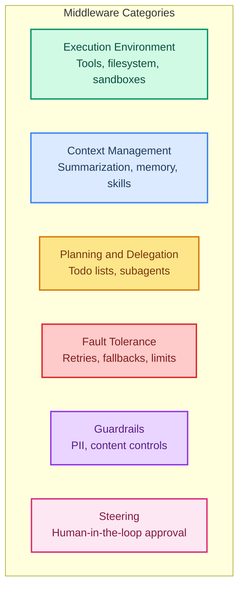

# Middleware: Customizing Your Agent's Behavior

> **Goal:** Understand what middleware is, the 6 categories, and how to compose them for production-ready agents.  
> **Previous chapter:** [13 - Real-World Tools](./13-real-world-tools.md)  
> **Next chapter:** [15 - Fault Tolerance](./15-fault-tolerance.md)

---

## What Is Middleware?

Middleware is code that runs **around** the agent loop. It can modify behavior before or after the model runs, before or after tools run, or even change what happens entirely.

Think of it like a filter pipeline:

```mermaid
graph LR
    A["User Message"] --> B["Before Agent<br/>Middleware"]
    B --> C["Before Model<br/>Middleware"]
    C --> D["Model Runs"]
    D --> E["After Model<br/>Middleware"]
    E --> F["Before Tool<br/>Middleware"]
    F --> G["Tool Runs"]
    G --> H["After Tool<br/>Middleware"]
    H --> I["After Agent<br/>Middleware"]
    I --> J["Final Answer"]

    style A fill:#d1fae5,stroke:#059669,stroke-width:2px,color:#064e3b
    style B fill:#fde68a,stroke:#d97706,stroke-width:1px,color:#78350f
    style C fill:#fde68a,stroke:#d97706,stroke-width:1px,color:#78350f
    style D fill:#dbeafe,stroke:#3b82f6,stroke-width:2px,color:#1e3a5f
    style E fill:#fde68a,stroke:#d97706,stroke-width:1px,color:#78350f
    style F fill:#fde68a,stroke:#d97706,stroke-width:1px,color:#78350f
    style G fill:#e9d5ff,stroke:#9333ea,stroke-width:2px,color:#581c87
    style H fill:#fde68a,stroke:#d97706,stroke-width:1px,color:#78350f
    style I fill:#fde68a,stroke:#d97706,stroke-width:1px,color:#78350f
    style J fill:#d1fae5,stroke:#059669,stroke-width:2px,color:#064e3b
```



---

## Agent = Model + Harness

LangChain says: **Agent = Model + Harness**. The harness is everything around the model:

- **System prompt** - Instructions
- **Tools** - What the agent can do
- **Middleware** - How the agent behaves (retries, guardrails, summaries, etc.)

---

## The 6 Categories of Middleware



| Category | Purpose | Example Middleware |
|----------|---------|-------------------|
| **Execution Environment** | Give agents a workspace | FilesystemMiddleware |
| **Context Management** | Manage conversation/memory | SummarizationMiddleware, MemoryMiddleware |
| **Planning & Delegation** | Break tasks into pieces | TodoListMiddleware, SubAgentMiddleware |
| **Fault Tolerance** | Handle failures gracefully | ModelRetryMiddleware, ToolRetryMiddleware |
| **Guardrails** | Safety and validation | PII detection, content controls |
| **Steering** | Human oversight | HITL approval middleware |

---

## How to Compose Middleware

```python
from dotenv import load_dotenv
load_dotenv()

from langchain_groq import ChatGroq
from langchain.agents import create_agent
from langchain.agents.middleware import (
    ModelRetryMiddleware,
    ToolRetryMiddleware,
    SummarizationMiddleware,
)
from langchain.tools import tool
from langgraph.checkpoint.memory import InMemorySaver


@tool
def calculate(expression: str) -> str:
    """Calculate a math expression.

    Args:
        expression: A math expression.
    """
    try:
        return str(eval(expression, {"__builtins__": {}}, {}))
    except Exception as e:
        return f"Error: {e}"


llm = ChatGroq(model="openai/gpt-oss-120b", temperature=0)

# Compose middleware - they run in order
agent = create_agent(
    model=llm,
    tools=[calculate],
    system_prompt="You are a helpful assistant.",
    middleware=[
        SummarizationMiddleware(model=llm, max_tokens_before_summary=2000),
        ModelRetryMiddleware(max_retries=3),
        ToolRetryMiddleware(max_retries=2),
    ],
    checkpointer=InMemorySaver(),
)
```

Each middleware runs in the order you list them. You can mix and match however you want.

---

## Prebuilt Middleware List

| Middleware | Category | What It Does |
|-----------|----------|-------------|
| `SummarizationMiddleware` | Context Mgmt | Compress old messages |
| `ModelRetryMiddleware` | Fault Tolerance | Retry failed model calls |
| `ToolRetryMiddleware` | Fault Tolerance | Retry failed tool calls |
| `ToolListMiddleware` | Execution Env | Dynamically filter tools |
| `TodoListMiddleware` | Planning | Give agent task tracking |
| `SubAgentMiddleware` | Delegation | Spawn subagents for parallel work |
| `FilesystemMiddleware` | Execution Env | Give agent a filesystem |
| `MemoryMiddleware` | Context Mgmt | Load persistent instructions |
| `SkillsMiddleware` | Context Mgmt | Load domain knowledge packs |

---

## Try It Yourself

1. Create an agent with 2 middleware (SummarizationMiddleware + ModelRetryMiddleware)
2. Compare behavior with and without middleware on a multi-turn conversation
3. Add ToolRetryMiddleware to an agent with a flaky tool and test it

---

## What You Learned

- What middleware is and where it runs in the agent loop
- The 6 categories: Execution, Context, Planning, Fault Tolerance, Guardrails, Steering
- How to compose multiple middleware together
- What prebuilt middleware is available

---

## Next Steps

Let's start with fault tolerance - making agents that don't crash when things go wrong.

Go to: [15 - Fault Tolerance](./15-fault-tolerance.md)