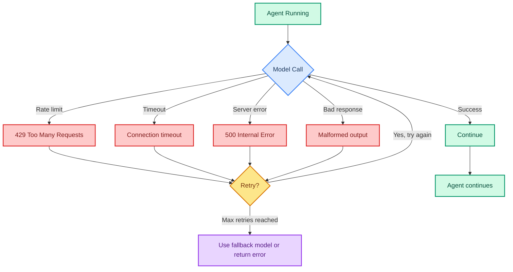

# Fault Tolerance: Making Agents Resilient

> **Goal:** Configure retries, fallbacks, and call limits so your agent handles failures gracefully.  
> **Previous chapter:** [14 - Middleware Overview](./14-middleware-overview.md)  
> **Next chapter:** [16 - Guardrails](./16-guardrails.md)

---

## What Can Go Wrong in Production?



---

## ModelRetryMiddleware

Retries failed model calls automatically:

```python
from dotenv import load_dotenv
load_dotenv()

from langchain_groq import ChatGroq
from langchain.agents import create_agent
from langchain.agents.middleware import ModelRetryMiddleware
from langchain.tools import tool


@tool
def get_data(query: str) -> str:
    """Get data for a query.

    Args:
        query: What to look up.
    """
    return f"Data for '{query}': 42"


llm = ChatGroq(model="openai/gpt-oss-120b", temperature=0)

agent = create_agent(
    model=llm,
    tools=[get_data],
    system_prompt="You are a helpful assistant.",
    middleware=[
        ModelRetryMiddleware(max_retries=3),  # Retry up to 3 times on model failure
    ],
)

result = agent.invoke({"messages": [{"role": "user", "content": "Get data for 'sales 2026'"}]})
print(result["messages"][-1].content)
```

---

## ToolRetryMiddleware

Retries failed tool calls:

```python
from langchain.agents.middleware import ToolRetryMiddleware

agent = create_agent(
    model=llm,
    tools=[get_data],
    system_prompt="You are a helpful assistant.",
    middleware=[
        ModelRetryMiddleware(max_retries=3),   # Retries model calls
        ToolRetryMiddleware(max_retries=2),    # Retries tool calls
    ],
)
```

---

## Combined: Full Fault Tolerance Stack

```python
from dotenv import load_dotenv
load_dotenv()

from langchain_groq import ChatGroq
from langchain.agents import create_agent
from langchain.agents.middleware import (
    ModelRetryMiddleware,
    ToolRetryMiddleware,
)
from langchain.tools import tool
import random


@tool
def flaky_api_call(endpoint: str) -> str:
    """Call an API that might fail (simulated).

    Args:
        endpoint: The API endpoint to call.
    """
    # Simulate 40% failure rate
    if random.random() < 0.4:
        raise ConnectionError(f"Connection failed for {endpoint}")
    return f"Success! Data from {endpoint}: {{'status': 'ok', 'count': 42}}"


@tool
def reliable_tool(query: str) -> str:
    """A reliable tool that never fails.

    Args:
        query: What to look up.
    """
    return f"Result: {query}"


llm = ChatGroq(model="openai/gpt-oss-120b", temperature=0)

agent = create_agent(
    model=llm,
    tools=[flaky_api_call, reliable_tool],
    system_prompt="You are a helpful assistant. If a tool fails, try a different approach.",
    middleware=[
        ModelRetryMiddleware(max_retries=3),  # Model fails? Retry 3 times
        ToolRetryMiddleware(max_retries=3),   # Tool fails? Retry 3 times
    ],
)

result = agent.invoke({
    "messages": [{"role": "user", "content": "Call the flaky API endpoint '/users' and tell me the result."}]
})
print(result["messages"][-1].content)
# The tool will be retried up to 3 times if it fails
```

---

## Call Limits (Preventing Infinite Loops)

By default, agents loop until they finish. Add limits to prevent runaway agents:

```python
from langchain.agents import create_agent

agent = create_agent(
    model=llm,
    tools=[get_data],
    system_prompt="You are a helpful assistant.",
    middleware=[
        ModelRetryMiddleware(max_retries=3),
    ],
    # The agent has a built-in recursion limit (default ~25 steps)
    # You can adjust via config:
)

result = agent.invoke(
    {"messages": [{"role": "user", "content": "Hello"}]},
    config={"recursion_limit": 10},  # Maximum 10 steps
)
```

---

## Fallback Models

If Groq is down, fall back to another model:

```python
from dotenv import load_dotenv
load_dotenv()

from langchain_groq import ChatGroq
from langchain.chat_models import init_chat_model
from langchain.agents import create_agent
from langchain.agents.middleware import ModelRetryMiddleware
from langchain.tools import tool


@tool
def calculate(expression: str) -> str:
    """Calculate math.

    Args:
        expression: Math expression.
    """
    try:
        return str(eval(expression, {"__builtins__": {}}, {}))
    except Exception as e:
        return f"Error: {e}"


# Primary model
primary_model = ChatGroq(model="openai/gpt-oss-120b", temperature=0)

# Fallback model (uncomment if you have other API keys)
# fallback_model = init_chat_model("openai:gpt-5.5", temperature=0)

agent = create_agent(
    model=primary_model,
    tools=[calculate],
    system_prompt="You are a helpful assistant.",
    middleware=[
        ModelRetryMiddleware(max_retries=3),
    ],
)

result = agent.invoke({"messages": [{"role": "user", "content": "What is 42 * 17?"}]})
print(result["messages"][-1].content)
```

---

## Try It Yourself

1. Create a flaky tool (randomly fails 30% of the time) and add ToolRetryMiddleware
2. Set `recursion_limit: 5` and give the agent a task that needs many tool calls - see what happens
3. Combine ModelRetryMiddleware + ToolRetryMiddleware in one agent

---

## What You Learned

- What can fail: rate limits, timeouts, server errors, bad responses
- How ModelRetryMiddleware retries model calls
- How ToolRetryMiddleware retries tool calls
- How to set recursion limits to prevent infinite loops
- How to compose a full fault tolerance stack

---

## Next Steps

Now let's add safety guardrails to prevent harmful content and protect user data.

Go to: [16 - Guardrails](./16-guardrails.md)