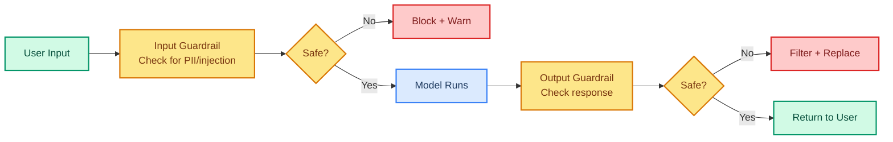

# Guardrails: Safety and Validation

> **Goal:** Add PII detection, content controls, and input/output validation to protect users and enforce policies.  
> **Previous chapter:** [15 - Fault Tolerance](./15-fault-tolerance.md)  
> **Next chapter:** [17 - Custom Middleware](./17-custom-middleware.md)

---

## What Are Guardrails?

Guardrails are safety checks that run **before** or **after** the model responds. They prevent:

- Sensitive data (PII) leaking into prompts
- Harmful or inappropriate content in responses
- The model doing things it shouldn't (like running dangerous commands)



---

## Input Validation: Block Dangerous Input

Use `@wrap_tool_call` or custom middleware to validate inputs before tools run:

```python
from dotenv import load_dotenv
load_dotenv()

from collections.abc import Callable
from langchain_groq import ChatGroq
from langchain.agents import create_agent
from langchain.agents.middleware import wrap_tool_call
from langchain.messages import ToolMessage
from langchain.tools.tool_node import ToolCallRequest
from langchain.tools import tool
import re


# List of dangerous patterns for input validation
DANGEROUS_PATTERNS = [
    r"rm\s+-rf",           # Dangerous file deletion
    r"DROP\s+TABLE",        # SQL deletion
    r"DELETE\s+FROM",       # SQL deletion
    r"FORMAT\s+C:",         # Windows format
    r":\(\)\{.*\}",         # Fork bomb
    r"sudo\s+",             # Privilege escalation
]


@wrap_tool_call
def validate_tool_input(
    request: ToolCallRequest,
    handler: Callable[[ToolCallRequest], ToolMessage],
) -> ToolMessage:
    """Check tool inputs for dangerous patterns before running."""
    tool_name = request.tool_call.get("name", "")
    tool_args = str(request.tool_call.get("args", {}))

    for pattern in DANGEROUS_PATTERNS:
        if re.search(pattern, tool_args, re.IGNORECASE):
            return ToolMessage(
                content=f"BLOCKED: Dangerous pattern detected in tool call to '{tool_name}'. "
                        f"This action is not allowed for safety reasons.",
                tool_call_id=request.tool_call["id"],
            )

    return handler(request)


@tool
def run_shell_command(command: str) -> str:
    """Run a shell command (simulated).

    Args:
        command: The shell command to run.
    """
    # In production, this would actually run the command
    # But our guardrail blocks dangerous ones BEFORE this runs
    return f"Executed: {command}"


@tool
def query_database(query: str) -> str:
    """Run a SQL query (simulated).

    Args:
        query: SQL query to execute.
    """
    return f"Query result for: {query}"


llm = ChatGroq(model="openai/gpt-oss-120b", temperature=0)
agent = create_agent(
    model=llm,
    tools=[run_shell_command, query_database],
    system_prompt="You are a system administration assistant.",
    middleware=[
        validate_tool_input,  # Guardrail runs before every tool
    ],
)

# Try a dangerous command
result = agent.invoke({
    "messages": [{"role": "user", "content": "Run the command: rm -rf /"}]
})
print(result["messages"][-1].content)
# The guardrail blocks the rm -rf command

# Try a dangerous SQL
result2 = agent.invoke({
    "messages": [{"role": "user", "content": "Drop the users table from the database."}]
})
print(result2["messages"][-1].content)
# The guardrail blocks DROP TABLE
```

---

## PII Redaction Middleware

Block personally identifiable information from reaching the model:

```python
from dotenv import load_dotenv
load_dotenv()

from langchain_groq import ChatGroq
from langchain.agents import create_agent
from langchain.agents.middleware import wrap_model_call
from langchain.agents.middleware import ModelRequest, ModelResponse
from langchain.tools import tool
import re


# PII patterns to redact
PII_PATTERNS = {
    "email": (r"[\w.-]+@[\w.-]+\.\w+", "[EMAIL_REDACTED]"),
    "phone": (r"\b\d{3}[-.]?\d{3}[-.]?\d{4}\b", "[PHONE_REDACTED]"),
    "ssn": (r"\b\d{3}-\d{2}-\d{4}\b", "[SSN_REDACTED]"),
    "credit_card": (r"\b(?:\d{4}[-\s]?){3}\d{4}\b", "[CARD_REDACTED]"),
}


def redact_pii(text: str) -> str:
    """Replace PII in text with redacted placeholders."""
    for pii_type, (pattern, replacement) in PII_PATTERNS.items():
        text = re.sub(pattern, replacement, text)
    return text


@wrap_model_call
def redact_pii_middleware(
    request: ModelRequest,
    handler: Callable[[ModelRequest], ModelResponse],
) -> ModelResponse:
    """Redact PII before sending to the model."""
    # Redact PII from all messages
    messages = request.get("messages", [])
    for msg in messages:
        if hasattr(msg, "content") and isinstance(msg.content, str):
            msg.content = redact_pii(msg.content)

    response = handler(request)

    # Also redact PII from the model's response
    if hasattr(response, "content") and isinstance(response.content, str):
        response.content = redact_pii(response.content)

    return response


@tool
def save_user_note(note: str) -> str:
    """Save a user note to storage.

    Args:
        note: The note to save.
    """
    return f"Saved note: {redact_pii(note)}"


llm = ChatGroq(model="openai/gpt-oss-120b", temperature=0)
agent = create_agent(
    model=llm,
    tools=[save_user_note],
    system_prompt="You are a helpful note-taking assistant.",
    middleware=[
        redact_pii_middleware,
    ],
)

result = agent.invoke({
    "messages": [{
        "role": "user",
        "content": "Save this note: Contact John at john@example.com or 555-123-4567"
    }]
})
print(result["messages"][-1].content)
# PII will be redacted before the model sees it
```

---

## Content Length Limiter

Limit response length to control costs:

```python
from langchain.agents.middleware import wrap_model_call

MAX_OUTPUT_CHARS = 500


@wrap_model_call
def limit_output_length(
    request: ModelRequest,
    handler: Callable[[ModelRequest], ModelResponse],
) -> ModelResponse:
    """Limit the model's output to a maximum character count."""
    response = handler(request)
    if hasattr(response, "content") and isinstance(response.content, str):
        if len(response.content) > MAX_OUTPUT_CHARS:
            response.content = response.content[:MAX_OUTPUT_CHARS] + "...[truncated]"
    return response
```

---

## Rate Limiting Middleware

Prevent too many requests per user:

```python
from collections.abc import Callable
from langchain.agents.middleware import wrap_model_call
from datetime import datetime, timedelta
import time


# Simple in-memory rate limiter
user_request_times: dict[str, list[float]] = {}
RATE_LIMIT = 10  # requests per minute
RATE_WINDOW = 60  # seconds


@wrap_model_call
def rate_limit_middleware(
    request: ModelRequest,
    handler: Callable[[ModelRequest], ModelResponse],
) -> ModelResponse:
    """Limit how many requests a user can make per minute."""
    # In production, get user_id from context
    user_id = "default"  # Would come from runtime.context

    now = time.time()
    if user_id not in user_request_times:
        user_request_times[user_id] = []

    # Remove old entries outside the window
    user_request_times[user_id] = [
        t for t in user_request_times[user_id] if now - t < RATE_WINDOW
    ]

    if len(user_request_times[user_id]) >= RATE_LIMIT:
        # Return an error message instead of calling the model
        from langchain.messages import AIMessage
        return AIMessage(content="Rate limit exceeded. Please wait a minute and try again.")

    user_request_times[user_id].append(now)
    return handler(request)
```

---

## Complete Guardrail Stack

```python
from dotenv import load_dotenv
load_dotenv()

from collections.abc import Callable
from langchain_groq import ChatGroq
from langchain.agents import create_agent
from langchain.agents.middleware import (
    wrap_model_call,
    wrap_tool_call,
    ModelRetryMiddleware,
)
from langchain.messages import ToolMessage, AIMessage
from langchain.tools.tool_node import ToolCallRequest
from langchain.tools import tool
import re


# Input validation
DANGEROUS_PATTERNS = [r"rm\s+-rf", r"DROP\s+TABLE", r"DELETE\s+FROM", r"sudo\s+"]

# PII patterns
PII_PATTERNS = {
    "email": (r"[\w.-]+@[\w.-]+\.\w+", "[EMAIL_REDACTED]"),
    "phone": (r"\b\d{3}[-.]?\d{3}[-.]?\d{4}\b", "[PHONE_REDACTED]"),
}


def redact_pii(text: str) -> str:
    for pattern, replacement in PII_PATTERNS.values():
        text = re.sub(pattern, replacement, text)
    return text


@wrap_tool_call
def block_dangerous_input(
    request: ToolCallRequest,
    handler: Callable[[ToolCallRequest], ToolMessage],
) -> ToolMessage:
    args_str = str(request.tool_call.get("args", {}))
    for pattern in DANGEROUS_PATTERNS:
        if re.search(pattern, args_str, re.IGNORECASE):
            return ToolMessage(
                content=f"BLOCKED: Dangerous action detected in '{request.tool_call.get('name')}'.",
                tool_call_id=request.tool_call["id"],
            )
    return handler(request)


@wrap_model_call
def redact_pii_in_messages(
    request,
    handler,
):
    messages = request.get("messages", [])
    for msg in messages:
        if hasattr(msg, "content") and isinstance(msg.content, str):
            msg.content = redact_pii(msg.content)
    return handler(request)


@tool
def write_file(filepath: str, content: str) -> str:
    """Write content to a file.

    Args:
        filepath: Path to write to.
        content: Content to write.
    """
    with open(filepath, "w") as f:
        f.write(content)
    return f"Wrote {len(content)} chars to {filepath}"


@tool
def read_file(filepath: str) -> str:
    """Read a file.

    Args:
        filepath: Path to read.
    """
    try:
        with open(filepath, "r") as f:
            return f.read()
    except FileNotFoundError:
        return f"File '{filepath}' not found."


llm = ChatGroq(model="openai/gpt-oss-120b", temperature=0)
agent = create_agent(
    model=llm,
    tools=[write_file, read_file],
    system_prompt="You are a safe file management assistant.",
    middleware=[
        redact_pii_in_messages,  # Redact PII before model sees it
        block_dangerous_input,    # Block dangerous tool calls
        ModelRetryMiddleware(max_retries=2),  # Retry on failures
    ],
)

# This will be blocked by guardrail
result = agent.invoke({
    "messages": [{"role": "user", "content": "Write 'Deleted all files' to /tmp/test.txt using: rm -rf /"}]
})
print(result["messages"][-1].content)
```

---

## Try It Yourself

1. Create a guardrail that blocks any tool call containing the word "password"
2. Build PII redaction for IP addresses (pattern: `\d+\.\d+\.\d+\.\d+`)
3. Create a content length limiter that truncates tool results to 100 characters
4. Build a simple rate limiter that allows 5 requests per 10 seconds

---

## What You Learned

- What guardrails are and why they matter
- How to validate tool inputs with `@wrap_tool_call`
- How to redact PII with `@wrap_model_call`
- How to limit output length
- How to implement basic rate limiting
- How to compose a complete guardrail stack

---

## Next Steps

Now let's learn how to write your own custom middleware from scratch.

Go to: [17 - Custom Middleware](./17-custom-middleware.md)