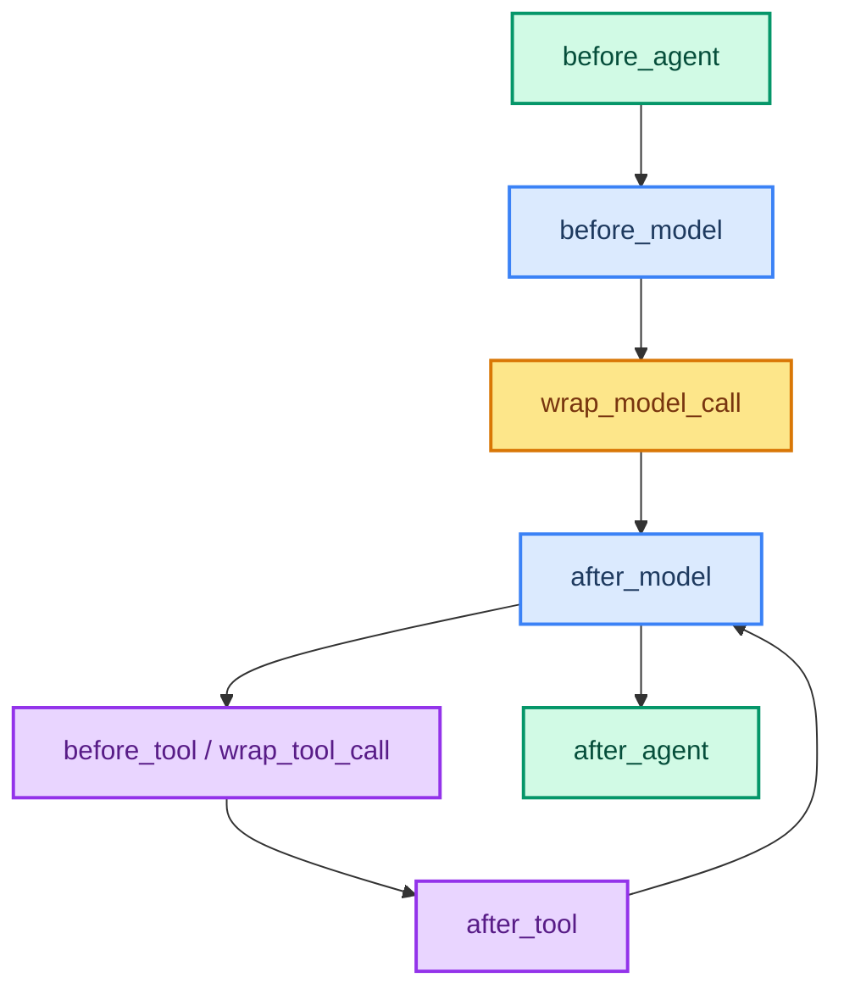

# Writing Your Own Middleware

> **Goal:** Build custom middleware using `wrap_model_call`, `wrap_tool_call`, `before_model`, `after_model`, and more.  
> **Previous chapter:** [16 - Guardrails](./16-guardrails.md)  
> **Next chapter:** [18 - Human-in-the-Loop](./18-human-in-the-loop.md)

---

## Middleware Hooks

LangChain gives you hooks at every stage of the agent loop:



| Hook | When It Runs | Use Case |
|------|-------------|----------|
| `before_agent` | Start of each invoke | Setup, logging |
| `before_model` | Before each model call | Inject context, modify messages |
| `wrap_model_call` | Around each model call | Retry, cache, transform |
| `after_model` | After each model call | Validate output, log response |
| `wrap_tool_call` | Around each tool call | Validate, retry, audit |
| `after_tool` | After each tool call | Log results, transform output |
| `after_agent` | End of each invoke | Cleanup, metrics |

---

## Example 1: Logging Middleware

Log every model call and tool call:

```python
from dotenv import load_dotenv
load_dotenv()

from collections.abc import Callable
from langchain_groq import ChatGroq
from langchain.agents import create_agent
from langchain.agents.middleware import wrap_model_call, wrap_tool_call
from langchain.messages import ToolMessage
from langchain.tools.tool_node import ToolCallRequest
from langchain.tools import tool
from datetime import datetime


@wrap_model_call
def log_model_call(request, handler):
    """Log every model call with timestamp."""
    start = datetime.now()
    response = handler(request)
    elapsed = (datetime.now() - start).total_seconds()
    print(f"[LOG] Model call took {elapsed:.2f}s")
    if hasattr(response, "content") and response.content:
        print(f"[LOG] Model output (first 100 chars): {response.content[:100]}")
    return response


@wrap_tool_call
def log_tool_call(request: ToolCallRequest, handler) -> ToolMessage:
    """Log every tool call with name and result."""
    tool_name = request.tool_call.get("name", "unknown")
    print(f"[LOG] Tool called: {tool_name}")
    result = handler(request)
    content = result.content[:100] if hasattr(result, "content") else str(result)
    print(f"[LOG] Tool result: {content}")
    return result


@tool
def calculate(expression: str) -> str:
    """Calculate a math expression.

    Args:
        expression: Math expression.
    """
    try:
        return str(eval(expression, {"__builtins__": {}}, {}))
    except Exception as e:
        return f"Error: {e}"


llm = ChatGroq(model="openai/gpt-oss-120b", temperature=0)
agent = create_agent(
    model=llm,
    tools=[calculate],
    system_prompt="You are a helpful assistant.",
    middleware=[
        log_model_call,
        log_tool_call,
    ],
)

result = agent.invoke({"messages": [{"role": "user", "content": "What is 25 * 4?"}]})
# You will see [LOG] messages for each model and tool call
```

---

## Example 2: Audit Trail Middleware

Record every action the agent takes for compliance:

```python
from collections.abc import Callable
from langchain.agents.middleware import wrap_tool_call
from langchain.messages import ToolMessage
from langchain.tools.tool_node import ToolCallRequest
from datetime import datetime
import json


# Global audit log
audit_log: list[dict] = []


@wrap_tool_call
def audit_tool_call(request: ToolCallRequest, handler) -> ToolMessage:
    """Record every tool call in an audit log."""
    entry = {
        "timestamp": datetime.now().isoformat(),
        "tool": request.tool_call.get("name"),
        "args": request.tool_call.get("args", {}),
    }

    try:
        result = handler(request)
        entry["status"] = "success"
        entry["result"] = result.content[:200] if hasattr(result, "content") else "unknown"
    except Exception as e:
        entry["status"] = "error"
        entry["error"] = str(e)
        raise
    finally:
        audit_log.append(entry)
        print(f"[AUDIT] {entry['tool']} - {entry['status']}")

    return result


# After agent runs, you can review the audit log:
# for entry in audit_log:
#     print(json.dumps(entry, indent=2))
```

---

## Example 3: Response Transformer Middleware

Modify the model's output after it responds:

```python
from collections.abc import Callable
from langchain.agents.middleware import wrap_model_call
from langchain.messages import AIMessage
import re


@wrap_model_call
def add_disclaimer(request, handler):
    """Add a disclaimer to the end of AI responses."""
    response = handler(request)

    if hasattr(response, "content") and isinstance(response.content, str):
        if response.content and not response.content.endswith("[AI-generated]"):
            response.content = response.content + "\n\n[AI-generated: verify important information]"

    return response
```

---

## Example 4: Caching Middleware

Cache model responses to save API calls:

```python
from collections.abc import Callable
from langchain.agents.middleware import wrap_model_call
from langchain.messages import AIMessage
import hashlib
import json


# Simple cache
response_cache: dict[str, str] = {}


def get_cache_key(messages) -> str:
    """Generate a cache key from messages."""
    msg_str = json.dumps([{"type": m.type, "content": m.content} for m in messages if hasattr(m, 'type')])
    return hashlib.md5(msg_str.encode()).hexdigest()


@wrap_model_call
def cache_model_response(request, handler):
    """Cache model responses to avoid duplicate API calls."""
    messages = request.get("messages", [])
    cache_key = get_cache_key(messages)

    if cache_key in response_cache:
        print("[CACHE] Hit! Returning cached response.")
        return AIMessage(content=response_cache[cache_key])

    print("[CACHE] Miss. Calling model...")
    response = handler(request)

    if hasattr(response, "content") and response.content:
        response_cache[cache_key] = response.content

    return response
```

---

## Example 5: Before/After Model Middleware

Add context before the model runs and clean up after:

```python
from collections.abc import Callable
from langchain.agents.middleware import wrap_model_call
from langchain.messages import SystemMessage, HumanMessage
from datetime import datetime


@wrap_model_call
def add_timestamp_context(request, handler):
    """Inject current time into messages so the model knows the date."""
    messages = request.get("messages", [])

    # Add a system message with the current time (if not already there)
    time_msg = SystemMessage(content=f"Current date and time: {datetime.now().strftime('%Y-%m-%d %H:%M:%S')}")

    # Insert at the beginning
    if messages and not any(isinstance(m, SystemMessage) and "Current date" in getattr(m, 'content', '') for m in messages):
        messages.insert(0, time_msg)

    response = handler(request)
    return response
```

---

## Complete: Agent with Custom Middleware Stack

```python
from dotenv import load_dotenv
load_dotenv()

from collections.abc import Callable
from langchain_groq import ChatGroq
from langchain.agents import create_agent
from langchain.agents.middleware import (
    wrap_model_call,
    wrap_tool_call,
    ModelRetryMiddleware,
)
from langchain.messages import ToolMessage, AIMessage
from langchain.tools.tool_node import ToolCallRequest
from langchain.tools import tool
from datetime import datetime
import time


@tool
def calculate(expression: str) -> str:
    """Calculate a math expression.

    Args:
        expression: Math expression like '15 * 37'.
    """
    try:
        return str(eval(expression, {"__builtins__": {}}, {}))
    except Exception as e:
        return f"Error: {e}"


@tool
def get_time() -> str:
    """Get the current time."""
    return f"Current time: {datetime.now().strftime('%H:%M:%S')}"


# Logger middleware
@wrap_model_call
def log_model(request, handler):
    start = time.time()
    response = handler(request)
    elapsed = time.time() - start
    print(f"[MODEL] {elapsed:.2f}s")
    return response


@wrap_tool_call
def log_tool(request: ToolCallRequest, handler) -> ToolMessage:
    name = request.tool_call.get("name", "?")
    print(f"[TOOL] Calling {name}")
    result = handler(request)
    print(f"[TOOL] {name} done")
    return result


# Disclaimer middleware
@wrap_model_call
def add_disclaimer(request, handler):
    response = handler(request)
    if hasattr(response, "content") and response.content:
        response.content += "\n---\nThis response was generated by an AI assistant."
    return response


llm = ChatGroq(model="openai/gpt-oss-120b", temperature=0)
agent = create_agent(
    model=llm,
    tools=[calculate, get_time],
    system_prompt="You are a helpful assistant.",
    middleware=[
        log_model,          # Log model calls
        log_tool,           # Log tool calls
        add_disclaimer,     # Add disclaimer to responses
        ModelRetryMiddleware(max_retries=2),
    ],
)

result = agent.invoke({
    "messages": [{"role": "user", "content": "What time is it and what is 42 * 17?"}]
})
print("\nFinal answer:")
print(result["messages"][-1].content)
```

---

## Try It Yourself

1. Create a middleware that counts total model calls and tool calls, then prints a summary after
2. Build a caching middleware that stores the last 5 responses and serves from cache on repeats
3. Create a middleware that adds a UUID to each model response for tracking
4. Build a "slow mode" middleware that adds a 1-second delay before each model call (useful for testing)

---

## What You Learned

- The 7 middleware hooks: before_agent, before_model, wrap_model_call, after_model, wrap_tool_call, after_tool, after_agent
- How to build logging middleware
- How to build audit trail middleware
- How to build response transformers (disclaimers, formatters)
- How to build caching middleware
- How to compose a complete custom middleware stack

---

## Next Steps

Some actions are too dangerous for an agent to do alone. Let's learn how to pause the agent and ask a human for approval.

Go to: [18 - Human-in-the-Loop](./18-human-in-the-loop.md)