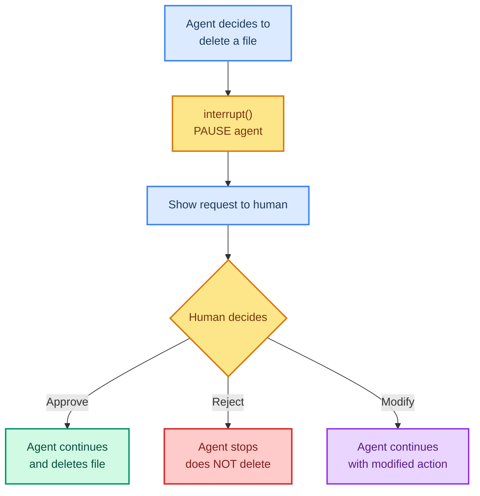

# Human-in-the-Loop: When Agents Need Approval

> **Goal:** Use `interrupt()` to pause agents before dangerous actions and resume after human approval.  
> **Previous chapter:** [17 - Custom Middleware](./17-custom-middleware.md)  
> **Next chapter:** [19 - Structured Output](./19-structured-output.md)

---

## What Is Human-in-the-Loop (HITL)?

Some actions are too important for an agent to do alone:

- Deleting files or databases
- Sending money or emails
- Running shell commands
- Modifying production systems

**Human-in-the-Loop** means the agent **pauses** before dangerous actions and **waits for a human** to approve or reject.



---

## How interrupt() Works

```python
from langgraph.types import interrupt, Command

@tool
def delete_file(filepath: str, runtime: ToolRuntime) -> Command:
    """Delete a file - requires human approval."""
    # Before deleting, pause and ask for approval
    approval = interrupt({
        "action": "delete_file",
        "filepath": filepath,
        "message": f"Are you sure you want to delete '{filepath}'?"
    })

    if approval == "approve":
        os.remove(filepath)
        return Command(update={"messages": [ToolMessage(content=f"Deleted {filepath}", ...)]})
    else:
        return Command(update={"messages": [ToolMessage(content="Deletion cancelled", ...)]})
```

The agent pauses at `interrupt()`, shows the human what it wants to do, then continues based on the human's response.

---

## Complete Example: File Deletion with Approval

```python
from dotenv import load_dotenv
load_dotenv()

from langchain_groq import ChatGroq
from langchain.agents import create_agent
from langchain.tools import tool, ToolRuntime
from langchain.messages import ToolMessage
from langgraph.types import interrupt, Command
from langgraph.checkpoint.memory import InMemorySaver
from langchain_core.utils.uuid import uuid7
import os


# Create a test file
with open("important_data.txt", "w") as f:
    f.write("This is important data that should not be deleted without approval.")


@tool
def list_files(directory: str = ".") -> str:
    """List files in a directory.

    Args:
        directory: Directory path (default: current directory).
    """
    files = os.listdir(directory)
    return f"Files: {', '.join(files)}"


@tool
def delete_file(filepath: str, runtime: ToolRuntime) -> Command:
    """Delete a file. This action requires human approval before it runs.

    Args:
        filepath: The path of the file to delete.
    """
    # PAUSE here and ask human for approval
    human_response = interrupt({
        "action": "DELETE_FILE",
        "filepath": filepath,
        "warning": f"This will permanently delete '{filepath}'. This cannot be undone.",
        "options": ["approve", "reject"],
    })

    tool_call_id = runtime.tool_call_id

    if human_response == "approve":
        try:
            os.remove(filepath)
            return Command(update={
                "messages": [ToolMessage(
                    content=f"File '{filepath}' has been deleted successfully.",
                    tool_call_id=tool_call_id,
                )]
            })
        except Exception as e:
            return Command(update={
                "messages": [ToolMessage(
                    content=f"Error deleting file: {e}",
                    tool_call_id=tool_call_id,
                )]
            })
    else:
        return Command(update={
            "messages": [ToolMessage(
                content=f"Deletion of '{filepath}' was cancelled by the human reviewer.",
                tool_call_id=tool_call_id,
            )]
        })


@tool
def read_file(filepath: str) -> str:
    """Read a file's contents.

    Args:
        filepath: Path to the file.
    """
    try:
        with open(filepath, "r") as f:
            return f.read()
    except FileNotFoundError:
        return f"File '{filepath}' not found."


llm = ChatGroq(model="openai/gpt-oss-120b", temperature=0)

checkpointer = InMemorySaver()

agent = create_agent(
    model=llm,
    tools=[list_files, delete_file, read_file],
    system_prompt="You are a file management assistant. When deleting files, the human must approve first.",
    checkpointer=checkpointer,
)

# Step 1: Start the agent (it will pause when it tries to delete)
thread_id = str(uuid7())
config = {"configurable": {"thread_id": thread_id}}

print("=== Step 1: Agent starts, will pause at delete ===")
try:
    result = agent.invoke(
        {"messages": [{"role": "user", "content": "List the files in the current directory, then delete 'important_data.txt'."}]},
        config=config,
    )
except Exception as e:
    print(f"Agent paused: {e}")

# Step 2: Get the interrupt request
state = agent.get_state(config)
print(f"\nAgent paused. Pending task:")
for m in state.values.get("messages", []):
    if hasattr(m, "tool_calls") and m.tool_calls:
        for tc in m.tool_calls:
            print(f"  Tool: {tc['name']}, Args: {tc['args']}")

# Step 3: Human approves (simulated - in production this would be a UI)
print("\n=== Step 2: Human approves the deletion ===")
# In production, a human would review and click "Approve"
# Here we simulate by resuming with "approve"

result = agent.invoke(
    Command(resume="approve"),  # Resume with approval
    config=config,
)

print("Final answer:")
print(result["messages"][-1].content)

# Step 4: Check if file was deleted
print(f"\nFile exists: {os.path.exists('important_data.txt')}")
# False - it was deleted
```

---

## Ask vs Execute Pattern

```mermaid
sequenceDiagram
    participant U as User
    participant A as Agent
    participant H as Human Reviewer

    U->>A: Delete all temp files
    A->>A: Lists files, prepares delete
    A->>H: interrupt: "Delete temp1.txt?"
    H->>A: "approve"
    A->>A: Deletes temp1.txt
    A->>H: interrupt: "Delete temp2.txt?"
    H->>A: "reject"
    A->>A: Skips temp2.txt
    A->>U: "Deleted temp1.txt. Kept temp2.txt (rejected)."

    style U fill:#d1fae5,stroke:#059669,stroke-width:2px,color:#064e3b
    style A fill:#dbeafe,stroke:#3b82f6,stroke-width:2px,color:#1e3a5f
    style H fill:#fde68a,stroke:#d97706,stroke-width:2px,color:#78350f
```

---

## Interactive Approval Loop (CLI)

```python
from dotenv import load_dotenv
load_dotenv()

from langchain_groq import ChatGroq
from langchain.agents import create_agent
from langchain.tools import tool, ToolRuntime
from langchain.messages import ToolMessage
from langgraph.types import interrupt, Command
from langgraph.checkpoint.memory import InMemorySaver
from langchain_core.utils.uuid import uuid7
import os


@tool
def delete_file(filepath: str, runtime: ToolRuntime) -> Command:
    """Delete a file. Requires human approval.

    Args:
        filepath: The file to delete.
    """
    human_response = interrupt({
        "action": "DELETE",
        "filepath": filepath,
    })

    tool_call_id = runtime.tool_call_id

    if human_response == "approve":
        try:
            os.remove(filepath)
            return Command(update={"messages": [ToolMessage(
                content=f"Deleted: {filepath}",
                tool_call_id=tool_call_id,
            )]})
        except Exception as e:
            return Command(update={"messages": [ToolMessage(
                content=f"Error: {e}",
                tool_call_id=tool_call_id,
            )]})
    return Command(update={"messages": [ToolMessage(
        content=f"Cancelled: {filepath} was NOT deleted.",
        tool_call_id=tool_call_id,
    )]})


@tool
def list_files(directory: str = ".") -> str:
    """List files in a directory.

    Args:
        directory: Directory path.
    """
    return f"Files: {', '.join(os.listdir(directory))}"


# Create test files
for name in ["file_a.txt", "file_b.txt", "file_c.txt"]:
    with open(name, "w") as f:
        f.write(f"Content of {name}")

llm = ChatGroq(model="openai/gpt-oss-120b", temperature=0)
checkpointer = InMemorySaver()

agent = create_agent(
    model=llm,
    tools=[list_files, delete_file],
    system_prompt="You are a file assistant. Delete files one by one when the user asks.",
    checkpointer=checkpointer,
)


def run_with_approval(user_message: str):
    """Run agent with interactive CLI approval for each interrupt."""
    thread_id = str(uuid7())
    config = {"configurable": {"thread_id": thread_id}}

    while True:
        try:
            result = agent.invoke(
                {"messages": [{"role": "user", "content": user_message}]},
                config=config,
            )
            print(f"\nAgent: {result['messages'][-1].content}")
            break
        except Exception:
            # Agent paused - get the interrupt info
            state = agent.get_state(config)
            tasks = state.tasks or []

            # Find the interrupt request
            for task in tasks:
                if hasattr(task, "interrupts") and task.interrupts:
                    interrupt_data = task.interrupts[0].value
                    print(f"\n--- APPROVAL NEEDED ---")
                    print(f"Action: {interrupt_data.get('action')}")
                    print(f"File: {interrupt_data.get('filepath')}")

                    # Ask user (simulated)
                    approval = input("Approve? (yes/no): ").strip().lower()
                    response = "approve" if approval in ("yes", "y", "approve") else "reject"

                    agent.invoke(Command(resume=response), config=config)

            # Check if we need to continue
            state = agent.get_state(config)
            if not state.next or not state.tasks:
                # Agent is done
                break


# Run it
run_with_approval("List all files, then delete file_a.txt.")
```

---

## When to Use HITL

| Use Case | Use HITL? | Why |
|----------|-----------|-----|
| Delete files | Yes | Data loss is irreversible |
| Send emails | Yes | Can't unsend emails |
| Run shell commands | Yes | Could harm the system |
| Read files | No | Reading is safe |
| Search the web | No | No side effects |
| Calculate math | No | No side effects |
| Query database (SELECT) | No | Read-only |
| Query database (DELETE/DROP) | Yes | Data loss |
| API calls (GET) | No | Read-only |
| API calls (POST/DELETE) | Yes | Side effects |

---

## Try It Yourself

1. Create a "send email" tool that interrupts before sending and shows the email content for approval
2. Build a tool that creates files but asks "What filename should I use?" via interrupt
3. Create an agent that can install packages but pauses for approval before running pip install

---

## What You Learned

- What Human-in-the-Loop is and when to use it
- How `interrupt()` pauses the agent
- How `Command(resume=...)` resumes the agent with the human's decision
- How to build an interactive approval loop
- When to use HITL vs let the agent act freely

---

## Next Steps

Now let's learn how to get **structured data** (not just text) from your agent using Pydantic models.

Go to: [19 - Structured Output](./19-structured-output.md)