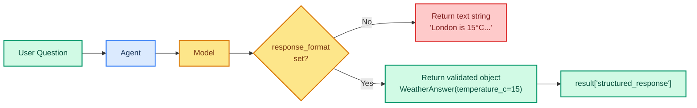

# Structured Output: Getting Data, Not Just Text

> **Goal:** Use `response_format` with Pydantic models to get structured JSON data from your agent.  
> **Previous chapter:** [18 - Human-in-the-Loop](./18-human-in-the-loop.md)  
> **Next chapter:** [20 - Streaming](./20-streaming.md)

---

## Why Structured Output?

Normally, the agent returns text:

```python
# Without structured output, you get a string:
result["messages"][-1].content
# "The weather in London is 15°C with rain. Confidence: 80%."
# Hard to parse! What if you need just the temperature?
```

With **structured output**, you get a **validated Python object**:

```python
# With structured output, you get typed data:
result["structured_response"]
# WeatherAnswer(city="London", temperature_c=15, condition="rain", confidence=0.8)
```



---

## Basic Example: Simple Response Schema

```python
from dotenv import load_dotenv
load_dotenv()

from pydantic import BaseModel, Field
from langchain_groq import ChatGroq
from langchain.agents import create_agent
from langchain.tools import tool


# Step 1: Define the output schema with Pydantic
class Answer(BaseModel):
    """The agent's structured response."""
    summary: str = Field(description="A brief summary of the answer")
    confidence: float = Field(description="Confidence score from 0.0 to 1.0", ge=0.0, le=1.0)


# Step 2: Create the agent with response_format
llm = ChatGroq(model="openai/gpt-oss-120b", temperature=0)

agent = create_agent(
    model=llm,
    tools=[],  # No tools needed for this example
    system_prompt="You are a knowledgeable assistant.",
    response_format=Answer,  # This makes the output structured!
)

# Step 3: Invoke the agent
result = agent.invoke({
    "messages": [{"role": "user", "content": "Summarize the latest AI trends in 2026."}]
})

# Step 4: Access structured data
structured = result["structured_response"]
print(f"Type: {type(structured)}")  # <class 'Answer'>
print(f"Summary: {structured.summary}")
print(f"Confidence: {structured.confidence}")

# You can also still get the text:
print(f"\nText: {result['messages'][-1].content}")
```

---

## Nested Models

Real-world data is often nested:

```python
from dotenv import load_dotenv
load_dotenv()

from pydantic import BaseModel, Field
from typing import Literal
from langchain_groq import ChatGroq
from langchain.agents import create_agent


class Person(BaseModel):
    """Information about a person."""
    name: str = Field(description="Full name")
    age: int = Field(description="Age in years", ge=0, le=150)
    role: Literal["developer", "manager", "designer", "other"] = Field(description="Job role")


class TeamAssessment(BaseModel):
    """Assessment of a team."""
    team_name: str = Field(description="Name of the team")
    members: list[Person] = Field(description="List of team members")
    overall_score: float = Field(description="Team score from 0.0 to 10.0", ge=0.0, le=10.0)
    recommendation: str = Field(description="What the team should improve")
    needs_hiring: bool = Field(description="Whether the team needs to hire more people")


llm = ChatGroq(model="openai/gpt-oss-120b", temperature=0)

agent = create_agent(
    model=llm,
    tools=[],
    system_prompt="You are a team analysis assistant. Analyze teams based on their description.",
    response_format=TeamAssessment,
)

result = agent.invoke({
    "messages": [{
        "role": "user",
        "content": """Analyze this team:
        Team name: Backend Squad
        Members: Alice (28, developer), Bob (35, manager), Carol (30, designer)
        They build APIs and microservices. Recently missed 2 deadlines."""
    }]
})

assessment = result["structured_response"]
print(f"Team: {assessment.team_name}")
print(f"Score: {assessment.overall_score}/10")
print(f"Recommendation: {assessment.recommendation}")
print(f"Needs hiring: {assessment.needs_hiring}")
print(f"\nMembers:")
for member in assessment.members:
    print(f"  - {member.name}, {member.age}, {member.role}")
```

---

## Structured Output with Tools

```python
from dotenv import load_dotenv
load_dotenv()

from pydantic import BaseModel, Field
from langchain_groq import ChatGroq
from langchain.agents import create_agent
from langchain.tools import tool


class WeatherReport(BaseModel):
    """Structured weather report."""
    city: str = Field(description="City name")
    temperature_c: float = Field(description="Temperature in Celsius")
    condition: str = Field(description="Weather condition (sunny, rainy, cloudy, etc.)")
    humidity_percent: int = Field(description="Humidity percentage", ge=0, le=100)
    suggestion: str = Field(description="What the user should do (bring umbrella, wear jacket, etc.)")


@tool
def get_weather(city: str) -> str:
    """Get weather for a city (simulated).

    Args:
        city: City name.
    """
    weather_db = {
        "London": {"temp": 12, "condition": "rainy", "humidity": 80},
        "Tokyo": {"temp": 25, "condition": "sunny", "humidity": 50},
        "Mumbai": {"temp": 32, "condition": "humid", "humidity": 85},
    }
    data = weather_db.get(city, {"temp": 20, "condition": "cloudy", "humidity": 60})
    return f"City={city}, Temp={data['temp']}C, Condition={data['condition']}, Humidity={data['humidity']}%"


llm = ChatGroq(model="openai/gpt-oss-120b", temperature=0)

agent = create_agent(
    model=llm,
    tools=[get_weather],
    system_prompt="You are a weather assistant. Use the get_weather tool to answer questions.",
    response_format=WeatherReport,
)

result = agent.invoke({
    "messages": [{"role": "user", "content": "What's the weather in London? Give me a full report."}]
})

report = result["structured_response"]
print(f"Weather Report for {report.city}")
print(f"  Temperature: {report.temperature_c}°C")
print(f"  Condition: {report.condition}")
print(f"  Humidity: {report.humidity_percent}%")
print(f"  Suggestion: {report.suggestion}")
```

---

## Common Use Cases

| Use Case | Schema Example |
|----------|----------------|
| Research summary | `ResearchSummary(topic, key_findings: list[str], sources: list[str])` |
| Sentiment analysis | `Sentiment(text, score: float, label: Literal["positive", "negative", "neutral"])` |
| Data extraction | `ExtractedData(name, email, phone, address)` |
| Decision making | `Decision(action, reasoning, confidence: float)` |
| Code review | `CodeReview(rating: int, issues: list[str], suggestion: str)` |
| Quiz generation | `Quiz(question, options: list[str], correct_answer: str, explanation: str)` |

---

## Try It Yourself

1. Create a `Sentiment` schema with `text`, `score` (0-1), and `label` (positive/negative/neutral)
2. Create a `CodeReview` schema that extracts the rating, list of issues, and improvement suggestion
3. Build an agent with a web search tool that returns a structured news report
4. Create a quiz generator that outputs a `Quiz` object with question, multiple choice options, and explanation

---

## What You Learned

- Why structured output is better than parsing text
- How to use `response_format` with Pydantic models
- How to get validated, typed data from `result["structured_response"]`
- How to create nested schemas for complex data
- How to combine structured output with tools

---

## Next Steps

Let's learn how to stream agent responses in real-time so users see progress immediately.

Go to: [20 - Streaming](./20-streaming.md)