# Streaming: Real-Time Agent Responses

> **Goal:** Use `stream_events` to show agent progress in real-time as it thinks, calls tools, and responds.  
> **Previous chapter:** [19 - Structured Output](./19-structured-output.md)  
> **Next chapter:** [21 - Retrieval (RAG)]](./21-retrieval-rag.md)

---

## Why Streaming?

Without streaming, the user waits silently until the entire response is done. With streaming, the user sees:

- The agent thinking in real-time
- Which tool it's calling right now
- Tool results as they come back
- The final answer appearing word by word

```mermaid
graph TD
    subgraph "Without Streaming"
        A1["User asks"] --> B1["...silence..."] --> C1["Full answer appears"]
    end

    subgraph "With Streaming"
        A2["User asks"] --> B2["Agent is thinking..."]
        B2 --> C2["Calling tool: web_search..."]
        C2 --> D2["Got results: AI trends 2026..."]
        D2 --> E2["The latest AI trends show..."]
        E2 --> F2["...include agentic AI and..."]
    end

    style A1 fill:#fecaca,stroke:#dc2626,stroke-width:2px,color:#7f1d1d
    style B1 fill:#fecaca,stroke:#dc2626,stroke-width:2px,color:#7f1d1d
    style C1 fill:#fecaca,stroke:#dc2626,stroke-width:2px,color:#7f1d1d

    style A2 fill:#d1fae5,stroke:#059669,stroke-width:2px,color:#064e3b
    style B2 fill:#dbeafe,stroke:#3b82f6,stroke-width:2px,color:#1e3a5f
    style C2 fill:#fde68a,stroke:#d97706,stroke-width:2px,color:#78350f
    style D2 fill:#fde68a,stroke:#d97706,stroke-width:2px,color:#78350f
    style E2 fill:#d1fae5,stroke:#059669,stroke-width:2px,color:#064e3b
    style F2 fill:#d1fae5,stroke:#059669,stroke-width:2px,color:#064e3b
```



---

## stream_events (version 3)

`stream_events` is the main way to stream. It gives you events for each step:

```python
from dotenv import load_dotenv
load_dotenv()

from langchain_groq import ChatGroq
from langchain_tavily import TavilySearch
from langchain.agents import create_agent

llm = ChatGroq(model="openai/gpt-oss-120b", temperature=0)
web_search = TavilySearch(max_results=2, include_answer=True)

agent = create_agent(
    model=llm,
    tools=[web_search],
    system_prompt="You are a helpful research assistant.",
)

# Stream events
for event in agent.stream_events(
    {"messages": [{"role": "user", "content": "What are the latest AI trends in 2026?"}]},
    version="v3",
):
    event_type = event.get("event", "")
    data = event.get("data", {})
    name = event.get("name", "")

    if event_type == "on_chat_model_stream":
        # Token-by-token text streaming
        chunk = data.get("chunk")
        if chunk and chunk.content:
            print(chunk.content, end="", flush=True)

    elif event_type == "on_tool_start":
        print(f"\n[TOOL] Starting: {name}")

    elif event_type == "on_tool_end":
        print(f"\n[TOOL] Finished: {name}")

    elif event_type == "on_custom_event":
        # Custom events from stream_writer in tools
        print(f"\n[CUSTOM] {data}")
```

---

## Event Types

| Event | When It Fires | What You Get |
|-------|---------------|--------------|
| `on_chat_model_start` | Model starts processing | Model name, input messages |
| `on_chat_model_stream` | Model generates each token | Text chunk (word by word) |
| `on_chat_model_end` | Model finishes | Full response |
| `on_tool_start` | Tool starts running | Tool name, arguments |
| `on_tool_end` | Tool finishes running | Tool result |
| `on_custom_event` | Tool sends `stream_writer` update | Custom progress data |
| `on_chain_start` | Agent step starts | Step info |
| `on_chain_end` | Agent step finishes | Final result |

---

## Real-Time Console Output

```python
from dotenv import load_dotenv
load_dotenv()

from langchain_groq import ChatGroq
from langchain.tools import tool
from langchain.agents import create_agent
import time


@tool
def calculate(expression: str) -> str:
    """Calculate a math expression.

    Args:
        expression: Math expression.
    """
    time.sleep(1)  # Simulate slow operation
    try:
        return str(eval(expression, {"__builtins__": {}}, {}))
    except Exception as e:
        return f"Error: {e}"


llm = ChatGroq(model="openai/gpt-oss-120b", temperature=0)
agent = create_agent(
    model=llm,
    tools=[calculate],
    system_prompt="You are a helpful math assistant.",
)

print("User: What is 25 * 4 + 10?\n")
print("Agent: ", end="")

current_tool = None

for event in agent.stream_events(
    {"messages": [{"role": "user", "content": "What is 25 * 4 + 10?"}]},
    version="v3",
):
    event_type = event.get("event", "")
    data = event.get("data", {})
    name = event.get("name", "")

    if event_type == "on_tool_start":
        current_tool = name
        print(f"\n  [Using tool: {name}...]")

    elif event_type == "on_tool_end":
        print(f"  [Tool {current_tool} done]")
        current_tool = None
        print("  ", end="")

    elif event_type == "on_chat_model_stream":
        chunk = data.get("chunk")
        if chunk and chunk.content:
            print(chunk.content, end="", flush=True)

print("\n")  # Final newline
```

**Output (live):**

```
User: What is 25 * 4 + 10?

Agent:
  [Using tool: calculate...]
  [Tool calculate done]
  25 * 4 + 10 = 110
```

---

## stream() Method: Values and Messages Modes

You can also use `stream()` which gives simpler streaming:

```python
# Values mode - gives you the full state at each step
for chunk in agent.stream(
    {"messages": [{"role": "user", "content": "Hello"}]},
    stream_mode="values",
):
    messages = chunk.get("messages", [])
    if messages:
        last = messages[-1]
        print(f"[{type(last).__name__}] {last.content}")

# Messages mode - gives you message updates
for chunk in agent.stream(
    {"messages": [{"role": "user", "content": "Hello"}]},
    stream_mode="messages",
):
    for msg in chunk:
        if msg.content:
            print(f"[{type(msg).__name__}] {msg.content}", end="")
```

---

## Building a Chat UI with Streaming

```python
from dotenv import load_dotenv
load_dotenv()

from langchain_groq import ChatGroq
from langchain.tools import tool
from langchain.agents import create_agent
from langchain_core.utils.uuid import uuid7
from langgraph.checkpoint.memory import InMemorySaver
from langchain.messages import HumanMessage, AIMessage


@tool
def calculate(expression: str) -> str:
    """Calculate a math expression.

    Args:
        expression: Math expression.
    """
    try:
        return str(eval(expression, {"__builtins__": {}}, {}))
    except Exception as e:
        return f"Error: {e}"


llm = ChatGroq(model="openai/gpt-oss-120b", temperature=0)
checkpointer = InMemorySaver()
agent = create_agent(
    model=llm,
    tools=[calculate],
    system_prompt="You are a helpful assistant. Be concise.",
    checkpointer=checkpointer,
)

# Interactive chat loop with streaming
thread_id = str(uuid7())
config = {"configurable": {"thread_id": thread_id}}

print("Chat with the agent! Type 'quit' to exit.\n")

while True:
    user_input = input("You: ").strip()
    if user_input.lower() in ("quit", "exit", "bye"):
        print("Goodbye!")
        break

    print("Agent: ", end="")

    for event in agent.stream_events(
        {"messages": [{"role": "user", "content": user_input}]},
        config=config,
        version="v3",
    ):
        event_type = event.get("event", "")
        data = event.get("data", {})

        if event_type == "on_chat_model_stream":
            chunk = data.get("chunk")
            if chunk and chunk.content:
                print(chunk.content, end="", flush=True)

        elif event_type == "on_tool_start":
            print(f"\n  [calling {event.get('name', '?')}...] ", end="")

        elif event_type == "on_tool_end":
            print(f"\n  [done] ", end="")

    print("\n")  # Newline after response
```

---

## Try It Yourself

1. Build an agent with streaming that prints emoji indicators for each event type
2. Create an interactive chat loop where the user can have a multi-turn conversation with streaming
3. Add a "typing indicator" that shows "..." while the model is thinking
4. Stream an agent that does 3 tool calls and show a progress bar (1/3, 2/3, 3/3)

---

## What You Learned

- Why streaming improves user experience
- How `stream_events(version="v3")` gives you events for each step
- Event types: on_chat_model_stream, on_tool_start, on_tool_end, on_custom_event
- How to stream text token-by-token
- How to build an interactive streaming chat loop
- Alternative: `stream()` with values and messages modes

---

## Next Steps

Let's learn how to give your agent knowledge from documents using Retrieval-Augmented Generation (RAG).

Go to: [21 - Retrieval (RAG)]](./21-retrieval-rag.md)