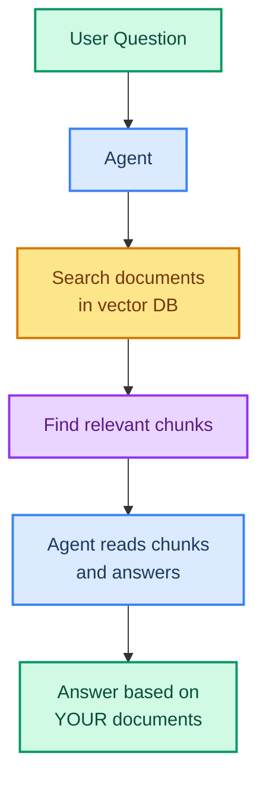
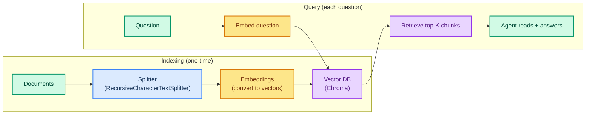

# Retrieval-Augmented Generation (RAG)

> **Goal:** Build agents that can answer questions from your own documents using embeddings, Chroma vector DB, and retriever tools.  
> **Previous chapter:** [20 - Streaming](./20-streaming.md)  
> **Next chapter:** [22 - MCP Tools](./22-mcp-tools.md)

---

## What Is RAG?

RAG (Retrieval-Augmented Generation) gives your agent a **private knowledge base**. Instead of relying only on what the model was trained on, the agent can:

1. **Store** your documents in a vector database
2. **Search** for relevant documents when asked a question  
3. **Read** the documents and answer based on them



---

## RAG Pipeline



---

## Prerequisites

```bash
pip install langchain langchain-chroma langchain-text-splitters chromadb
```

---

## Step 1: Create Documents

```python
from langchain_core.documents import Document

# Create documents from text
documents = [
    Document(
        page_content="LangChain is a framework for building AI agents. It provides tools, memory, and middleware for creating production-ready agents.",
        metadata={"source": "langchain_intro.txt", "page": 1}
    ),
    Document(
        page_content="The create_agent function is the main entry point in LangChain 1.x. It takes a model, tools, and optional middleware.",
        metadata={"source": "langchain_api.txt", "page": 1}
    ),
    Document(
        page_content="Tools in LangChain are Python functions decorated with @tool. They need type hints and a docstring describing what the tool does.",
        metadata={"source": "langchain_tools.txt", "page": 1}
    ),
    Document(
        page_content="Memory in LangChain is handled by checkpointers for short-term memory and stores for long-term memory. The InMemorySaver is used for development.",
        metadata={"source": "langchain_memory.txt", "page": 1}
    ),
    Document(
        page_content="Middleware is the way to customize agent behavior in LangChain. Categories include fault tolerance, guardrails, and context management.",
        metadata={"source": "langchain_middleware.txt", "page": 1}
    ),
    Document(
        page_content="The Groq API provides fast inference for open-source models. The openai/gpt-oss-120b model is available on Groq's free tier.",
        metadata={"source": "groq_info.txt", "page": 1}
    ),
]

print(f"Created {len(documents)} documents")
```

---

## Step 2: Split Documents into Chunks

Large documents need to be split into smaller chunks for better retrieval:

```python
from langchain_text_splitters import RecursiveCharacterTextSplitter

# Create a text splitter
splitter = RecursiveCharacterTextSplitter(
    chunk_size=200,       # Each chunk is about 200 characters
    chunk_overlap=50,     # 50 characters overlap between chunks
    separators=["\n\n", "\n", ". ", " "],  # Try to split at natural boundaries
)

# Split all documents
chunks = splitter.split_documents(documents)
print(f"Split {len(documents)} documents into {len(chunks)} chunks")

# See a chunk
print(f"\nFirst chunk:\n{chunks[0].page_content[:150]}...")
print(f"Metadata: {chunks[0].metadata}")
```

---

## Step 3: Create Embeddings and Vector Store

Embeddings convert text into numbers (vectors) so similar texts have similar numbers:

```python
from dotenv import load_dotenv
load_dotenv()

from langchain_chroma import Chroma
from langchain.embeddings import init_embeddings

# Use free embeddings from Groq or alternatives
# Groq doesn't provide embeddings, so we use a local embedding model
# Option 1: Use sentence-transformers (pip install sentence-transformers)
# Option 2: Use FakeEmbeddings for testing (no real embeddings)

# For local embeddings (free, no API key):
# pip install langchain-huggingface sentence-transformers
from langchain_huggingface import HuggingFaceEmbeddings

embeddings = HuggingFaceEmbeddings(
    model_name="sentence-transformers/all-MiniLM-L6-v2",
)

# Create a Chroma vector database from chunks
vector_db = Chroma.from_documents(
    documents=chunks,
    embedding=embeddings,
    collection_name="langchain_docs",
    persist_directory="./chroma_db",  # Saves to disk
)

print(f"Vector DB created with {vector_db._collection.count()} documents")
```

> **Alternative:** If you don't want to install HuggingFace, you can use the free OpenAI-compatible embedding APIs or run Ollama locally for embeddings.

---

## Step 4: Search the Vector DB

```python
# Search for relevant documents
results = vector_db.similarity_search(
    query="How do I create an agent?",
    k=3,  # Return top 3 results
)

print(f"Found {len(results)} relevant chunks:")
for i, doc in enumerate(results):
    print(f"\n--- Result {i+1} ---")
    print(f"Content: {doc.page_content[:150]}...")
    print(f"Source: {doc.metadata.get('source', 'unknown')}")
```

---

## Step 5: Build an Agent with RAG

```python
from dotenv import load_dotenv
load_dotenv()

from langchain_groq import ChatGroq
from langchain.agents import create_agent
from langchain.tools import tool
from langchain_chroma import Chroma
from langchain_huggingface import HuggingFaceEmbeddings
from langchain_text_splitters import RecursiveCharacterTextSplitter
from langchain_core.documents import Document
from langchain_core.utils.uuid import uuid7
from langgraph.checkpoint.memory import InMemorySaver


# Step 1: Create documents from your knowledge base
documents = [
    Document(page_content="LangChain is a framework for building AI agents with tools, memory, and middleware.", metadata={"source": "intro"}),
    Document(page_content="create_agent(model, tools, system_prompt, middleware) creates an agent in LangChain 1.x.", metadata={"source": "api"}),
    Document(page_content="Tools use @tool decorator with type hints and docstrings. Functions become callable tools.", metadata={"source": "tools"}),
    Document(page_content="InMemorySaver saves conversations in RAM. Use thread_id to group messages.", metadata={"source": "memory"}),
    Document(page_content="Middleware customizes agent behavior: retries, guardrails, summarization, HITL.", metadata={"source": "middleware"}),
    Document(page_content="Groq provides fast inference for openai/gpt-oss-120b model on free tier.", metadata={"source": "groq"}),
]

# Step 2: Split documents
splitter = RecursiveCharacterTextSplitter(chunk_size=200, chunk_overlap=50)
chunks = splitter.split_documents(documents)

# Step 3: Create vector DB
embeddings = HuggingFaceEmbeddings(model_name="sentence-transformers/all-MiniLM-L6-v2")
vector_db = Chroma.from_documents(chunks, embeddings, collection_name="knowledge")

# Step 4: Create a retriever tool
@tool
def search_knowledge_base(query: str) -> str:
    """Search the knowledge base for relevant information about LangChain, tools, memory, middleware, and Groq.

    Args:
        query: What to search for.
    """
    results = vector_db.similarity_search(query, k=3)
    if not results:
        return "No relevant information found."
    
    output = []
    for i, doc in enumerate(results):
        output.append(f"[Result {i+1}] {doc.page_content}")
    return "\n\n".join(output)


# Step 5: Create the agent
llm = ChatGroq(model="openai/gpt-oss-120b", temperature=0)
agent = create_agent(
    model=llm,
    tools=[search_knowledge_base],
    system_prompt="You are a LangChain expert assistant. Use the search_knowledge_base tool to answer questions based on the documents.",
    checkpointer=InMemorySaver(),
)

# Step 6: Ask questions
config = {"configurable": {"thread_id": str(uuid7())}}

questions = [
    "How do I create an agent in LangChain?",
    "What is middleware used for?",
    "How does memory work in LangChain?",
]

for q in questions:
    print(f"\nQ: {q}")
    result = agent.invoke(
        {"messages": [{"role": "user", "content": q}]},
        config=config,
    )
    print(f"A: {result['messages'][-1].content}")
```

---

## Loading Documents from Files

In real projects, you load documents from files:

```python
from langchain_community.document_loaders import TextLoader, DirectoryLoader

# Load a single file
loader = TextLoader("README.md")
docs = loader.load()

# Load all .txt files in a directory
loader = DirectoryLoader(
    "./data/",
    glob="**/*.txt",
    loader_cls=TextLoader,
)
docs = loader.load()
print(f"Loaded {len(docs)} documents from files")
```

---

## Try It Yourself

1. Create 5 documents about a topic you know well, build a RAG agent, and test it
2. Load a real text file (like a README) into the vector DB and ask questions about it
3. Experiment with different chunk_size and chunk_overlap values - how does it affect retrieval?
4. Build a RAG agent that also has web search - let it use both to answer questions

---

## What You Learned

- What RAG is and why it gives agents private knowledge
- How to create documents from text
- How to split documents into chunks with RecursiveCharacterTextSplitter
- How to create embeddings and store them in Chroma vector DB
- How to build a retriever tool for the agent
- How to load documents from files

---

## Next Steps

Let's learn how to connect your agent to external tools using the Model Context Protocol (MCP).

Go to: [22 - MCP Tools](./22-mcp-tools.md)