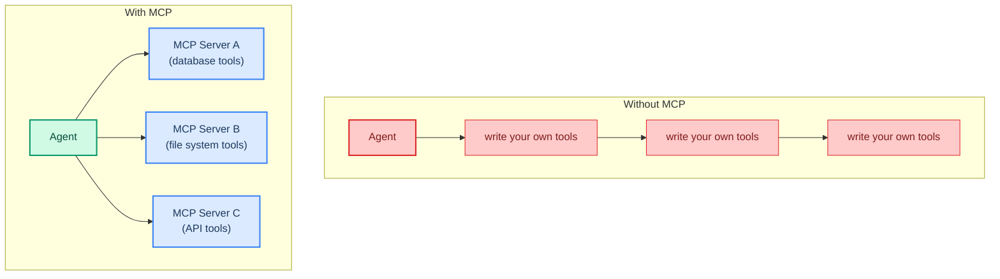
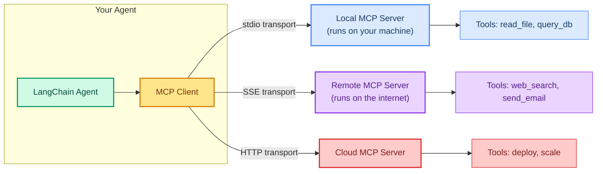

# MCP: Connecting External Tool Servers

> **Goal:** Use the Model Context Protocol (MCP) to connect your agent to external tool servers.  
> **Previous chapter:** [21 - Retrieval (RAG)](./21-retrieval-rag.md)  
> **Next chapter:** [23 - Building MCP Servers with FastMCP](./23-fastmcp-building-servers.md)

---

## What Is MCP?

MCP (Model Context Protocol) is a standard way for AI agents to connect to **external tool servers**. Instead of writing every tool yourself, you can connect to MCP servers that provide tools for you.



---

## MCP Architecture



---

## Prerequisites

```bash
pip install langchain-mcp-adapters mcp
```

---

## Connecting to an MCP Server (stdio)

The most common way to connect is via **stdio** - running a local MCP server as a subprocess:

```python
from dotenv import load_dotenv
load_dotenv()

from langchain_groq import ChatGroq
from langchain.agents import create_agent
from langchain_mcp_adapters.client import MultiServerMCPClient

# Step 1: Define MCP server connection
mcp_client = MultiServerMCPClient({
    "filesystem": {
        "command": "npx",
        "args": ["-y", "@modelcontextprotocol/server-filesystem", "/tmp"],
        "transport": "stdio",
    }
})

# Step 2: Get tools from the MCP server
mcp_tools = await mcp_client.get_tools()
print(f"Loaded {len(mcp_tools)} tools from MCP server:")
for t in mcp_tools:
    print(f"  - {t.name}: {t.description[:60]}")

# Step 3: Create agent with MCP tools
llm = ChatGroq(model="openai/gpt-oss-120b", temperature=0)
agent = create_agent(
    model=llm,
    tools=mcp_tools,
    system_prompt="You are a helpful file system assistant.",
)

# Step 4: Use the agent
result = agent.invoke({
    "messages": [{"role": "user", "content": "List all files in /tmp"}]
})
print(result["messages"][-1].content)
```

> Note: The filesystem MCP server requires Node.js (npx). Install it from https://nodejs.org

---

## Connecting to Multiple MCP Servers

```python
from dotenv import load_dotenv
load_dotenv()

from langchain_groq import ChatGroq
from langchain.agents import create_agent
from langchain_mcp_adapters.client import MultiServerMCPClient

mcp_client = MultiServerMCPClient({
    # Filesystem server (local, stdio)
    "filesystem": {
        "command": "npx",
        "args": ["-y", "@modelcontextprotocol/server-filesystem", "/tmp"],
        "transport": "stdio",
    },
    # SQLite server (local, stdio)
    "sqlite": {
        "command": "npx",
        "args": ["-y", "@modelcontextprotocol/server-sqlite", "--db-path", "test.db"],
        "transport": "stdio",
    },
    # Remote server (SSE)
    "remote_api": {
        "url": "https://mcp-server.example.com/sse",
        "transport": "sse",
    },
})

# Get ALL tools from ALL servers
all_mcp_tools = await mcp_client.get_tools()
print(f"Total MCP tools: {len(all_mcp_tools)}")

llm = ChatGroq(model="openai/gpt-oss-120b", temperature=0)
agent = create_agent(
    model=llm,
    tools=all_mcp_tools,
    system_prompt="You are a helpful assistant with file, database, and API access.",
)

result = agent.invoke({
    "messages": [{"role": "user", "content": "What files are in /tmp?"}]
})
print(result["messages"][-1].content)
```

---

## Available MCP Servers

Popular MCP servers you can connect to:

| Server | Command | Tools Provided |
|--------|---------|---------------|
| FileSystem | `npx @modelcontextprotocol/server-filesystem` | read_file, write_file, list_files |
| SQLite | `npx @modelcontextprotocol/server-sqlite` | query, execute, list_tables |
| Fetch | `npx @modelcontextprotocol/server-fetch` | fetch_url |
| Git | `npx @modelcontextprotocol/server-git` | git_log, git_diff, git_status |
| GitHub | `npx @modelcontextprotocol/server-github` | create_issue, list_prs |
| Memory | `npx @modelcontextprotocol/server-memory` | store, retrieve, search |

> Full list: https://github.com/modelcontextprotocol/servers

---

## Combining MCP Tools with Custom Tools

```python
from dotenv import load_dotenv
load_dotenv()

from langchain_groq import ChatGroq
from langchain.agents import create_agent
from langchain_mcp_adapters.client import MultiServerMCPClient
from langchain.tools import tool


# Your own custom tools
@tool
def calculate(expression: str) -> str:
    """Calculate a math expression.

    Args:
        expression: Math expression.
    """
    try:
        return str(eval(expression, {"__builtins__": {}}, {}))
    except Exception as e:
        return f"Error: {e}"


# Connect to MCP server
mcp_client = MultiServerMCPClient({
    "filesystem": {
        "command": "npx",
        "args": ["-y", "@modelcontextprotocol/server-filesystem", "/tmp"],
        "transport": "stdio",
    }
})
mcp_tools = await mcp_client.get_tools()

# Combine MCP tools + custom tools
all_tools = mcp_tools + [calculate]

llm = ChatGroq(model="openai/gpt-oss-120b", temperature=0)
agent = create_agent(
    model=llm,
    tools=all_tools,
    system_prompt="You are a helpful assistant with file and math tools.",
)

result = agent.invoke({
    "messages": [{"role": "user", "content": "List files in /tmp then calculate 42 * 17"}]
})
print(result["messages"][-1].content)
```

---

## Try It Yourself

1. Install the filesystem MCP server and connect your agent to it
2. Connect to the SQLite MCP server and ask the agent to list tables
3. Combine MCP tools with your own custom tools in a single agent
4. Try the fetch MCP server to have your agent load a webpage

---

## What You Learned

- What MCP is and how it standardizes tool connections
- How to connect to MCP servers via stdio transport
- How to connect to multiple MCP servers at once
- Popular MCP servers available (filesystem, SQLite, Git, GitHub, etc.)
- How to combine MCP tools with your own custom tools

---

## Next Steps

Now let's learn how to **build your own** MCP tool server with FastMCP so other agents can use your tools.

Go to: [23 - Building MCP Servers with FastMCP](./23-fastmcp-building-servers.md)