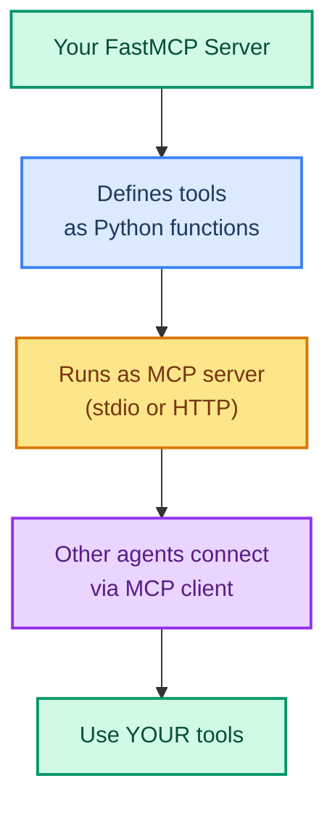
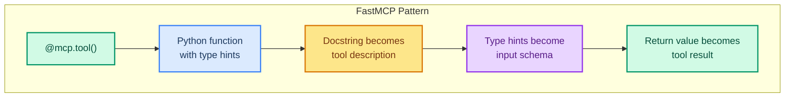

# Building MCP Tool Servers with FastMCP

> **Goal:** Build your own MCP tool server using FastMCP so other agents can connect and use your tools.  
> **Previous chapter:** [22 - MCP Tools](./22-mcp-tools.md)  
> **Next chapter:** [24 - Agent Skills](./24-agent-skills.md)

---

## What Is FastMCP?

FastMCP is a Python library that makes it easy to create your own **MCP tool servers**. Instead of only connecting to other people's servers, you can build your own and share tools with any MCP-compatible agent.



---

## Prerequisites

```bash
pip install fastmcp mcp
```

---

## Step 1: Create a FastMCP Server

```python
from fastmcp import FastMCP

# Create an MCP server
mcp = FastMCP("My Tool Server")


@mcp.tool()
def calculate(expression: str) -> str:
    """Calculate a math expression safely.

    Args:
        expression: A math expression like '15 * 37' or '2 + 2'.
    """
    try:
        result = eval(expression, {"__builtins__": {}}, {})
        return f"{expression} = {result}"
    except Exception as e:
        return f"Error: {e}"


@mcp.tool()
def word_count(text: str) -> str:
    """Count words in a text.

    Args:
        text: The text to count words in.
    """
    words = text.split()
    return f"Words: {len(words)}, Characters: {len(text)}"


@mcp.tool()
def reverse_string(text: str) -> str:
    """Reverse a string.

    Args:
        text: The string to reverse.
    """
    return text[::-1]


@mcp.tool()
def get_system_info() -> str:
    """Get basic system information."""
    import platform
    return f"OS: {platform.system()} {platform.release()}, Python: {platform.python_version()}"


# Run the server
if __name__ == "__main__":
    mcp.run(transport="stdio")
```

Save this as `mcp_server.py`.

---

## Step 2: Connect Your Agent to Your MCP Server

```python
from dotenv import load_dotenv
load_dotenv()

from langchain_groq import ChatGroq
from langchain.agents import create_agent
from langchain_mcp_adapters.client import MultiServerMCPClient

# Connect to YOUR MCP server
mcp_client = MultiServerMCPClient({
    "my_server": {
        "command": "python",
        "args": ["mcp_server.py"],  # Your server file
        "transport": "stdio",
    }
})

# Get tools from your MCP server
mcp_tools = await mcp_client.get_tools()
print(f"Loaded {len(mcp_tools)} tools from your MCP server:")
for t in mcp_tools:
    print(f"  - {t.name}: {t.description[:60]}")

# Create agent with MCP tools
llm = ChatGroq(model="openai/gpt-oss-120b", temperature=0)
agent = create_agent(
    model=llm,
    tools=mcp_tools,
    system_prompt="You are a helpful assistant with math and text tools.",
)

# Test the agent
result = agent.invoke({
    "messages": [{"role": "user", "content": "Calculate 42 * 17 and count the words in 'Hello world this is a test'"}]
})
print(result["messages"][-1].content)
```

---

## Step 3: Real-World MCP Server Example

```python
from fastmcp import FastMCP
import sqlite3
import json
import os
from datetime import datetime

mcp = FastMCP("Company Tools Server")

# Create a test database
def init_db():
    conn = sqlite3.connect("company.db")
    conn.execute("""
        CREATE TABLE IF NOT EXISTS employees (
            id INTEGER PRIMARY KEY,
            name TEXT,
            department TEXT,
            salary INTEGER,
            hire_date TEXT
        )
    """)
    conn.execute("INSERT OR REPLACE INTO employees VALUES (1, 'Alice', 'Engineering', 95000, '2023-01-15')")
    conn.execute("INSERT OR REPLACE INTO employees VALUES (2, 'Bob', 'Sales', 65000, '2024-06-01')")
    conn.execute("INSERT OR REPLACE INTO employees VALUES (3, 'Charlie', 'Engineering', 88000, '2022-03-20')")
    conn.commit()
    conn.close()

init_db()


@mcp.tool()
def list_employees() -> str:
    """List all employees in the company database.
    """
    conn = sqlite3.connect("company.db")
    cursor = conn.cursor()
    cursor.execute("SELECT * FROM employees")
    rows = cursor.fetchall()
    conn.close()

    employees = []
    for row in rows:
        employees.append(f"ID:{row[0]}, Name:{row[1]}, Dept:{row[2]}, Salary:${row[3]}, Hired:{row[4]}")
    return "\n".join(employees)


@mcp.tool()
def search_employees_by_department(department: str) -> str:
    """Search for employees in a specific department.

    Args:
        department: Department name (e.g., 'Engineering', 'Sales').
    """
    conn = sqlite3.connect("company.db")
    cursor = conn.cursor()
    cursor.execute("SELECT * FROM employees WHERE department = ?", (department,))
    rows = cursor.fetchall()
    conn.close()

    if not rows:
        return f"No employees found in {department}."

    results = []
    for row in rows:
        results.append(f"ID:{row[0]}, Name:{row[1]}, Salary:${row[3]}")
    return f"Employees in {department}:\n" + "\n".join(results)


@mcp.tool()
def get_company_stats() -> str:
    """Get company statistics (total employees, avg salary, departments).
    """
    conn = sqlite3.connect("company.db")
    cursor = conn.cursor()

    cursor.execute("SELECT COUNT(*) FROM employees")
    total = cursor.fetchone()[0]

    cursor.execute("SELECT AVG(salary) FROM employees")
    avg_salary = cursor.fetchone()[0]

    cursor.execute("SELECT DISTINCT department FROM employees")
    depts = [row[0] for row in cursor.fetchall()]

    conn.close()

    return (
        f"Company Stats:\n"
        f"  Total employees: {total}\n"
        f"  Average salary: ${avg_salary:,.2f}\n"
        f"  Departments: {', '.join(depts)}\n"
        f"  Generated: {datetime.now().strftime('%Y-%m-%d %H:%M')}"
    )


if __name__ == "__main__":
    mcp.run(transport="stdio")
```

---

## Step 4: Connect LangChain Agent to Your Company MCP Server

```python
from dotenv import load_dotenv
load_dotenv()

from langchain_groq import ChatGroq
from langchain.agents import create_agent
from langchain_mcp_adapters.client import MultiServerMCPClient

mcp_client = MultiServerMCPClient({
    "company_server": {
        "command": "python",
        "args": ["company_mcp_server.py"],
        "transport": "stdio",
    }
})

mcp_tools = await mcp_client.get_tools()
print(f"Loaded tools: {[t.name for t in mcp_tools]}")

llm = ChatGroq(model="openai/gpt-oss-120b", temperature=0)
agent = create_agent(
    model=llm,
    tools=mcp_tools,
    system_prompt="You are a company HR assistant. Answer questions about employees and departments.",
)

result = agent.invoke({
    "messages": [{"role": "user", "content": "Give me the company stats and list all engineering employees."}]
})
print(result["messages"][-1].content)
```

---

## FastMCP Tool Definition Pattern



> The pattern is identical to LangChain's `@tool` decorator! If you know LangChain tools, you already know FastMCP tools.

---

## Running MCP Server Over HTTP (for remote access)

```python
from fastmcp import FastMCP

mcp = FastMCP("Remote Tool Server")


@mcp.tool()
def health_check() -> str:
    """Check if the server is running."""
    return "Server is healthy!"


if __name__ == "__main__":
    # Run over HTTP instead of stdio
    mcp.run(transport="http", host="0.0.0.0", port=8080)
```

Then connect remotely:

```python
mcp_client = MultiServerMCPClient({
    "remote_server": {
        "url": "http://localhost:8080/sse",
        "transport": "sse",
    }
})
```

---

## Try It Yourself

1. Create a FastMCP server with 3 tools (calculator, string tools, file reader)
2. Connect your LangChain agent to your MCP server and test each tool
3. Build a company database MCP server with tools for CRUD operations
4. Run your MCP server over HTTP and connect from another Python script

---

## What You Learned

- What FastMCP is and how it helps you build MCP tool servers
- How to define tools with `@mcp.tool()` decorator
- How to run an MCP server via stdio (local) transport
- How to run an MCP server over HTTP (for remote access)
- How to connect a LangChain agent to your own MCP server
- How to build a real-world company database MCP server

---

## Next Steps

Let's learn how to give your agent **domain knowledge** using Agent Skills - special instruction packs that load on demand.

Go to: [24 - Agent Skills](./24-agent-skills.md)