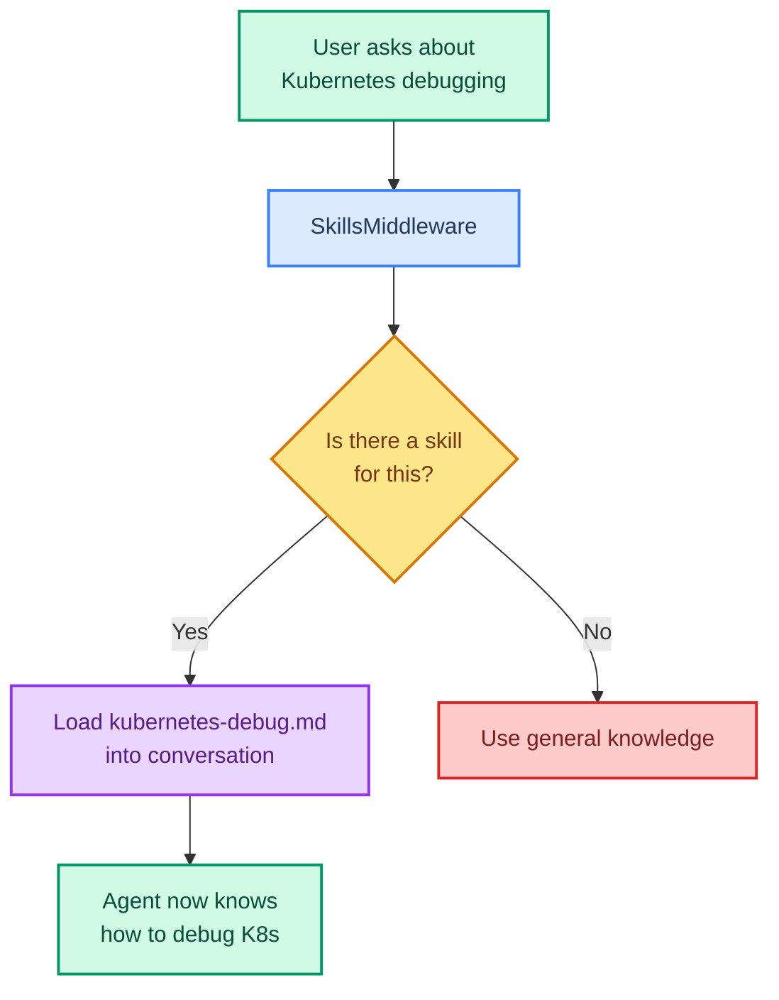

# Agent Skills: Giving Agents Domain Knowledge

> **Goal:** Use SkillsMiddleware to load domain-specific knowledge packs that teach your agent specialized behavior.  
> **Previous chapter:** [23 - FastMCP Servers](./23-fastmcp-building-servers.md)  
> **Next chapter:** [25 - Multi-Agent Overview](./25-multi-agent-overview.md)

---

## What Are Agent Skills?

**Skills** are markdown instruction packs that teach your agent how to do specialized tasks. Instead of stuffing everything into the system prompt, skills load **on demand** based on the conversation.



---

## Skills vs System Prompt

| Feature | System Prompt | Skills |
|---------|--------------|--------|
| Always loaded? | Yes - takes up context space | No - loaded on demand |
| Best for | General behavior rules | Specialized domain knowledge |
| Size limit | Small (few hundred tokens) | Can be large (loaded when needed) |
| Dynamic? | Static | Dynamic - loads relevant skills |

---

## Creating Skill Files

Skills are markdown files in a directory. Each file is one skill:

```bash
mkdir -p skills
```

**`skills/kubectl-debugging.md`:**

```markdown
# Skill: Kubernetes Debugging

## When to Use
Use this skill when the user asks about debugging Kubernetes pods, containers, or services.

## Steps
1. Check pod status with `kubectl get pods`
2. Get detailed info with `kubectl describe pod <name>`
3. Check logs with `kubectl logs <name>`
4. If crash loop, check events with `kubectl get events`

## Common Issues
- CrashLoopBackOff: Check if the container image is correct
- Pending: Check for resource limits or node availability
- OOMKilled: Increase memory limits

## Commands
- `kubectl get pods -n <namespace>`
- `kubectl describe pod <pod-name> -n <namespace>`
- `kubectl logs <pod-name> -n <namespace>`
- `kubectl exec -it <pod-name> -- /bin/bash`
```

**`skills/python-debugging.md`:**

```markdown
# Skill: Python Debugging

## When to Use
Use this skill when the user needs help debugging Python errors.

## Steps
1. Read the full traceback to find the file and line number
2. Check if the variable name matches (typos)
3. Check if the import is correct
4. Print variable types to find type mismatches

## Common Errors
- ModuleNotFoundError: pip install the missing module
- TypeError: Check what type the variable actually is
- KeyError: Use .get() method instead of [] for dicts
- AttributeError: Check if the object is None

## Debugging Tips
- Use print() to trace variable values
- Use python -m pdb <file> for interactive debugging
- Use type() to check variable types at each step
```

**`skills/sql-optimization.md`:**

```markdown
# Skill: SQL Query Optimization

## When to Use
Use this skill when the user asks about optimizing SQL queries or database performance.

## Steps
1. Check if indexes exist on join and filter columns
2. Look for N+1 query patterns
3. Use EXPLAIN to see the query plan
4. Check for full table scans

## Common Optimizations
- Add indexes on WHERE clause columns
- Use LIMIT to reduce result set
- Avoid SELECT *, choose specific columns
- Use JOINs instead of subqueries when possible
- Use EXISTS instead of COUNT for existence checks
```

---

## Using SkillsMiddleware

```python
from dotenv import load_dotenv
load_dotenv()

from langchain_groq import ChatGroq
from langchain.agents import create_agent
from langchain.agents.middleware import SkillsMiddleware
from langchain.tools import tool
from langgraph.checkpoint.memory import InMemorySaver
import os


@tool
def run_command(command: str) -> str:
    """Run a shell command (simulated, safe commands only).

    Args:
        command: The shell command to run.
    """
    safe_commands = ["kubectl get pods", "kubectl get events", "ls", "pwd", "whoami"]
    if any(command.startswith(cmd) for cmd in safe_commands):
        return f"Executed: {command}\nOutput: [simulated successful output]"
    return f"Command '{command}' is blocked. Only safe read-only commands are allowed."


llm = ChatGroq(model="openai/gpt-oss-120b", temperature=0)

agent = create_agent(
    model=llm,
    tools=[run_command],
    system_prompt="You are a helpful DevOps assistant. Use your skills to provide accurate guidance.",
    middleware=[
        SkillsMiddleware(sources=["./skills/"]),  # Load skills from this directory
    ],
    checkpointer=InMemorySaver(),
)

# Ask about Kubernetes - the K8s skill should load
result = agent.invoke({
    "messages": [{"role": "user", "content": "My Kubernetes pod is in CrashLoopBackOff. How do I debug it?"}]
})
print(result["messages"][-1].content)
# The agent will use the Kubernetes debugging skill to give accurate guidance

# Ask about SQL - the SQL skill should load
result2 = agent.invoke({
    "messages": [{"role": "user", "content": "How do I optimize a slow SQL query?"}]
})
print(result2["messages"][-1].content)
# The agent will use the SQL optimization skill
```

---

## How Skills Work Internally

```mermaid
sequenceDiagram
    participant U as User
    participant SM as SkillsMiddleware
    participant FS as File System
    participant M as Model

    U->>SM: "Debug my Kubernetes pod"
    SM->>FS: List all skill files
    FS->>SM: kubectl-debugging.md, python-debugging.md, sql-optimization.md
    SM->>SM: Match question to relevant skill
    SM->>M: Here is your system prompt + the K8s debugging skill
    M->>U: Follows the K8s debugging steps from the skill

    style U fill:#d1fae5,stroke:#059669,stroke-width:2px,color:#064e3b
    style SM fill:#e9d5ff,stroke:#9333ea,stroke-width:2px,color:#581c87
    style FS fill:#dbeafe,stroke:#3b82f6,stroke-width:2px,color:#1e3a5f
    style M fill:#fde68a,stroke:#d97706,stroke-width:2px,color:#78350f
```

---

## Creating a Skills Library

For a real project, organize your skills:

```
skills/
├── devops/
│   ├── kubectl-debugging.md
│   ├── docker-troubleshooting.md
│   ├── podman-commands.md
│   └── terraform-basics.md
├── development/
│   ├── python-debugging.md
│   ├── git-workflow.md
│   ├── code-review-checklist.md
│   └── testing-patterns.md
├── data/
│   ├── sql-optimization.md
│   ├── etl-patterns.md
│   └── data-validation.md
└── security/
    ├── prompt-injection.md
    ├── tool-safety.md
    └── audit-checklist.md
```

Load all skills:

```python
agent = create_agent(
    model=llm,
    tools=[run_command],
    system_prompt="You are a helpful DevOps assistant.",
    middleware=[
        SkillsMiddleware(sources=[
            "./skills/devops/",
            "./skills/development/",
            "./skills/data/",
            "./skills/security/",
        ]),
    ],
)
```

---

## Try It Yourself

1. Create 3 skill files for domains you know (cooking, gaming, fitness, etc.)
2. Build an agent with SkillsMiddleware and test that it loads the right skills
3. Create a "code review" skill that teaches the agent how to review Python files
4. Test: does the agent behave differently with vs without the skills?

---

## What You Learned

- What skills are and how they differ from system prompts
- How to create skill files in markdown
- How to use SkillsMiddleware to load skill files
- How the agent matches questions to relevant skills on demand
- How to organize a skills directory for a real project

---

## Next Steps

Now let's move beyond single agents and learn about **multi-agent systems** - when multiple agents work together.

Go to: [25 - Multi-Agent Overview](./25-multi-agent-overview.md)