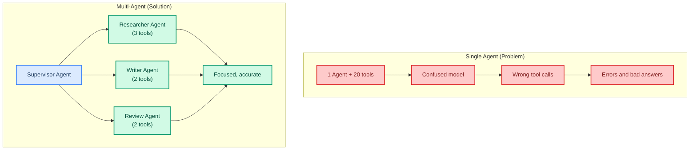
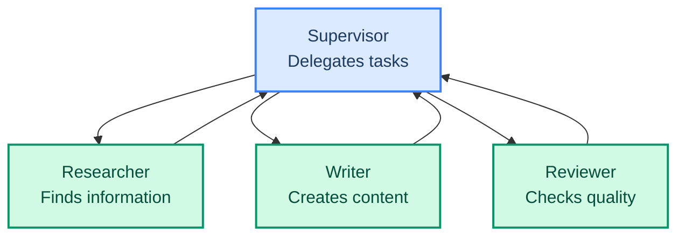
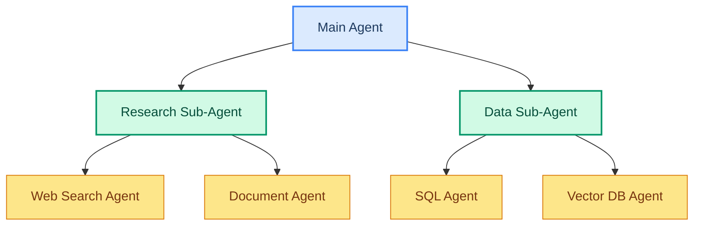
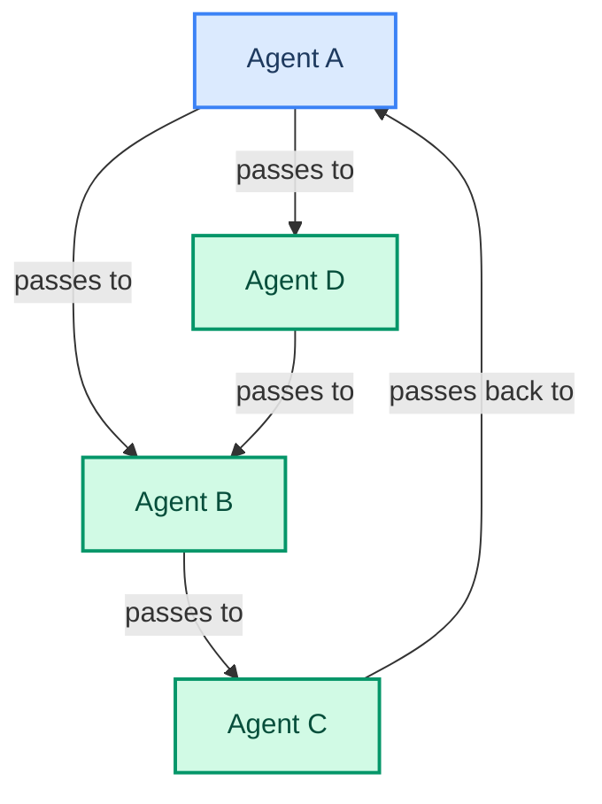
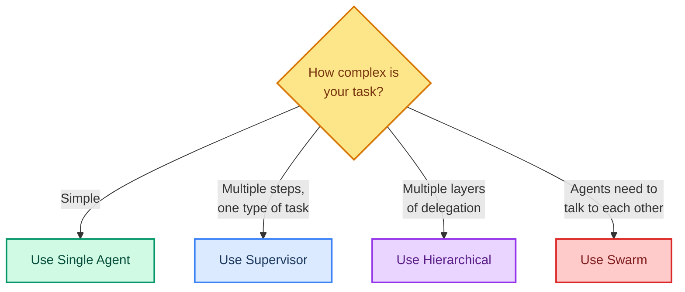

# Multi-Agent Systems: When One Agent Is Not Enough

> **Goal:** Understand multi-agent architectures (supervisor, swarm, hierarchical) and when to use them.  
> **Previous chapter:** [24 - Agent Skills](./24-agent-skills.md)  
> **Next chapter:** [26 - Subagents](./26-subagents.md)

---

## Why Multiple Agents?

A single agent with 20+ tools gets confused. It tries to do everything itself and makes mistakes. Multiple agents solve this by **splitting work**:



---

## When to Use Multi-Agent

| Situation | Single Agent | Multi-Agent |
|-----------|-------------|-------------|
| Simple Q&A (1-3 tools) | Use this | Overkill |
| Research + writing + review | Too many tools | Use multi-agent |
| Parallel independent tasks | Sequential (slow) | Use multi-agent (parallel) |
| Different expertise needed | One agent can't be expert at everything | Use multi-agent |
| Complex multi-step workflow | Gets lost | Use multi-agent |
| Need different models per task | Can't do this | Use multi-agent |

---

## Three Main Architectures

### 1. Supervisor (Recommended for beginners)

One "boss" agent delegates tasks to worker agents:



---

### 2. Hierarchical

Agents delegate to sub-agents which can delegate further:



---

### 3. Swarm / Event-Driven

Agents communicate with each other directly, no fixed boss:



---

## Pattern Selection Guide



---

## Simple Supervisor Example

```python
from dotenv import load_dotenv
load_dotenv()

from langchain_groq import ChatGroq
from langchain.agents import create_agent
from langchain.tools import tool
from langchain_tavily import TavilySearch
from langgraph.checkpoint.memory import InMemorySaver


# Research agent tools
@tool
def search_web(query: str) -> str:
    """Search the web for information.

    Args:
        query: What to search for.
    """
    search = TavilySearch(max_results=2, include_answer=True)
    result = search.invoke({"query": query})
    return str(result.get("answer", "No results"))


# Writing tools
@tool
def format_report(title: str, sections: list) -> str:
    """Format a report with title and sections.

    Args:
        title: Report title.
        sections: List of section dictionaries with 'heading' and 'content'.
    """
    report = f"# {title}\n\n"
    for section in sections:
        report += f"## {section['heading']}\n{section['content']}\n\n"
    return report


# Create the supervisor agent
llm = ChatGroq(model="openai/gpt-oss-120b", temperature=0)

supervisor = create_agent(
    model=llm,
    tools=[search_web, format_report],
    system_prompt="""You are a research supervisor.
    1. First search the web for information
    2. Then format a clear report from the findings
    Be thorough and organized.""",
    checkpointer=InMemorySaver(),
)

result = supervisor.invoke({
    "messages": [{"role": "user", "content": "Research the latest AI trends in 2026 and write a report."}]
})
print(result["messages"][-1].content)
```

> In the next chapter, you'll learn how to split this into proper subagents.

---

## Try It Yourself

1. Think of a task that needs multiple types of expertise (e.g., "analyze data and write a report")
2. Draw a multi-agent architecture diagram for it (on paper)
3. Identify which agents would have which tools
4. Decide: supervisor, hierarchical, or swarm?

---

## What You Learned

- Why single agents struggle with complex tasks
- Three multi-agent architectures: supervisor, hierarchical, swarm
- When to use each architecture
- How to think about splitting work among agents
- A simple supervisor example

---

## Next Steps

Let's build real subagents that work in parallel using SubAgentMiddleware.

Go to: [26 - Subagents: Parallel Isolated Work](./26-subagents.md)