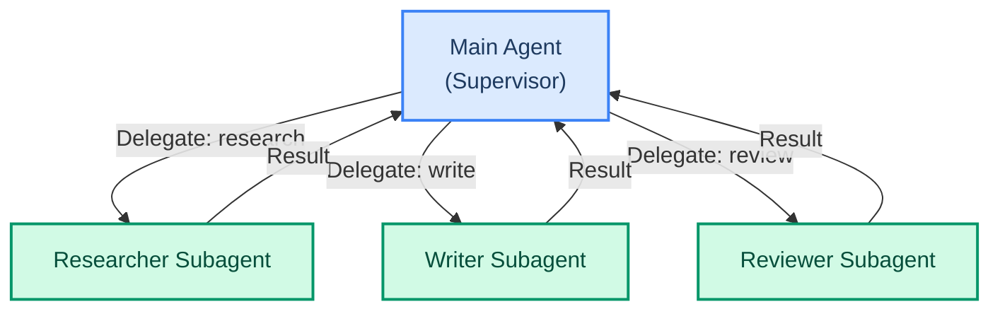

# Subagents: Parallel Isolated Work

> **Goal:** Use SubAgentMiddleware to spawn subagents that work in isolated contexts and report back.  
> **Previous chapter:** [25 - Multi-Agent Overview](./25-multi-agent-overview.md)  
> **Next chapter:** [27 - LangGraph Orchestration](./27-langgraph-orchestration.md)

---

## What Are Subagents?

A **subagent** is a mini-agent that runs inside your main agent. It has:
- Its own system prompt
- Its own set of tools
- Its own context window (isolated)
- A specific task to do

The main agent delegates work to subagents, waits for results, and combines them.



---

## Using SubAgentMiddleware

```python
from dotenv import load_dotenv
load_dotenv()

from langchain_groq import ChatGroq
from langchain.agents import create_agent
from langchain.agents.middleware import SubAgentMiddleware
from langchain.tools import tool
from langchain_tavily import TavilySearch


# Tools for the research subagent
@tool
def search_web(query: str) -> str:
    """Search the web.

    Args:
        query: What to search for.
    """
    search = TavilySearch(max_results=2, include_answer=True)
    result = search.invoke({"query": query})
    return str(result.get("answer", "No results"))


# Tools for the main agent
@tool
def format_output(title: str, content: str) -> str:
    """Format content with a title.

    Args:
        title: Output title.
        content: Main content.
    """
    return f"# {title}\n\n{content}"


llm = ChatGroq(model="openai/gpt-oss-120b", temperature=0)

# Define subagents
subagent_config = SubAgentMiddleware(
    subagents=[
        {
            "name": "researcher",
            "description": "Searches the web and returns a summary of findings.",
            "system_prompt": "You are a research assistant. Search the web and summarize key findings.",
            "tools": [search_web],
            "model": "groq:openai/gpt-oss-120b",  # Can use different model per subagent
            "middleware": [],
        },
        {
            "name": "writer",
            "description": "Takes research findings and writes a clear report.",
            "system_prompt": "You are a technical writer. Take raw information and create a well-structured report.",
            "tools": [],
            "model": "groq:openai/gpt-oss-120b",
            "middleware": [],
        },
    ]
)

# Main agent with subagents
agent = create_agent(
    model=llm,
    tools=[format_output],
    system_prompt="""You are a content supervisor.
    1. Use the researcher subagent to find information
    2. Use the writer subagent to create the report
    3. Format the output""",
    middleware=[subagent_config],
)

result = agent.invoke({
    "messages": [{"role": "user", "content": "Research the latest trends in agentic AI and write a report."}]
})
print(result["messages"][-1].content)
```

---

## How Subagents Work

```mermaid
sequenceDiagram
    participant U as User
    participant M as Main Agent
    participant R as Researcher Subagent
    participant W as Writer Subagent

    U->>M: "Research AI trends and write a report"
    M->>M: Think: I need research first
    M->>R: Delegate: "Find AI trends"
    R->>R: Search web, summarize findings
    R->>M: Return: "Here are the 5 key AI trends..."
    M->>M: Think: Now I need a writer
    M->>W: Delegate: "Write a report about these trends"
    W->>W: Format and write report
    W->>M: Return: "# AI Trends Report\n\n..."
    M->>U: Final formatted report

    style U fill:#d1fae5,stroke:#059669,stroke-width:2px,color:#064e3b
    style M fill:#dbeafe,stroke:#3b82f6,stroke-width:2px,color:#1e3a5f
    style R fill:#fde68a,stroke:#d97706,stroke-width:2px,color:#78350f
    style W fill:#e9d5ff,stroke:#9333ea,stroke-width:2px,color:#581c87
```

---

## Subagent Configuration Options

Each subagent is defined as a dictionary:

```python
{
    "name": "researcher",         # Unique name for this subagent
    "description": "...",          # What this subagent does (helps the main agent decide when to use it)
    "system_prompt": "...",       # Instructions for this subagent
    "tools": [tool1, tool2],      # Tools available to this subagent
    "model": "groq:openai/gpt-oss-120b",  # Can use a different model
    "middleware": [],              # Can have its own middleware
}
```

---

## Real-World Example: Database Analysis Agent

```python
from dotenv import load_dotenv
load_dotenv()

from langchain_groq import ChatGroq
from langchain.agents import create_agent
from langchain.agents.middleware import SubAgentMiddleware
from langchain.tools import tool
import sqlite3


# Set up a test database
conn = sqlite3.connect("analytics.db")
conn.execute("CREATE TABLE IF NOT EXISTS sales (id INTEGER PRIMARY KEY, product TEXT, amount INTEGER, region TEXT)")
conn.execute("INSERT OR REPLACE INTO sales VALUES (1, 'Widget A', 5000, 'North')")
conn.execute("INSERT OR REPLACE INTO sales VALUES (2, 'Widget B', 3200, 'South')")
conn.execute("INSERT OR REPLACE INTO sales VALUES (3, 'Widget A', 7100, 'South')")
conn.execute("INSERT OR REPLACE INTO sales VALUES (4, 'Widget C', 1200, 'East')")
conn.commit()
conn.close()


@tool
def query_database(query: str) -> str:
    """Run a SELECT query on the database.

    Args:
        query: SQL SELECT query.
    """
    if not query.strip().upper().startswith("SELECT"):
        return "Error: Only SELECT allowed."
    conn = sqlite3.connect("analytics.db")
    cursor = conn.cursor()
    cursor.execute(query)
    rows = cursor.fetchall()
    conn.close()
    return str(rows) if rows else "No results."


llm = ChatGroq(model="openai/gpt-oss-120b", temperature=0)

agent = create_agent(
    model=llm,
    tools=[query_database],
    system_prompt="""You are a sales analysis supervisor.
    1. Query the database to get sales data
    2. Analyze the results and identify trends
    3. Provide a summary with recommendations""",
    middleware=[
        SubAgentMiddleware(subagents=[
            {
                "name": "data_analyst",
                "description": "Queries the database and extracts raw sales data.",
                "system_prompt": "You are a data analyst. Query the database to answer questions about sales.",
                "tools": [query_database],
                "model": "groq:openai/gpt-oss-120b",
                "middleware": [],
            },
        ]),
    ],
)

result = agent.invoke({
    "messages": [{"role": "user", "content": "Analyze our sales data. What are the top products and regions?"}]
})
print(result["messages"][-1].content)
```

---

## TodoListMiddleware: Task Planning

Combine with TodoListMiddleware for structured planning:

```python
from langchain.agents.middleware import TodoListMiddleware, SubAgentMiddleware

agent = create_agent(
    model=llm,
    tools=[],
    system_prompt="You are a project manager that delegates work.",
    middleware=[
        TodoListMiddleware(),  # Helps the agent plan and track tasks
        SubAgentMiddleware(subagents=[
            {
                "name": "researcher",
                "description": "Finds information online.",
                "system_prompt": "Search the web and summarize findings.",
                "tools": [search_web],
                "model": "groq:openai/gpt-oss-120b",
                "middleware": [],
            },
            {
                "name": "writer",
                "description": "Writes clear reports.",
                "system_prompt": "Write clear, well-structured reports.",
                "tools": [],
                "model": "groq:openai/gpt-oss-120b",
                "middleware": [],
            },
        ]),
    ],
)
```

---

## Try It Yourself

1. Create a subagent that does math (with calculate tool) and another that does text analysis
2. Build a multi-agent system where one subagent writes code and another reviews it
3. Add TodoListMiddleware and watch the agent plan its work step by step

---

## What You Learned

- What subagents are and how they run in isolated contexts
- How to use SubAgentMiddleware to define subagents
- How each subagent can have its own tools, model, and prompt
- How the main agent delegates to subagents and collects results
- How to combine TodoListMiddleware for structured planning

---

## Next Steps

For maximum control, you can build custom agent workflows using LangGraph directly. Let's learn the fundamentals.

Go to: [27 - LangGraph Orchestration](./27-langgraph-orchestration.md)