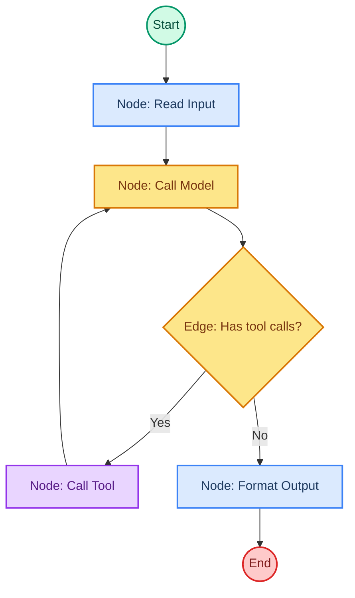
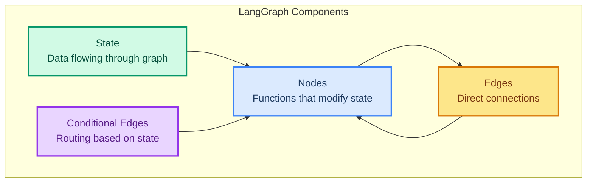
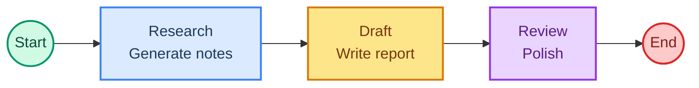

# LangGraph: Building Custom Agent Workflows

> **Goal:** Learn LangGraph fundamentals (State, nodes, edges, conditional routing) to build custom agent workflows.  
> **Previous chapter:** [26 - Subagents](./26-subagents.md)  
> **Next chapter:** [28 - Observability with LangSmith](./28-observability-langsmith.md)

---

## What Is LangGraph?

LangGraph is the **engine** underneath LangChain agents. It gives you full control to build custom workflows with:

- **State** - Data that flows through your graph
- **Nodes** - Functions that process the state
- **Edges** - Connections that route data between nodes
- **Conditional routing** - Decide which node to go to next based on state



---

## When to Use LangGraph vs create_agent

| Use | create_agent | LangGraph |
|-----|-------------|-----------|
| Simple agent with tools | Use this | Overkill |
| Standard agent loop (think, act, observe) | Use this | Overkill |
| Custom routing logic | Can't do this | Use LangGraph |
| Multiple models in one workflow | Hard | Use LangGraph |
| Complex multi-step processes | Limited | Use LangGraph |
| Deterministic + agentic mix | Hard | Use LangGraph |

---

## Building a Simple Graph

```python
from dotenv import load_dotenv
load_dotenv()

from langchain_groq import ChatGroq
from langchain.tools import tool
from langgraph.graph import StateGraph, START, END
from langgraph.prebuilt import ToolNode
from langchain.agents import AgentState
from langchain.messages import HumanMessage, AIMessage
from typing import Annotated
from langgraph.graph.message import add_messages


# Step 1: Define the State
class MyState(AgentState):
    messages: Annotated[list, add_messages]
    step_count: int


# Step 2: Create the model and tools
llm = ChatGroq(model="openai/gpt-oss-120b", temperature=0)


@tool
def calculate(expression: str) -> str:
    """Calculate a math expression.

    Args:
        expression: Math expression like '2 + 2'.
    """
    try:
        return str(eval(expression, {"__builtins__": {}}, {}))
    except Exception as e:
        return f"Error: {e}"


llm_with_tools = llm.bind_tools([calculate])
tool_node = ToolNode([calculate])


# Step 3: Define nodes (functions that process state)
def call_model(state: MyState) -> dict:
    """Call the model with the current messages."""
    response = llm_with_tools.invoke(state["messages"])
    return {"messages": [response]}


def should_continue(state: MyState) -> str:
    """Decide whether to call a tool or end."""
    last_message = state["messages"][-1]
    if hasattr(last_message, "tool_calls") and last_message.tool_calls:
        return "tools"
    return END


# Step 4: Build the graph
graph_builder = StateGraph(MyState)

# Add nodes
graph_builder.add_node("model", call_model)
graph_builder.add_node("tools", tool_node)

# Add edges
graph_builder.add_edge(START, "model")
graph_builder.add_conditional_edges("model", should_continue)
graph_builder.add_edge("tools", "model")  # After tool, go back to model

# Compile the graph
app = graph_builder.compile()

# Step 5: Run it
result = app.invoke({
    "messages": [HumanMessage(content="What is 25 * 4?")],
    "step_count": 0,
})

# Print results
for msg in result["messages"]:
    print(f"[{type(msg).__name__}] {msg.content[:200]}")
```

---

## Graph Components Explained



### State

State is a TypedDict or Pydantic model that holds all data flowing through your graph:

```python
class MyState(AgentState):
    messages: Annotated[list, add_messages]  # Auto-appends new messages
    step_count: int                          # Custom field
    result: str                              # Custom field
```

### Nodes

Nodes are functions that take state and return updates:

```python
def my_node(state: MyState) -> dict:
    # Read from state
    messages = state["messages"]
    
    # Do something
    response = llm.invoke(messages)
    
    # Return updates (merged into state)
    return {
        "messages": [response],
        "step_count": state.get("step_count", 0) + 1,
    }
```

### Edges

Edges connect nodes. There are two types:

```python
# Direct edge: always go from A to B
graph.add_edge("node_a", "node_b")

# Conditional edge: decide where to go based on state
def route(state):
    if state["needs_tool"]:
        return "tools"
    return END

graph.add_conditional_edges("model", route)
```

---

## Custom Multi-Step Workflow Example

```python
from dotenv import load_dotenv
load_dotenv()

from langchain_groq import ChatGroq
from langgraph.graph import StateGraph, START, END
from langchain.messages import HumanMessage, SystemMessage
from typing import Annotated
from langgraph.graph.message import add_messages
from pydantic import BaseModel


class WorkflowState(BaseModel):
    messages: Annotated[list, add_messages] = []
    topic: str = ""
    research_notes: str = ""
    draft: str = ""
    final_report: str = ""


llm = ChatGroq(model="openai/gpt-oss-120b", temperature=0)


def research_node(state: WorkflowState) -> dict:
    """Generate research notes about the topic."""
    response = llm.invoke([
        SystemMessage(content="You are a researcher. Provide key facts and points about the topic."),
        HumanMessage(content=f"Research this topic: {state['topic']}"),
    ])
    return {"research_notes": response.content}


def draft_node(state: WorkflowState) -> dict:
    """Write a draft based on research."""
    response = llm.invoke([
        SystemMessage(content="You are a writer. Create a clear report from research notes."),
        HumanMessage(content=f"Write a report about: {state['topic']}\n\nResearch notes:\n{state['research_notes']}"),
    ])
    return {"draft": response.content}


def review_node(state: WorkflowState) -> dict:
    """Review and polish the draft."""
    response = llm.invoke([
        SystemMessage(content="You are an editor. Polish the report. Fix any issues and improve clarity."),
        HumanMessage(content=f"Polish this report:\n\n{state['draft']}"),
    ])
    return {"final_report": response.content, "messages": [response]}


# Build the graph
builder = StateGraph(WorkflowState)

builder.add_node("research", research_node)
builder.add_node("draft", draft_node)
builder.add_node("review", review_node)

builder.add_edge(START, "research")
builder.add_edge("research", "draft")
builder.add_edge("draft", "review")
builder.add_edge("review", END)

workflow = builder.compile()

# Run it
result = workflow.invoke({
    "topic": "The impact of AI on software development in 2026",
    "messages": [],
})

print("=== Final Report ===")
print(result["final_report"])
```



---

## Conditional Routing Example

```python
from dotenv import load_dotenv
load_dotenv()

from langchain_groq import ChatGroq
from langgraph.graph import StateGraph, START, END
from langchain.messages import HumanMessage, SystemMessage
from typing import Annotated
from langgraph.graph.message import add_messages


class RouterState(dict):
    messages: Annotated[list, add_messages]
    category: str


llm = ChatGroq(model="openai/gpt-oss-120b", temperature=0)


def classify_node(state):
    """Classify the user's question."""
    response = llm.invoke([
        SystemMessage(content="""Classify the user's question into one category.
        Reply with ONLY one word: 'math', 'text', or 'general'."""),
        HumanMessage(content=state["messages"][-1].content),
    ])
    category = response.content.strip().lower()
    return {"category": category, "messages": [response]}


def math_node(state):
    """Handle math questions."""
    response = llm.invoke([
        SystemMessage(content="You are a math expert. Solve the problem step by step."),
        HumanMessage(content=state["messages"][0].content),
    ])
    return {"messages": [response]}


def text_node(state):
    """Handle text questions."""
    response = llm.invoke([
        SystemMessage(content="You are a text analysis expert."),
        HumanMessage(content=state["messages"][0].content),
    ])
    return {"messages": [response]}


def general_node(state):
    """Handle general questions."""
    response = llm.invoke([
        SystemMessage(content="You are a helpful assistant."),
        HumanMessage(content=state["messages"][0].content),
    ])
    return {"messages": [response]}


def route(state):
    """Route based on classification."""
    category = state.get("category", "general")
    if "math" in category:
        return "math_handler"
    elif "text" in category:
        return "text_handler"
    return "general_handler"


# Build graph
builder = StateGraph(RouterState)
builder.add_node("classify", classify_node)
builder.add_node("math_handler", math_node)
builder.add_node("text_handler", text_node)
builder.add_node("general_handler", general_node)

builder.add_edge(START, "classify")
builder.add_conditional_edges("classify", route)
builder.add_edge("math_handler", END)
builder.add_edge("text_handler", END)
builder.add_edge("general_handler", END)

app = builder.compile()

# Test it
result = app.invoke({
    "messages": [HumanMessage(content="What is 42 * 17?")],
})
print(result["messages"][-1].content)
```

---

## Visualizing Your Graph

You can visualize the graph structure:

```python
# Print graph structure
print(app.get_graph().draw_ascii())

# Or save as PNG (requires pygraphviz)
# app.get_graph().draw_png("workflow.png")
```

---

## Try It Yourself

1. Build a simple graph with 3 nodes: input -> process -> output
2. Create a conditional routing graph that routes to different handlers based on user language
3. Build a multi-step workflow: research, draft, review, and polish (4 nodes)

---

## What You Learned

- What LangGraph is and how it powers LangChain agents
- LangGraph components: State, Node, Edge, Conditional Edge
- How `create_agent` uses LangGraph under the hood
- How to build a custom graph with the agent loop (model + tools)
- How to build multi-step deterministic workflows
- How to use conditional routing to dispatch to different handlers

---

## Next Steps

Now let's learn how to **observe** what your agent is doing using LangSmith tracing.

Go to: [28 - Observability with LangSmith](./28-observability-langsmith.md)