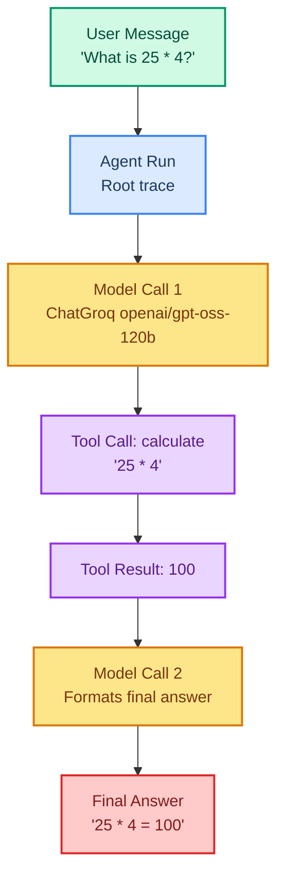

# Observability: Tracing and Debugging with LangSmith

> **Goal:** Learn how to trace, inspect, and debug LangChain agent runs using the free tier of LangSmith.  
> **Previous chapter:** [27 - LangGraph Orchestration](./27-langgraph-orchestration.md)  
> **Next chapter:** [29 - Agent Evaluation](./29-agent-evaluation.md)

---

## What Is Observability?

When an agent runs, a lot happens behind the scenes:

- The model is called one or more times
- Tools are called in a certain order
- Tokens are consumed (costs money)
- Errors can occur at any step

**Observability** means you can *see* all of this after (or during) the run. Without it, an agent is a black box — you only see what comes out, not what happened inside.

**LangSmith** is LangChain's official tool for tracing, debugging, and evaluating agents. It has a **free developer tier** that is more than enough for this course.

> Official docs: <https://docs.smith.langchain.com/> and <https://docs.langchain.com/observability>

---

## The Tracing Flow

When you enable LangSmith tracing, every agent step is captured as a **run** in a tree structure:



Each box is a **run**. The full tree is a **trace**. One user request = one trace with many child runs.

---

## Setting Up LangSmith (Free Tier)

### Step 1: Create a free account

Go to <https://smith.langchain.com/> and sign up. The free developer tier gives you 5,000 traces per month — plenty for learning.

### Step 2: Get your API key

After signing in, go to **Settings → API Keys** and create a new API key. Copy it — you will not see it again.

### Step 3: Set environment variables

Create or update your `.env` file:

```bash
# .env
GROQ_API_KEY=your_groq_key_here
LANGSMITH_TRACING=true
LANGSMITH_API_KEY=your_langsmith_key_here
LANGSMITH_PROJECT=my-first-agent-course
```

That's it. With `LANGSMITH_TRACING=true`, LangChain will **automatically** send every run to LangSmith. No code changes needed.

### Step 4: Install the packages

```bash
pip install -U langchain langchain-groq langsmith
```

---

## Automatic Tracing (Zero Code Changes)

Once the environment variables are set, **any** LangChain call is traced automatically:

```python
from dotenv import load_dotenv
load_dotenv()

from langchain_groq import ChatGroq

llm = ChatGroq(model="openai/gpt-oss-120b", temperature=0)

# This single call creates a trace in LangSmith
response = llm.invoke("Say hello in 5 words.")
print(response.content)
```

Run it, then open <https://smith.langchain.com/>. You will see a trace for the call, including:

- The model name (`openai/gpt-oss-120b`)
- Input prompt and output text
- Token usage (prompt tokens, completion tokens, total)
- Latency (how long the call took)
- Cost estimate

---

## Tracing a Full Agent Run

Now let's trace an agent with tools. Every model call and every tool call will show up in the trace tree:

```python
from dotenv import load_dotenv
load_dotenv()

from langchain_groq import ChatGroq
from langchain.tools import tool
from langchain.agents import create_agent


@tool
def calculate(expression: str) -> str:
    """Calculate a math expression like '2 + 2' or '15 * 7'."""
    try:
        return str(eval(expression, {"__builtins__": {}}, {}))
    except Exception as e:
        return f"Error: {e}"


@tool
def get_word_length(word: str) -> str:
    """Return the number of characters in a word."""
    return f"The word '{word}' has {len(word)} characters."


llm = ChatGroq(model="openai/gpt-oss-120b", temperature=0)

agent = create_agent(
    model=llm,
    tools=[calculate, get_word_length],
)

# This run will produce a full trace tree in LangSmith
result = agent.invoke(
    "First calculate 42 * 17, then tell me the length of the word 'LangChain'."
)

print(result["messages"][-1].content)
```

After running, open the trace in LangSmith. You will see a tree like:

```
Agent Run
├── Model Call 1 (decides to call calculate)
├── Tool Call: calculate("42 * 17")
├── Model Call 2 (decides to call get_word_length)
├── Tool Call: get_word_length("LangChain")
└── Model Call 3 (final answer combining both results)
```

### Extracting the trace URL

You can grab a direct link to the trace so you can share it or save it in a bug report:

```python
from langchain_core.tracers.context import collect_v

# Run the agent inside a context that collects the run tree
with collect_v() as runs:
    agent.invoke("What is 10 + 20?")

# The latest run is the root of your trace
root_run = runs[0]
print(f"Trace URL: https://smith.langchain.com/runs/{root_run.id}")
```

---

## Inspecting a Trace

Open a trace in LangSmith. You will see tabs:

| Tab | What you see |
|-----|--------------|
| **Run Tree** | The full tree of model and tool calls |
| **Inputs / Outputs** | Exactly what went in and came out of each step |
| **Metadata** | Model name, token usage, latency, tags |
| **Error** | If the run failed, the full error stack |
| **Usage** | Token counts and cost for the whole trace |

### Reading token usage

In the **Usage** tab you will see numbers like:

- `input_tokens: 320`
- `output_tokens: 48`
- `total_tokens: 368`
- `total_cost_usd: 0.0001`

This is how you track how expensive each agent run is.

---

## Debugging a Failed Run

When an agent fails, the trace tells you exactly **which** step broke and **why**.

```python
from dotenv import load_dotenv
load_dotenv()

from langchain_groq import ChatGroq
from langchain.tools import tool
from langchain.agents import create_agent


@tool
def risky_divide(a: str, b: str) -> str:
    """Divide a by b. Inputs must be numbers."""
    try:
        return str(float(a) / float(b))
    except ZeroDivisionError:
        raise ValueError("Cannot divide by zero!")
    except ValueError as e:
        return f"Bad input: {e}"


llm = ChatGroq(model="openai/gpt-oss-120b", temperature=0)
agent = create_agent(model=llm, tools=[risky_divide])

# The agent will try to divide by zero — the error will show in the trace
result = agent.invoke("Divide 100 by 0.")
print(result["messages"][-1].content)
```

In LangSmith, the `risky_divide` run will be **red** (failed). Click it and you will see:

- The exact inputs the model passed to the tool
- The full Python traceback
- Which model call came before the bad tool call

This is *much* faster than adding `print()` statements everywhere.

---

## Cost Tracking

LangSmith tracks token usage on every trace, so you can see exactly how much each agent run costs.

To compute costs yourself in code:

```python
from dotenv import load_dotenv
load_dotenv()

from langchain_groq import ChatGroq

llm = ChatGroq(model="openai/gpt-oss-120b", temperature=0)

response = llm.invoke("List 3 planets.")

usage = response.usage_metadata
print(usage)
# {'input_tokens': 12, 'output_tokens': 30, 'total_tokens': 42}
```

To see all costs for a project, go to **LangSmith → your project → Usage**. You will see:

- Total traces this month
- Total tokens used
- Estimated total cost
- Cost broken down per day

---

## Tagging Runs for Organization

When you have many traces, tags help you filter them. Pass `tags` to any invoke:

```python
from dotenv import load_dotenv
load_dotenv()

from langchain_groq import ChatGroq
from langchain.tools import tool
from langchain.agents import create_agent


@tool
def calculate(expression: str) -> str:
    """Calculate a math expression."""
    try:
        return str(eval(expression, {"__builtins__": {}}, {}))
    except Exception as e:
        return f"Error: {e}"


llm = ChatGroq(model="openai/gpt-oss-120b", temperature=0)
agent = create_agent(model=llm, tools=[calculate])

# Tag this run as a math test
agent.invoke(
    "What is 7 * 8?",
    config={"tags": ["math", "quick-test"], "metadata": {"user": "student1"}},
)
```

In LangSmith you can filter traces by tag (`math`) or metadata (`user=student1`).

---

## Adding Metadata for Context

Metadata is great for linking traces to real-world things like a user ID:

```python
agent.invoke(
    "Summarize the weather today.",
    config={
        "metadata": {
            "user_id": "u_42",
            "session_id": "s_99",
            "environment": "dev",
        }
    },
)
```

Now you can search LangSmith for `user_id = "u_42"` and see everything that user did.

---

## Naming Your Traces

By default traces have a generic name like `ChatGroq`. Give them friendly names with `run_name`:

```python
llm = ChatGroq(model="openai/gpt-oss-120b", temperature=0)

response = llm.invoke(
    "Say hi.",
    config={"run_name": "GreetingModel", "tags": ["greeting"]},
)
```

Your trace will show up as `GreetingModel` instead of `ChatGroq`.

---

## Streaming with Tracing

Tracing works with streaming too — the trace only finalizes when the stream completes:

```python
from dotenv import load_dotenv
load_dotenv()

from langchain_groq import ChatGroq

llm = ChatGroq(model="openai/gpt-oss-120b", temperature=0)

# Stream and trace at the same time
for chunk in llm.stream("Count to 5 slowly.", config={"tags": ["stream-demo"]}):
    print(chunk.content, end="", flush=True)
print()
```

---

## Connecting Evaluation (Preview)

Chapter 29 covers evaluation in depth, but here is a quick preview — you can pull traces into a dataset for later testing:

1. In LangSmith, open a trace you like
2. Click **Add to Dataset**
3. Give the dataset a name (e.g. `math-agent-tests`)

You can now reuse that example to test future versions of your agent. More on this in the next chapter.

---

## Common Mistakes

### 1. Forgetting to set `LANGSMITH_TRACING=true`

If traces don't show up, this is usually why. The variable must be set **before** your script runs. Check your `.env` and use `load_dotenv()` first.

### 2. Using the wrong API key

LangSmith has a separate key from Groq. Make sure `LANGSMITH_API_KEY` is the one from <https://smith.langchain.com/>, not your Groq key.

### 3. Tracing production by accident

The free tier is for development. For production, use the paid tier or self-hosting. Set `LANGSMITH_TRACING=false` in production test scripts that you don't want traced.

### 4. Ignoring trace URL when asking for help

When you post a question about a failing agent on the forum, **include the trace URL**. Reviewers can see exactly what happened.

### 5. Sending secrets in prompts

Everything in the prompt goes into LangSmith. Never put real passwords, API keys, or customer PII into a traced prompt. Use placeholders like `<API_KEY>` instead.

---

## Try It Yourself

1. Set up LangSmith with the free tier and run the simple `llm.invoke("Hello")` example. Confirm the trace shows up in the dashboard.

2. Build an agent with two tools (`calculate` and `get_word_length`) and trace a multi-step request. Count how many model calls the trace contains.

3. Intentionally break a tool (make it raise an exception on bad input). Find the failed run in LangSmith and copy the error message from the trace.

4. Add a `metadata` field with `user_id="me"` to 5 different runs, then filter LangSmith by that `user_id` to see only your runs.

5. Use `response.usage_metadata` to print the token usage of a model call, then compare it with the number shown in the LangSmith trace — they should match.

---

## What You Learned

- What observability is and why agents need it
- How to set up LangSmith's free developer tier
- How `LANGSMITH_TRACING=true` enables automatic tracing with no code changes
- How to inspect a trace tree: model calls, tool calls, inputs, outputs
- How to debug a failing run using the red failed-run view
- How to track token usage and cost per run
- How to use tags, metadata, and run names to organize traces
- How streaming and tracing work together
- How to save traces as datasets for evaluation (preview of chapter 29)

---

## Next Steps

Now that you can **see** what your agent does, let's learn how to **measure** whether it does it *correctly*.

Go to: [29 - Agent Evaluation](./29-agent-evaluation.md)