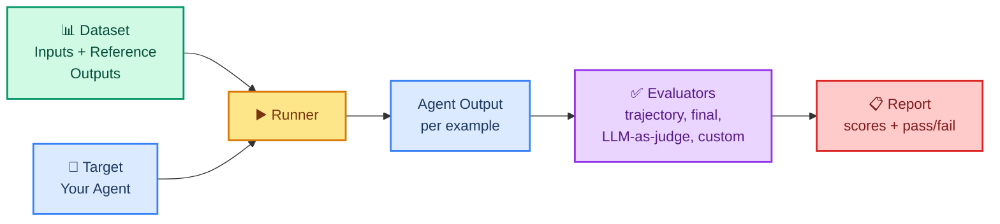

# Agent Evaluation: Measuring Quality and Correctness

> **Goal:** Learn how to measure whether your agent is actually doing a good job using LangSmith datasets, evaluators, and LLM-as-judge.  
> **Previous chapter:** [28 - Observability with LangSmith](./28-observability-langsmith.md)  
> **Next chapter:** [30 - Performance Optimization](./30-performance-optimization.md)

---

## Why Evaluation Matters

Tracing (chapter 28) tells you **what happened**. Evaluation tells you **whether it was good**.

Without evaluation you cannot answer questions like:

- Did my agent call the right tools?
- Did it call tools in the right **order**?
- Is the final answer correct?
- Did my new prompt make the agent better or worse?

If you change a prompt, swap a tool, or upgrade a model, you are flying blind without evaluation. Evaluation turns agent development from guessing into measurement.

> Official docs: <https://docs.smith.langchain.com/evaluation> and <https://docs.langchain.com/evaluation>

---

## The Evaluation Pipeline

Evaluation has three parts:

1. **Dataset** — Example inputs and the expected (reference) outputs
2. **Target** — Your agent (the thing you're testing)
3. **Evaluators** — Functions that score each agent output against the reference

LangSmith runs all three and gives you a report.



---

## Step 1: Create a Dataset

A **dataset** is a list of **examples**. Each example has an input and (usually) a reference output.

You can create datasets in the LangSmith UI by clicking **Datasets → New Dataset**, or in code:

```python
from dotenv import load_dotenv
load_dotenv()

from langsmith import Client

client = Client()

# Create a dataset
dataset = client.create_dataset(
    name="math-agent-baseline",
    description="Basic math questions for the agent course",
)

# Add a few examples
client.create_examples(
    dataset_id=dataset.id,
    inputs=[
        {"question": "What is 7 * 8?"},
        {"question": "What is 100 - 45?"},
        {"question": "What is the length of the word 'LangChain'?"},
    ],
    outputs=[
        {"answer": "56"},
        {"answer": "55"},
        {"answer": "9"},
    ],
)
```

The `inputs` are what you give the agent. The `outputs` are the **reference** (the correct expected answer) that evaluators compare against.

---

## Step 2: Define the Target

The **target** is a function that takes an example's inputs and returns an output. Usually this wraps your agent:

```python
from dotenv import load_dotenv
load_dotenv()

from langchain_groq import ChatGroq
from langchain.tools import tool
from langchain.agents import create_agent


@tool
def calculate(expression: str) -> str:
    """Calculate a math expression like '7 * 8'."""
    try:
        return str(eval(expression, {"__builtins__": {}}, {}))
    except Exception as e:
        return f"Error: {e}"


@tool
def get_word_length(word: str) -> str:
    """Return the number of characters in a word."""
    return str(len(word))


llm = ChatGroq(model="openai/gpt-oss-120b", temperature=0)
agent = create_agent(model=llm, tools=[calculate, get_word_length])


def target(inputs: dict) -> dict:
    """Run the agent on a dataset example."""
    result = agent.invoke(inputs["question"])
    return {"answer": result["messages"][-1].content}
```

The target receives the `inputs` dict from the dataset and returns a dict whose keys must match the `outputs` (reference) keys.

---

## Step 3: Define Evaluators

An evaluator is a function that takes the run's prediction, the reference, and the inputs, and returns a score.

### Custom Python evaluator

The simplest evaluator is plain Python. It scores `1` for pass and `0` for fail:

```python
from langsmith.schemas import Example, Run


def exact_match_evaluator(run: Run, example: Example) -> dict:
    """Score 1 if the agent's answer equals the reference answer."""
    prediction = run.outputs.get("answer", "").strip()
    reference = example.outputs.get("answer", "").strip()

    # Check whether the reference string appears in the prediction
    passed = reference in prediction
    return {"key": "exact_match", "score": int(passed)}
```

### LLM-as-judge evaluator

When exact matching is too strict (the agent might say "The answer is 56" instead of just "56"), use the model itself as a judge:

```python
from langchain_groq import ChatGroq
from langsmith.schemas import Example, Run

judge_llm = ChatGroq(model="openai/gpt-oss-120b", temperature=0)


def llm_judge_evaluator(run: Run, example: Example) -> dict:
    """Use the model to judge whether the answer is correct."""
    prediction = run.outputs.get("answer", "")
    reference = example.outputs.get("answer", "")
    question = example.inputs.get("question", "")

    prompt = f"""You are grading an agent's answer.

Question: {question}
Reference answer: {reference}
Agent's answer: {prediction}

Reply with only one word: CORRECT or INCORRECT.
"""
    verdict = judge_llm.invoke(prompt).content.strip().upper()
    passed = "CORRECT" in verdict
    return {"key": "llm_judge", "score": int(passed), "comment": verdict}
```

Always use a low `temperature` (0) for the judge so the verdict is consistent.

---

## Step 4: Run the Evaluation

Now plug the dataset, target, and evaluators together:

```python
from dotenv import load_dotenv
load_dotenv()

from langsmith import Client
from langsmith.evaluation import evaluate

client = Client()


def target(inputs: dict) -> dict:
    # ... your agent call from Step 2 ...
    result = agent.invoke(inputs["question"])
    return {"answer": result["messages"][-1].content}


results = evaluate(
    target,
    data="math-agent-baseline",          # dataset name
    evaluators=[exact_match_evaluator, llm_judge_evaluator],
    experiment_prefix="math-agent-v1",   # label for this run
)

# results.summary() shows pass/fail counts
```

LangSmith will run your target on every example, run every evaluator on every output, and produce a report you can open in the dashboard.

---

## Trajectory Evaluation (Tools Used + Order)

So far we evaluated only the **final answer**. But agents also have a **trajectory** — the sequence of tool calls.

Trajectory evaluation answers: *did the agent use the right tools in the right order?*

```python
from langchain_core.messages import AIMessage
from langsmith.schemas import Example, Run


def trajectory_evaluator(run: Run, example: Example) -> dict:
    """Check that the agent called exactly the expected tools, in order."""
    expected_tools = ["calculate"]  # what we expect for this question

    # Walk the run tree and pull out tool-call names
    actual_tools = []
    for msg in run.inputs.get("messages", []) or []:
        if isinstance(msg, AIMessage) and getattr(msg, "tool_calls", None):
            for tc in msg.tool_calls:
                actual_tools.append(tc["name"])

    # In a real run you would inspect run.outputs for the trajectory too
    passed = actual_tools == expected_tools
    return {
        "key": "trajectory_match",
        "score": int(passed),
        "comment": f"expected={expected_tools} got={actual_tools}",
    }
```

A complete trajectory evaluator checks:

1. **Tool choice** — did it call the right tools?
2. **Tool order** — did it call them in the right order?
3. **Tool arguments** — did it pass sensible inputs to each tool?
4. **No extra calls** — did it avoid wasted tool calls?

---

## The Full Pipeline Together

Putting dataset, target, trajectory evaluator, final-answer evaluator, and LLM-judge all together:

```python
from dotenv import load_dotenv
load_dotenv()

from langchain_groq import ChatGroq
from langchain.tools import tool
from langchain.agents import create_agent
from langsmith import Client
from langsmith.evaluation import evaluate
from langsmith.schemas import Example, Run


# --- Tools and agent ---
@tool
def calculate(expression: str) -> str:
    """Calculate a math expression like '7 * 8'."""
    try:
        return str(eval(expression, {"__builtins__": {}}, {}))
    except Exception as e:
        return f"Error: {e}"


@tool
def get_word_length(word: str) -> str:
    """Return how many characters the word has."""
    return str(len(word))


llm = ChatGroq(model="openai/gpt-oss-120b", temperature=0)
agent = create_agent(model=llm, tools=[calculate, get_word_length])


# --- Dataset (created once) ---
client = Client()
dataset = client.create_dataset(name="agent-eval-demo")
client.create_examples(
    dataset_id=dataset.id,
    inputs=[
        {"question": "What is 6 * 7?"},
        {"question": "How long is the word 'apple'?"},
    ],
    outputs=[
        {"answer": "42"},
        {"answer": "5"},
    ],
)


# --- Target ---
def target(inputs: dict) -> dict:
    result = agent.invoke(inputs["question"])
    return {"answer": result["messages"][-1].content}


# --- Evaluators ---
def exact_match(run: Run, example: Example) -> dict:
    pred = run.outputs.get("answer", "").strip()
    ref = example.outputs.get("answer", "").strip()
    return {"key": "exact_match", "score": int(ref in pred)}


judge_llm = ChatGroq(model="openai/gpt-oss-120b", temperature=0)


def llm_judge(run: Run, example: Example) -> dict:
    pred = run.outputs.get("answer", "")
    ref = example.outputs.get("answer", "")
    q = example.inputs.get("question", "")
    prompt = (
        f"Question: {q}\nReference: {ref}\nAgent answer: {pred}\n"
        "Reply with only one word: CORRECT or INCORRECT."
    )
    verdict = judge_llm.invoke(prompt).content.strip().upper()
    return {
        "key": "llm_judge",
        "score": int("CORRECT" in verdict),
        "comment": verdict,
    }


# --- Run evaluation ---
evaluate(
    target,
    data="agent-eval-demo",
    evaluators=[exact_match, llm_judge],
    experiment_prefix="agent-eval-v1",
)
```

Open the LangSmith dashboard to see a table of every example with pass/fail for each evaluator.

---

## Regression Testing in CI

Once you have a dataset and evaluators, you can run them in your CI pipeline to catch regressions automatically.

A simple example using `pytest`:

```python
# tests/test_agent_eval.py
import pytest
from langsmith import Client
from langsmith.evaluation import evaluate

from my_agent import target, exact_match, llm_judge   # your code


@pytest.mark.ci
def test_agent_passes_baseline():
    """Fail CI if the agent scores below 80% on the baseline dataset."""
    client = Client()
    results = evaluate(
        target,
        data="math-agent-baseline",
        evaluators=[exact_match, llm_judge],
        experiment_prefix="ci",
    )

    # Pull summary statistics and assert a pass threshold
    df = results.to_pandas()
    avg_score = df["score"].mean()
    assert avg_score >= 0.80, f"Agent quality dropped: {avg_score:.0%}"
```

Now every pull request automatically verifies the agent did not get worse.

---

## Human Annotation

Numbers are great, but humans catch things code does not — tone, missing context, helpfulness. LangSmith lets you collect **human feedback**:

```python
from langsmith import Client

client = Client()

# Suppose you have a run_id from a traced run
run_id = "..."  # paste a real run id from the dashboard

# Add human feedback (1 = good, 0 = bad)
client.create_feedback(
    run_id=run_id,
    key="human_helpfulness",
    score=1,
    comment="Answer was clear and concise.",
)
```

In the dashboard, you can also annotate runs by hand: open a trace, click **Add Feedback**, and mark it as helpful or not. Over time this builds a labeled corpus you can reuse for fine-tuning or better evaluators.

---

## Common Mistakes

### 1. Evaluating only the final answer

The agent can produce the right answer for the wrong reasons (lucky guess, wrong tool). Always add a trajectory evaluator too.

### 2. Making the LLM judge too strict

A judge that rejects "56" because the reference was "The answer is 56" will tank your real score. Tell the judge to be lenient about formatting.

### 3. Using a different judge model than your agent

You can, but be consistent. If your agent uses `openai/gpt-oss-120b`, use the same model as judge so its notion of "correct" matches the agent's style.

### 4. Tiny datasets

A dataset with 2 examples cannot detect regressions. Aim for at least 20 — 50 is better. Reuse real user questions whenever you can.

### 5. Forgetting to version your dataset

When you add examples, create a new dataset version (`math-agent-v2`) instead of editing the old one. Otherwise you cannot compare old vs new runs fairly.

---

## Try It Yourself

1. Create a dataset called `word-agent-baseline` with 5 questions about word lengths. Add reference answers in the `outputs`.

2. Write a custom evaluator that checks the **length only** (extract any number out of the answer and compare to the reference length). Run the evaluation.

3. Add an LLM-judge evaluator that is lenient about formatting. Compare the scores from the strict custom evaluator vs the lenient judge.

4. Add a trajectory evaluator that fails if the agent calls a tool it didn't need to.

5. Set a CI threshold of 70% and then deliberately break one tool so the score drops. Confirm your CI test fails.

---

## What You Learned

- Why evaluation matters for agents (not just models)
- The three parts of an eval pipeline: dataset, target, evaluators
- How to create a LangSmith dataset in code
- How to write a custom Python evaluator
- How to use LLM-as-judge for lenient grading
- How to do **trajectory evaluation** (right tools, right order)
- How to run the full evaluation and read the report
- How to add regression testing in CI with pass thresholds
- How to collect human annotation feedback

---

## Next Steps

Now that you can measure quality, let's make the agent **fast and cheap** without losing quality.

Go to: [30 - Performance Optimization](./30-performance-optimization.md)