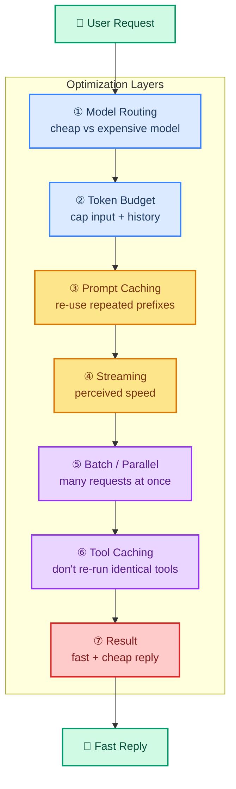

# Performance: Making Agents Fast and Cost-Effective

> **Goal:** Learn practical techniques to make LangChain agents faster, cheaper, and lighter on tokens without losing quality.  
> **Previous chapter:** [29 - Agent Evaluation](./29-agent-evaluation.md)  
> **Next chapter:** [31 - Security Overview](./31-security-overview.md)

---

## Why Performance Matters

A slow agent is a bad agent. If the user waits 30 seconds for a reply, they will assume it's broken. And every token costs money — a chatty agent can quietly burn through your budget.

Performance work has three goals:

1. **Latency** — make the agent reply faster
2. **Cost** — use fewer tokens per request
3. **Perceived speed** — make the reply *feel* fast even when it isn't

You will rarely get all three perfectly. The trick is layering techniques.

> Official docs: <https://docs.langchain.com/observability> and <https://python.langchain.com/docs/concepts/streaming/>

---

## The Performance Optimization Layers

Think of optimization as a stack. Apply techniques top-down, then measure:



We'll work through each layer with runnable code.

---

## ① Model Routing: Right Model for the Job

Not every step needs the big model. Use a **cheap/fast** model for simple steps (classification, formatting, extraction) and the **powerful** model for hard steps (reasoning, tool choice).

With Groq you only configure one model in this course (`openai/gpt-oss-120b`), but you can still route by **temperature** and **max_tokens** to control cost and speed:

```python
from dotenv import load_dotenv
load_dotenv()

from langchain_groq import ChatGroq


# Cheap & fast for classification: low tokens, zero creativity
classifier = ChatGroq(
    model="openai/gpt-oss-120b",
    temperature=0,
    max_tokens=5,        # tiny reply = fast + cheap
)

# Full power for actual reasoning
reasoner = ChatGroq(
    model="openai/gpt-oss-120b",
    temperature=0,
    max_tokens=1024,     # enough for a real answer
)


def route_and_answer(question: str) -> str:
    """Classify simple questions, give full power to hard ones."""
    category = classifier.invoke(
        f"Is this a simple greeting? Reply YES or NO: {question}"
    ).content.strip().upper()

    if "YES" in category:
        return classifier.invoke(
            f"Reply with one short sentence: {question}"
        ).content
    return reasoner.invoke(question).content


print(route_and_answer("Hi there!"))                    # fast path
print(route_and_answer("Explain how transformers work.")) # full path
```

Routing by `max_tokens` alone is a small win, but cuts latency and cost on the easy path dramatically.

---

## ② Token Budget Management

Every token you send the model is paid for. Control the budget with three rules:

1. **Trim old messages** so the context window doesn't grow forever
2. **Set `max_tokens`** so the model can't run off
3. **Summarize history** instead of replaying every message

```python
from langchain_groq import ChatGroq
from langchain.agents import create_agent
from langchain.agents.middleware import SummarizeSummaryMiddleware
from langchain_core.messages import SystemMessage

# Cap output tokens
llm = ChatGroq(model="openai/gpt-oss-120b", temperature=0, max_tokens=512)

# Summarize history after a few turns to keep context small
agent = create_agent(
    model=llm,
    tools=[],
    middleware=[
        SummarizeSummaryMiddleware(
            model=llm,                        # model used to summarize
            max_messages_before_summary=6,    # summarize after 6 messages
            max_summary_messages=2,           # keep summary to ~2 messages
        ),
    ],
)

# A long fake history to show trimming
history = [
    SystemMessage(content="You are a helpful assistant."),
] + [
    SystemMessage(content=f"turn {i}: user asked something, you answered.")
    for i in range(20)
]

result = agent.invoke({"messages": history + [SystemMessage(content="Say hi.")]})
print(f"Final context messages kept: {len(result['messages'])}")
```

Rule of thumb: if your context grows past ~10k tokens, you are paying too much.

---

## ③ Prompt Caching

If your agent always starts with the same big system prompt, the **prompt prefix** is identical across runs. Some providers cache that prefix so you don't pay to reprocess it.

```python
from dotenv import load_dotenv
load_dotenv()

from langchain_groq import ChatGroq

SYSTEM_PROMPT = """
You are a math tutor for beginners.
Explain every step in simple words.
Always end with the final number on its own line like: ANSWER: 42
""" * 3  # padded to make the prefix non-trivial

llm = ChatGroq(model="openai/gpt-oss-120b", temperature=0)

# First call — pays full price
r1 = llm.invoke([{"role": "system", "content": SYSTEM_PROMPT},
                 {"role": "user", "content": "What is 9 * 9?"}])
print("Run 1 tokens:", r1.usage_metadata)

# Second call with the SAME prefix — much cheaper if the provider caches it
r2 = llm.invoke([{"role": "system", "content": SYSTEM_PROMPT},
                 {"role": "user", "content": "What is 12 * 12?"}])
print("Run 2 tokens:", r2.usage_metadata)
```

Check the `usage_metadata` of the second call — if your provider supports prefix caching, you'll see a smaller `input_tokens` count or a `cached_tokens` field.

> Tip: keep your system prompt **stable** across runs. Even small edits to the prefix disable the cache.

---

## ④ Streaming for Perceived Speed

Streaming doesn't make the request faster, but it makes it **feel** faster because the user sees the first token almost immediately:

```python
from dotenv import load_dotenv
load_dotenv()

from langchain_groq import ChatGroq

llm = ChatGroq(model="openai/gpt-oss-120b", temperature=0)

print("Assistant: ", end="", flush=True)
for chunk in llm.stream("Explain recursion in 3 short sentences."):
    print(chunk.content, end="", flush=True)
print()  # newline at the end
```

Time-to-first-token (TTFT) matters more than total time for most users. Streaming drops perceived latency from "waiting 5 seconds" to "it started talking instantly."

For a full agent with streaming events, use the agent stream API:

```python
from langchain.agents import create_agent
from langchain.tools import tool


@tool
def calculate(expression: str) -> str:
    """Calculate a math expression."""
    try:
        return str(eval(expression, {"__builtins__": {}}, {}))
    except Exception as e:
        return f"Error: {e}"


agent = create_agent(
    model=ChatGroq(model="openai/gpt-oss-120b", temperature=0),
    tools=[calculate],
)

# Stream agent events so users see progress in real time
for event in agent.stream(
    {"messages": [{"role": "user", "content": "What is 32 * 11?"}]},
    stream_mode="updates",
):
    for key, value in event.items():
        print(f"[{key}] {str(value)[:80]}")
```

---

## ⑤ Parallel and Batch Tool Calls

If the user asks three independent questions, run them at the same time instead of one after another.

### Batch processing

```python
from dotenv import load_dotenv
load_dotenv()

from langchain_groq import ChatGroq

llm = ChatGroq(model="openai/gpt-oss-120b", temperature=0)

questions = [
    "What is 2 + 2?",
    "What is 5 * 5?",
    "What is 100 / 4?",
]

# Batch: one call sends all prompts and returns a list of responses
responses = llm.batch(
    [{"role": "user", "content": q} for q in questions]
)

for q, r in zip(questions, responses):
    print(f"{q} -> {r.content.strip()}")
```

### Parallel tool calls

If your model asks for multiple tool calls in one round, LangChain runs them concurrently:

```python
from langchain_groq import ChatGroq
from langchain.tools import tool
from langchain.agents import create_agent
import time


@tool
def get_city_population(city: str) -> str:
    """Return the population of a city (mock data)."""
    time.sleep(1)  # pretend this is a slow API
    return {"paris": "2.1M", "tokyo": "13.9M", "nyc": "8.3M"}.get(
        city.lower(), "unknown"
    )


llm = ChatGroq(model="openai/gpt-oss-120b", temperature=0)
agent = create_agent(model=llm, tools=[get_city_population])

start = time.time()
result = agent.invoke(
    "Give me the populations of Paris, Tokyo, and New York, all at once."
)
elapsed = time.time() - start

print(result["messages"][-1].content)
print(f"\nTotal time: {elapsed:.2f}s")
```

If the model groups all three into one batched tool call, the total is ~1s. If it called them one at a time, total would be ~3s.

---

## ⑥ Caching Tool Results

If a tool returns the same answer for the same input every time (a lookup, a constant), cache it so you never run it twice:

```python
from functools import lru_cache
from langchain.tools import tool


@lru_cache(maxsize=128)
def _lookup_country(code: str) -> str:
    # Pretend this is an expensive API call
    return {"US": "United States", "IN": "India", "JP": "Japan"}.get(
        code.upper(), "Unknown"
    )


@tool
def get_country(code: str) -> str:
    """Return the country name for a country code (US, IN, JP)."""
    return _lookup_country(code)
```

`lru_cache` memoizes by argument — the second identical call returns instantly from memory instead of hitting your backend.

---

## ⑦ Latency Profiling

Before optimizing, **measure**. Use LangSmith traces (chapter 28) to see which step is slow. In code, time each block:

```python
import time
from dotenv import load_dotenv
load_dotenv()

from langchain_groq import ChatGroq
from langchain.tools import tool
from langchain.agents import create_agent


@tool
def calculate(expression: str) -> str:
    """Calculate a math expression."""
    try:
        return str(eval(expression, {"__builtins__": {}}, {}))
    except Exception as e:
        return f"Error: {e}"


llm = ChatGroq(model="openai/gpt-oss-120b", temperature=0)
agent = create_agent(model=llm, tools=[calculate])

start = time.time()
result = agent.invoke("What is 17 * 23?")
total = time.time() - start

# Per-step breakdown from the final message list
print(f"Total wall time: {total:.2f}s")
print(f"Messages in trace: {len(result['messages'])}")
print(f"Output: {result['messages'][-1].content}")
```

Open the LangSmith trace for the same run and you'll see per-step latency: model call 1, tool call, model call 2 — each with its own duration.

---

## Cost-Per-Request Tracking

Aggregate token usage across a whole agent run, not just a single LLM call:

```python
import time
from dotenv import load_dotenv
load_dotenv()

from langchain_groq import ChatGroq
from langchain.tools import tool
from langchain.agents import create_agent
from langchain_core.messages import AIMessage


@tool
def calculate(expression: str) -> str:
    """Calculate a math expression."""
    try:
        return str(eval(expression, {"__builtins__": {}}, {}))
    except Exception as e:
        return f"Error: {e}"


llm = ChatGroq(model="openai/gpt-oss-120b", temperature=0)
agent = create_agent(model=llm, tools=[calculate])

result = agent.invoke("What is 88 / 4 plus 12?")

# Sum tokens across all model responses in the run
total_input = 0
total_output = 0
for msg in result["messages"]:
    if isinstance(msg, AIMessage) and msg.usage_metadata:
        total_input += msg.usage_metadata.get("input_tokens", 0)
        total_output += msg.usage_metadata.get("output_tokens", 0)

print(f"Input tokens (whole run):  {total_input}")
print(f"Output tokens (whole run): {total_output}")
print(f"Total tokens (whole run):  {total_input + total_output}")
```

Track this number over time. When it spikes, you have a regression.

---

## Context Window Optimization

Big contexts cost more and slow things down. Three quick rules:

### 1. Drop unused tool definitions

Only bind the tools the agent actually needs for this turn:

```python
# Good: only bind the math tool when we know it's a math question
math_agent = create_agent(model=llm, tools=[calculate])
general_agent = create_agent(model=llm, tools=[])

def smart_route(q: str):
    if any(op in q for op in "+-*/"):
        return math_agent.invoke(q)
    return general_agent.invoke(q)
```

Every tool you bind adds tokens to every prompt. Less is more.

### 2. Trim the message list

Keep only the last N messages plus the system prompt:

```python
from langchain_core.messages import SystemMessage, HumanMessage

def trim(messages: list, keep_last: int = 6) -> list:
    if len(messages) <= keep_last + 1:
        return messages
    system = [m for m in messages if isinstance(m, SystemMessage)]
    recent = messages[-keep_last:]
    return system + recent

messages = [SystemMessage(content="hi")] + [HumanMessage(content=str(i)) for i in range(50)]
print(len(trim(messages)))  # 7
```

### 3. Summarize instead of replaying

Use `SummarizeSummaryMiddleware` (shown in section ②). A 3-line summary replaces a 50-message thread.

---

## Putting It All Together

A real optimized agent combines every layer:

```python
import time
from functools import lru_cache
from dotenv import load_dotenv
load_dotenv()

from langchain_groq import ChatGroq
from langchain.tools import tool
from langchain.agents import create_agent


# ⑥ Cached tool
@lru_cache(maxsize=64)
def _lookup(code: str) -> str:
    return {"US": "United States", "IN": "India", "JP": "Japan"}.get(
        code.upper(), "Unknown"
    )


@tool
def get_country(code: str) -> str:
    """Return the country name for a country code."""
    return _lookup(code)


@tool
def calculate(expression: str) -> str:
    """Calculate a math expression."""
    try:
        return str(eval(expression, {"__builtins__": {}}, {}))
    except Exception as e:
        return f"Error: {e}"


# ② Cheap output budget to force short replies
fast_llm = ChatGroq(model="openai/gpt-oss-120b", temperature=0, max_tokens=256)

# ① + Caching prefix: same system prompt on every call
SYSTEM = (
    "You are a fast, concise assistant. "
    "Use tools when useful. Answer in one short paragraph max."
)

agent = create_agent(
    model=fast_llm,
    tools=[calculate, get_country],
    prompt=SYSTEM,           # stable prefix for ③ prompt caching
)

# ⑦ Profile + ④ Stream
start = time.time()
print("Assistant: ", end="", flush=True)
for event in agent.stream(
    {"messages": [{"role": "user", "content": "Population of IN times 2 plus 5?"}]},
    stream_mode="updates",
):
    for k, v in event.items():
        print(f"[{k}] {str(v)[:60]}", end=" ", flush=True)
print()
print(f"\nTotal time: {time.time() - start:.2f}s")
```

---

## Common Mistakes

### 1. Optimizing before measuring

You'll waste effort on the wrong layer. Profile first with LangSmith — fix the slowest step, then re-measure.

### 2. Letting context grow forever

A long-running chat agent accumulates messages. Without trimming or summarization, by turn 20 you're paying for every single message again every turn.

### 3. Binding every tool everywhere

10 tools × every prompt = thousands of tokens of tool JSON per turn. Bind only what the current task needs.

### 4. Disabling streaming "to make it simpler"

Streaming is one of the easiest perceived-speed wins. Always ship with it on.

### 5. Forgetting to measure total run cost

Looking at one LLM call's usage masks the truth. Sum usage across all messages in the run to see the real cost.

### 6. Over-caching

`lru_cache` on a tool that returns **time-sensitive** data (stock prices, weather) will give stale answers. Only cache tools whose answers don't change.

---

## Try It Yourself

1. Build an agent with two tools and time it with `time.time()`. Add `max_tokens=512` to the model and re-time — note the speedup.

2. Build a long fake history (30 messages), run the agent, and print total token usage. Then add `SummarizeSummaryMiddleware` and compare total tokens.

3. Use `llm.batch()` to send 5 different math questions at once. Time it vs sending them one at a time in a loop.

4. Use `lru_cache` on a mock weather tool. Call it 50 times for "Tokyo" and time the cache hits vs misses.

5. Stream an agent's response and print the time-to-first-token (`t0` before the loop, `t1` when the first chunk arrives).

6. Wrap your agent in a function that prints total input + output tokens for the whole run. Compare before and after removing one tool from the bind list.

---

## What You Learned

- The seven optimization layers: routing, budgets, caching, streaming, batching, tool caching, profiling
- How to route by capabilities like `max_tokens` to give simple tasks a cheap path
- How to manage token budgets with trimming and SummarizeSummaryMiddleware
- How prompt caching saves money on repeated prefixes
- How streaming improves perceived latency (lower TTFT)
- How batch and parallel tool calls cut wall-clock time
- How `lru_cache` cheaply caches deterministic tool results
- How to profile latency and track total cost per request
- Why you must measure before optimizing, and how to avoid over-caching

---

## Next Steps

You can now trace, evaluate, and optimize your agent. The last topic is making it **safe** to deploy in the real world.

Go to: [31 - Security Overview](./31-security-overview.md)