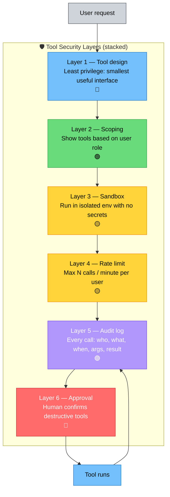
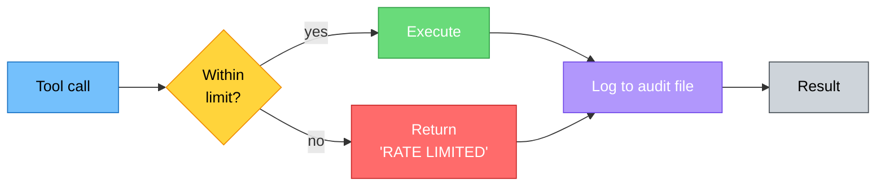
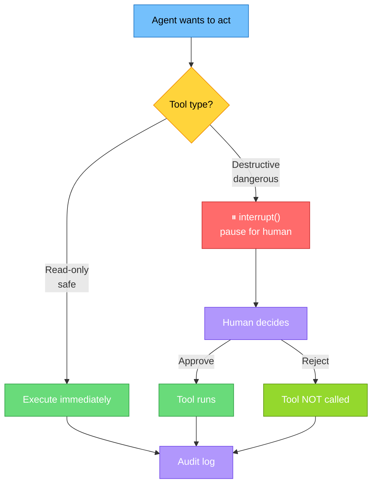

# Tool Security and Access Control

> **Lesson 33** · Previous: [32 — Prompt Injection Defense](32-prompt-injection-defense.md) · Next: [34 — Data Security and Privacy](34-data-security-privacy.md)

---

## Why This Lesson Matters

Tools are how an agent **changes the world** — it can send emails, write files, call APIs, delete rows, charge credit cards. A good tool surface is small, scoped, watched, and reversible. A bad tool surface is a loaded gun pointed at your data.

This lesson gives you the four layers of tool security: **least privilege, access control by role, rate limiting, and audit logging**, plus **human approval** for dangerous actions.

---

## Table of Contents

1. [The Principle of Least Privilege](#1-the-principle-of-least-privilege)
2. [Tool Security Layers](#2-tool-security-layers)
3. [Tool Scoping by User Role](#3-tool-scoping-by-user-role)
4. [Sandboxing Tool Execution](#4-sandboxing-tool-execution)
5. [Rate Limiting Tool Calls](#5-rate-limiting-tool-calls)
6. [Audit Logging Every Call](#6-audit-logging-every-call)
7. [Restricting Dangerous Tools + Human Approval](#7-restricting-dangerous-tools--human-approval)
8. [MCP Server Authentication](#8-mcp-server-authentication)
9. [Try It Yourself](#9-try-it-yourself)
10. [Common Mistakes](#10-common-mistakes)
11. [What You Learned](#11-what-you-learned)

---

## 1. The Principle of Least Privilege

**Least privilege** means: give an agent the **fewest tools** and the **weakest tools** that still let it do its job.

| Bad (over-permissive) | Good (least privilege) |
|-----------------------|------------------------|
| `run_sql(query)` — any SQL | `get_order_status(order_id)` — fixed query |
| `execute_code(code)` — run anything | `compute_average(numbers)` — one operation |
| `send_email(to, body)` — anyone | `send_receipt(to_address_in_db)` — only customers |
| `delete_file(path)` — any path | `archive_old_logs()` — fixed folder, fixed pattern |
| `shell(cmd)` — full shell | `list_files(folder)` — fixed folder |

The left column is **excessive agency** (OWASP LLM08). The right column is what you ship.

**Rule:** Start with **zero tools**. Add tools one at a time only when the agent genuinely cannot finish the task without them.

---

## 2. Tool Security Layers



Each layer below the top assumes the layer above **already passed**. If layer 1 (design) is bad, none of the other layers save you.

---

## 3. Tool Scoping by User Role

Not every user should see every tool. A guest should not see `delete_user`. A cashier should not see `refund_any_amount`. Build a function that returns the tools appropriate for the current user.

```python
# 33_role_scoping.py
# Run: python 33_role_scoping.py

from langchain_groq import ChatGroq
from langchain_core.tools import tool
from langchain.agents import create_agent

model = ChatGroq(model="openai/gpt-oss-120b", temperature=0)

# ---- Tools ----
@tool
def get_balance() -> str:
    """Show the current balance for the logged-in user."""
    return "Balance: $1,000"

@tool
def transfer_money(to: str, amount: float) -> str:
    """Transfer money to another account. Admins only."""
    return f"Transferred ${amount} to {to}."

@tool
def delete_account(user_id: str) -> str:
    """Permanently delete a user. Superadmin only."""
    return f"Deleted user {user_id}."

# ---- Role -> tools mapping ----
ROLE_TOOLS = {
    "guest":   [get_balance],
    "user":    [get_balance, transfer_money],
    "admin":   [get_balance, transfer_money, delete_account],
    "super":   [get_balance, transfer_money, delete_account],
}

SYSTEM_PROMPT = """You are a bank assistant.
Use only the tools given to you. If a tool is not available, refuse.
Never invent a tool or guess its result."""

def build_agent_for(role: str):
    """Return an agent with only this role's tools."""
    tools = ROLE_TOOLS.get(role, [])
    return create_agent(model=model, tools=tools, system_prompt=SYSTEM_PROMPT)

if __name__ == "__main__":
    for role in ["guest", "user", "admin"]:
        print(f"\n--- Role: {role} ---")
        agent = build_agent_for(role)
        r = agent.invoke({"messages": [
            {"role": "user", "content": "Delete user 42."}
        ]})
        print("Reply:", r["messages"][-1].content)
```

Expected: the guest sees no `delete_account` tool, so it refuses. The admin can call it. **The model never even sees the tools it is not allowed to use.**

---

## 4. Sandboxing Tool Execution

Tools should run with the **minimum environment permissions** they need. In Python, two easy sandboxing moves:

1. Run the agent under a **low-privilege OS user** (not root/admin).
2. For file tools, **restrict paths** inside the tool function. Never let a tool take an arbitrary path.

```python
# 33_sandbox_paths.py
import os
from pathlib import Path
from langchain_core.tools import tool

SAFE_DIR = Path("/tmp/agent_workspace").resolve()  # NEVER inside your home dir

@tool
def write_file(filename: str, content: str) -> str:
    """Write a text file inside the agent workspace sandbox."""
    # 1. Reject absolute paths, parent traversal, etc.
    if "/" in filename or "\\" in filename or ".." in filename:
        return "ERROR: filename must be a simple name, no folders."
    target = (SAFE_DIR / filename).resolve()
    # 2. Confirm the resolved path is still inside SAFE_DIR
    if SAFE_DIR not in target.parents and target != SAFE_DIR:
        return "ERROR: path escaped sandbox."
    target.parent.mkdir(parents=True, exist_ok=True)
    target.write_text(content, encoding="utf-8")
    return f"Saved {len(content)} bytes to {target.name}"

@tool
def read_file(filename: str) -> str:
    """Read a text file from the agent workspace sandbox."""
    if "/" in filename or ".." in filename:
        return "ERROR: unsafe filename."
    target = (SAFE_DIR / filename).resolve()
    if not target.is_file():
        return "ERROR: file does not exist."
    return target.read_text(encoding="utf-8")
```

**Key idea:** even if the model is tricked into calling `read_file("../../../../etc/passwd")`, the tool itself refuses — the model has no power the tool does not grant.

For real production workloads, run all tools in a **container** (Docker / gVisor) so even a catastrophic tool bug cannot escape.

---

## 5. Rate Limiting Tool Calls

A prompt-injected agent can loop and call a tool 1,000 times per second. A simple **sliding-window rate limiter** stops that cold.

```python
# 33_rate_limit.py
import time
from collections import defaultdict, deque
from langchain.agents.middleware import wrap_tool_call
from langchain_core.messages import AnyMessage

MAX_CALLS_PER_MINUTE = 10
WINDOW_SECONDS = 60

_per_user_calls: dict[str, deque] = defaultdict(deque)

def allow_call(user_id: str) -> bool:
    now = time.time()
    dq = _per_user_calls[user_id]
    while dq and now - dq[0] > WINDOW_SECONDS:
        dq.popleft()
    if len(dq) >= MAX_CALLS_PER_MINUTE:
        return False
    dq.append(now)
    return True

# Wrap a tool with a rate-limit guard.
from langchain_core.tools import BaseTool

def rate_limited(tool_obj: BaseTool, user_id_fn):
    original = tool_obj.func if hasattr(tool_obj, "func") else tool_obj
    def new_func(*args, **kwargs):
        uid = user_id_fn()
        if not allow_call(uid):
            return f"RATE LIMITED: too many calls. Try again in {WINDOW_SECONDS}s."
        return original(*args, **kwargs)
    tool_obj.func = new_func  # simplistic; in real code use RunnableBinding
    return tool_obj
```

**Why per user?** Rate limits apply to whichever session is running. Even if one user is compromised, your other users keep working.



---

## 6. Audit Logging Every Call

Every tool call must be **logged** with: **who** called it, **what** tool, **when** (UTC timestamp), **what args**, and **what result**. Without logs, you cannot investigate incidents.

```python
# 33_audit_log.py
import json
from datetime import datetime, timezone
from pathlib import Path

AUDIT_FILE = Path("/tmp/agent_workspace/audit_log.txt")

def audit_log(user_id: str, tool_name: str, args: dict, result, ok: bool):
    """Append one JSON line to the audit log. JSONL = easy to parse later."""
    AUDIT_FILE.parent.mkdir(parents=True, exist_ok=True)
    entry = {
        "ts": datetime.now(timezone.utc).isoformat(),
        "user": user_id,
        "tool": tool_name,
        "args": _safe_str(args),
        "result_preview": _safe_str(result)[:200],
        "ok": ok,
    }
    with AUDIT_FILE.open("a", encoding="utf-8") as f:
        f.write(json.dumps(entry, ensure_ascii=False) + "\n")

def _safe_str(x):
    try:
        return str(x)
    except Exception:
        return "<unrepresentable>"

# Wrap a tool so every invocation is audited.
def audited(tool_obj, user_id_fn):
    original = tool_obj.func if hasattr(tool_obj, "func") else tool_obj
    def new_func(*args, **kwargs):
        uid = user_id_fn()
        try:
            res = original(*args, **kwargs)
            audit_log(uid, tool_obj.name, kwargs or dict(zip(
                [p for p in tool_obj.args_schema.model_fields] if hasattr(tool_obj, "args_schema") else range(len(args)),
                args)),
                res, ok=True)
            return res
        except Exception as e:
            audit_log(uid, tool_obj.name, {}, f"ERROR: {e}", ok=False)
            raise
    tool_obj.func = new_func
    return tool_obj
```

A sample log line looks like:
```json
{"ts":"2026-08-02T11:04:13.552211+00:00","user":"alice","tool":"transfer_money","args":{"to":"bob","amount":50.0},"result_preview":"Transferred $50.0 to bob.","ok":true}
```

**Two rules for audit logs:**
1. **Never** put secrets or full PII in the log (Lesson 34 covers redaction).
2. **Tamper-resistant**: write to a file the agent itself cannot read or delete. Best effort: append-only mode.

---

## 7. Restricting Dangerous Tools + Human Approval

Some tools are **destructive or irreversible** — `delete_file`, `send_email`, `refund`, `drop_table`. For these, require a **human to approve** before the tool runs.

LangChain's `interrupt()` (human-in-the-loop) is the right primitive. See Lessons 18 and 12 for the full mechanism. Below is a focused reminder:

```python
# 33_human_approval.py
# Run: python 33_human_approval.py
# Requires: langgraph

from typing import Literal
from langchain_groq import ChatGroq
from langchain_core.tools import tool
from langchain.agents import create_agent
from langgraph.types import interrupt, Command

model = ChatGroq(model="openai/gpt-oss-120b", temperature=0)

# The dangerous tool. It does NOT execute automatically — it asks a human.
@tool
def send_email(to: str, subject: str, body: str) -> str:
    """Send an email. Requires human approval before sending."""
    decision = interrupt({
        "question": "Approve sending this email?",
        "to": to, "subject": subject, "body_preview": body[:200],
    })
    if decision == "yes":
        # ← real send happens here
        return f"Email sent to {to}."
    return f"Email NOT sent (human said {decision!r})."

agent = create_agent(model=model, tools=[send_email],
                     system_prompt="You are an email draftsman. Always confirm before sending.")

if __name__ == "__main__":
    config = {"configurable": {"thread_id": "demo-1"}}
    r = agent.invoke({"messages": [
        {"role": "user", "content": "Email Bob at bob@example.com with subject 'Hi' and body 'Hello from my agent!'"},
    ]}, config=config)
    # The tool called interrupt() — the agent is now paused waiting for human input.
    # Simulate a human approving:
    r = agent.invoke(Command(resume="yes"), config=config)
    print("Final:", r["messages"][-1].content)
```

**Danger list** — these tools should **always** require human approval:

| Category | Examples |
|---------|----------|
| Payment / financial | `refund`, `charge`, `transfer` |
| Communication | `send_email`, `post_tweet`, `send_sms` |
| Destructive | `delete_file`, `drop_table`, `delete_account` |
| External API mutating | `update_db`, `create_user`, `publish` |



---

## 8. MCP Server Authentication

When you connect to a **Model Context Protocol** server (Lessons 22–23), it exposes tools to your agent. Two security rules:

1. **Authenticate upstream**: The MCP server should require a token (OAuth or API key). Never expose an MCP server with no auth.
2. **Scope by user**: The MCP server should return different tools per user. A guest connecting to the same server should NOT see `delete_database`.

Minimal example using the MCP client config:

```python
# 33_mcp_secure.py
# Requires:
#   langchain-mcp-adapters>=0.1
# Show the structure of a secured MCP config.

MCP_CONFIG = {
    "banking_server": {
        "command": "python",
        "args": ["-m", "banking_mcp_server"],
        # Pass the user's role and a scoped token via env. The server
        # uses these to decide which tools to expose.
        "env": {
            "MCP_TOKEN": os.environ["MCP_TOKEN"],       # from .env, never in prompt
            "USER_ROLE": "user",                         # guest|user|admin
            "USER_ID": "alice",
        },
        # The server reads MCP_TOKEN to authenticate and USER_ROLE/USER_ID
        # to scope the tool list. No client-side check — server enforces.
    }
}

# After load_mcp_tools(config) you get the role-appropriate tools as LangChain
# tools. Compare this with section 3: same effect, but the scoping is done
# by the server, not the client.
```

**Important:** the agent never learns the token. The token stays in `env`, flows to the server process, and never reaches the LLM prompt. This matches Lesson 34 — secrets never go in prompts.

---

## 9. Try It Yourself

### Exercise 1 — Tighten a tool
Take this permissive tool and **rewrite it least-privilege**:
```python
@tool
def run(query: str) -> str: ... # runs any SQL
```
Goal: only allow `SELECT status FROM orders WHERE order_id = ?`. Hint: split into one fixed-shape tool.

### Exercise 2 — Add an audit log
Modify `33_role_scoping.py` so every tool call is logged to `audit_log.txt` with timestamp, role, tool name, and args. After running the demo, open the log and confirm each call appears.

### Exercise 3 — Rate-limit your tools
Wrap `get_balance` to allow max 3 calls per minute. Loop the agent 5 times quickly and confirm the 4th and 5th calls are blocked with "RATE LIMITED".

### Exercise 4 — Approval gate on `transfer_money`
Add `interrupt()` to `transfer_money` so a human must approve each transfer. Test that rejecting the interrupt stops the tool from running.

### Exercise 5 — MCP role auth
Sketch (do not have to run) the env vars you would pass to an MCP server to scope a `"cashier"` role. Why is it safer to scope on the **server** than on the client?

---

## 10. Common Mistakes

| Mistake | Why It Hurts | Fix |
|---------|-------------|-----|
| Giving the agent a generic `exec()` tool "for flexibility". | One injection = full RCE. | Replace with whitelisted tools. |
| Letting every user see every tool. | Guests can call admin tools by asking the model nicely. | Scope tools per role and only pass the allowed list to `create_agent`. |
| Using relative paths in file tools. | `../../etc/passwd` escapes your sandbox. | Resolve and confirm the path is inside the sandbox dir. |
| No rate limiting. | An injected agent loops forever. | Sliding-window per-user limit on every tool. |
| Logging the **full** API response with PII. | Your log file becomes a leak. | Truncate result; redact PII (Lesson 34). |
| Auto-running destructive tools. | One bad call wipes data irreversibly. | `interrupt()` for any tool with side effects. |
| MCP server with no auth. | Anyone on the network can call your tools. | Require a token; scope by user. |

---

## 11. What You Learned

- **Least privilege** is the foundation: smallest, weakest tool that still gets the job done.
- **Tool security layers**, stacked from design → scoping → sandbox → rate limit → audit → approval. Each layer assumes the one above passed.
- **Role scoping** means code (not the model) decides which tools the agent sees. The model cannot call a tool it never received.
- **Sandboxes** restrict where file tools can write; containers restrict what the whole tool process can do.
- **Rate limits** use a per-user sliding window to cap runaway loops.
- **Audit logs** in JSONL format capture who/what/when/args/result for every call. Make them append-only.
- **Human approval** via `interrupt()` is mandatory for any tool with real-world side effects (email, pay, delete).
- **MCP authentication**: tokens live in `env`, never in prompts; the server scopes tools by role.

**Next:** [Lesson 34 — Data Security and Privacy](34-data-security-privacy.md) — we lock down secrets and PII in memory, logs, and the model's view of the world.