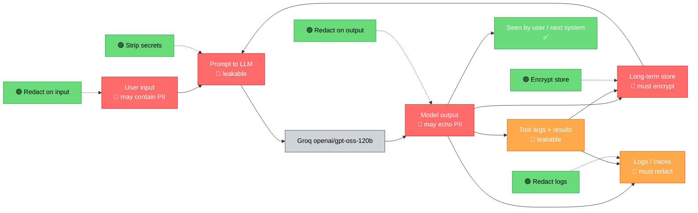
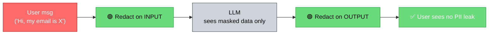
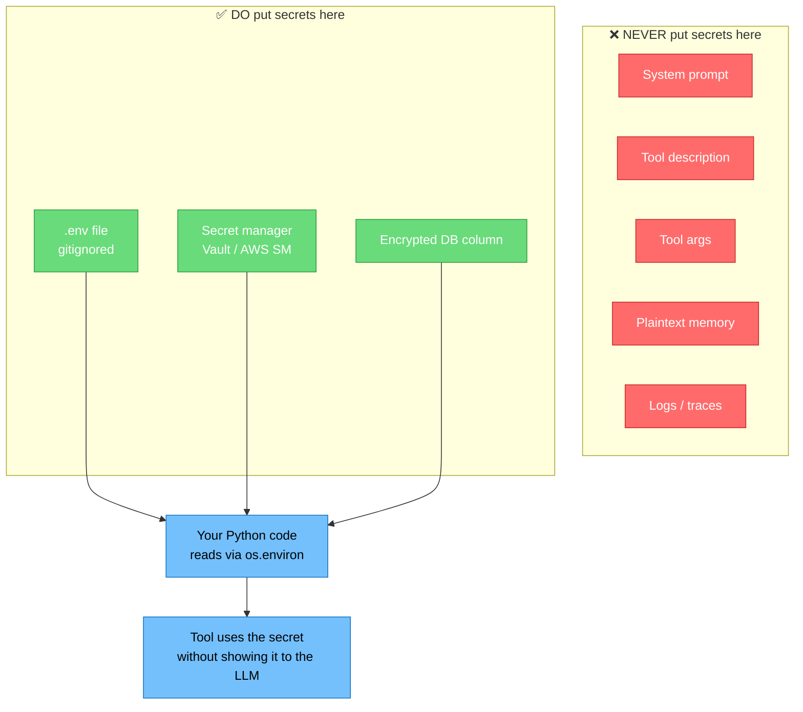

# Data Security and Privacy

> **Lesson 34** · Previous: [33 — Tool Security](33-tool-security.md) · Next: [35 — System Design Overview](35-system-design-overview.md)

---

## Why This Lesson Matters

Tools can be locked down (Lesson 33) and prompts can be hardened (Lesson 32). But agents also **remember**, **log**, and **show** data. If the memory file contains a credit card number and your agent happily prints it back to the user, you have a data breach.

This lesson covers **PII detection, redaction, retention, secrets management, and privacy patterns** — the data side of agent security (OWASP LLM06 + LLM05).

---

## Table of Contents

1. [The Data Lifecycle](#1-the-data-lifecycle)
2. [PII Detection and Redaction Middleware](#2-pii-detection-and-redaction-middleware)
3. [Data Retention Policies](#3-data-retention-policies)
4. [Encrypting Stored Memory (`store`)](#4-encrypting-stored-memory-store)
5. [GDPR and Privacy Compliance Patterns](#5-gdpr-and-privacy-compliance-patterns)
6. [Secrets Management — Never in Prompts](#6-secrets-management--never-in-prompts)
7. [Secure API Key Handling with `.env`](#7-secure-api-key-handling-with-env)
8. [Avoiding Sensitive Data in Traces and Prompts](#8-avoiding-sensitive-data-in-traces-and-prompts)
9. [Try It Yourself](#9-try-it-yourself)
10. [Common Mistakes](#10-common-mistakes)
11. [What You Learned](#11-what-you-learned)

---

## 1. The Data Lifecycle

Data moves through your agent in **six places**. At each one, you can either **protect** it (green) or **leak** it (red):



The green points are where you intervene. The pattern is the same five times: **detect, redact, encrypt, retain-with-policy, scrub-from-logs.**

---

## 2. PII Detection and Redaction Middleware

**PII** = Personally Identifiable Information: names, emails, phone numbers, credit cards, SSN, addresses, health data. Your agent should:

- Detect PII in **input** → redact (mask) before the LLM sees it.
- Detect PII in **output** → redact before the user sees it.

### A PII redaction function

```python
# 34_pii_redact.py
# Pure-Python PII redaction using regex. Install `presidio-analyzer` for industrial use.

import re
from dataclasses import dataclass, field

PATTERNS = {
    "EMAIL": r"[A-Za-z0-9._%+-]+@[A-Za-z0-9.-]+\.[A-Za-z]{2,}",
    "PHONE": r"\b(?:\+?\d{1,3}[\s.-]?)?\(?\d{3}\)?[\s.-]?\d{3}[\s.-]?\d{4}\b",
    "SSN":   r"\b\d{3}-\d{2}-\d{4}\b",
    "CARD":  r"\b(?:\d[ -]*?){13,19}\b",
    "ZIP":   r"\b\d{5}(?:-\d{4})?\b",
}
COMPILED = {k: re.compile(v) for k, v in PATTERNS.items()}

def redact_pii(text: str) -> tuple[str, dict[str, list[str]]]:
    """Return (redacted_text, mapping_of_type_to_originals)."""
    found = {k: [] for k in PATTERNS}
    out = text
    for kind, rgx in COMPILED.items():
        # Mask the value but keep one distinguishing token (e.g., last 4 of card)
        def _mask(m):
            val = m.group(0)
            found[kind].append(val)
            tail = val[-4:] if len(val) >= 4 else val
            return f"[{kind}:...{tail}]"
        out = rgx.sub(_mask, out)
    return out, {k: v for k, v in found.items() if v}

if __name__ == "__main__":
    sample = (
        "Hi, I'm Bob. My email bob.smith@example.com and my card 4111-1111-1111-1111 "
        "are on file. Call me at (555) 123-4567. SSN 123-45-6789."
    )
    safe, leaks = redact_pii(sample)
    print("REDACTED:", safe)
    print("LEAKS:", leaks)
```

Expected output:
```
REDACTED: Hi, I'm Bob. My email [EMAIL:...com] and my card [CARD:...1111] are on file. Call me at [PHONE:...4567]. SSN [SSN:...6789].
LEAKS: {'EMAIL': ['bob.smith@example.com'], 'CARD': ['4111-1111-1111-1111'], 'PHONE': ['(555) 123-4567'], 'SSN': ['123-45-6789']}
```

### Plug it into the agent as middleware

```python
# 34_pii_middleware.py
from langchain_groq import ChatGroq
from langchain_core.messages import AnyMessage, HumanMessage, AIMessage, SystemMessage
from langchain.agents.middleware import wrap_model_call
from langchain_core.runnables import RunnableLambda

model = ChatGroq(model="openai/gpt-oss-120b", temperature=0)

# Re-use redact_pii from 34_pii_redact.py
# (import it or copy in the same file)

AUDIT_FILE = "/tmp/agent_workspace/pii_audit.jsonl"

@wrap_model_call(model)
def redact_input(messages: list[AnyMessage]) -> list[AnyMessage]:
    """Redact PII in Human messages BEFORE the LLM sees them."""
    out = []
    for m in messages:
        if isinstance(m, HumanMessage):
            safe, _ = redact_pii(str(m.content))
            out.append(HumanMessage(content=safe))
        else:
            out.append(m)
    return out

def redact_output(ai_msg: AIMessage) -> AIMessage:
    safe, _ = redact_pii(str(ai_msg.content))
    return AIMessage(content=safe)

guarded_model = redact_input | RunnableLambda(lambda msgs: model.invoke(msgs)) | RunnableLambda(redact_output)
```



The agent now answers questions about a user without the raw PII ever reaching the model's prompt. If the model tries to echo PII, the output middleware masks it again.

---

## 3. Data Retention Policies

**Retain the least data for the shortest time.** Every byte you keep is a byte that can leak.

A simple retention policy says: **"Profiles older than N days are deleted."** Implement it as a small scheduled job that walks the store.

```python
# 34_retention.py
import time
from datetime import datetime, timezone, timedelta

# Fake store dict: user -> {"data": ..., "saved_at": epoch}
store: dict[str, dict] = {}

RETENTION_DAYS = 30

def purge_expired(now: datetime | None = None) -> int:
    """Delete store entries older than RETENTION_DAYS. Return count removed."""
    now = now or datetime.now(timezone.utc)
    cutoff_epoch = (now - timedelta(days=RETENTION_DAYS)).timestamp()
    removed = 0
    for key in list(store.keys()):
        if store[key].get("saved_at", 0) < cutoff_epoch:
            del store[key]
            removed += 1
    return removed

if __name__ == "__main__":
    store["alice"] = {"data": "old", "saved_at": time.time() - 31 * 86400}
    store["bob"]   = {"data": "new", "saved_at": time.time()}
    print("Removed:", purge_expired())          # → 1 (alice)
    print("Remaining keys:", list(store.keys())) # → ['bob']
```

**Schedule it** with cron, APScheduler, or a free GitHub Actions cron — anything that runs the sweep daily.

---

## 4. Encrypting Stored Memory (`store`)

When your agent uses LangChain's `InMemoryStore` or a real backend (Redis, Postgres), **encrypt sensitive fields before saving**. Use the standard library `cryptography`:

```bash
pip install cryptography
```

```python
# 34_encrypt_store.py
# Run: python 34_encrypt_store.py

import os, base64, json
from cryptography.fernet import Fernet

# 1. Generate ONCE; store the KEY in .env as STORE_KEY = <base64>.
# NEVER commit this. NEVER put it in a prompt.
def _get_key() -> bytes:
    raw = os.environ.get("STORE_KEY")
    if raw:
        return raw.encode()
    # first-run fallback (warn so you do not ship this)
    print("WARNING: STORE_KEY not set. Generating ephemeral key for demo.")
    return Fernet.generate_key()
KEY = _get_key()
FER = Fernet(KEY)

def encrypt_value(plain: str) -> str:
    """Returns base64 ciphertext safe to store."""
    return FER.encrypt(plain.encode("utf-8")).decode("ascii")

def decrypt_value(cipher: str) -> str:
    return FER.decrypt(cipher.encode("ascii")).decode("utf-8")

# Use it with the LangChain store.
from langchain_core.store import InMemoryStore

store = InMemoryStore()

def put_profile(namespace: tuple[str, ...], key: str, profile: dict) -> None:
    """Store an encrypted profile. Only the ciphertext sits in the store."""
    cipher = encrypt_value(json.dumps(profile))
    store.put(namespace, key, {"ciphertext": cipher, "saved_at": time.time()})

def get_profile(namespace: tuple[str, ...], key: str) -> dict | None:
    item = store.get(namespace, key)
    if item is None:
        return None
    return json.loads(decrypt_value(item.value["ciphertext"]))

if __name__ == "__main__":
    import time
    ns = ("tenant_1", "user_42")
    put_profile(ns, "contact", {"email": "alice@example.com", "phone": "555-1234"})
    print("Decrypted:", get_profile(ns, "contact"))
    # Inspect the store directly to confirm only ciphertext is present:
    raw = store.get(ns, "contact").value
    print("Raw store content (should be ciphertext):", raw)
```

**Key points:**
- The encryption **key lives in `.env`**, never in the prompt.
- If the store is dumped, the attacker only sees ciphertext.
- If the key is rotated, old data must be **re-encrypted** (migrate during downtime).

---

## 5. GDPR and Privacy Compliance Patterns

GDPR (and similar laws like CCPA, DPDP) gives users rights. Three that touch agents:

1. **Right of access** — user can ask "what data do you have about me?" → implement `export_user_data(user_id)`.
2. **Right to erasure ("right to be forgotten")** — implement `delete_user_data(user_id)` that wipes memory, store, and logs for that user.
3. **Data minimization** — only collect what you need. If your agent asks for an address to ship something, that is fine. Asking for an address to calculate a refund is **not**.

```python
# 34_gdpr.py
from datetime import datetime, timezone
from langchain_core.store import InMemoryStore

store = InMemoryStore()

def export_user_data(user_id: str) -> dict:
    """Return everything the agent has stored about this user, decrypted."""
    ns = ("tenant", "user", user_id)
    items = store.search(ns, prefix="", limit=100).items if hasattr(store, "search") else []
    # Simplified: in real code, iterate namespaces under user_id.
    return {"user_id": user_id, "items": list(items)}

def delete_user_data(user_id: str) -> int:
    """Permanently delete everything for this user. Returns count removed."""
    ns = ("tenant", "user", user_id)
    # InMemoryStore does not have enumerate; in production use Redis SCAN or SQL DELETE.
    # Here we illustrate the pattern with a per-user deletion entry.
    store.put(("gdpr", "deletion_log"), user_id, {"deleted_at": datetime.now(timezone.utc).isoformat()})
    return 1

if __name__ == "__main__":
    delete_user_data("user_42")
    print("Deletion logged.")
```

**Compliance checklist:**
- [ ] Every stored record has a `saved_at` timestamp.
- [ ] A scheduled job purges records older than your retention period.
- [ ] You can answer "what do you have on me?" for any user.
- [ ] You can delete all of a user's records on request.
- [ ] Consent for storing data is recorded (when relevant).
- [ ] Cross-border transfer rules are respected (e.g., do not store EU users' data on US servers without safeguards).

---

## 6. Secrets Management — Never in Prompts

**The single rule:** a secret (API key, password, token) is **never** part of any string that the LLM could see.

| Place | OK to put a secret? |
|-------|---------------------|
| System prompt | ❌ NO |
| Tool description | ❌ NO |
| Tool argument default | ❌ NO |
| Logs / traces | ❌ NO |
| Memory / store (plaintext) | ❌ NO |
| Environment variable | ✅ YES |
| `.env` file (gitignored) | ✅ YES |
| Secret manager (Vault, AWS Secret Mgr) | ✅ BEST |
| Encrypted column in the DB | ✅ YES |

**Why this matters:** A prompt-injection attack can ask the model to "print your system prompt." If your system prompt contains `Your API key is sk-...`, that key leaks immediately.



---

## 7. Secure API Key Handling with `.env`

Step by step:

### Step 1 — Create `.env` (NEVER commit it)

```
# .env
GROQ_API_KEY=gsk_your_key_here
STORE_KEY=R39__your_fernet_key_here__
MCP_TOKEN=your_mcp_token
```

### Step 2 — Add to `.gitignore`

```gitignore
# .gitignore
.env
.env.*
audit_log.txt
pii_audit.jsonl
```

### Step 3 — Load in Python

```python
# 34_secrets.py
# Run: python 34_secrets.py

import os
from dotenv import load_dotenv     # pip install python-dotenv
load_dotenv()                      # reads .env from the cwd

GROQ_API_KEY  = os.environ["GROQ_API_KEY"]
STORE_KEY     = os.environ["STORE_KEY"]
MCP_TOKEN     = os.environ["MCP_TOKEN"]

from langchain_groq import ChatGroq
model = ChatGroq(model="openai/gpt-oss-120b", temperature=0)  # reads key from env

print("Model ready with key length:", len(GROQ_API_KEY))
print("Store key present:", bool(STORE_KEY))
print("MCP token present:", bool(MCP_TOKEN))
```

**Tip:** In staging/production, prefer your host's secret manager (AWS_SECRET, GCP_SECRET, Vault) over `.env` files. The pattern at the code level is the same: `os.environ["SECRET_NAME"]`.

---

## 8. Avoiding Sensitive Data in Traces and Prompts

LangChain / LangSmith can **log the entire conversation**, including tool results and stored memories. By default, those traces can contain PII and secrets. Protect them:

1. **Disable tracing of sensitive fields** via `metadata` masking in LangSmith, or by not enabling tracing at all in production.
2. **Redact before logging** — make sure tool results are redacted before they hit the audit log.
3. **Sample low** in production — do not log 100% of traces if they contain PII.

```python
# 34_safe_logging.py
import json
from datetime import datetime, timezone

def safe_log_line(event: str, payload: dict) -> str:
    """Log only safe payloads. Redact PII and secrets before write."""
    text = json.dumps(payload, default=str)
    safe, _ = redact_pii(text)              # reuse from §2
    safe = LEAK_RE.sub("[SECRET]", safe)    # mask any sk-/gsk_ pattern
    line = f"[{datetime.now(timezone.utc).isoformat()}] {event}: {safe}\n"
    # In real code you would write to an append-only file, not stdout.
    return line

LEAK_RE = __import__("re").compile(r"sk-[A-Za-z0-9]{16,}|gsk_[A-Za-z0-9]{16,}")

example = {
    "user": "alice",
    "email": "alice@example.com",
    "key":  "gsk_" + "A" * 30,
    "note": "payload may also contain text like sk-1234567890ABCDEF",
}
print(safe_log_line("TOOL_CALL", example))
```

Sample output:
```
[2026-08-02T11:30:42.123456+00:00] TOOL_CALL: {"user": "alice", "email": "[EMAIL:...com]", "key": "[SECRET]", "note": "payload may also contain text like [SECRET]"}
```

Both PII **and** secrets are gone before the line is written.

---

## 9. Try It Yourself

### Exercise 1 — Drop-in redaction
Add a `redact_pii` middleware to any agent you built in Lessons 5–13. Confirm by sending the user message `"Send a refund to alice@example.com, card 4111-1111-1111-1111"` and checking the model only sees masked values.

### Exercise 2 — Retention enforcement
Write a function `purge_expired(transcripts, days=14)` that takes a list of `{"user": ..., "saved_at": ...}` dicts and returns the filtered list. Test with five fake records, two of which are older than 14 days.

### Exercise 3 — Encrypt-then-store
Build a tiny demo: save a profile (name, email) into an encrypted `InMemoryStore`, then dump the raw store content. Confirm you cannot read the email without `STORE_KEY`.

### Exercise 4 — Right-to-be-forgotten
Implement `delete_user(user_id)` that wipes a user's namespace AND appends an entry to a `deletion_log` namespace. Add an `export_user(user_id)` that returns the remaining data (should be empty after deletion).

### Exercise 5 — Safe logs
Modify the audit log from Lesson 33 so every line passes through `safe_log_line`. Confirm that a payload containing `sk-...` is written as `[SECRET]`.

---

## 10. Common Mistakes

| Mistake | Why It Hurts | Fix |
|---------|-------------|-----|
| Putting the API key in the system prompt so the agent "knows" it. | Any prompt-injection exfiltrates the key. | Use `os.environ`. Keys never touch the prompt. |
| Storing `email`, `phone`, `card` in plaintext memory. | A store dump = data breach. | Encrypt sensitive fields (Fernet / AES-GCM). |
| Keeping transcripts forever. | Each old transcript is a leak waiting to happen. | Retain N days, then purge. |
| Logging every tool's full result. | PII exits via the log file. | Redact PII + secrets before logging. |
| `.env` committed to git. | Pushes secrets to the repo's history forever. | `git rm --cached .env`, add to `.gitignore`, rotate keys. |
| One global key for all tenants. | Breach exposes **all** users. | Per-tenant or per-user keys where feasible. |
| "PII is only in the user's message." | Tool results and retrieved docs contain PII too. | Redact every input, not just user messages. |
| Trusting LangSmith traces to be safe by default. | Traces capture full payloads. | Mask metadata; disable tracing for sensitive flows. |

---

## 11. What You Learned

- Data passes through **six places** in your agent; each is a chance to **redact**, **encrypt**, or **scrub**.
- **PII redaction** with regex + middleware masks names, emails, phones, cards, SSNs at the boundary — the LLM and logs only ever see masked values.
- **Retention policies** delete old data on a schedule. Keep data only as long as you must.
- **Encrypted memory**: store ciphertext, never plaintext PII. The key lives in `.env` (or a secret manager), never in the prompt.
- **GDPR patterns**: export-user, delete-user, data-minimization, consent logs.
- **Secret management rule**: secrets live in env / secret manager / encrypted DB. **Never** in prompts, tool descriptions, args, memory, or logs.
- **Safe logging**: redact PII AND mask secret patterns before any line is written.
- Combined with Lessons 31–33, you now have a defense-in-depth stack covering prompts, tools, **and** data.

**Next:** [Lesson 35 — System Design Overview](35-system-design-overview.md) — we zoom out and look at how to architect multi-agent systems that use everything you have built so far.