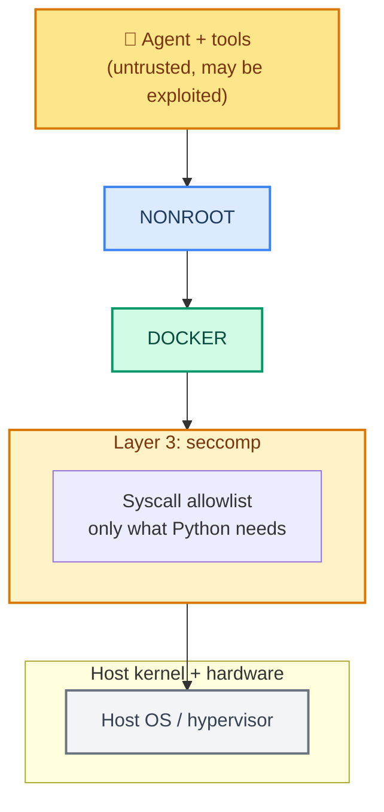
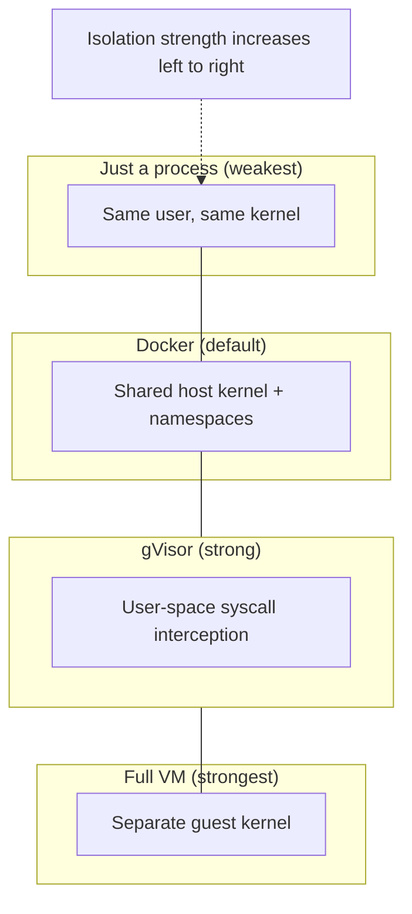

# Chapter 34: Sandboxing Agents — Containers, Restricted Users, and seccomp

> **Course Navigation:** Previous: [33 - Tool Security](./33-tool-security.md) | Next: [35 - Audit Logging](./35-audit-logging.md)

---

## Why This Lesson Matters

In [33 - Tool Security](./33-tool-security.md) you learned to **restrict what each tool may do** — path whitelists, deny-by-default, role-based scoping. That protects the agent *when it behaves badly but stays inside your rules*.

But those rules have a weakness: the defenses live **in the same process** as the agent. If a tool (or the Python runtime itself) has a bug that lets arbitrary code run — for example a path traversal that defeats your check, an `eval()` reached through clever input, or a vulnerability in a dependency — the attacker is now running code as **your user**, with **your permissions**, on **your host**. Path checks cannot stop that.

**Sandboxing** is the second, deeper layer. It does not try to be clever inside the process. Instead it **walls the whole thing off** at the operating system and container level, so that even if everything inside misbehaves, the damage cannot escape.

This lesson covers the three layers you reach for, in order of escalation:

1. **Restricted OS user** — run as nobody, drop privileges.
2. **Containers** (Docker / gVisor / Firecracker) — isolate filesystem, network, processes.
3. **seccomp** — restrict the system calls a process is even *allowed* to make.

> `"Sandboxing is containment, not cleverness. If the rule is in the process, a bug in the process can remove it."`

---

## The Layered Model



Each layer is **independent**: a mismatch on one does not cancel the others. Each ring must hold on its own, because the layer *above* may be bypassed entirely.

---

## Layer 1 — Restricted OS User

The cheapest win. Run the agent process under an **unprivileged OS user** with the smallest surface possible.

```yaml
# Dockerfile — never run your agent as root
FROM python:3.11-slim

WORKDIR /app
COPY requirements.txt .
RUN pip install --no-cache-dir -r requirements.txt && \
    useradd --system --uid 10001 --shell /usr/sbin/nologin agentuser

COPY agent/ /app/agent/

# Drop privileges permanently: RUN/CMD/ENTRYPOINT now run as agentuser
USER agentuser
CMD ["python", "-m", "agent.main"]
```

Why this matters:

- **No root** means a breakout can't write to `/etc`, install packages, or read other users' secrets.
- **No shell** (`nologin`) means even if an attacker gets a command runner, they can't get an interactive login.
- **Read-only filesystem** (`--read-only` on the container) means nothing persistent can be written even if files are writable in-process.

Key point: **`USER` in the Dockerfile is not enough by itself** — the container base image is still large, and the kernel is still shared. User restriction is the *first* floor, not the whole building.

---

## Layer 2 — Containers

A container gives the agent an **isolated namespace view**:

- **Filesystem**: it sees only the image + mounted volumes, not your host.
- **Processes**: in its own PID namespace.
- **Network**: only what you explicitly attach (default: none).
- **Kernel**: shared with the host, but with capability separation.

The crucial hardening flags:

```bash
# Minimal, firewalled agent container — deny by default
docker run --rm \
  --user 10001:10001 \            # non-root user
  --read-only \                   # cannot write a single byte to fs
  --network none \                # NO network unless it's a web tool
  --cap-drop ALL \               # drop every capability: no raw sockets, no dac_override
  --security-opt seccomp=profile.json \
  --memory 512m --cpus 1 \        # resource limits
  --pids-limit 100 \              # cap fork bombs
  agent-image
```

### Network-first, not network-together

Most agents need the internet. The secure pattern is **route the network through a sidecar**, never give the container a raw socket:

```mermaid
graph LR
    AGENT["Sandboxed agent<br/>--network none"] --|"HTTP to proxy only"| SIDECAR["Egress proxy<br/>allowlist of hosts/ports"]
    SIDECAR -->|"curl / api calls"| NET["Internet"]

    style AGENT fill:#fde68a,stroke:#d97706,stroke-width:2px,color:#78350f
    style SIDECAR fill:#d1fae5,stroke:#059669,stroke-width:2px,color:#064e3b
    style NET fill:#f3f4f6,stroke:#6b7280,stroke-width:2px,color:#374151
```

Now the agent cannot exfiltrate to an arbitrary IP — it can only reach hosts your proxy allows. The proxy holds a **hostname allowlist** (e.g. `api.groq.com`, `tavily.com`) and *never* lets the agent fetch arbitrary domains.

### gVisor and Firecracker for hard isolation

If the workload matters (agents that might run arbitrary code, or multi-tenant), don't rely on Docker sharing the host kernel. Use:

- **gVisor (`runsc`)** — a user-space kernel that **intercepts syscalls** so hostile actions hit gVisor's emulator, not the Linux kernel:
  ```bash
  docker run --runtime=runsc --user 65534 --cap-drop ALL agent-image
  ```
- **Firecracker / Kata** — microVMs with a *real* separate kernel and hypervisor isolation, the strongest isolation short of dedicated hardware.



---

## Layer 3 — seccomp

**seccomp** (secure computing mode) tells the kernel **which system calls a process may make**. Python's interpreter needs a modest set of syscalls; anything else (reboot, mount, kill other PIDs, raw socket ops) can be banned outright.

```json
{
  "defaultAction": "SCMP_ACT_ERRNO",
  "architectures": ["SCMP_ARCH_X86_64"],
  "syscalls": [
    { "names": ["read","write","close","openat","fstat","lseek","mmap",
                "munmap","brk","access","exit_group","getpid","nanosleep",
                "futex","clock_gettime","getrandom","mlockall","madvise",
                "rt_sigaction","pread64","pwrite64"], "action": "SCMP_ACT_ALLOW" }
  ]
}
```

Run with it:

```bash
docker run --security-opt seccomp=profile.json agent-image
```

### seccomp, Docker, and how strict defaults are

- Docker ships a **default seccomp profile** that already blocks a dangerous set. It's the *floor*, not a guarantee.
- The profile above is **stricter than Docker's default** because `SCMP_ACT_ERRNO` is the **default** action — it **denies every syscall not explicitly listed**.
- Notice the difference from Docker's default, which is `SCMP_ACT_ALLOW` default with denylists. **Denylist reasoning**: safe until blocked. **Allowlist**. Here the deny default means the agent runs with the absolute minimum.

### seccomp on bare-metal Python (no Docker)

You can apply a seccomp filter to a subprocess using the `pyseccomp` binding:

```python
import pys  # (illustrative; real module is `seccomp`)
import subprocess

def restrict_child():
    seccomp = __import__("seccomp")
    f = seccomp.SyscallFilter(seccomp.ArgError, seccomp.DEFAULT_KILL)
    # Allow only a minimal set Python needs; deny the rest
    for name in ["read","write","close","openat","mmap","munmap","brk","fstat",
                 "getpid","clone","execve","exit","exit_group","futex","nanosleep"]:
        f.add_rule(seccomp.ALLOW, name)
    f.load()

subprocess.run(["python", "-m", "my_agent"], preexec_fn=restrict_child)
```

---

## Limits Beyond the Kernel: Time, CPU, Memory, Speed

Containers and seccomp block **what** the agent may do. Resource limits block **how much** it may do — a runaway agent is still an availability DoS on your machine.

```yaml
# run the agent container with a hard limit set
  --memory 256m
  --cpus 1
  --pids-limit 100
  --ulimit nofile=256:256
  --ulimit nproc=128:128
```

For a **non-container** (bare subprocess) fallback, use `resource`:

```python
import resource

def apply_limits():
    resource.setrlimit(resource.RLIMIT_AS, (1 << 30, 1 << 30))   # 1 GiB address space
    resource.setrlimit(resource.RLIMIT_CPU, (10, 10))            # 10 s CPU
    resource.setrlimit(resource.RLIMIT_NOFILE, (100, 100))       # open files cap
```

---

## Sandboxing Inside LangChain / LangGraph

Sandboxes are typically enforced **at the process or container boundary**, but LangChain gives you hooks to *know* execution boundaries so you can launch sandboxed subprocesses deliberately.

In [09 - Context and Runtime](./09-context-and-runtime.md) you met `ToolRuntime`. A tool that *must* run sandboxed can spawn a hardened subprocess and stream result back:

```python
# tools/run_in_sandbox.py (illustrative)
import subprocess
from langchain_core.tools import tool

@tool
def run_in_sandbox(command: str) -> str:
    """Run a command inside a hardened sandbox container. Fails closed on escape."""
    allowed = {"ls", "cat", "du"}           # allowlist at the tool layer too
    if command.split()[0] not in allowed:
        return "[refused] command not allowed"
    # Launch inside a hard-isolated container. Options real-world projects use:
    docker_cmd = ["docker", "run", "--rm",
                  "--user", "65534:65534", "--read-only",
                  "--cap-drop", "ALL", "--network", "none",
                  "--memory", "128m", "--pids-limit", "64",
                  "sandbox-image", "sh", "-c", command]
    r = subprocess.run(docker_cmd, capture_output=True, text=True, timeout=30)
    return r.stdout[-500:]                  # return only a bounded tail
```

Two defenses, in series: the **tool allowlist** (block a bad command early) *and* the **container isolation** (stop it regardless if a shape slips through).

---

## Full Hardening Checklist

| Control | What it stops | Layer |
|---------|---------------|-------|
| Non-root user + `nologin` | root privilege escalation | user |
| Read-only root filesystem | persistent malicious writes | user |
| `--cap-drop ALL` | kernel capability abuse | container |
| `--network none` + egress proxy allowlist | exfiltration, SSRF | container |
| `--memory/--cpus` | resource exhaustion | container |
| gVisor / Firecracker | kernel-exploit escape | VM |
| seccomp allowlist | syscall abuse (mknod, mounts) | kernel |
| tool allowlist (ch33) | bad intent at model level | code |
| HITL for destructive tools (ch33) | human veto | process |

---

## Common Mistakes

| Mistake | Fix |
|---|---|
| Running the container as root "so it works" | `--user 65534:65534` always; fix permissions instead. |
| Giving `--network host` for convenience | No raw host network; route through an egress proxy. |
| seccomp denylist instead of allowlist | Allowlist (default-deny). Denylists are never complete. |
| Only Docker, no more layers | Docker shares the host kernel; add gVisor/firecracker on hardened workloads. |
| No resource/pids limits | A runaway agent becomes a DoS on your own box. |
| Testing the sandbox only with "happy-path" tools | Attack-test it: `run_in_sandbox("cat host_secret"), "nc evil 9999"`, `rm -rf /`. |
| Sandboxing the agent but not the MCP server | Sandbox the whole process that runs untrusted code, agents and MCP servers alike. |

---

## Try It Yourself

1. Run a container with `--read-only --cap-drop ALL` and try to write a file or bind a socket. Observe the failures.
2. Switch your sandbox to the gVisor runtime if available; note how syscalls are intercepted.
3. Write a `run_in_sandbox` tool for one of your project agents (Project 2 ETL or Project 5 PLC) that executes stage code inside a hard-isolated container.

---

## Recap

Sandboxing is the **second** layer of agent security (after in-process tool rules). You learned three escalating layers:

1. **Restricted OS user** — never run as root; `--user non-root`.
2. **Containers/VM** — isolate filesystem, network, capability (`--cap-drop ALL`, `--network none`, egress proxy); gVisor/Firecracker for hard isolation.
3. **seccomp** — kernel-level syscall allowlist (default-deny).

Plus resource limits to stop abuse, and `run_in_sandbox` tools to route untrusted execution through a hardened container. With all three, a fault **inside** the agent cannot become a compromise **of the host**.

---

> Next up: [35 - Audit Logging](./35-audit-logging.md) — the other half of the "you mess up, but you cannot hide" contract: a tamper-resistant record of everything the agent did.