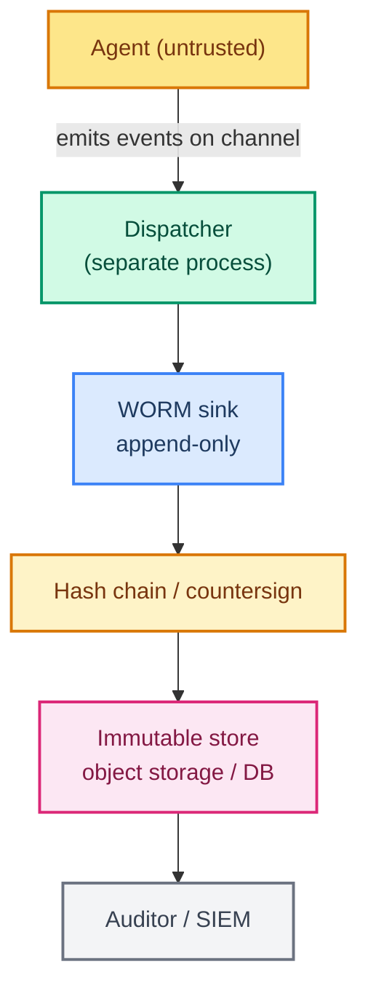

# Chapter 35: Audit Logging — A Tamper-Resistant Record of Everything Your Agent Did

> **Course Navigation:** Previous: [34 - Sandboxing](./34-sandboxing.md) | Next: [36 - Data Security and Privacy](./36-data-security-privacy.md)

---

## Why This Lesson Matters

Sandboxing ([34](./34-sandboxing.md)) stops a bad agent **from reaching the host**. But it cannot answer a different, equally important question:

> **"What exactly did the agent do, and who authorized it?"**

An LLM agent is not deterministic on purpose. It calls tools, changes state, and **makes irreversible decisions** (delete a file, transfer money, apply a fix, write to a PLC). When something goes wrong — or an auditor asks for evidence — you need a *reliable, honest* record of every action. That record is called an **audit log**.

This is **not the same thing** as ordinary logging:

- **Logging** = debugging. `print()` and app logs are for finding bugs. They can be messy, incomplete, and deleted freely.
- **Audit logging** = accountability. It answers "who did what, when, and with what authority", and it must resist being changed or deleted — even by the very code that produced it.

In [33 - Tool Security](./33-tool-security.md) you saw `audit_log()` — a quick JSONL-appender inside the agent. That was the *seed*. This lesson turns it into a real **system**: an append-only, out-of-band, tamper-evident pipeline that survives the agent's own misbehavior.

---

## What an Audit Event Contains

Design a single, consistent event shape. Every tool call, model call, and decision becomes one **event**. This is the contract everything downstream (query, alerting, compliance) depends on, so make it stable.

```python
# audit_event.py
from datetime import datetime, timezone
from typing import Any
from pydantic import BaseModel, Field

class AuditEvent(BaseModel):
    event_id: str                # unique UUID — enables correlation + dedup
    ts: str = Field(default_factory=lambda: datetime.now(timezone.utc).isoformat())
    thread_id: str               # correlate multi-turn conversations
    user_id: str                 # who initiated the run
    agent: str                   # which agent / graph
    action: str                  # tool call | LLM | hitl_decision | run_start | run_end
    tool: str | None = None      # tool name if action == "tool_call"
    args: dict[str, Any] = {}    # sanitized args (never raw secrets)
    result_preview: str = ""     # truncated result, no PII
    ok: bool = True
    decision: str | None = None  # for hitl: approved | rejected | skipped
```

### The "never log" list (ties to [36](./36-data-security-privacy.md))

Your audit log must NOT capture:

- API keys, passwords, tokens **in args or outputs**.
- Raw PII where a redacted form exists.
- Messages content (prompts/outputs) unless you truly need them for compliance — and then redacted.

Use a sanitizer before writing every event:

```python
SECRET_KEYS = {"password", "api_key", "token", "secret", "authorization"}
def sanitize(obj: dict) -> dict:
    if isinstance(obj, dict):
        return {k: ("[REDACTED]" if k.lower() in SECRET_KEYS else sanitize(v))
                for k, v in obj.items()}
    if isinstance(obj, list):
        return [sanitize(x) for x in obj]
    if isinstance(obj, str) and len(obj) > 500:
        return obj[:500] + "…[truncated]"
    return obj
```

---

## The Three Invariants of Audit Logging

By design, these three properties are non-negotiable:

1. **Append-only** — nothing is ever edited or deleted (WORM — write once, read many).
2. **Out-of-band** — the agent process *cannot* write or read its own audit log; a separate trusted sink does.
3. **Tamper-evident** — a chain of hashes or a timestamp proves no line was removed or reordered.



The critical design judgment is the **boundary**: the agent never touches the sink. It only *emits* events to a queue/channel; a **separate privileged process** appends them. An agent that stores its own logs can delete them to hide what it did.

---

## Emitting Audit Events from LangChain / LangGraph

Use **middleware** so you never have to sprinkle `audit()` calls through agent code by hand. LangChain's middleware hooks map cleanly:

- `before_model` / `after_model` → log every LLM call.
- `before_tool_call` / `after_tool_call` → log every tool invocation (args + result).
- `after_agent` / a graph node → log run start/end and HITL decisions.

```python
# middleware/audit_middleware.py
import json
from langchain_core.middleware import (
    BaseMiddleware, AfterToolCall, BeforeToolCall, MessageAfterModel, MessageBeforeModel
)
from audit_event import AuditEvent, sanitize
from emitter import emit    # sends to the OUT-OF-BAND channel

class AuditMiddleware(BaseMiddleware):
    async def before_model(self, msg: MessageBeforeModel):
        emit(AuditEvent(... action="llm", thread_id=..., args=msg.messages_and_custom.to_dict(small=True)))

    async def after_model(self, model: MessageAfterModel):
        # record token usage if present
        pass

    async def before_tool_call(self, tc: BeforeToolCall):
        emit(AuditEvent(... action="tool_call", tool=..., args=sanitize(tc.args)))

    async def after_tool_call(self, tc: AfterToolCall):
        emit(AuditEvent(... action="tool_call", tool=..., ok=tc.ok,
                        args=sanitize(tc.args), result_preview=str(tc.result or "")[:200]))
```

Attach the middleware when you build the agent:

```python
from langgraph.prebuilt import create_agent
from langchain_groq import ChatGroq

agent = create_agent(
    ChatGroq(model="openai/gpt-oss-120b", temperature=0.0),
    tools=[...],
    middleware=[AuditMiddleware()],
)
```

### Recording HITL decisions

Every human-in-the-loop decision is a **critical audit event**. In [18 - Human-in-the-Loop](./18-human-in-the-loop.md) and the projects, the human either approves or rejects a proposed action. Log the **decision**, the **proposed action**, and **who** decided.

```python
# inside your HITL node (Project 1 / 4 / 5)
from audit_event import AuditEvent
decision = interrupt({...})                      # LangGraph pause
emit(AuditEvent(
    action="hitl",
    decision=str(decision),
    args=sanitize({"proposed": proposal, "operator": operator_id}),
))
```

Now the answer to "who approved that destructive `podman rm`?" is one query away.

---

## The Out-of-Band Sink

### Option A — local append-only JSONL (small demo)

```python
# sink.py
import json, os
from datetime import datetime, timezone

AUDIT_PATH = "/var/log/agent_audit/audit.jsonl"   # a directory the agent CANNOT write
def append_event(event: dict):
    # open in append mode: always adds, never rewrites
    with open(AUDIT_PATH, "a", encoding="utf-8") as f:
        f.write(json.dumps(event, ensure_ascii=False) + "\n")
        f.flush()
        os.fsync(f.fileno())       # force to disk now
```

Notice `os.fsync` — force the write to physical disk so a crash right after a destructive action does not lose the record.

### Chain B — hash-chained tamper evidence

To detect tampering, chain every line to the one before it with a running hash:

```python
import hashlib

chain_prev = ""                      # stored at boot from the last persisted line
def append_chained(event: dict):
    global chain_prev
    line = json.dumps(event, ensure_ascii=False, sort_keys=True)
    row = {"event": event, "prev_hash": chain_prev}
    raw = json.dumps(row, ensure_ascii=False, sort_keys=True)
    with open(AUDIT_PATH, "a") as f:
        f.write(raw + "\n"); f.flush(); os.fsync(f.fileno())
    chain_prev = hashlib.sha256(raw.encode()).hexdigest()

def verify(path):          # recompute chain, compare prev_hash to stored
    prev = ""
    for line in open(path):
        row = json.loads(line)
        assert row["prev_hash"] == prev
        prev = hashlib.sha256(json.dumps(row, sort_keys=True).encode()).hexdigest()
```

Now an attacker who flips one line breaks the hash chain **for every line after it**. Tampering is **detectable**, even if not immediately reversible.

### Chain C — out-of-process (the one that actually matters)

Keep the log sink in a **separate container/process/account** that the agent *cannot* reach:

```bash
# Run the audit-writer as its own hardened service:
#  - different account than the agent
#  - append-only filesystem (chmod 444 with no delete permission)
#  - different network namespace from the agent
```

Or push to an append-only queue / object store:

- **S3/GCS** with object **versioning + WORM lock** (object lock = no delete for retention period).
- A **DB** whose role is `INSERT-only` (no `UPDATE`/`DELETE`).
- A **queue** (SQS/Kafka) so the agent only *publishes*, never stores.

This is what makes the log honest: the process that misbehaves has **no path** to its own history.

---

## Querying and Alerting

A log is only useful if you can answer questions fast:

```python
# queries.py — find every destructive action by a user, today
def destructive_actions(agent, since):
    rows = select("action='tool_call' AND tool IN $1 AND ts >= $2",
                  ("podman_rm", "terraform_apply", "write_setpoint", "vc_replace"), since)
    return rows

# Alert: excessive failures suggest an agent loop / attack
def alert_on_error_spike(user_id, limit=10, window="5 min"):
    n = count("ok=False WHERE user_id=? AND ts>now()-window", user_id)
    if n >= limit:
        notify("audit_alert", f"agent {user_id} failing {n} calls in {window}")
```

Typical queries your portfolio projects should answer: *"Who changed the PLC setpoint on Aug 2?"* (Project 5), *"Did the drift agent apply any fix, and who approved it?"* (Project 4). Both projects already write an `audit_trail.jsonl` — extend them with hash chaining and an out-of-band sink.

---

## Retention, Rotation, and Compliance

| Ask | Answer |
|-----|--------|
| How long to keep? | Match compliance (SOC 2 / ISO 27001): often 90 days–7 years. Configure rotation with `size/threshold`. |
| Rotation strategy | Daily or 500 MB files; keep N generations of old files. |
| Don't lose during rotation | Write atomically (write temp, rename), flush+fsync before rotate. |
| Immutable retention | S3 Object Lock / WORM storage for regulated industries. |
| Who reads it? | **Least privilege**: only auditors/SREs; the agent never. |

```python
# rotation.py (sketch)
def rotate_if_large(path, max_bytes=500_000_000):
    if os.path.getsize(path) > max_bytes:
        stamp = datetime.now(timezone.utc).strftime("%Y%m%d%H%M%S")
        os.replace(path, f"{path}.{stamp}")   # atomic rename; NOT a delete
```

---

## Common Mistakes

| Mistake | Fix |
| --- | --- |
| Agent writes its own audit log | Out-of-band sink/account — agent has no write path. |
| Logging raw full prompts/outputs | Store only sanitized, truncated; redact secrets (ch36). |
| Using `print()` as audit | Structured JSONL events with the fixed schema, not free text. |
| No fsync / buffered write | `flush()` + `os.fsync()` after each append. |
| Editing or deleting old events | Append-only, hash-chain, object versioning. |
| Logging only tool calls, not HITL decisions | Record the human's approve/reject + who. |
| Single event shape changed mid-course | Freeze the schema; add fields versioned, never reorder/remove. |

---

## Try It Yourself

1. Wrap one of your agent projects (Project 1, 4, or 5) with `AuditMiddleware` so **every** tool call hits your audit channel.
2. Add **hash chaining** to the project's existing `audit_trail.jsonl`; write a `verify()` that detects any tampered line.
3. Move the sink out of the agent process: write events to a second container / a local-only DB with an `access`-only user.
4. Write the query: *"Show every HITL decision on thread X yesterday, with who approved it."*

---

## Recap

Audit logging is the accountability half of agent security (the enforcement half is [34 - Sandboxing](./34-sandboxing.md)).

You now have:

- A **stable event schema** (who/what/when/args/result) with a redaction list.
- **Middleware-based emission** that logs every LLM call, tool call, and HITL decision without littering code.
- **Three invariants**: append-only, out-of-band, tamper-evident (hash chain).
- Out-of-process sinks (container, S3 WORM, DB with no-delete role).
- Query, alert, and retention patterns — and the "who approved this destructive action" queries your projects need.

Together, sandboxing and audit logging mean the agent is **both** prevented from harming the host **and** unable to hide what it did. That is the operational contract of a trustworthy AI agent.

---

> Next up: [36 - Data Security and Privacy](./36-data-security-privacy.md) — redact PII, encrypt secrets, and meet compliance so your audit logs stay useful and lawful.