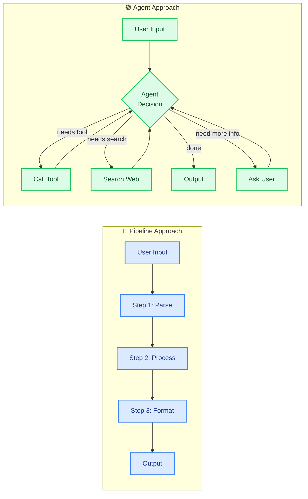
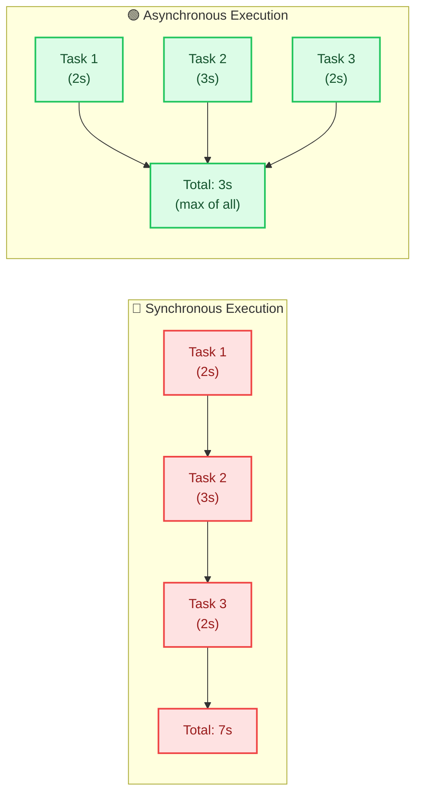
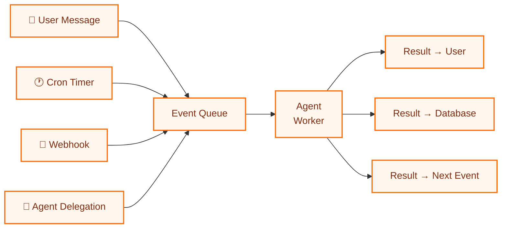

# System Design for Agentic AI: Architecture Patterns

> **Course Module 35** | Previous: [34-data-security-privacy](34-data-security-privacy.md) | Next: [36-agent-architecture-patterns](36-agent-architecture-patterns.md)

---

## Why System Design Matters for Agents

Traditional software systems follow predictable paths. You send a request, the server processes it step by step, and returns a result. Agents break that model. They **decide their own paths**, call tools multiple times, loop back when needed, and sometimes run for minutes before producing output.

This unpredictability means designing agent systems is fundamentally different from designing regular APIs. You must plan for:

- **Non-deterministic execution paths** — the same input can take different routes
- **Long-running workflows** — agents can take 30 seconds to 5 minutes per request
- **State management across turns** — agent memory grows with each interaction
- **Tool failure recovery** — external APIs fail, agents must adapt
- **Cost control** — each LLM call costs money, and agents make many calls

This module covers the high-level architecture decisions you must make **before** writing any code.

---

## Agents vs Pipelines: When to Use What

The first design decision is the most important: **do you even need an agent?**

A **pipeline** runs a fixed sequence of steps. Step 1 → Step 2 → Step 3 → Done. No branching. No decision-making. No loops.

An **agent** makes decisions at runtime. It can skip steps, repeat steps, call different tools based on intermediate results, and stop when it decides the task is complete.

### Decision Guide

| Criterion | Use Pipeline | Use Agent |
|-----------|:-----------:|:---------:|
| Fixed number of steps | ✅ | ❌ |
| Steps depend on intermediate results | ❌ | ✅ |
| Need human-like reasoning | ❌ | ✅ |
| Latency budget < 2 seconds | ✅ | ❌ |
| Cost sensitive (many requests) | ✅ | ❌ |
| Unpredictable user intent | ❌ | ✅ |
| Need to call external tools dynamically | ❌ | ✅ |
| Deterministic output required | ✅ | ❌ |
| Audit trail of every step needed | ✅ | ⚠️ |
| Complex multi-step research | ❌ | ✅ |

### Architecture Comparison



### Code: Pipeline vs Agent with LangChain

```python
"""
Pipeline vs Agent: A side-by-side comparison.
Both use Groq with model='openai/gpt-oss-120b' (free tier).
"""
import os
from langchain_groq import ChatGroq
from langchain_core.prompts import ChatPromptTemplate
from langchain_core.tools import tool
from langchain.agents import create_tool_calling_agent, AgentExecutor

os.environ.setdefault("GROQ_API_KEY", "your-groq-api-key-here")

llm = ChatGroq(model="openai/gpt-oss-120b", temperature=0)

# ──────────────────────────────────────────────
# APPROACH 1: Pipeline (fixed steps, no decisions)
# ──────────────────────────────────────────────
def pipeline_summarize(text: str) -> str:
    """A fixed pipeline: extract key points, then format as bullet list."""
    # Step 1: Extract key points
    step1_prompt = ChatPromptTemplate.from_template(
        "Extract 3 key points from this text:\n\n{text}"
    )
    chain1 = step1_prompt | llm
    key_points = chain1.invoke({"text": text}).content

    # Step 2: Format as bullet list
    step2_prompt = ChatPromptTemplate.from_template(
        "Format these key points as a clean bullet list:\n\n{points}"
    )
    chain2 = step2_prompt | llm
    result = chain2.invoke({"points": key_points}).content

    return result


# ──────────────────────────────────────────────
# APPROACH 2: Agent (decides its own steps)
# ──────────────────────────────────────────────
@tool
def extract_key_points(text: str) -> str:
    """Extract 3 key points from the given text."""
    prompt = ChatPromptTemplate.from_template(
        "Extract 3 key points from this text:\n\n{text}"
    )
    return (prompt | llm).invoke({"text": text}).content

@tool
def format_as_bullets(points: str) -> str:
    """Format the given points as a clean bullet list."""
    prompt = ChatPromptTemplate.from_template(
        "Format these key points as a clean bullet list:\n\n{points}"
    )
    return (prompt | llm).invoke({"points": points}).content

@tool
def translate_text(text: str, target_language: str) -> str:
    """Translate the given text to the target language."""
    prompt = ChatPromptTemplate.from_template(
        "Translate this text to {target_language}:\n\n{text}"
    )
    return (prompt | llm).invoke(
        {"text": text, "target_language": target_language}
    ).content

tools = [extract_key_points, format_as_bullets, translate_text]
prompt = ChatPromptTemplate.from_messages([
    ("system", "You are a helpful assistant. Use tools to complete tasks."),
    ("user", "{input}"),
    ("placeholder", "{agent_scratchpad}"),
])
agent = create_tool_calling_agent(llm, tools, prompt)
executor = AgentExecutor(agent=agent, tools=tools, verbose=True)

# ──────────────────────────────────────────────
# RUN BOTH
# ──────────────────────────────────────────────
sample_text = """
LangChain is a framework for building applications powered by LLMs.
It provides modular components for prompts, chains, agents, and memory.
LangGraph extends this for stateful, multi-actor applications.
"""

print("=== PIPELINE OUTPUT ===")
print(pipeline_summarize(sample_text))

print("\n=== AGENT OUTPUT ===")
result = executor.invoke({
    "input": f"Summarize this text and translate the result to Spanish:\n\n{sample_text}"
})
print(result["output"])
```

---

## Stateful vs Stateless Agent Design

### Stateless Agents

A **stateless agent** treats every request independently. No memory of past interactions. Each call provides all needed context.

**Pros:** Easy to scale, easy to debug, no state cleanup needed.
**Cons:** User must repeat context; cannot do multi-turn workflows.

### Stateful Agents

A **stateful agent** remembers past interactions within a session or thread. State persists between calls using a **checkpointer** (memory store).

**Pros:** Multi-turn conversations, complex workflows, human-in-the-loop.
**Cons:** Harder to scale, state management overhead, checkpoint cleanup needed.

```mermaid
graph TB
    subgraph Stateless["🟡 Stateless Agent"]
        U1["User Request 1"] --> S1["Agent"]
        S1 --> R1["Response 1"]
        U2["User Request 2"] --> S2["Agent"]
        S2 --> R2["Response 2<br/>(no memory of Request 1)"]
        style U1 fill:#fef3c7,stroke:#f59e0b,stroke-width:2px,color:#78350f
        style S1 fill:#fef3c7,stroke:#f59e0b,stroke-width:2px,color:#78350f
        style R1 fill:#fef3c7,stroke:#f59e0b,stroke-width:2px,color:#78350f
        style U2 fill:#fef3c7,stroke:#f59e0b,stroke-width:2px,color:#78350f
        style S2 fill:#fef3c7,stroke:#f59e0b,stroke-width:2px,color:#78350f
        style R2 fill:#fef3c7,stroke:#f59e0b,stroke-width:2px,color:#78350f
    end

    subgraph Stateful["🟣 Stateful Agent"]
        U3["User Request 1"] --> S3["Agent"]
        S3 --> C1["Checkpoint Store"]
        C1 --> R3["Response 1"]
        U4["User Request 2"] --> S4["Agent"]
        C1 --> S4
        S4 --> C2["Checkpoint Store"]
        C2 --> R4["Response 2<br/>(remembers Request 1)"]
        style U3 fill:#f3e8ff,stroke:#a855f7,stroke-width:2px,color:#581c87
        style S3 fill:#f3e8ff,stroke:#a855f7,stroke-width:2px,color:#581c87
        style C1 fill:#f3e8ff,stroke:#a855f7,stroke-width:2px,color:#581c87
        style R3 fill:#f3e8ff,stroke:#a855f7,stroke-width:2px,color:#581c87
        style U4 fill:#f3e8ff,stroke:#a855f7,stroke-width:2px,color:#581c87
        style S4 fill:#f3e8ff,stroke:#a855f7,stroke-width:2px,color:#581c87
        style C2 fill:#f3e8ff,stroke:#a855f7,stroke-width:2px,color:#581c87
        style R4 fill:#f3e8ff,stroke:#a855f7,stroke-width:2px,color:#581c87
    end
```



### Code: Stateless vs Stateful with LangGraph

```python
"""
Stateless vs Stateful agent design using LangGraph.
Uses Groq model='openai/gpt-oss-120b' (free tier).
"""
import os
from typing import TypedDict, Annotated
from langchain_groq import ChatGroq
from langchain_core.tools import tool
from langchain_core.messages import HumanMessage, SystemMessage
from langgraph.graph import StateGraph, START, END
from langgraph.graph.message import add_messages
from langgraph.checkpoint.memory import InMemorySaver

os.environ.setdefault("GROQ_API_KEY", "your-groq-api-key-here")

llm = ChatGroq(model="openai/gpt-oss-120b", temperature=0)


# ──────────────────────────────────────────────
# STATELESS: Each call independent, no memory
# ──────────────────────────────────────────────
class StatelessState(TypedDict):
    message: str
    response: str

def respond_stateless(state: StatelessState) -> dict:
    """Process without any memory of past calls."""
    reply = llm.invoke([
        SystemMessage(content="You are a helpful assistant."),
        HumanMessage(content=state["message"]),
    ])
    return {"response": reply.content}

stateless_graph = StateGraph(StatelessState)
stateless_graph.add_node("respond", respond_stateless)
stateless_graph.add_edge(START, "respond")
stateless_graph.add_edge("respond", END)
stateless_app = stateless_graph.compile()


# ──────────────────────────────────────────────
# STATEFUL: Remembers conversation within a thread
# ──────────────────────────────────────────────
class StatefulState(TypedDict):
    messages: Annotated[list, add_messages]

def respond_stateful(state: StatefulState) -> dict:
    """Process with memory of past messages in this thread."""
    reply = llm.invoke([
        SystemMessage(content="You are a helpful assistant. Remember our conversation."),
        *state["messages"],
    ])
    return {"messages": [reply]}

stateful_graph = StateGraph(StatefulState)
stateful_graph.add_node("respond", respond_stateful)
stateful_graph.add_edge(START, "respond")
stateful_graph.add_edge("respond", END)

# InMemorySaver stores state per thread_id
checkpointer = InMemorySaver()
stateful_app = stateful_graph.compile(checkpointer=checkpointer)


# ──────────────────────────────────────────────
# TEST: Stateful remembers, Stateless forgets
# ──────────────────────────────────────────────
CONFIG = {"configurable": {"thread_id": "user-123"}}

print("=== STATEFUL: Turn 1 ===")
result = stateful_app.invoke(
    {"messages": [HumanMessage(content="My name is Alice.")]},
    config=CONFIG,
)
print(result["messages"][-1].content)

print("\n=== STATEFUL: Turn 2 (remembers name) ===")
result = stateful_app.invoke(
    {"messages": [HumanMessage(content="What is my name?")]},
    config=CONFIG,
)
print(result["messages"][-1].content)

print("\n=== STATELESS: Same question, no memory ===")
result = stateless_app.invoke({"message": "What is my name?"})
print(result["response"])
```

---

## Synchronous vs Async Execution

### Synchronous (Blocking)

Each task runs one at a time. The caller waits until the task finishes. Simple to reason about but slow for multiple independent tasks.

### Asynchronous (Non-blocking)

Multiple tasks run concurrently. The caller does not wait idly. Much faster for I/O-bound work (API calls, database queries, tool execution).



### Code: Sync vs Async Agent

```python
"""
Synchronous vs Asynchronous agent execution.
Uses Groq model='openai/gpt-oss-120b' (free tier).
"""
import os
import asyncio
import time
from langchain_groq import ChatGroq

os.environ.setdefault("GROQ_API_KEY", "your-groq-api-key-here")

llm = ChatGroq(model="openai/gpt-oss-120b", temperature=0)


def run_sync():
    """Run 3 questions one at a time."""
    questions = [
        "What is the capital of France?",
        "What is the capital of Japan?",
        "What is the capital of Brazil?",
    ]
    start = time.time()
    results = []
    for q in questions:
        result = llm.invoke(q)
        results.append(result.content[:50])
    elapsed = time.time() - start
    print(f"Sync total: {elapsed:.2f}s")
    for r in results:
        print(f"  → {r}...")


async def run_async():
    """Run 3 questions concurrently."""
    questions = [
        "What is the capital of France?",
        "What is the capital of Japan?",
        "What is the capital of Brazil?",
    ]
    start = time.time()
    tasks = [llm.ainvoke(q) for q in questions]
    results = await asyncio.gather(*tasks)
    elapsed = time.time() - start
    print(f"Async total: {elapsed:.2f}s")
    for r in results:
        print(f"  → {r.content[:50]}...")


if __name__ == "__main__":
    print("=== SYNCHRONOUS ===")
    run_sync()
    print("\n=== ASYNCHRONOUS ===")
    asyncio.run(run_async())
```

---

## Event-Driven Agents

In an event-driven design, the agent **reacts to events** rather than responding to direct requests. Events can come from:

- A user message (chat event)
- A scheduled timer (cron event)
- An external system webhook (GitHub pushed code, Stripe received payment)
- Another agent (delegation event)

This decouples the agent from the caller. The agent processes events from a queue at its own pace.



### Code: Simple Event-Driven Agent Loop

```python
"""
A simple event-driven agent loop using an in-memory queue.
Uses Groq model='openai/gpt-oss-120b' (free tier).
"""
import os
import queue
import time
from langchain_groq import ChatGroq
from langchain_core.tools import tool
from langchain.agents import create_tool_calling_agent, AgentExecutor
from langchain_core.prompts import ChatPromptTemplate

os.environ.setdefault("GROQ_API_KEY", "your-groq-api-key-here")

llm = ChatGroq(model="openai/gpt-oss-120b", temperature=0)

@tool
def get_temperature(city: str) -> str:
    """Get the current temperature for a city (mock data)."""
    mock = {"Paris": "15C", "Tokyo": "22C", "Mumbai": "31C"}
    return mock.get(city, "20C")

@tool
def get_headline(topic: str) -> str:
    """Get a mock news headline for a topic."""
    return f"Breaking: Major update in {topic} sector!"

tools = [get_temperature, get_headline]
prompt = ChatPromptTemplate.from_messages([
    ("system", "You are an event-driven assistant. Process each event."),
    ("user", "{input}"),
    ("placeholder", "{agent_scratchpad}"),
])
agent = create_tool_calling_agent(llm, tools, prompt)
executor = AgentExecutor(agent=agent, tools=tools, verbose=False)

# ──────────────────────────────────────────────
# Simple event queue
# ──────────────────────────────────────────────
event_queue: queue.Queue = queue.Queue()

def publish_event(event_type: str, payload: str):
    """Publish an event to the queue."""
    event_queue.put({"type": event_type, "payload": payload})
    print(f"[Published] {event_type}: {payload}")

def process_events():
    """Process events from the queue."""
    while not event_queue.empty():
        event = event_queue.get()
        print(f"\n[Processing] {event['type']}: {event['payload']}")
        result = executor.invoke({"input": event["payload"]})
        print(f"[Result] {result['output'][:80]}...")
        event_queue.task_done()

# ──────────────────────────────────────────────
# Simulate events arriving
# ──────────────────────────────────────────────
publish_event("user_message", "What's the weather in Paris?")
publish_event("user_message", "Give me a news headline about AI.")
publish_event("user_message", "What's the temperature in Tokyo?")

if __name__ == "__main__":
    print("\n=== STARTING EVENT PROCESSOR ===\n")
    process_events()
    print("\n=== ALL EVENTS PROCESSED ===")
```

---

## Designing for Observability from Day One

Observability means you can answer **"what is the agent doing right now?"** at any moment. Without it, agents are a black box.

### Three Pillars of Observability

| Pillar | What It Captures | Tool (Free) |
|--------|-----------------|-------------|
| **Traces** | Full path of each run (every LLM call, tool call, decision) | LangSmith (free tier) or LangGraph Studio |
| **Metrics** | Aggregated numbers (latency, token count, error rate, cost) | LangSmith or custom logging |
| **Logs** | Free-form text events (warnings, debug info, user actions) | Python `logging` module |

### What to Log from Day One

1. **Every LLM call** — input prompt, model used, output, tokens consumed, latency
2. **Every tool call** — tool name, arguments, result, duration
3. **Every agent decision** — why it chose a path, what alternatives it considered
4. **Every error** — what failed, retry count, fallback used
5. **Every user interaction** — input, agent response, user follow-up

### Code: Basic Observability Setup

```python
"""
Add observability to your agent using Python logging + LangSmith.
Uses Groq model='openai/gpt-oss-120b' (free tier).
"""
import os
import logging
import time
from langchain_groq import ChatGroq
from langchain_core.tools import tool
from langchain.agents import create_tool_calling_agent, AgentExecutor
from langchain_core.prompts import ChatPromptTemplate

# ──────────────────────────────────────────────
# Option A: Free LangSmith tracing (recommended)
# ──────────────────────────────────────────────
# Set these in your .env or environment:
os.environ.setdefault("GROQ_API_KEY", "your-groq-api-key-here")
os.environ.setdefault("LANGCHAIN_API_KEY", "your-langsmith-key-here")
os.environ.setdefault("LANGCHAIN_TRACING_V2", "true")
os.environ.setdefault("LANGCHAIN_PROJECT", "my-agent-project")

# ──────────────────────────────────────────────
# Option B: Basic Python logging (always works)
# ──────────────────────────────────────────────
logging.basicConfig(
    level=logging.INFO,
    format="%(asctime)s [%(levelname)s] %(message)s",
    datefmt="%H:%M:%S",
)
logger = logging.getLogger("agent")

llm = ChatGroq(model="openai/gpt-oss-120b", temperature=0)

@tool
def calculate(expression: str) -> str:
    """Safely evaluate a math expression."""
    logger.info(f"Tool called: calculate({expression})")
    try:
        result = eval(expression, {"__builtins__": {}}, {})
        logger.info(f"Tool result: {result}")
        return str(result)
    except Exception as e:
        logger.error(f"Tool error: {e}")
        return f"Error: {e}"

tools = [calculate]
prompt = ChatPromptTemplate.from_messages([
    ("system", "You are a helpful math assistant. Use the calculate tool."),
    ("user", "{input}"),
    ("placeholder", "{agent_scratchpad}"),
])
agent = create_tool_calling_agent(llm, tools, prompt)
executor = AgentExecutor(agent=agent, tools=tools, verbose=False)

if __name__ == "__main__":
    logger.info("Agent session started")
    start = time.time()

    result = executor.invoke({"input": "What is (15 + 27) * 3?"})
    logger.info(f"Final output: {result['output']}")

    elapsed = time.time() - start
    logger.info(f"Total time: {elapsed:.2f}s")
    logger.info("Agent session ended")
```

---

## Tradeoff Matrix Summary

| Design Decision | Simple Option | Scalable Option | Cost | Tradeoff |
|-----------------|:------------:|:---------------:|:----:|----------|
| Pipeline vs Agent | Pipeline | Agent | Agent costs more | Use agent only when needed |
| Stateful vs Stateless | InMemory state | External store | Stateless cheaper | Start stateless, add state when needed |
| Sync vs Async | Sync | Async | Same | Use async for >1 concurrent request |
| Direct vs Event-driven | Direct call | Queue + workers | Event-driven needs infra | Event-driven for high volume |
| Observability level | Basic logging | Full tracing | LangSmith free tier | Always start with basic logging |

---

## Try It Yourself

1. **Compare latency.** Build the same "summarize and translate" task as both a pipeline and an agent. Time each. Which is faster? Which handles "also add a bullet list" better?

2. **Test stateful memory.** Create a stateful agent with `thread_id="test"`. First message: "I like pizza." Second message (new invoke, same thread_id): "What food do I like?" Does it remember?

3. **Go async.** Convert a sync agent loop that calls 3 tools sequentially into async using `asyncio.gather()`. Measure time saved.

4. **Add a cron event.** Modify the event-driven example to add an event every 2 seconds using `time.sleep(2)` in a background thread publishing to the queue.

5. **Set up LangSmith.** Create a free LangSmith account, add your API key to `.env`, and run any agent. Check the LangSmith dashboard for the trace.

---

## Common Mistakes

- **Using an agent when a pipeline works.** Agents add latency, cost, and unpredictability. If your steps are fixed, use a chain.

- **Forgetting to set `thread_id`.** A stateful agent without a `thread_id` creates a new state each call and remembers nothing. Always pass `config={"configurable": {"thread_id": "..."}}`.

- **Using sync calls for batch work.** If you need 10 independent LLM calls, do them async with `asyncio.gather()`. Sync takes 10x longer.

- **No observability in development.** "It works on my machine" does not survive production. Trace every LLM call from day one.

- **Hardcoding the model in multiple places.** Define your model config once and import it. Changing models across 20 files is a nightmare.

---

## What You Learned

- **Pipelines** are fixed-step sequences; **agents** make runtime decisions. Choose based on predictability, cost, and whether steps are known in advance.
- **Stateless agents** scale easily but forget; **stateful agents** remember via checkpointers but need state management.
- **Synchronous execution** is simple; **async execution** is faster for parallel I/O-bound work.
- **Event-driven agents** process events from a queue, decoupling request arrival from processing.
- **Observability** (traces, metrics, logs) must be built in from day one, not bolted on later.

---

> Next: [36-agent-architecture-patterns](36-agent-architecture-patterns.md) — Deep dive into single-agent, supervisor-worker, hierarchical, and swarm patterns.