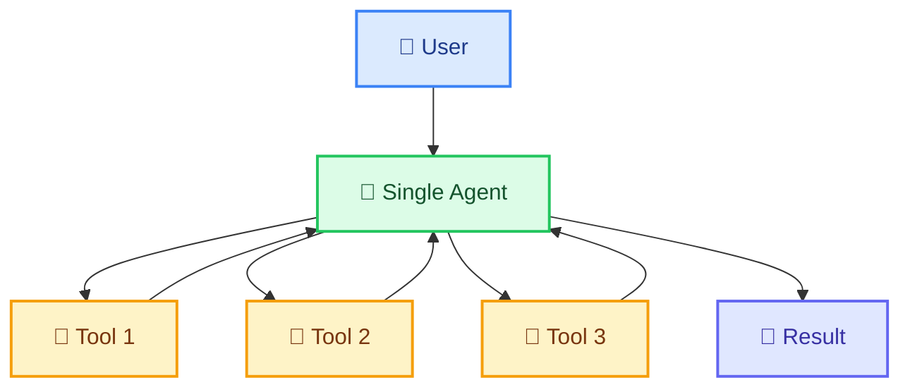
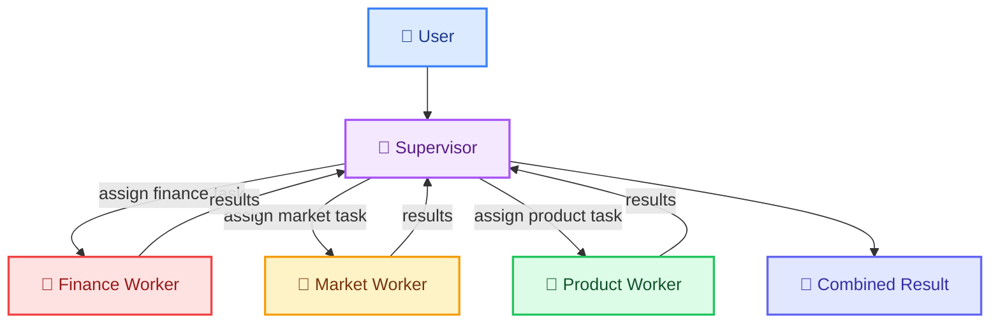
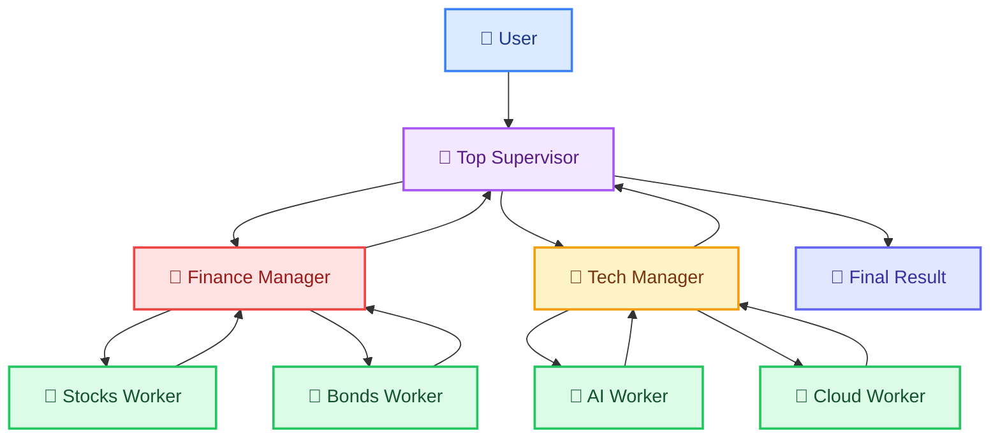
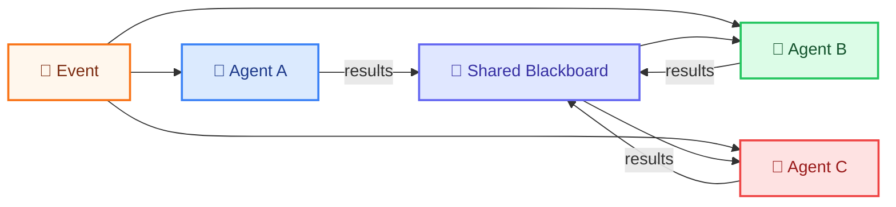
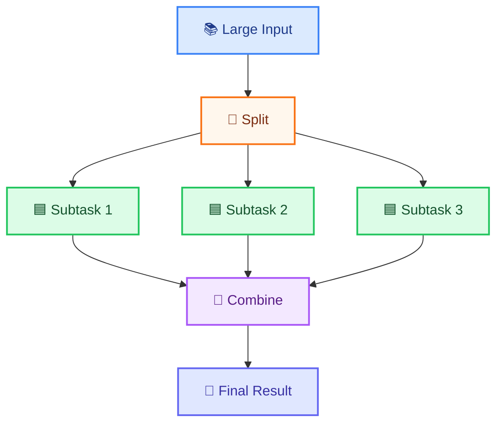

# Agent Architecture Patterns

> **Course Module 36** | Previous: [35-system-design-overview](35-system-design-overview.md) | Next: [37-designing-for-scale](37-designing-for-scale.md)

---

## Overview

Once you decide to build an agent, the next question is: **what structure should it take?** A single all-in-one agent? A supervisor delegating to workers? A swarm of cooperating agents? A map-reduce pipeline for parallel work?

This module covers the five most common architecture patterns for agents built with LangChain and LangGraph. Each pattern has a diagram, code, and guidance on when to use it.

All examples use **Groq** with `model="openai/gpt-oss-120b"` and free tools only.

---

## Pattern 1: Single-Agent

One agent with tools. It decides what to do, calls tools, and produces output. The simplest and most common pattern.

**When to use:** Most use cases (chatbots, research assistants, coding helpers). Start here before anything complex.

**When NOT to use:** When the task needs multiple distinct skill sets (e.g., writing and math and coding), or when one agent's context window overflows.



### Code: Single Agent

```python
"""
Pattern 1: Single-Agent with multiple tools.
Uses Groq model='openai/gpt-oss-120b' (free tier).
"""
import os
from langchain_groq import ChatGroq
from langchain_core.tools import tool
from langchain.agents import create_tool_calling_agent, AgentExecutor
from langchain_core.prompts import ChatPromptTemplate

os.environ.setdefault("GROQ_API_KEY", "your-groq-api-key-here")

llm = ChatGroq(model="openai/gpt-oss-120b", temperature=0)

@tool
def add(a: float, b: float) -> float:
    """Add two numbers."""
    return a + b

@tool
def multiply(a: float, b: float) -> float:
    """Multiply two numbers."""
    return a * b

@tool
def get_word_count(text: str) -> int:
    """Count the number of words in a text."""
    return len(text.split())

tools = [add, multiply, get_word_count]
prompt = ChatPromptTemplate.from_messages([
    ("system", "You are a helpful assistant. Use tools when needed."),
    ("user", "{input}"),
    ("placeholder", "{agent_scratchpad}"),
])

agent = create_tool_calling_agent(llm, tools, prompt)
executor = AgentExecutor(agent=agent, tools=tools, verbose=True)

if __name__ == "__main__":
    result = executor.invoke({
        "input": "Multiply 15 by 4, then add 100 to the result."
    })
    print("Result:", result["output"])
```

---

## Pattern 2: Supervisor-Worker

A **supervisor** agent receives the task, decides which **worker** agents to call, delegates subtasks, collects results, and produces the final answer.

**When to use:** Tasks with distinct sub-areas (e.g., "research this company's finances, market position, and product" — three different specialized workers). More controllable than a swarm.



### Code: Supervisor-Worker with LangGraph

```python
"""
Pattern 2: Supervisor-Worker architecture using LangGraph.
Uses Groq model='openai/gpt-oss-120b' (free tier).
"""
import os
from typing import TypedDict, Literal
from langchain_groq import ChatGroq
from langchain_core.messages import HumanMessage, SystemMessage, AIMessage
from langgraph.graph import StateGraph, START, END

os.environ.setdefault("GROQ_API_KEY", "your-groq-api-key-here")
llm = ChatGroq(model="openai/gpt-oss-120b", temperature=0)


class SwarmState(TypedDict):
    messages: list
    next_agent: str


def finance_worker(state: SwarmState) -> dict:
    """Handles finance-related questions."""
    user_msg = state["messages"][-1].content
    response = llm.invoke([
        SystemMessage(content="You are a finance expert. Answer concisely."),
        HumanMessage(content=user_msg),
    ])
    return {"messages": [AIMessage(content=response.content, name="finance")]}


def tech_worker(state: SwarmState) -> dict:
    """Handles technology-related questions."""
    user_msg = state["messages"][-1].content
    response = llm.invoke([
        SystemMessage(content="You are a technology expert. Answer concisely."),
        HumanMessage(content=user_msg),
    ])
    return {"messages": [AIMessage(content=response.content, name="tech")]}


def supervisor(state: SwarmState) -> dict:
    """Decides which worker to route to."""
    user_msg = state["messages"][-1].content
    decision = llm.invoke([
        SystemMessage(content=(
            "You are a supervisor. Route the question to 'finance' or 'tech'. "
            "Respond with ONLY the word 'finance' or 'tech'."
        )),
        HumanMessage(content=user_msg),
    ])
    return {"next_agent": decision.content.strip().lower()}


def route(state: SwarmState) -> Literal["finance_worker", "tech_worker", "__end__"]:
    next_agent = state.get("next_agent", "")
    if next_agent == "finance":
        return "finance_worker"
    elif next_agent == "tech":
        return "tech_worker"
    return END


# Build the supervisor-Worker graph
graph = StateGraph(SwarmState)
graph.add_node("supervisor", supervisor)
graph.add_node("finance_worker", finance_worker)
graph.add_node("tech_worker", tech_worker)

graph.add_conditional_edges("supervisor", route)
graph.add_edge("finance_worker", END)
graph.add_edge("tech_worker", END)
graph.add_edge(START, "supervisor")

app = graph.compile()

if __name__ == "__main__":
    result = app.invoke({
        "messages": [HumanMessage(content="What is a P/E ratio?")]
    })
    print("Supervisor routed to:", result.get("next_agent"))
    print("Answer:", result["messages"][-1].content)
```

---

## Pattern 3: Hierarchical Multi-Agent

Workers are organized in a tree. A **top supervisor** delegates to **mid-level supervisors**, which each manage their own workers. This pattern handles very complex, multi-domain tasks.

**When to use:** Large organizations, enterprise assistants with many departments, or when a flat supervisor's context would overflow.



### Code: Hierarchical (Simplified Two-Level Tree)

```python
"""
Pattern 3: Hierarchical multi-agent (simplified two-level tree).
Uses Groq model='openai/gpt-oss-120b' (free tier).
"""
import os
from typing import TypedDict, Literal
from langchain_groq import ChatGroq
from langchain_core.messages import HumanMessage, SystemMessage, AIMessage
from langgraph.graph import StateGraph, START, END

os.environ.setdefault("GROQ_API_KEY", "your-groq-api-key-here")
llm = ChatGroq(model="openai/gpt-oss-120b", temperature=0)


class HierarchicalState(TypedDict):
    messages: list
    next_team: str
    delegation: str


def top_supervisor(state: HierarchicalState) -> dict:
    """Decides which mid-level team handles the task."""
    user_msg = state["messages"][-1].content
    decision = llm.invoke([
        SystemMessage(content=(
            "You are a top supervisor. Route the question to 'finance_team' "
            "or 'tech_team'. Respond with ONLY the team name."
        )),
        HumanMessage(content=user_msg),
    ])
    return {"next_team": decision.content.strip().lower()}


def finance_manager(state: HierarchicalState) -> dict:
    """Delegates finance work to a worker and synthesizes."""
    user_msg = state["messages"][-1].content
    response = llm.invoke([
        SystemMessage(content="You are a finance expert. Provide a detailed answer."),
        HumanMessage(content=user_msg),
    ])
    return {"messages": [AIMessage(content=response.content, name="finance_mgr")]}


def tech_manager(state: HierarchicalState) -> dict:
    """Delegates tech work to a worker and synthesizes."""
    user_msg = state["messages"][-1].content
    response = llm.invoke([
        SystemMessage(content="You are a technology expert. Provide a detailed answer."),
        HumanMessage(content=user_msg),
    ])
    return {"messages": [AIMessage(content=response.content, name="tech_mgr")]}


def route(state: HierarchicalState) -> Literal["finance_manager", "tech_manager", "__end__"]:
    team = state.get("next_team", "")
    if team == "finance_team":
        return "finance_manager"
    elif team == "tech_team":
        return "tech_manager"
    return END


graph = StateGraph(HierarchicalState)
graph.add_node("top_supervisor", top_supervisor)
graph.add_node("finance_manager", finance_manager)
graph.add_node("tech_manager", tech_manager)
graph.add_conditional_edges("top_supervisor", route)
graph.add_edge("finance_manager", END)
graph.add_edge("tech_manager", END)
graph.add_edge(START, "top_supervisor")
app = graph.compile()

if __name__ == "__main__":
    result = app.invoke({
        "messages": [HumanMessage(content="Explain Kubernetes in simple terms.")]
    })
    print("Routed to:", result.get("next_team"))
    print("Answer:", result["messages"][-1].content)
```

---

## Pattern 4: Event-Driven / Swarm

Multiple agents **listen for events** and react. There is no single supervisor. Any agent can produce a result or trigger another agent. This is the most flexible but hardest to control.

**When to use:** Creative tasks, brainstorming, or when the order of work is unpredictable.



### Code: Swarm via Shared Blackboard

```python
"""
Pattern 4: Event-driven swarm with a shared blackboard.
Uses Groq model='openai/gpt-oss-120b' (free tier).
"""
import os
from typing import TypedDict
from langchain_groq import ChatGroq
from langchain_core.messages import HumanMessage, SystemMessage, AIMessage
from langgraph.graph import StateGraph, START, END

os.environ.setdefault("GROQ_API_KEY", "your-groq-api-key-here")
llm = ChatGroq(model="openai/gpt-oss-120b", temperature=0)


class BlackboardState(TypedDict):
    messages: list
    blackboard: str


def skeptic(state: BlackboardState) -> dict:
    bb = state.get("blackboard", "")
    prompt = (
        "Here is the current blackboard:\n" + bb +
        "\n\nPlay the skeptic. Point out one weakness. "
        "Write 2 sentences."
    )
    response = llm.invoke([
        SystemMessage(content="You are a careful skeptic."),
        HumanMessage(content=prompt),
    ])
    return {"blackboard": bb + "\n[Skeptic]: " + response.content}


def enthusiast(state: BlackboardState) -> dict:
    bb = state.get("blackboard", "")
    prompt = (
        "Here is the current blackboard:\n" + bb +
        "\n\nBe the enthusiast. Support one strength. "
        "Write 2 sentences."
    )
    response = llm.invoke([
        SystemMessage(content="You are a positive enthusiast."),
        HumanMessage(content=prompt),
    ])
    return {"blackboard": bb + "\n[Enthusiast]: " + response.content}


def judge(state: BlackboardState) -> dict:
    bb = state.get("blackboard", "")
    response = llm.invoke([
        SystemMessage(content="You summarize both sides fairly in 3 sentences."),
        HumanMessage(content=f"Summarize this debate:\n{bb}"),
    ])
    return {
        "blackboard": bb + "\n[Judge]: " + response.content,
        "messages": [AIMessage(content=response.content, name="judge")],
    }


graph = StateGraph(BlackboardState)
graph.add_node("skeptic", skeptic)
graph.add_node("enthusiast", enthusiast)
graph.add_node("judge", judge)
graph.add_edge(START, "enthusiast")
graph.add_edge("enthusiast", "skeptic")
graph.add_edge("skeptic", "judge")
graph.add_edge("judge", END)
app = graph.compile()

if __name__ == "__main__":
    result = app.invoke({
        "messages": [HumanMessage(content="debate")],
        "blackboard": "Topic: Is AI a net positive for society?",
    })
    print(result["blackboard"])
```

---

## Pattern 5: Map-Reduce for Parallel Work

Split a large task into independent subtasks (**map**), process them in parallel, then combine results (**reduce**).

**When to use:** Batch summarization, large document processing, analyzing multiple data sources simultaneously.



### Code: Map-Reduce with asyncio

```python
"""
Pattern 5: Map-Reduce for parallel document summarization.
Uses Groq model='openai/gpt-oss-120b' (free tier).
"""
import os
import asyncio
from langchain_groq import ChatGroq

os.environ.setdefault("GROQ_API_KEY", "your-groq-api-key-here")
llm = ChatGroq(model="openai/gpt-oss-120b", temperature=0)


async def summarize_chunk(chunk: str, idx: int) -> str:
    """Summarize one chunk (map step)."""
    response = await llm.ainvoke(
        f"Summarize this text in 2 sentences:\n\n{chunk}"
    )
    return response.content


async def combine_summaries(summaries: list[str]) -> str:
    """Combine all summaries into one (reduce step)."""
    combined = "\n\n".join(summaries)
    response = await llm.ainvoke(
        f"Combine these summaries into one coherent summary:\n\n{combined}"
    )
    return response.content


async def map_reduce_summarize(document: str, chunk_size: int = 500) -> str:
    chunks = [document[i:i + chunk_size] for i in range(0, len(document), chunk_size)]
    print(f"Split into {len(chunks)} chunks")

    # MAP: summarize each chunk in parallel
    summaries = await asyncio.gather(
        *[summarize_chunk(chunk, i) for i, chunk in enumerate(chunks)],
    )

    # REDUCE: combine summaries
    final = await combine_summaries(list(summaries))
    return final


if __name__ == "__main__":
    long_text = (
        "Artificial intelligence is transforming how we work. "
        "Models like GPT can write, reason, and code. " * 20
    )
    result = asyncio.run(map_reduce_summarize(long_text))
    print("Final summary:", result)
```

---

## Pattern Selection Guide

| If your task... | Use Pattern | Example |
|-----------------|:----------:|---------|
| Is simple, one domain, few tools | Single-Agent | "What's the weather?" |
| Has 2-3 distinct domains | Supervisor-Worker | "Research company's finance + product" |
| Has many domains, organized hierarchically | Hierarchical | "Full company report across all departments" |
| Is creative, agents interact dynamically | Agent Swarm | "Brainstorm ideas, debate them" |
| Can be split into independent chunks | Map-Reduce | "Summarize 100 documents" |

---

## Try It Yourself

1. **Single-Agent challenge.** Add a `divide` tool to the single-agent example. Test with "Divide 100 by 4, then multiply the result by 3."

2. **Supervisor routing.** Add a "general" worker to the Supervisor-Worker pattern. Modify the supervisor to route non-finance, non-tech questions there.

3. **Three-level hierarchy.** Extend the simplified hierarchical example by adding a second worker under one of the managers. Call it from the manager.

4. **Swarm debate.** Extend the blackboard example to run skeptic and enthusiast twice each (with a loop in LangGraph) before the judge.

5. **Map-Reduce timing.** Use `time.perf_counter()` to measure how long the sync version (one chunk at a time) takes vs async `asyncio.gather`. Note the speedup.

---

## Common Mistakes

- **Starting with a complex pattern.** Most tasks work great with a single agent. Start simple, add complexity only when you hit a concrete wall.

- **Workers that are too similar.** If two workers do nearly the same thing, merge them. The supervisor wastes tokens deciding between almost identical options.

- **Not passing enough context to workers.** Workers operate in isolation. If they need the conversation history, pass it explicitly in state.

- **Infinite loops in swarm patterns.** Agents can call each other endlessly. Always include a max-iterations guard or an explicit termination node.

- **Forgetting to set `name` on `AIMessage`.** When debugging, you need to know which agent produced which message. Always set `name="agent_label"`.

---

## What You Learned

- **Single-Agent** is the default choice — one agent with multiple tools handles most real-world tasks.
- **Supervisor-Worker** splits a task by domain; the supervisor routes to the right specialist and combines results.
- **Hierarchical** multi-agent organizes workers under mid-level supervisors, avoiding context overflow at the top.
- **Swarm/Event-driven** lets multiple agents interact via a shared blackboard; no central supervisor; best for creative tasks.
- **Map-Reduce** processes large inputs by splitting into chunks, processing in parallel, and combining — ideal for batch summarization and large-document analysis.

---

> Next: [37-designing-for-scale](37-designing-for-scale.md) — Scale your agent from a single user to thousands with state externalization, load balancing, and backpressure.