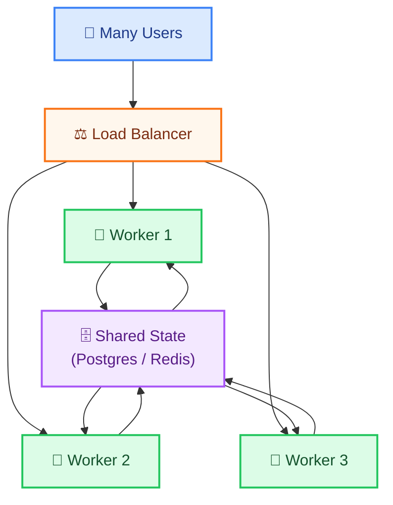
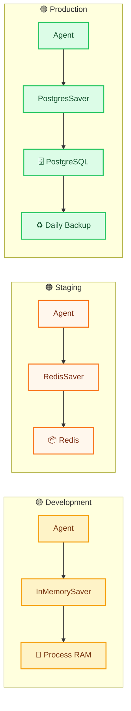
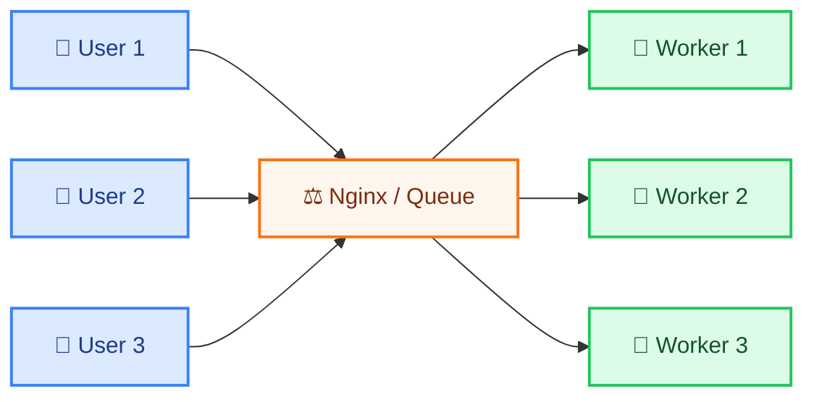
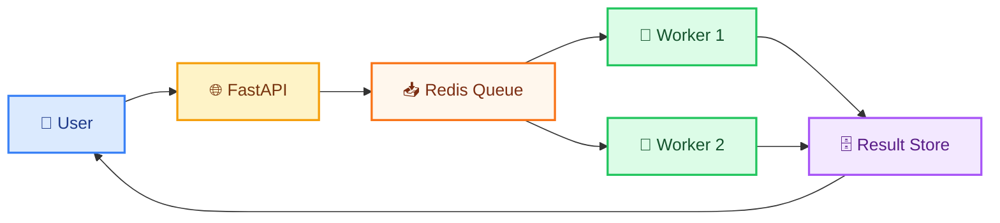
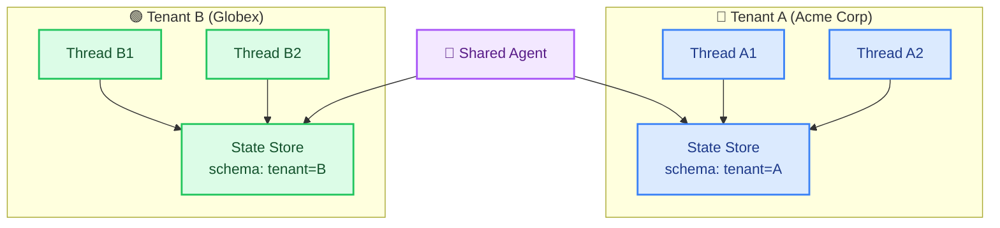

# Designing Agents for Scale

> **Course Module 37** | Previous: [36-agent-architecture-patterns](36-agent-architecture-patterns.md) | Next: [38-production-readiness-checklist](38-production-readiness-checklist.md)

---

## Why Scaling Agents Is Hard

A single agent running on your laptop works fine. But when you move to production with hundreds or thousands of concurrent users, new problems appear:

- **State storage fills up.** `InMemorySaver` stores everything in RAM. It dies on restart and cannot be shared across servers.
- **LLM rate limits hit fast.** Groq's free tier has requests-per-minute limits. One popular agent can exhaust them.
- **Long-running requests block others.** A 30-second agent run can tie up a worker thread, starving other users.
- **No multi-tenant isolation.** User A's state must never leak to User B's agent.
- **One bad tool call cascades.** A slow external API slows down all users behind the same worker.

This module covers the patterns that take your agent from a prototype to a system that handles real load.

---

## Horizontal Scaling with LangGraph

**Vertical scaling** means a bigger machine (more CPU, more RAM). **Horizontal scaling** means more machines (more agent worker instances).

For agents, horizontal scaling is the right approach because:

- Agent work is **I/O-bound** (waiting for LLM and tool responses), not CPU-bound
- Each request is independent (in stateless mode) or coordinated via external state (in stateful mode)
- You can add more workers when load increases, remove them when it drops



The key enabling factor for horizontal scaling is **externalizing state** — moving agent memory out of process RAM and into a shared store.

---

## State Externalization: From InMemorySaver to Postgres/Redis

### The Problem with InMemorySaver

`InMemorySaver` stores all checkpoint data in the Python process's memory. Problems:

1. **Lost on restart.** When the process dies, all conversation history dies with it.
2. **Not shared.** Worker 1 cannot read state written by Worker 2.
3. **Unbounded growth.** No cleanup, so memory grows until the process crashes.

### Solution: External Checkpointer

LangGraph provides two production-ready checkpointers:

| Checkpointer | Storage | Best For | Setup |
|-------------|---------|----------|-------|
| `InMemorySaver` | Process RAM | Development, testing | Built-in |
| `MemorySaver` (Redis) | Redis (external) | Fast reads, TTL support | Requires Redis server |
| `PostgresSaver` | PostgreSQL (external) | Durable, queryable, ACID | Requires Postgres server |

For free local development, use **SQLite** (a local file) or **Redis** (via Docker). For a real production system, use **PostgreSQL** (most durable) or **Redis** (fastest reads).



### Code: Swap InMemorySaver for SQLite (Free Postgres-like)

```python
"""
State externalization: swap InMemorySaver for SQLiteSaver (free, local, durable).
Uses Groq model='openai/gpt-oss-120b' (free tier).
"""
import os
from typing import Annotated, TypedDict
from langchain_groq import ChatGroq
from langchain_core.messages import HumanMessage, SystemMessage
from langgraph.graph import StateGraph, START, END
from langgraph.graph.message import add_messages
from langgraph.checkpoint.sqlite import SqliteSaver

os.environ.setdefault("GROQ_API_KEY", "your-groq-api-key-here")
llm = ChatGroq(model="openai/gpt-oss-120b", temperature=0)


class ChatState(TypedDict):
    messages: Annotated[list, add_messages]


def respond(state: ChatState) -> dict:
    reply = llm.invoke([
        SystemMessage(content="You are a helpful assistant."),
        *state["messages"],
    ])
    return {"messages": [reply]}


# Build the graph
graph = StateGraph(ChatState)
graph.add_node("respond", respond)
graph.add_edge(START, "respond")
graph.add_edge("respond", END)

# SQLiteSaver persists state to a local file (survives restarts)
with SqliteSaver.from_conn_string("agent_state.db") as checkpointer:
    app = graph.compile(checkpointer=checkpointer)

    config = {"configurable": {"thread_id": "user-42"}}

    # Turn 1
    r1 = app.invoke(
        {"messages": [HumanMessage(content="I'm learning Python.")]},
        config=config,
    )
    print("Turn 1:", r1["messages"][-1].content[:60])

    # Turn 2 — state persists across calls (and across process restarts!)
    r2 = app.invoke(
        {"messages": [HumanMessage(content="What am I learning?")]},
        config=config,
    )
    print("Turn 2:", r2["messages"][-1].content[:60])

# Test: stop the process, restart, and run Turn 2 with the same thread_id.
# The agent will still remember "Python" because state lives in SQLite now.
```

### Code: RedisSaver (Fast Reads, TTL Support)

```python
"""
State externalization with Redis (great for fast reads and auto-cleanup).
Install: pip install redis langgraph-checkpoint-redis
"""
import os
from typing import Annotated, TypedDict
from langchain_groq import ChatGroq
from langchain_core.messages import HumanMessage, SystemMessage
from langgraph.graph import StateGraph, START, END
from langgraph.graph.message import add_messages
from langgraph.checkpoint.redis import RedisSaver

os.environ.setdefault("GROQ_API_KEY", "your-groq-api-key-here")
llm = ChatGroq(model="openai/gpt-oss-120b", temperature=0)


class ChatState(TypedDict):
    messages: Annotated[list, add_messages]


def respond(state: ChatState) -> dict:
    reply = llm.invoke([
        SystemMessage(content="You are a helpful assistant."),
        *state["messages"],
    ])
    return {"messages": [reply]}


graph = StateGraph(ChatState)
graph.add_node("respond", respond)
graph.add_edge(START, "respond")
graph.add_edge("respond", END)

# Connect to Redis (local: docker run -p 6379:6379 redis)
REDIS_URL = os.environ.setdefault("REDIS_URL", "redis://localhost:6379")

with RedisSaver.from_conn_string(REDIS_URL) as checkpointer:
    app = graph.compile(checkpointer=checkpointer)
    config = {"configurable": {"thread_id": "user-redis-1"}}

    r = app.invoke(
        {"messages": [HumanMessage(content="Hello!")]},
        config=config,
    )
    print(r["messages"][-1].content)
```

---

## Load Balancing Requests

When you have multiple worker processes, you need a **load balancer** in front of them. Two popular free options:

1. **Nginx** — A reverse proxy that distributes requests in round-robin or least-connections mode. Great for HTTP.
2. **A message queue** (Redis Streams, RabbitMQ) — Decouples user requests from workers, smoothing out bursty traffic.



### Code: FastAPI Agent with Multiple Workers

```python
"""
Expose your agent as an HTTP API using FastAPI.
Run multiple instances behind Nginx for horizontal scaling.
Uses Groq model='openai/gpt-oss-120b' (free tier).

Run: uvicorn agent_api:app --workers 4 --port 8000
"""
import os
from typing import Annotated, TypedDict
from fastapi import FastAPI
from pydantic import BaseModel
from langchain_groq import ChatGroq
from langchain_core.messages import HumanMessage
from langgraph.graph import StateGraph, START, END
from langgraph.graph.message import add_messages
from langgraph.checkpoint.memory import InMemorySaver

os.environ.setdefault("GROQ_API_KEY", "your-groq-api-key-here")

llm = ChatGroq(model="openai/gpt-oss-120b", temperature=0)


class ChatState(TypedDict):
    messages: Annotated[list, add_messages]


def respond(state: ChatState) -> dict:
    reply = llm.invoke(state["messages"])
    return {"messages": [reply]}


graph = StateGraph(ChatState)
graph.add_node("respond", respond)
graph.add_edge(START, "respond")
graph.add_edge("respond", END)
# For production: swap InMemorySaver for SqliteSaver/PostgresSaver
app_graph = graph.compile(checkpointer=InMemorySaver())

api = FastAPI(title="Agent API")


class ChatRequest(BaseModel):
    message: str
    thread_id: str = "default"


@api.post("/chat")
def chat(req: ChatRequest):
    config = {"configurable": {"thread_id": req.thread_id}}
    result = app_graph.invoke(
        {"messages": [HumanMessage(content=req.message)]},
        config=config,
    )
    return {"response": result["messages"][-1].content}


@api.get("/health")
def health():
    return {"status": "ok"}
```

---

## Queue-Based Architecture

A queue decouples the **user request** from the **agent worker**. Benefits:

1. **Smoothing bursts.** 1000 users hit at once? The queue holds them; workers process at their own pace.
2. **Retries built in.** If a worker fails, the item goes back to the queue.
3. **Backpressure visibility.** You can see how many items are waiting and scale workers up or down.

### Free Queue Options

| Tool | Type | Free? | Setup |
|------|------|:-----:|-------|
| Python `queue.Queue` | In-process | ✅ | Built-in |
| Redis Streams | External | ✅ (Redis free) | Local Docker |
| RabbitMQ | External | ✅ (Docker) | Local Docker |
| Celery (uses Redis/RabbitMQ) | Distributed | ✅ | `pip install celery` |



### Code: Simple Queue with Redis Streams

```python
"""
Queue-based architecture with Redis Streams (free, local).
Producer enqueues tasks; workers process them.
Uses Groq model='openai/gpt-oss-120b' (free tier).
Install: pip install redis
"""
import os
import json
import redis
from langchain_groq import ChatGroq

os.environ.setdefault("GROQ_API_KEY", "your-groq-api-key-here")
llm = ChatGroq(model="openai/gpt-oss-120b", temperature=0)

rdb = redis.Redis(host="localhost", port=6379, db=0)
STREAM = "agent_tasks"
CONSUMER_GROUP = "workers"


def enqueue_task(user_id: str, message: str):
    """Add a task to the stream (call from FastAPI handler)."""
    rdb.xadd(STREAM, {
        "user_id": user_id,
        "message": message,
    })
    print(f"[Enqueued] user={user_id} msg={message[:50]}")


def worker_loop(worker_name: str):
    """Process tasks from the stream (run as a separate process)."""
    try:
        rdb.xgroup_create(STREAM, CONSUMER_GROUP, id="0", mkstream=True)
    except redis.ResponseError:
        pass  # group already exists

    print(f"[{worker_name}] Listening on {STREAM}...")
    while True:
        # Read up to 1 new message, block for 2 seconds if empty
        results = rdb.xreadgroup(
            CONSUMER_GROUP, worker_name,
            {STREAM: ">"}, count=1, block=2000,
        )
        for stream, messages in results:
            for msg_id, fields in messages:
                user_id = fields[b"user_id"].decode()
                message = fields[b"message"].decode()

                print(f"[{worker_name}] Processing for {user_id}...")
                try:
                    response = llm.invoke(message)
                    print(f"[{worker_name}] Done: {response.content[:50]}...")
                except Exception as e:
                    print(f"[{worker_name}] Error: {e}")

                rdb.xack(STREAM, CONSUMER_GROUP, msg_id)


if __name__ == "__main__":
    enqueue_task("user-1", "What is 2+2?")
    enqueue_task("user-2", "Write a haiku about cats.")
    worker_loop("worker-1")
```

---

## Backpressure Handling

**Backpressure** means "I am being asked to do more than I can handle." Without backpressure handling, the system either crashes or returns errors silently.

### Strategies

| Strategy | How It Works | When to Use |
|----------|-------------|-------------|
| **Queue length limit** | Reject new requests when queue > N | Hard SLA, simple ops |
| **Rate limit per user** | Each user gets X requests/minute | Multi-tenant fairness |
| **Rate limit per worker** | Each worker admits Y concurrent calls | Protect LLM API from bursts |
| **Graceful degradation** | Return a shorter/quicker answer when busy | Best-effort UX |
| **Circuit breaker** | If error rate > X%, stop accepting new work | Protect downstream |

### Code: Simple Per-User Rate Limiter

```python
"""
Simple rate limiter using a sliding window with Redis.
Free, local, no extra dependencies beyond redis-py.
"""
import time
import redis
from collections import deque

rdb = redis.Redis(host="localhost", port=6379, db=0)


def rate_limit(user_id: str, max_calls: int = 10, window_seconds: int = 60) -> bool:
    """Return True if user is within rate limit, False otherwise."""
    key = f"rate:{user_id}"
    now = time.time()
    pipe = rdb.pipeline()
    pipe.zremrangebyscore(key, 0, now - window_seconds)
    pipe.zadd(key, {str(now): now})
    pipe.zcard(key)
    pipe.expire(key, window_seconds)
    results = pipe.execute()
    count = results[2]
    return count <= max_calls


if __name__ == "__main__":
    user = "user-100"
    for i in range(15):
        if rate_limit(user, max_calls=5, window_seconds=60):
            print(f"  Call {i+1}: ALLOWED")
        else:
            print(f"  Call {i+1}: REJECTED (rate limit)")
```

---

## Graceful Degradation

When the system is overloaded, returning **something** is better than returning **nothing**. Techniques:

- **Cache fallback.** If LLM call times out, return a cached answer to a similar past query.
- **Smaller model.** If `openai/gpt-oss-120b` is too slow, fall back to a smaller Groq model.
- **Shorter response.** Ask the model for "1 sentence only" when busy.
- **Static FAQ.** Hard code a reply to common questions.

### Code: Degradation Chain

```python
"""
Graceful degradation: try a strong model, fall back to a simpler response.
Uses Groq models on free tier.
"""
import os
import time
from langchain_groq import ChatGroq

os.environ.setdefault("GROQ_API_KEY", "your-groq-api-key-here")

strong_model = ChatGroq(model="openai/gpt-oss-120b", temperature=0, timeout=5)
fallback_response = "I'm very busy right now. Please try again in a moment."


def answer_question(question: str) -> str:
    try:
        return strong_model.invoke(question).content
    except Exception as e:
        print(f"[Degrade] Strong model failed: {e}")
        return fallback_response


if __name__ == "__main__":
    print("Answer:", answer_question("Explain quantum computing in 2 sentences."))
```

---

## Multi-Tenant Isolation

Every user (tenant) must have their own:

1. **Thread ID** — so checkpoint state never crosses between users
2. **Rate limit counter** — one tenant cannot exhaust the API quota for others
3. **Conversation history** — User A cannot query or retrieve User B's chats
4. **Tool credentials** — each tenant uses their own tool API keys



### Code: Isolated Multi-Tenant Agent

```python
"""
Multi-tenant isolation with per-tenant thread IDs.
Uses Groq model='openai/gpt-oss-120b'.
"""
import os
from typing import Annotated, TypedDict
from langchain_groq import ChatGroq
from langchain_core.messages import HumanMessage, SystemMessage
from langgraph.graph import StateGraph, START, END
from langgraph.graph.message import add_messages
from langgraph.checkpoint.memory import InMemorySaver

os.environ.setdefault("GROQ_API_KEY", "your-groq-api-key-here")
llm = ChatGroq(model="openai/gpt-oss-120b", temperature=0)


class ChatState(TypedDict):
    messages: Annotated[list, add_messages]


def respond(state: ChatState) -> dict:
    reply = llm.invoke([
        SystemMessage(content="You are a helpful assistant."),
        *state["messages"],
    ])
    return {"messages": [reply]}


graph = StateGraph(ChatState)
graph.add_node("respond", respond)
graph.add_edge(START, "respond")
graph.add_edge("respond", END)
app = graph.compile(checkpointer=InMemorySaver())


def chat(tenant_id: str, user_id: str, message: str) -> str:
    """Each (tenant, user) pair gets its own conversation thread."""
    thread_id = f"{tenant_id}::{user_id}"
    config = {"configurable": {"thread_id": thread_id}}
    r = app.invoke(
        {"messages": [HumanMessage(content=message)]},
        config=config,
    )
    return r["messages"][-1].content


if __name__ == "__main__":
    # Tenant isolation test
    print(chat("acme", "alice", "My name is Alice and I work at Acme."))
    print(chat("globex", "alice", "My name is Alice and I work at Globex."))
    # Each tenant sees only their own history
    print(chat("acme", "alice", "Where do I work?"))
    # → "Acme" (not Globex, because thread is scoped to acme::alice)
```

---

## Try It Yourself

1. **Test SQLite persistence.** Run the SQLiteSaver example, then delete the process. Start a new process with the same `thread_id` and ask "What did I tell you before?" The agent should remember.

2. **Stress test FastAPI.** Run `uvicorn agent_api:app --workers 4` and use `ab -n 100 -c 10 http://localhost:8000/health` to verify multiple workers serve requests concurrently.

3. **Add a Redis queue.** Start Redis (`docker run -p 6379:6379 redis`), enqueue 5 messages with the enqueue function, and watch the worker process them.

4. **Trigger degradation.** Set `timeout=0.1` on the model so calls always fail. Verify the fallback response is returned instead of an error.

5. **Verify tenant isolation.** Run the multi-tenant example and confirm that user "alice" under "acme" does NOT see the history from "globex".

---

## Common Mistakes

- **Keeping InMemorySaver in production.** It dies on every restart. Use SQLite, Redis, or Postgres even for small projects.

- **Same `thread_id` for all users.** Everyone shares one conversation. Always scope `thread_id` by tenant + user.

- **No rate limiter on the LLM call.** A few popular users can burn through your entire Groq quota. Always rate limit per user.

- **Synchronous LLM call inside FastAPI.** This blocks the worker. Use `await llm.ainvoke()` in async endpoints or run workers behind a queue.

- **No timeout on the LLM call.** A stuck model call hangs the entire worker forever. Always set `timeout=` on `ChatGroq`.

---

## What You Learned

- **Horizontal scaling** means running multiple agent workers behind a load balancer, all reading from the same external state store.
- **State externalization** moves agent memory from `InMemorySaver` to SQLite, Redis, or Postgres so state survives restarts and is shared across workers.
- **Load balancers** (Nginx) and **queues** (Redis Streams) smooth out bursts and decouple user requests from agent workers.
- **Backpressure** strategies (rate limits, circuit breakers, queue limits) protect the system from overload.
- **Graceful degradation** (smaller model, cached response, shorter answer) gives users something useful when the system is busy.
- **Multi-tenant isolation** scoping `thread_id` by `{tenant}::{user}` ensures no state leaks between tenants.

---

> Next: [38-production-readiness-checklist](38-production-readiness-checklist.md) — A final checklist to make sure your agent is ready for real users.