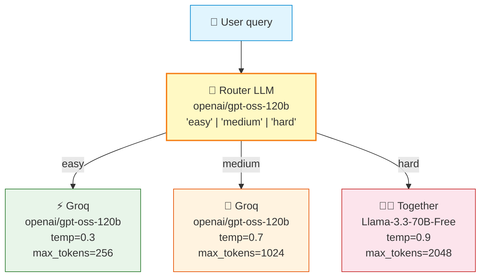
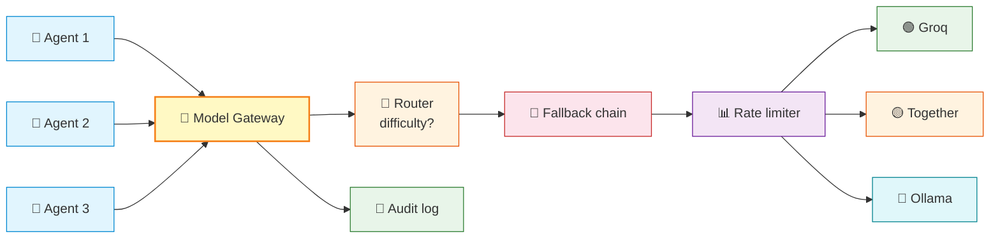

# Model Serving and Routing

> **Course Navigation:** Previous: [39-ai-infrastructure-overview.md](./39-ai-infrastructure-overview.md) | Next: [41-vector-db-infrastructure.md](./41-vector-db-infrastructure.md)

---

## Why This Lesson Matters

Your agent is only as fast, smart, and cheap as its LLM. But you don't have to pick one LLM forever. In production, you want:

- **Speed** — answer the user in under 1 second when possible.
- **Fallbacks** — if Groq is down, your agent keeps working.
- **Cost control** — cheap model for "what's 2+2," expensive model for "draft a contract clause."
- **Rate limits** — don't get banned by hammering one provider.

This lesson shows you how to **route, fallback, A/B test, and survive rate limits** — all with free tools and the Groq `openai/gpt-oss-120b` model.

---

## The Providers Landscape

| Provider | Free tier? | Our model | Speed | Best for |
|----------|-----------|-----------|-------|----------|
| **Groq** | Yes (generous) | `openai/gpt-oss-120b` | ⚡ Fastest (LPU) | Default for this course |
| OpenAI | Trial only | gpt-4o-mini | Medium | High quality, paid |
| Together AI | Free credits | meta-llama/Llama-3.3-70B | Fast | Backup, many models |
| Fireworks | Free credits | fireworks/llama-v3p-70b | Fast | Backup |
| Ollama (local) | 100% free | llama3.3, mistral | Slow on laptop | Self-hosted, no internet |
| vLLM (self-host) | Hardware costs | Any open model | Depends on GPU | Full control |

**For this course, Groq is the default. We'll set up Together AI as the fallback.**

---

## Setting Up the Models

```python
# -- multi_provider_setup.py --
import os
from langchain_groq import ChatGroq
from langchain_openai import ChatOpenAI

# Primary: Groq
groq_model = ChatGroq(
    model="openai/gpt-oss-120b",
    temperature=0.7,
    max_tokens=1024,
)

# Fallback: Together AI (free credits, OpenAI-compatible API)
os.environ["OPENAI_API_BASE_FALLBACK"] = "https://api.together.xyz/v1"
fallback_model = ChatOpenAI(
    model="meta-llama/Llama-3.3-70B-Instruct-Turbo-Free",
    temperature=0.7,
    api_key=os.environ["TOGETHER_API_KEY"],
    base_url="https://api.together.xyz/v1",
)
```

---

## Pattern 1: Simple Fallback Chain

If Groq is down, use the fallback. LangChain supports this with `.with_fallbacks()`:

```python
# -- fallback_chain.py --
from langchain_groq import ChatGroq
from langchain_openai import ChatOpenAI
import os

primary = ChatGroq(model="openai/gpt-oss-120b", temperature=0.7)
backup = ChatOpenAI(
    model="meta-llama/Llama-3.3-70B-Instruct-Turbo-Free",
    base_url="https://api.together.xyz/v1",
    api_key=os.environ["TOGETHER_API_KEY"],
)

# If primary raises ANY exception, the fallback kicks in
reliable_model = primary.with_fallbacks([backup])

# Use it like any other model — same interface
response = reliable_model.invoke("Explain RAG in one sentence.")
print(response.content)
```

You can chain as many as you want:

```python
reliable_model = primary.with_fallbacks([groq_backup, together_backup, ollama_backup])
```

---

## Pattern 2: Fallback Only on Specific Errors

Sometimes you don't want every error to trigger a fallback (e.g., rate limits yes, but content policy no — you want to know about content issues).

```python
# -- selective_fallback.py --
from langchain_core.exceptions import OutputParserException
from langchain_community.callbacks import get_openai_callback

primary = ChatGroq(model="openai/gpt-oss-120b")
backup = ChatOpenAI(model="gpt-4o-mini")

# Fallback ONLY on rate limit and timeout errors
reliable = primary.with_fallbacks(
    [backup],
    exceptions_to_handle=(TimeoutError, ConnectionError, RuntimeError),
)
```

**Rule of thumb:** Fallback on infrastructure problems (rate limit, timeout, 500). Don't fallback on logic problems (bad output, content refusal) — those need fixing.

---

## Pattern 3: Routing by Task Complexity

Not every question needs the same model. Routing lets you send "easy" questions to a cheap fast model and "hard" questions to a slower/costlier one.



Here's how to implement that router:

```python
# -- task_router.py --
from typing import Literal
from langchain_groq import ChatGroq
from langchain_core.prompts import ChatPromptTemplate
from langchain_core.output_parsers import StrOutputParser
from pydantic import BaseModel, Field
from langchain_core.output_parsers import PydanticOutputParser

# 1. Define route schema
class RouteDecision(BaseModel):
    difficulty: Literal["easy", "medium", "hard"] = Field(
        description="How hard is this query for an LLM"
    )

router_llm = ChatGroq(model="openai/gpt-oss-120b", temperature=0.0)
parser = PydanticOutputParser(pydantic_object=RouteDecision)

router = ChatPromptTemplate.from_messages([
    ("system", "Classify the user query difficulty. {format_instructions}"),
    ("human", "{query}"),
]) | router_llm | parser

# 2. Define the candidate models
easy_model = ChatGroq(model="openai/gpt-oss-120b", temperature=0.3, max_tokens=256)
hard_model = ChatGroq(model="openai/gpt-oss-120b", temperature=0.9, max_tokens=2048)

# 3. Routing function
def route_query(query: str):
    decision = router.invoke({
        "query": query,
        "format_instructions": parser.get_format_instructions(),
    })
    difficulty = decision.difficulty
    if difficulty == "easy":
        return easy_model, "easy"
    elif difficulty == "medium":
        return ChatGroq(model="openai/gpt-oss-120b", temperature=0.7, max_tokens=1024), "medium"
    else:
        return hard_model, "hard"

# 4. Use it
model, level = route_query("What is the capital of France?")
print(f"Routed to: {level}")
print(model.invoke("What is the capital of France?").content)
```

**Payoff:** Easy questions get fewer tokens (cheaper). Hard questions get more (better answers). Your average cost drops.

---

## Pattern 4: Model A/B Testing

Sometimes you don't know which model is best for your task. Run both, compare side-by-side.

```python
# -- ab_testing.py --
from langchain_groq import ChatGroq
from langchain_openai import ChatOpenAI
import os, random

model_a = ChatGroq(model="openai/gpt-oss-120b", temperature=0.7)
model_b = ChatOpenAI(
    model="meta-llama/Llama-3.3-70B-Instruct-Turbo-Free",
    base_url="https://api.together.xyz/v1",
    api_key=os.environ["TOGETHER_API_KEY"],
    temperature=0.7,
)

prompt = "Write a 3-line poem about serverless functions."

results = {
    "A": model_a.invoke(prompt).content,
    "B": model_b.invoke(prompt).content,
}

for label, poem in results.items():
    print(f"--- Model {label} ---")
    print(poem)
    print()

# In production: store responses with labels, log user preference,
# compute win-rate over time, promote the winner.
```

**A/B test variables:**
- Different models (gpt-oss-120b vs Llama-3.3-70B)
- Different temperatures (0.3 vs 0.7)
- Different prompts (verbose vs terse)
- Different max_tokens (256 vs 1024)

---

## Pattern 5: Rate Limit Handling

Groq free tier has limits — typically **30 requests per minute** for `openai/gpt-oss-120b`. If you burst past it, you get 429 errors. Two strategies:

### Strategy A: Token Bucket Throttle

```python
# -- rate_limiter.py --
import time
from collections import deque
from langchain_groq import ChatGroq

class RateLimiter:
    def __init__(self, max_per_minute: int = 25):
        self.max_per_minute = max_per_minute
        self.calls = deque()

    def wait_if_needed(self):
        now = time.time()
        # drop calls older than 60s
        while self.calls and self.calls[0] < now - 60:
            self.calls.popleft()
        if len(self.calls) >= self.max_per_minute:
            sleep_for = 60 - (now - self.calls[0])
            print(f"⏳ Rate limit: sleeping {sleep_for:.1f}s")
            time.sleep(sleep_for)
        self.calls.append(time.time())

limiter = RateLimiter(max_per_minute=25)
model = ChatGroq(model="openai/gpt-oss-120b")

for i in range(30):
    limiter.wait_if_needed()
    response = model.invoke(f"Say hello {i}")
    print(f"Call {i}: {response.content[:30]}")
```

### Strategy B: Spread Across Providers

When one provider hits the limit, switch to another for the next call:

```python
# -- round_robin.py --
from langchain_groq import ChatGroq
from langchain_openai import ChatOpenAI
from itertools import cycle
import os

providers = cycle([
    ChatGroq(model="openai/gpt-oss-120b"),
    ChatOpenAI(
        model="meta-llama/Llama-3.3-70B-Instruct-Turbo-Free",
        base_url="https://api.together.xyz/v1",
        api_key=os.environ["TOGETHER_API_KEY"],
    ),
])

for question in ["hi", "hello", "hey there"]:
    model = next(providers)
    print(model.invoke(question).content)
```

---

## Model Gateway: The Central Brain

For larger systems, instead of every agent calling models directly, they go through a **gateway** that handles routing, fallback, rate limits, and observability.



LangChain \>= 0.3 has experimental gateway patterns. In practice, most teams start with **`.with_fallbacks()`** on each agent — that's enough until you reach dozens of agents.

---

## Cost-Per-Token Comparison

| Provider | Model | Input/M tokens | Output/M tokens | Speed |
|----------|-------|----------------|------------------|-------|
| Groq | openai/gpt-oss-120b | Free (rate limited) | Free (rate limited) | ⚡ |
| Together | Llama-3.3-70B-Free | Free tier | Free tier | Fast |
| OpenAI | gpt-4o-mini | $0.15 | $0.60 | Medium |
| OpenAI | gpt-4o | $2.50 | $10.00 | Medium |
| Ollama (local) | llama3.3 | Free | Free | Slow |
| vLLM (A100 GPU) | Many | ~$1/hr GPU | ~$1/hr GPU | Fast |

> **Note:** Free tiers have rate limits and may change. Always have one paid fallback for production-critical paths.

---

## Full Example: A Reliable Multi-Model Agent

Putting it all together — router + fallback + rate limit:

```python
# -- reliable_agent.py --
import os, time
from collections import deque
from langchain_groq import ChatGroq
from langchain_openai import ChatOpenAI
from langchain_core.prompts import ChatPromptTemplate
from langgraph.prebuilt import create_react_agent
from langchain_core.tools import tool

# 1. Models with fallback chain
primary = ChatGroq(model="openai/gpt-oss-120b", temperature=0.7, max_tokens=1024)
backup = ChatOpenAI(
    model="meta-llama/Llama-3.3-70B-Instruct-Turbo-Free",
    base_url="https://api.together.xyz/v1",
    api_key=os.environ["TOGETHER_API_KEY"],
    temperature=0.7, max_tokens=1024,
)
reliable = primary.with_fallbacks([backup])

# 2. Rate limiter
class Limiter:
    def __init__(self, max_per_min=25):
        self.max = max_per_min
        self.calls = deque()
    def wait(self):
        now = time.time()
        while self.calls and self.calls[0] < now - 60:
            self.calls.popleft()
        if len(self.calls) >= self.max:
            time.sleep(60 - (now - self.calls[0]))
        self.calls.append(time.time())

limiter = Limiter()

# 3. Wrap invocation with rate limiting
class ThrottledModel:
    def __init__(self, model, limiter):
        self.model = model
        self.limiter = limiter
    def invoke(self, *a, **k):
        self.limiter.wait()
        return self.model.invoke(*a, **k)

throttled = ThrottledModel(reliable, limiter)

# 4. Tool
@tool
def calculator(expression: str) -> str:
    """Safely evaluate a math expression."""
    try:
        return str(eval(expression, {"__builtins__": {}}, {}))
    except Exception as e:
        return f"Error: {e}"

# 5. Build agent
agent = create_react_agent(throttled, [calculator])

result = agent.invoke({
    "messages": [{"role": "user", "content": "What is 17 * 23 + 5?"}]
})
print(result["messages"][-1].content)
```

Run it. Even if Groq returns a 429, the fallback keeps your agent responsive.

---

## Try It Yourself

1. **Setup a fallback.** Sign up at [together.ai](https://together.ai), grab free credits. Configure `.with_fallbacks()`. Then **temporarily disable your Groq API key** (set it to `"invalid"`) and run the agent — confirm it falls through to Together.

2. **Build a router.** Take the `route_query` function above. Add a fourth route — `"trivial"` → set `max_tokens=64`. Test with: "hi", "what's 2+2", "write an essay about Napoleon", "summarize the Roman republic in detail".

3. **Stress test rate limits.** Loop `model.invoke("hi")` 100 times quickly. Watch it start returning 429 errors. Plug in the `RateLimiter`. Confirm it sleeps rather than errors.

4. **A/B test temperatures.** Write a creative prompt ("describe the color blue as a character"). Run it with `temperature=0.3` and `temperature=0.9` ten times each. Which set is more varied? Which is more coherent? What wins for your use case?

---

## Common Mistakes

- **Catching every exception as fallback.** If you fallback on `OutputParserException`, you hide bugs. Fallback only on rate limit / timeout / 5xx, not on logic errors.
- **Forgetting temperature differs across models.** Same `temperature=0.7` produces very different outputs on Groq vs Together. Test both.
- **Routing on the LLM when you could route on metadata.** If the user message has `#urgent` in it, you know it's urgent — don't pay an LLM to "guess" that.
- **Pooling instances of `ChatGroq`.** If two threads share one instance, they share rate-limit state (good!) but also block each other (bad). For high concurrency, use a queue.
- **Ignoring `max_tokens`.** Default `max_tokens` is often `None` (unlimited). Long outputs cost money and time. Always cap it.

---

## What You Learned

- The **provider landscape**: Groq (fast + free), Together (backup), OpenAI (paid quality), Ollama (self-host).
- **Fallback chains** with `.with_fallbacks()` keep your agent alive when a provider is down.
- **Selective fallbacks**: catch infrastructure errors, not logic errors.
- **Task routing** sends easy queries to a cheaper model configuration and hard ones to a richer one.
- **Rate limiting** can be done with a token bucket or by spreading across providers in a round-robin.
- **Model gateways** centralize routing, fallback, and limits for many agents.
- Use A/B testing to pick the winning model/config rather than guessing.

---

> **Next:** [41-vector-db-infrastructure.md](./41-vector-db-infrastructure.md) — Vector databases: from Chroma on your laptop to sharded Qdrant in production.