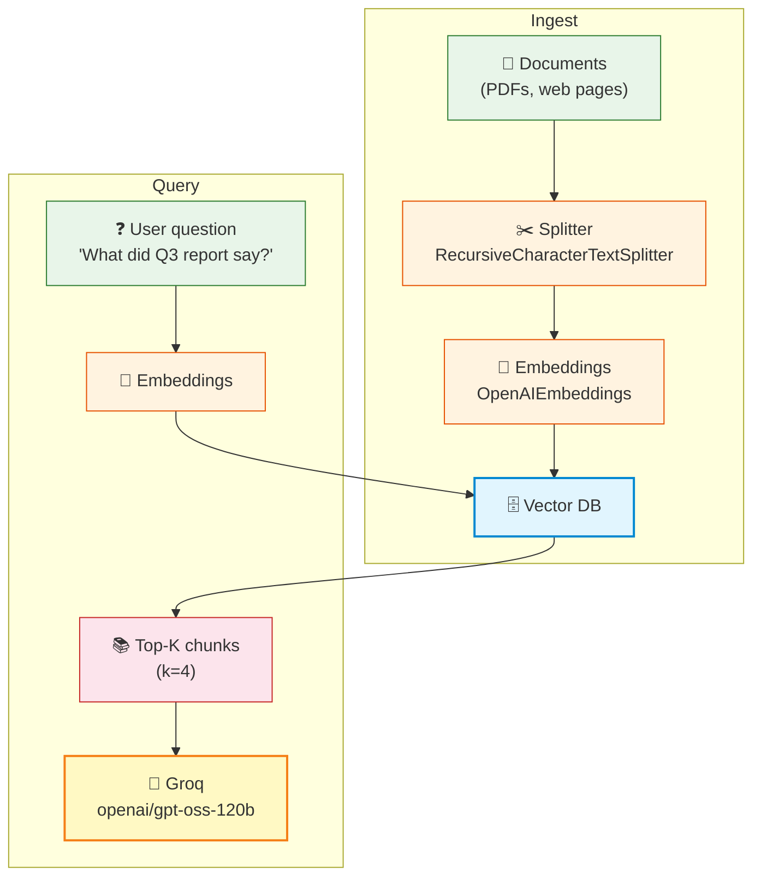
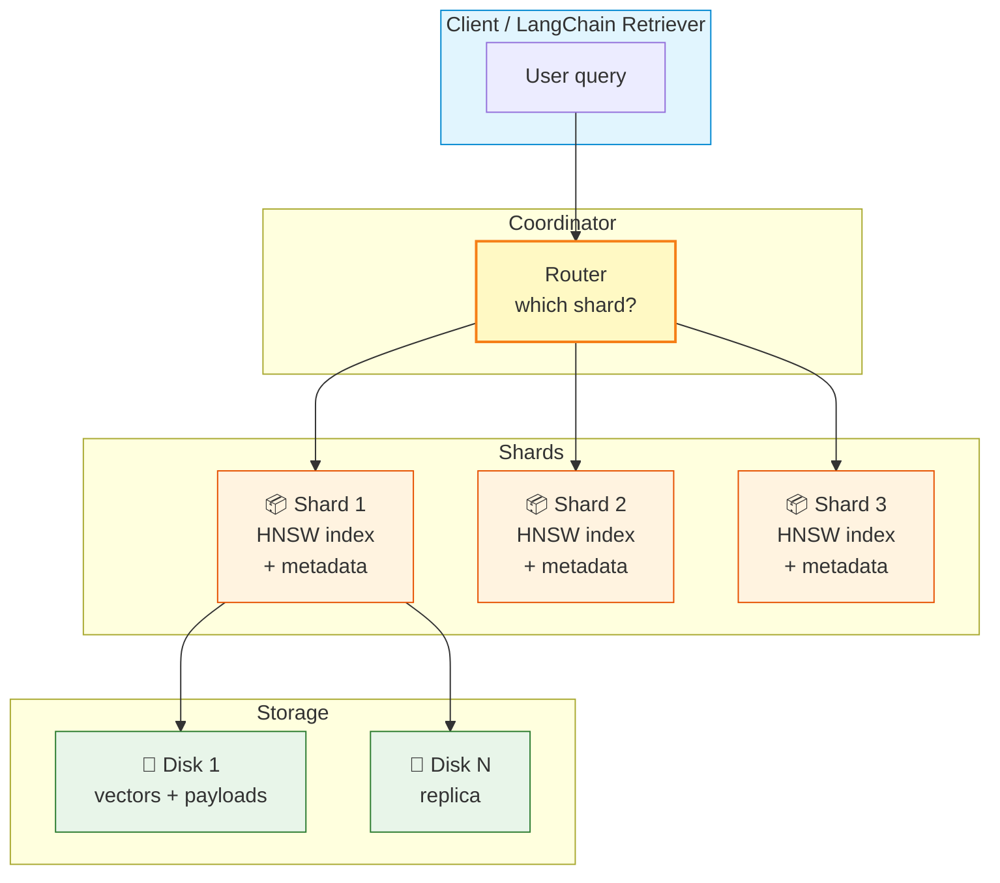
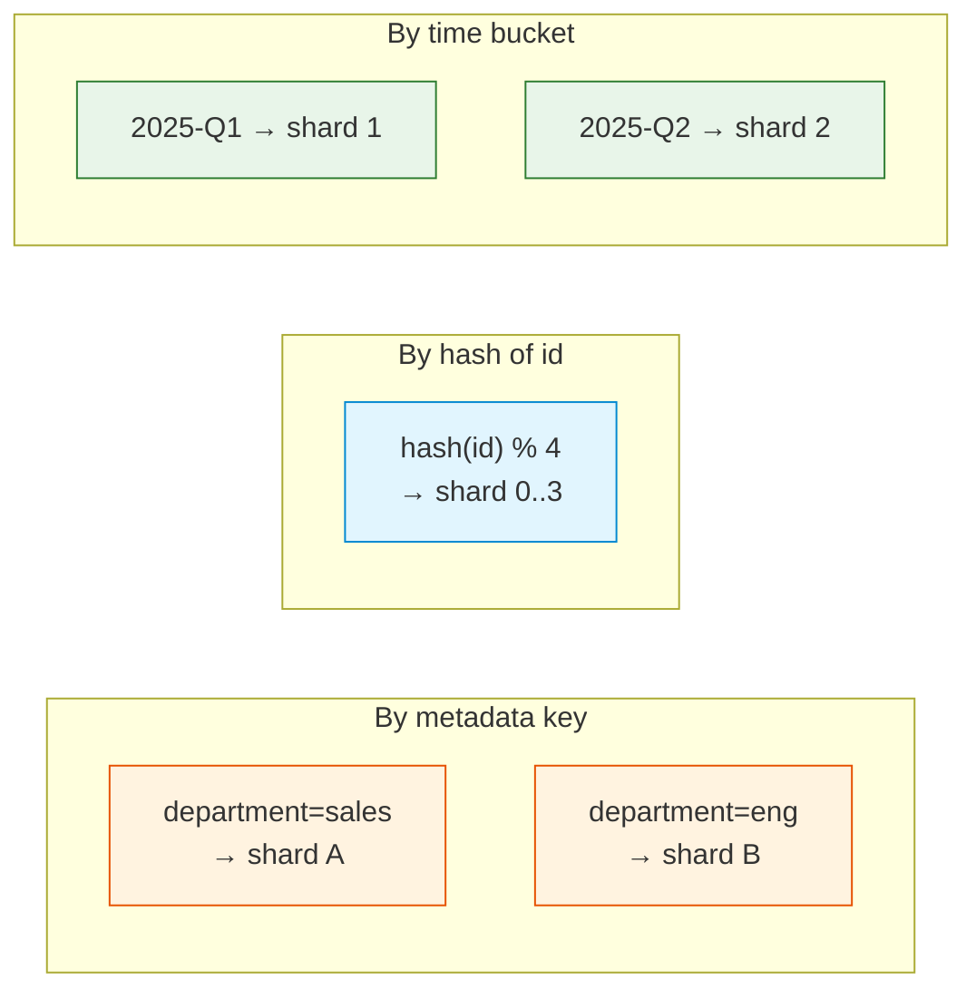

# Vector Database Infrastructure

> **Course Navigation:** Previous: [40-model-serving-and-routing.md](./40-model-serving-and-routing.md) | Next: [42-caching-and-queue-infrastructure.md](./42-caching-and-queue-infrastructure.md)

---

## Why This Lesson Matters

Your agent must "remember" things — PDFs you uploaded, past chats, your company wiki. There are too many to fit in a prompt. The solution: **vector databases**. They store text as numbers (embeddings) so the agent can find the most relevant chunks *before* asking the LLM.

This lesson covers **five vector DBs**, when to use each, how to pick embeddings, tune the index, shard, filter, and compare costs. We use **Chroma locally** because it's free and zero-setup — perfect for this course. We compare it to production options so you know what to switch to when you grow.

---

## The Big Picture



Two phases:
1. **Ingest**: documents → chunks → embeddings → DB.
2. **Query**: question → embedding → DB lookup → top-K chunks → LLM.

---

## The Vector DB Choices

| Database | Setup | Persistence | Scale | Cost | Best for |
|----------|-------|-------------|-------|------|----------|
| **Chroma** | `pip install` | Local file | <1M vectors | Free | This course, local dev |
| **Qdrant** | Docker or cloud | Disk + RAM | 10M+ | Self: free / Cloud: paid | Production, self-host |
| **Weaviate** | Docker or cloud | Disk + RAM | 10M+ | Self: free / Cloud: paid | Hybrid search (text + vector) |
| **Pinecone** | Managed only | Cloud | Billions | Free tier / paid | Managed scale, no ops |
| **pgvector** | Postgres extension | Postgres | 10M | Self: free | Reuse existing Postgres |

**Course pick:** Chroma, because it's free, runs locally, and uses the same LangChain interface as the others. Move to Qdrant or Pinecone when you need scale.

---

## Embedding Model Selection

Cheaper than LLMs but still costs money. Pick based on quality, language, and price.

| Embedding model | Dim | Price / M tokens | Quality | Speed |
|------------------|-----|------------------|---------|-------|
| `text-embedding-3-small` (OpenAI) | 1536 | $0.02 | Good | Fast |
| `text-embedding-3-large` (OpenAI) | 3072 | $0.13 | Best | Medium |
| `nomic-embed-text` (Ollama) | 768 | Free | Decent | Slow (local) |
| `BAAI/bge-small-en` (HF) | 384 | Free | Good | Depends |
| `sentence-transformers/all-MiniLM-L6-v2` | 384 | Free | OK | Fast (local) |

**Course pick:** `text-embedding-3-small` — cheap enough for free, good quality, server-side.

```python
from langchain_openai import OpenAIEmbeddings

embeddings = OpenAIEmbeddings(model="text-embedding-3-small")
# INVESTIGATE: vector dim
sample = embeddings.embed_query("hello world")
print(len(sample))  # 1536
```

---

## Quick Start: Chroma Locally

```python
# -- chroma_basics.py --
from langchain_chroma import Chroma
from langchain_openai import OpenAIEmbeddings
from langchain_text_splitters import RecursiveCharacterTextSplitter

embeddings = OpenAIEmbeddings(model="text-embedding-3-small")

# 1. Create a persistent store
vectorstore = Chroma(
    collection_name="course_docs",
    embedding_function=embeddings,
    persist_directory="./chroma_db",  # saved to disk
)

# 2. Add documents
texts = [
    "LangChain is a framework for building LLM apps.",
    "Groq offers fast inference using LPUs.",
    "Chroma is an open source vector database.",
    "RAG stands for retrieval-augmented generation.",
    "Vector databases store embeddings for similarity search.",
]
splitter = RecursiveCharacterTextSplitter(chunk_size=200, chunk_overlap=20)
docs = splitter.create_documents(texts)
ids = vectorstore.add_documents(docs)

print(f"Added {len(ids)} chunks. Total in DB now.")

# 3. Query
results = vectorstore.similarity_search("Where do embeddings live?", k=2)
for r in results:
    print(":", r.page_content)

# 4. Use as a retriever (the LangChain idiom)
retriever = vectorstore.as_retriever(search_kwargs={"k": 3})
for doc in retriever.invoke("What is RAG?"):
    print("hit:", doc.page_content)
```

Run it twice — the second time you'll see chunks already present (persisted across runs).

---

## Production Upgrade: Qdrant

When Chroma feels slow or you want to scale, switch to Qdrant. The LangChain interface barely changes.

```python
# -- qdrant_setup.py --
# First: docker run -p 6333:6333 qdrant/qdrant
from langchain_qdrant import QdrantVectorStore
from langchain_openai import OpenAIEmbeddings
from qdrant_client import QdrantClient
from qdrant_client.models import Distance, VectorParams

client = QdrantClient(host="localhost", port=6333)
# Create collection (one-time)
client.create_collection(
    collection_name="course_docs",
    vectors_config=VectorParams(size=1536, distance=Distance.COSINE),
)

vectorstore = QdrantVectorStore(
    client=client,
    collection_name="course_docs",
    embedding=OpenAIEmbeddings(model="text-embedding-3-small"),
)
```

Same `add_documents` / `similarity_search` / `as_retriever` API. The only swap: the constructor.

---

## Vector DB Architecture Deep Dive



Key ideas:
- **HNSW** (Hierarchical Navigable Small World) is the default index — fast近似 search.
- **Sharding** splits the collection across machines for scale.
- **Replication** keeps copies in case a node dies.
- **Metadata** — each vector has a JSON payload (source, page, timestamp).

---

## Index Tuning Basics

The two knobs every beginner should know:

### Knob 1: `ef` (search depth)

`HNSW` walks a graph. Higher `ef` → deeper search → more accurate but slower.

```python
# Qdrant
results = client.query_points(
    collection_name="course_docs",
    query=[0.1, 0.2, ...],
    limit=5,
    search_params={"hnsw_ef": 256},  # default 128; higher = slower + better
).points
```

### Knob 2: `m` (graph fan-out)

Build-time param — affects recall and memory.

```python
client.create_collection(
    "course_docs",
    vectors_config=VectorParams(size=1536, distance=Distance.COSINE),
    hnsw_config={"m": 32, "ef_construct": 128},
)
```

**Rule of thumb:** start with defaults. Only tune when latency > 100ms or recall < 90%.

---

## Metadata Filtering

You often only want chunks that have a certain tag. Without metadata filtering, you'd build separate collections per tag (wasteful).

```python
# -- metadata_filter.py --
from langchain_chroma import Chroma
from langchain_openai import OpenAIEmbeddings

vs = Chroma(
    collection_name="wiki",
    embedding_function=OpenAIEmbeddings(model="text-embedding-3-small"),
    persist_directory="./chroma_db",
)

# Each doc can have a metadata dict
vs.add_texts(
    ["Sales were up 12% in Q1.", "Engineering hired 8 people in Q1.", "Marketing cut budget in Q2."],
    metadatas=[
        {"department": "sales", "quarter": "Q1"},
        {"department": "engineering", "quarter": "Q1"},
        {"department": "marketing", "quarter": "Q2"},
    ],
)

# Filter: only Q1 documents
results = vs.similarity_search(
    "people changes",
    k=5,
    filter={"quarter": "Q1"},
)
for r in results:
    print(r.metadata, r.page_content)
```

Supported filters (Chroma): `$eq`, `$ne`, `$gt`, `$gte`, `$lt`, `$lte`, `$in`. Combinations with `$and`, `$or`.

---

## Sharding Strategies

Once you have more than ~5M vectors on one node, shard. Three patterns:



**Pick the strategy that matches your queries:**
- If you always filter by `department` → shard by department.
- If queries don't have a natural key → hash by id (good distribution).
- If queries are time-bounded (logs, chats) → shard by time bucket.

---

## Cost and Latency Comparison

| DB | Self-host cost/mo | Managed cost/mo | p50 latency | Setup minutes |
|----|-------------------|-----------------|-------------|----------------|
| Chroma local | $0 | n/a | <5 ms | 2 |
| Qdrant Docker | VPS ~$10 | $25+ Starter | 5–20 ms | 10 |
| Weaviate Docker | VPS ~$10 | $25+ Starter | 10–30 ms | 15 |
| Pinecone | n/a | Free → $70+ | 50–100 ms | 5 (best UX) |
| pgvector | Postgres cost | Supabase ~$25 | 10–40 ms | 10 |

> **Rule:** free + local first (Chroma). When your single machine is too slow or runs out of disk, move to Qdrant self-host. Only pay Pinecone when you must scale to 10M+ vectors without ops.

---

## Putting It All Together: Production-Ready RAG Retriever

```python
# -- production_retriever.py --
from langchain_chroma import Chroma
from langchain_openai import OpenAIEmbeddings
from langchain_text_splitters import RecursiveCharacterTextSplitter
from langchain_core.documents import Document

# 1. Configure embeddings
embeddings = OpenAIEmbeddings(model="text-embedding-3-small")

# 2. Persistent store
vs = Chroma(
    collection_name="company_kb",
    embedding_function=embeddings,
    persist_directory="./chroma_db",
)

# 3. Smart splitter (chunk size + overlap)
splitter = RecursiveCharacterTextSplitter(
    chunk_size=800,
    chunk_overlap=120,
    separators=["\n\n", "\n", ". ", " "],
)

# 4. Add new batch (with metadata for filtering + dedup)
def add_pdf(text: str, source: str, page: int = 0):
    chunks = splitter.create_documents([text], metadatas=[{"source": source, "page": page}])
    vs.add_documents(chunks)

add_pdf("LangChain provides chains to compose LLM calls... page 1 of guide.", "langchain_guide.pdf", 1)
add_pdf("Groq LPUs accelerate inference dramatically... page 2 of guide.", "langchain_guide.pdf", 2)
add_pdf("Sales spiked 30% in Q3 thanks to enterprise deals.", "report_q3.pdf", 1)

# 5. Filtered retriever (MMR for diversity)
retriever = vs.as_retriever(
    search_type="mmr",                       # diverse top-K
    search_kwargs={
        "k": 4,
        "fetch_k": 20,
        "lambda_mult": 0.5,
        "filter": {"source": "langchain_guide.pdf"},
    },
)

for hit in retriever.invoke("How fast is Groq?"):
    print(hit.metadata, hit.page_content)
```

Switch to Qdrant or Pinecone later with the *same retriever interface* — there's no rewrite of your agent code.

---

## Try It Yourself

1. **Build a personal wiki.** Make a `chroma_db` directory. Add 10 chunks of text from your own notes (Slack messages, doc snippets, blog lines you wrote). Query 5 questions and check accuracy.

2. **Tune `chunk_size`.** Re-add the same content with `chunk_size=200` and `chunk_size=2000`. Query each. Which gives better answers? Which gives shorter (cheaper) context for the LLM?

3. **Add metadata filters.** Take your personal wiki from step 1 and add `{"topic": "work"}` or `{"topic": "personal"}` to chunks. Then filter for only "work" chunks. Confirm only those are returned.

4. **Measure latency.** Use `time.perf_counter()` around `similarity_search(...)` with 1 vs 100 vs 1000 chunks. Plot the time. When does it cross 100ms?

---

## Common Mistakes

- **Embedding the LLM's output into the DB on every chat turn.** Unless you specifically want "the agent's own answers" as retrieval material, don't do this — it pollutes the corpus.
- **Mixing embedding models.** If you retune to `text-embedding-3-large`, all existing vectors made with `-small` are *invalid*. Re-embed the whole collection.
- **Forgetting chunk overlap.** With `chunk_overlap=0`, you cut important context exactly at the chunk boundary. Use 10–20% overlap.
- **Using `k=10` when pages are long.** 10 long chunks = 8000+ tokens, blowing your prompt window. Use `k=4` and `chunk_size=500` first.
- **Treating Chroma `persist_directory` as backup-able while open.** Always close the client before `cp -r`. Or use Chroma HTTP server, which is safer.
- **Not measuring recall.** You don't know if vector search is bad unless you label some queries as "expected to return chunk X" and check.

---

## What You Learned

- The 2 phases of a vector DB: **ingest** (split, embed, store) and **query** (embed, search, top-K to LLM).
- **Chroma** (free, local) is the course default; **Qdrant** (self-host) or **Pinecone** (managed) are production upgrades.
- Embedding models differ in **dimension**, **price**, and **quality** — `text-embedding-3-small` is the sweet spot for free use.
- **HNSW** is the default index; tune `ef` (search depth) and `m` (graph fan-out) only when needed.
- **Metadata filtering** beats creating one collection per tag.
- **Shard** by query pattern (key / hash / time-bucket).
- Cost grows sublinearly — first scale to one node (~5M vectors), then shard.

---

> **Next:** [42-caching-and-queue-infrastructure.md](./42-caching-and-queue-infrastructure.md) — Stop paying for duplicate LLM calls and stop hanging users on long tasks.