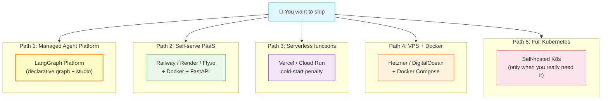
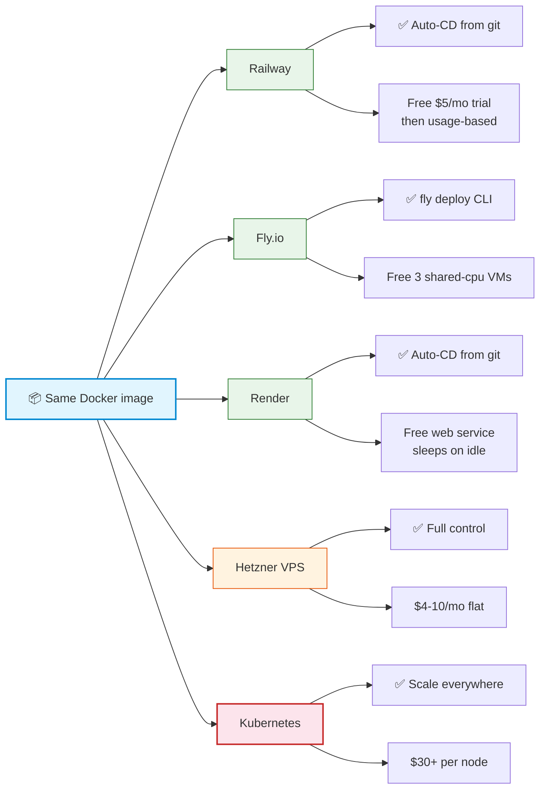

# Deployment Platforms for AI Agents

> **Course Navigation:** Previous: [42-caching-and-queue-infrastructure.md](./42-caching-and-queue-infrastructure.md) | Next: [44-testing-agents.md](./44-testing-agents.md)

---

## Why This Lesson Matters

A working agent on your laptop is **not** a product. To let real users talk to it, your code needs to run somewhere that has:

- A public URL.
- 24/7 uptime.
- Auto-restart on crash.
- Autoscaling when traffic spikes.
- Zero-downtime deploys.

There are many options. Picking wrong wastes hours. This lesson walks you through the **five main deployment paths**, compares them, and shows you how to ship a real LangGraph agent to a free platform today — using our Groq `openai/gpt-oss-120b` model.

---

## The Five Deployment Paths



| Path | Cost to start | Time to ship | Best for |
|------|---------------|-------------|----------|
| LangGraph Platform | Free dev tier | Minutes | LangGraph-heavy apps |
| Railway / Fly.io / Render + Docker | $0-5/mo trial | ~1 hour | General apps (course pick) |
| Serverless (Vercel/Cloud Run) | Free tier | ~30 min | Bursts, no long tasks |
| VPS + Docker | ~$5/mo | ~2 hours | Cost-capped, full control |
| Kubernetes | Hardware+人力 | Days | Massive scale, ops team |

**Course recommendation:** **Fly.io free tier** or **Railway hobby** — both support Docker + autoscale + free starter.

---

## What You're Shipping

Before we pick a host, let's standardize the artifact. We ship a **FastAPI app** that wraps a LangGraph agent. The Docker image is identical across Railway, Fly.io, Render, VPS, and (almost) K8s.

```python
# -- app.py (FastAPI + LangGraph agent) --
import os
from fastapi import FastAPI
from pydantic import BaseModel
from langchain_groq import ChatGroq
from langchain_core.tools import tool
from langgraph.prebuilt import create_react_agent
from langgraph.checkpoint.memory import MemorySaver

os.environ.setdefault("LANGSMITH_TRACING", "true")

app = FastAPI(title="LangChain agents course API")

@tool
def calculator(expression: str) -> str:
    """Evaluate math expression."""
    try:
        return str(eval(expression, {"__builtins__": {}}, {}))
    except Exception as e:
        return f"Error: {e}"

model = ChatGroq(model="openai/gpt-oss-120b", temperature=0.7, max_tokens=512)
agent = create_react_agent(model, [calculator], checkpointer=MemorySaver())

class AskRequest(BaseModel):
    question: str
    thread_id: str = "default"

@app.get("/health")
def health():
    return {"status": "ok"}

@app.post("/ask")
def ask(req: AskRequest):
    result = agent.invoke(
        {"messages": [{"role": "user", "content": req.question}]},
        config={"configurable": {"thread_id": req.thread_id}},
    )
    return {"answer": result["messages"][-1].content}
```

---

## The Docker Image (Universal)

```dockerfile
# -- Dockerfile --
FROM python:3.11-slim

WORKDIR /app

# System deps (for some packages like chroma/psycopg)
RUN apt-get update && apt-get install -y --no-install-recommends build-essential && rm -rf /var/lib/apt/lists/*

COPY requirements.txt .
RUN pip install --no-cache-dir -r requirements.txt

COPY app.py .

EXPOSE 8000
CMD ["uvicorn", "app:app", "--host", "0.0.0.0", "--port", "8000"]
```

```
# -- requirements.txt --
fastapi==0.115.6
uvicorn[standard]==0.34.0
langchain==0.3.14
langchain-groq==0.2.3
langchain-core==0.3.28
langgraph==0.2.60
pydantic==2.10.4
```

Build and run locally first:

```bash
# Build
docker build -t agent-app .
# Run with your Groq key
docker run -e GROQ_API_KEY=$GROQ_API_KEY -p 8000:8000 agent-app
# Hit it
curl http://localhost:8000/health
curl -X POST http://localhost:8000/ask \
  -H "Content-Type: application/json" \
  -d '{"question": "What is 5 times 7?", "thread_id": "t1"}'
```

---

## Deployment Targets Compared



| Factor | Railway | Fly.io | Render | VPS (Hetzner) | K8s |
|--------|---------|--------|--------|---------------|-----|
| Free tier | $5 credit/mo | Yes 3 shared VMs | Yes (sleeps) | No | No |
| HTTPS auto | Yes | Yes | Yes | DIY (Caddy) | DIY (cert-manager) |
| Autoscaling | Yes | Yes (manual+auto) | Yes (paid) | DIY | Yes (HPA) |
| Zero-downtime | Yes | Yes | Yes paid | DIY (blue/green) | Yes |
| Cold start | ~1s | ~5s | ~30s on free | None | None |
| Logs / metrics | Built-in | `fly logs` | Built-in | DIY (Loki) | DIY (Prometheus) |
| Exit cost | Easy | Easy | Easy | Locked-in data? | High |

---

## Ship in 5 Minutes: Fly.io

```bash
# 1. Install flyctl
brew install flyctl            # macOS
# or: curl -L https://fly.io/install.sh | sh

# 2. Sign in
fly auth login

# 3. In your repo with Dockerfile, run:
fly launch   # answers interactive prompts

# 4. Set secrets
fly secrets set GROQ_API_KEY=your_key_here
fly secrets set OPENAI_API_KEY=your_key_here
fly secrets set LANGSMITH_API_KEY=lsv2_...

# 5. Deploy (re-deploys on git push too)
fly deploy

# 6. Open it
fly open
```

You'll get a URL like `https://agent-app.fly.dev`. Send your friends.

---

## Ship in 5 Minutes: Railway

```bash
# 1. Push your repo to GitHub first
# 2. Go to https://railway.app -> New Project -> Deploy from GitHub repo
# 3. Railway auto-detects Dockerfile
# 4. Add env vars in the Variables tab:
#    GROQ_API_KEY, OPENAI_API_KEY, LANGSMITH_API_KEY
# 5. Trigger deploy. Get URL like https://your-app.up.railway.app
# 6. Every git push re-deploys automatically
```

---

## Ship in 5 Minutes: Render

```bash
# Same as Railway basically: connect GitHub
# Select "Web Service" + Docker
# Add env vars in dashboard
# Free tier sleeps after 15min idle (cold start ~30s)
```

---

## Self-Hosted on a VPS (Hetzner / DigitalOcean)

Best when cost is paramount and you have basic Linux skills.

```bash
# 1. Spin up a $5 Hetzner CX11 (1 vCPU, 2GB RAM)
# 2. SSH in
ssh root@your.server.ip

# 3. Install Docker
curl -fsSL https://get.docker.com | sh

# 4. Copy your repo, build, run with Caddy (auto-HTTPS)
git clone https://github.com/you/agent-app.git && cd agent-app
docker build -t agent-app .
# Run behind Caddy reverse proxy for TLS
docker compose up -d
```

```yaml
# -- docker-compose.yml --
services:
  app:
    image: agent-app
    restart: unless-stopped
    environment:
      - GROQ_API_KEY=${GROQ_API_KEY}
      - OPENAI_API_KEY=${OPENAI_API_KEY}
      - LANGSMITH_API_KEY=${LANGSMITH_API_KEY}
    healthcheck:
      test: ["CMD", "curl", "-f", "http://localhost:8000/health"]
      interval: 30s
      timeout: 5s
      retries: 3

  caddy:
    image: caddy:2
    restart: unless-stopped
    ports: ["80:80", "443:443"]
    volumes:
      - ./Caddyfile:/etc/caddy/Caddyfile
      - caddy_data:/data
    depends_on: [app]

volumes:
  caddy_data:
```

```Caddyfile
# -- Caddyfile --
your-domain.com {
    reverse_proxy app:8000
}
```

Now you have HTTPS, auto-restart, and health checks for ~$5/mo flat.

---

## LangGraph Platform

LangChain ships an opinionated platform for LangGraph apps. It bundles the graph runtime, studio for visual debugging, cron schedulers, and a checkpointer store. Setup:

```bash
# Install the CLI
pip install "langgraph-cli[inmem]"

# Create langgraph.json in your repo
```

```json
{
  "dependencies": ["."],
  "graphs": {
    "agent": "./app.py:graph"
  },
  "env": ".env"
}
```

```python
# Add to app.py
graph = agent  # expose the compiled agent as `graph`
```

```bash
# Run locally
langgraph dev

# Deploy to LangGraph Cloud
langgraph deploy
```

This is **the** way if your whole app is one LangGraph agent. For multi-app, mixed frameworks, libraries, etc., ship your custom FastAPI.

---

## Health Checks and Autoscaling

Autoscalers need a signal — "is this pod alive?". Add `/health` early.

```python
# Health endpoint (already in app.py above)
@app.get("/health")
def health():
    return {"status": "ok"}
```

For deeper checks, add `/ready`:

```python
@app.get("/ready")
def ready():
    # Check deps: Redis, Groq, etc.
    try:
        from langchain_groq import ChatGroq
        m = ChatGroq(model="openai/gpt-oss-120b", max_tokens=1)
        m.invoke("hi")  # tiny ping
        return {"groq": "ok"}
    except Exception as e:
        from fastapi.responses import JSONResponse
        return JSONResponse({"groq": "fail", "err": str(e)}, status_code=503)
```

Autoscaling config examples:

```yaml
# Fly.io fly.toml
[http_service]
  internal_port = 8000
  auto_stop_machines = false   # don't sleep
  auto_start_machines = true
  min_machines_running = 1

[[http_service.checks]]
  grace_period = "10s"
  interval = "30s"
  method = "GET"
  path = "/health"
  timeout = "5s"

[http_service.concurrency]
  type = "requests"
  hard_limit = 100
  soft_limit = 80
```

---

## Zero-Downtime Deploys

**With Fly.io:** `fly deploy` does rolling restarts automatically. New machines start before old ones stop. Zero downtime.

**With Railway + Render:** same — rolling restart is the default.

**With VPS:** manual blue-green:

```bash
docker run -d -p 8001:8000 agent-app:new      # blue (new)
curl -f http://localhost:8001/health
# If ok, swap Caddy upstream to 8001 and stop old
docker stop agent-app:old
```

**With Kubernetes:** Deployment strategy `RollingUpdate` with `maxSurge=1, maxUnavailable=0` — zero downtime.

---

## Comparison Table: One Glance

| Path | Setup time | Free start | SCM | Maintain | Verdict |
|------|-----------|-----------|-----|----------|---------|
| LangGraph Platform | 10 min | Yes dev | Yes | Low | Best for pure LangGraph apps |
| Railway | 5 min | $5/mo trial | Yes | Low | **Course default for apps** |
| Fly.io | 5 min | Yes 3 free VMs | Yes | Low | **Course default for Docker agents** |
| Render | 5 min | Yes (sleeps) | Yes | Low | Lazy weekend projects |
| VPS + Docker | 1 hour | No | No | Medium | When you need fixed cost |
| Serverless | 10 min | Yes | Yes | Low | Bursts only (cold start hurts) |
| Kubernetes | Days | No | No | High | Don't unless you have an ops team |

---

## Try It Yourself

1. **Run the Docker image locally.** Build and run the `Dockerfile` from this lesson. Hit `http://localhost:8000/health`. Confirm "ok".

2. **Ship to Fly.io free tier.** Run `fly launch`. Bind your Groq key. Open the public URL. Send a curl from a different machine (your phone?). You just deployed an agent.

3. **Trigger a redeploy.** Edit a string in `app.py` (e.g., return {"status": "ok", "version": "2"}). Push to GitHub. (Combine with Fly auto-deploy if you set it up, or run `fly deploy`.) Confirm zero downtime by curling in a loop while deploying.

4. **Add an autoscale rule.** Edit `fly.toml` to `min_machines_running=2`. Re-deploy. Visit `fly machines list`. Confirm 2 machines alive. Multiply traffic with `for i in $(seq 1 50); do curl ...; done` and confirm Fly doesn't crash.

5. **Health check it.** Take your prod URL down briefly (delete the Groq key). Curl `/ready`. Confirm 503. Restore key. Curl `/ready`. Confirm 200.

---

## Common Mistakes

- **Shipping `MemorySaver` to production.** Each restart wipes user history. Use SqliteSaver at minimum.
- **No `/health` endpoint.** Autoscalers have nothing to ping. They kill and restart your workers at random.
- **Exposing your API without rate limits.** Bad actors will hammer Groq, blow your free quota, lock you out.
- **Sync long tasks in the request.** A 30s PDF summary blocks your whole API. Use the queue from [Lesson 42](./42-caching-and-queue-infrastructure.md).
- **Forgetting env vars are secrets.** Don't `console.log` them, don't put them in `requirements.txt`, never commit `.env`.
- **Using Render free tier for serious users.** It sleeps after 15 min idle — first request after sleep takes ~30s.
- **Picking Kubernetes because it's "the future".** If your team is <5 people, K8s will cost you more time than it saves. Use Docker + Fly/Railway until you actually need HPA.
- **No rollbacks.** Each deploy should be reversible. Tag your images (`agent-app:v1.2.3`). On Fly: `fly deploy -i agent-app:v1.2.3`.

---

## What You Learned

- There are **5 main deployment paths** for AI agents: Managed (LangGraph), PaaS (Railway/Fly/Render), Serverless, VPS+Docker, Kubernetes.
- **FastAPI + Docker + LangGraph** is a portable pattern that runs on any of them.
- **Fly.io free tier** ships your agent in ~5 minutes with HTTPS, autoscaling, and zero-downtime restarts built in — best course default.
- **Health checks** (`/health`, `/ready`) are mandatory for autoscalers and orchestration.
- **Zero-downtime deploys** are automatic on managed platforms; manual blue-green for VPS; native for K8s.
- **Don't reach for Kubernetes** until you have ops capacity; Docker + Fly/Railway handles thousands of users.
- Every deploy should be **tagged, reversible, and observable**.

---

> **Next:** [44-testing-agents.md](./44-testing-agents.md) — How do you test something non-deterministic? Unit tests for prompts, integration tests for tool wiring, regression suites for behavior.