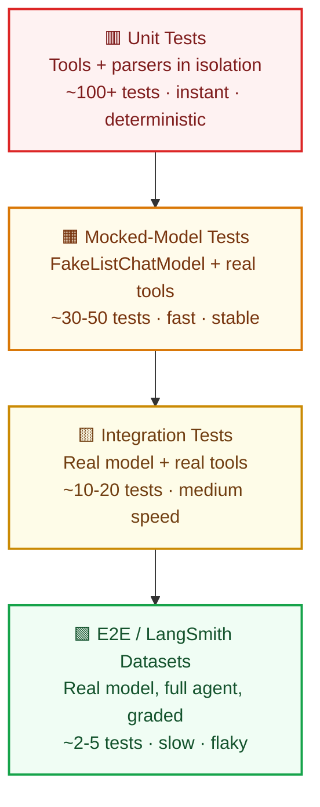
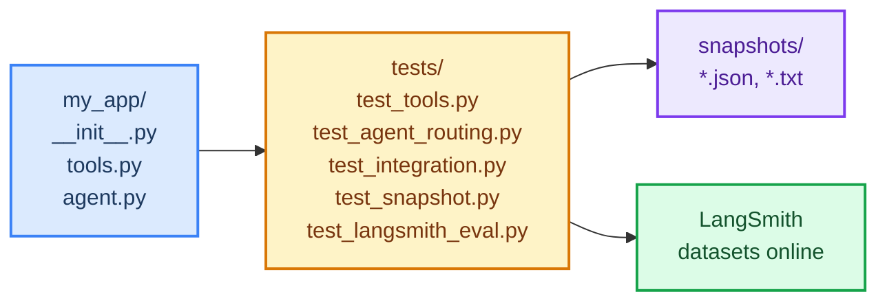

# Testing Your Agents

> **Course Navigation:** Previous: [43-deployment-platforms.md](./43-deployment-platforms.md) | Next: [45-deployment-guide.md](./45-deployment-guide.md)

---

## Why This Lesson Matters

An agent that worked yesterday can break today — not because *your* code changed, but because the model returned a slightly different tool-call format. Agents are **non-deterministic**: same input, different output. That makes testing hard, but it also makes testing **non-negotiable**.

This lesson shows you how to test agents without losing your mind:

- Test **tools** in isolation (fast, deterministic, no model calls).
- **Mock** the model when you only care about your wiring.
- Run **integration tests** with a real model for end-to-end confidence.
- Use **pytest fixtures** to reuse agents cheaply.
- **Snapshot test** outputs so regressions surface as diffs.
- Grade with **LangSmith datasets** for behavior-level testing.

All examples use Groq `openai/gpt-oss-120b` and free tools only.

---

## The Testing Pyramid for AI Agents

Traditional software has a pyramid: lots of unit tests, fewer integration tests, a few end-to-end tests. Agents flip it — the *interesting* failures are at the top, but they are slow and flaky. The trick is to **push as much logic as possible down into deterministic layers**.



| Layer | What you test | Model calls? | Speed | Count |
|-------|---------------|--------------|-------|-------|
| Unit (red) | `@tool` functions, parsers, validators | No | Instant | Many |
| Mocked-model (orange) | Agent wiring, prompt → tool routing | Fake | Fast | Medium |
| Integration (yellow) | Real model + real tools end-to-end | Real | Slow | Few |
| E2E / LangSmith (green) | Behavior on curated datasets | Real | Very slow | Very few |

**Rule of thumb:** if a bug can be caught at a lower layer, push it down. Save real-model tests for things only the model can break.

---

## Layer 1: Unit Testing Tools in Isolation

Tools are the **deterministic** part of your agent. They should have full test coverage *before* you touch the model.

```python
# -- tests/test_tools.py --
from my_app.tools import calculator, fetch_weather, search_docs


def test_calculator_adds():
    """The math tool must return a string, not a float."""
    result = calculator.invoke({"expression": "2 + 2"})
    assert result == "4"


def test_calculator_rejects_garbage():
    """Bad input should return an error string, never raise."""
    result = calculator.invoke({"expression": "import os"})
    assert "Error" in result


def test_fetch_weather_handles_unknown_city():
    """Unknown city → empty/None, not a crash."""
    data = fetch_weather.invoke({"city": "Atlantis"})
    assert data is None or "error" in str(data).lower()


def test_search_docs_returns_list():
    """Doc search must always return a list — even on zero hits."""
    hits = search_docs.invoke({"query": "nonexistent-xyz"})
    assert isinstance(hits, list)
    assert len(hits) >= 0
```

Run with:

```bash
pytest tests/test_tools.py -v
```

These tests run in **milliseconds** and never touch the network. Make tools ~100% unit-tested before moving up.

---

## Layer 2: Mocking Model Responses

When you only want to verify **"if the model decides to call tool X, the agent runs X correctly"**, you do not need a real model. Use `FakeListChatModel` from LangChain — it replays canned responses in order.

```python
# -- tests/test_agent_routing.py --
from langchain_core.language_models import FakeListChatModel
from langgraph.prebuilt import create_react_agent
from my_app.tools import calculator, fetch_weather


def _build_fake_agent(responses):
    """Build an agent whose 'model' returns canned responses in order."""
    fake_model = FakeListChatModel(responses=responses)
    return create_react_agent(fake_model, [calculator, fetch_weather])


def test_agent_calls_calculator_when_model_requests_it():
    """
    Fake model says: 'I will call calculator with 3*7'.
    We assert the calculator tool actually ran and its output appears
    in the final message list.
    """
    canned = [
        # The fake model's reply mimicking a tool-call message.
        # FakeListChatModel accepts AIMessage objects or raw strings.
        "Tool call: calculator with expression '3 * 7'",
    ]
    agent = _build_fake_agent(canned)
    result = agent.invoke({"messages": [{"role": "user", "content": "What is 3 * 7?"}]})
    # The exact assertions depend on your harness; the point is:
    # - no real network call was made
    # - your wiring (tool dispatch, message threading) worked
    last = result["messages"][-1]
    assert last is not None
```

For finer control, patch the model with `unittest.mock`:

```python
# -- tests/test_agent_with_mock.py --
from unittest.mock import MagicMock
from langchain_core.messages import AIMessage
from langgraph.prebuilt import create_react_agent
from my_app.tools import calculator


def test_agent_returns_final_answer_not_tool_error():
    fake_model = MagicMock()
    # First call: model says "I have the answer."
    fake_model.invoke.return_value = AIMessage(content="The answer is 42.")
    fake_model.bind_tools.return_value = fake_model

    agent = create_react_agent(fake_model, [calculator])
    result = agent.invoke({"messages": [{"role": "user", "content": "What is the meaning of life?"}]})

    final = result["messages"][-1].content
    assert "42" in final
    # Sanity: no tool-call message leaked into the final answer
    assert "calculator" not in final.lower()
```

**Why mock?** These tests run in <100ms, never hit Groq, and never burn your free quota. They catch wiring bugs.

---

## Layer 3: Integration Tests With a Real Model

Some bugs only surface when the **real model** is in the loop — wrong tool chosen, malformed tool args, endless loops. For these, use a real `ChatGroq` call. Mark them `@pytest.mark.integration` so you can skip them in fast CI runs.

```python
# -- tests/test_integration.py --
import os
import pytest
from langchain_groq import ChatGroq
from langgraph.prebuilt import create_react_agent
from my_app.tools import calculator, fetch_weather

pytestmark = pytest.mark.integration


@pytest.fixture(scope="session")
def real_agent():
    """One real agent per test session — saves time and quota."""
    model = ChatGroq(model="openai/gpt-oss-120b", temperature=0, max_tokens=256)
    return create_react_agent(model, [calculator, fetch_weather])


def test_agent_adds_two_numbers(real_agent):
    result = real_agent.invoke({"messages": [{"role": "user", "content": "What is 15 + 27?"}]})
    answer = result["messages"][-1].content
    assert "42" in answer, f"Expected 42 in answer, got: {answer}"


def test_agent_does_not_loop_forever(real_agent):
    """A confusing question must still terminate within recursion_limit."""
    result = real_agent.invoke(
        {"messages": [{"role": "user", "content": "Tell me a fun fact, then stop."}]},
        config={"recursion_limit": 25},
    )
    assert len(result["messages"]) < 30
```

Run only mocked/unit tests in fast CI:

```bash
pytest tests/ -m "not integration"         # fast, every commit
pytest tests/ -m "integration"            # nightly or pre-merge
```

---

## Pytest Fixtures for Reusable Agents

Fixtures avoid re-creating the model (slow) and the agent (stateful) on every test.

```python
# -- tests/conftest.py --
import os
import pytest
from langchain_groq import ChatGroq
from langchain_core.language_models import FakeListChatModel
from langgraph.prebuilt import create_react_agent
from langgraph.checkpoint.memory import MemorySaver
from my_app.tools import calculator, fetch_weather, search_docs


@pytest.fixture(scope="session")
def groq_model():
    """Real Groq model — created once per test session."""
    return ChatGroq(model="openai/gpt-oss-120b", temperature=0, max_tokens=256)


@pytest.fixture(scope="session")
def fake_model():
    """Canned-response fake model for mocked tests."""
    return FakeListChatModel(responses=["I will call calculator with '6 * 7'."])


@pytest.fixture
def agent_factory(groq_model):
    """Factory so each test gets a fresh agent + memory."""
    def _make(tools=None, use_real=True):
        model = groq_model if use_real else FakeListChatModel(responses=["ok"])
        return create_react_agent(
            model,
            tools or [calculator, fetch_weather, search_docs],
            checkpointer=MemorySaver(),
        )
    return _make


@pytest.fixture(autouse=True)
def _require_groq_key():
    """Skip integration tests if GROQ_API_KEY is missing."""
    if not os.getenv("GROQ_API_KEY"):
        pytest.skip("GROQ_API_KEY not set — skipping integration tests.")
```

Now any test file can ask for `agent_factory` and get a clean agent instantly.

---

## Snapshot Testing Agent Outputs

When output *structure* matters more than exact wording (which it usually does for agents), **snapshot testing** locks in a known-good shape. On every run, the new output is compared against a saved baseline; any drift surfaces as a diff.

```python
# -- tests/test_snapshot.py --
import json
from pathlib import Path
import pytest
from langchain_core.language_models import FakeListChatModel
from langgraph.prebuilt import create_react_agent
from my_app.tools import calculator

SNAP_DIR = Path(__file__).parent / "snapshots"
SNAP_DIR.mkdir(exist_ok=True)


def _fake_agent_fixture():
    """Canned model that deterministically chooses a tool."""
    fake = FakeListChatModel(responses=["call calculator with '10 / 4'"])
    return create_react_agent(fake, [calculator])


def test_calculator_output_shape_matches_snapshot():
    """
    Compare the tool's structure — not exact wording — against a saved file.
    First run creates the snapshot; subsequent runs enforce it.
    """
    result = calculator.invoke({"expression": "10 / 4"})
    snap_path = SNAP_DIR / "calc_10_div_4.json"

    if not snap_path.exists():
        snap_path.write_text(json.dumps(result, indent=2))
        pytest.skip("Snapshot created — re-run to enforce.")

    expected = json.loads(snap_path.read_text())
    assert result == expected, (
        f"Snapshot drift!\n expected: {expected}\n got:      {result}\n"
        f"Delete {snap_path} to regenerate (only if the change is intended)."
    )


def test_agent_message_count_is_stable():
    """Agent should add ~2 messages per loop turn. Lock the count."""
    agent = _fake_agent_fixture()
    result = agent.invoke({"messages": [{"role": "user", "content": "What is 10 / 4?"}]})
    count = len(result["messages"])
    snap_path = SNAP_DIR / "msg_count.txt"
    if not snap_path.exists():
        snap_path.write_text(str(count))
        pytest.skip("Snapshot created.")
    expected = int(snap_path.read_text())
    assert count == expected, f"Message count drifted: {expected} → {count}"
```

**Tip:** re-record snapshots by `rm tests/snapshots/*.json` and re-run CI. Snapshot diffs are a **decision point**, not an auto-failure.

---

## Behavior Testing With LangSmith Datasets

LangSmith lets you define a **dataset** of (input, expected-behavior) pairs, run your agent over all of them, and grade with an evaluator. This is the green E2E layer — small in count, but it catches the bugs only real-model behavior reveals.

```python
# -- tests/test_langsmith_eval.py --
import os
import pytest
from langchain_groq import ChatGroq
from langgraph.prebuilt import create_react_agent
from my_app.tools import calculator, fetch_weather
from langsmith import Client
from langsmith.evaluation import evaluate

pytestmark = pytest.mark.e2e

os.environ.setdefault("LANGSMITH_TRACING", "true")


@pytest.fixture(scope="module")
def target():
    model = ChatGroq(model="openai/gpt-oss-120b", temperature=0, max_tokens=256)
    agent = create_react_agent(model, [calculator, fetch_weather])

    def _run(question: str) -> str:
        result = agent.invoke({"messages": [{"role": "user", "content": question}]})
        return result["messages"][-1].content

    return _run


def _must_mention_42(run, example):
    """A custom evaluator: does the answer contain 42?"""
    return {
        "key": "contains_42",
        "score": 1.0 if "42" in run.outputs.get("output", "") else 0.0,
        "comment": f"Output: {run.outputs.get('output', '')[:80]}",
    }


def test_agent_passes_math_dataset(target):
    client = Client()
    # Assumes you created a dataset named "math-basics" in the LangSmith UI
    # with examples like input="What is 15+27?" expected="42".
    try:
        dataset = client.read_dataset(dataset_name="math-basics")
    except Exception:
        pytest.skip("Create the 'math-basics' dataset in LangSmith first.")

    results = evaluate(
        target,
        data=dataset_name := "math-basics",
        evaluators=[_must_mention_42],
        max_concurrency=2,
    )
    # Fail if any example scored 0.
    failed = [r for r in results.results if r.score == 0.0]
    assert not failed, f"{len(failed)} examples failed the 42 check."
```

This tests **behavior**, not code — exactly what real users care about.

---

## Putting It All Together: One Project Structure



A working `pytest.ini`:

```ini
# -- pytest.ini --
[pytest]
markers =
    integration: tests that call the real Groq model (slow, use quota)
    e2e: tests that run against LangSmith datasets (very slow)
    snapshot: snapshot tests that may auto-create baseline files
addopts = -ra --strict-markers -m "not e2e and not integration"
testpaths = tests
```

- Default `pytest` runs unit + mocked + snapshot tests in seconds.
- `pytest -m integration` runs integration tests.
- `pytest -m e2e` runs LangSmith evaluations (nightly).

---

## Try It Yourself

1. **Write 5 unit tests** for one of your existing `@tool` functions. Cover happy path, empty input, malformed input, and a boundary value. Run `pytest` — confirm all pass in under 1 second.

2. **Add a mocked-model test** using `FakeListChatModel`. Have the fake model "request" your calculator tool. Assert the agent's final message list contains the tool's output. Confirm this test makes **zero** network calls by unplugging your Wi-Fi and re-running it.

3. **Add one integration test** with the real Groq model. Ask `15 + 27` and assert the answer mentions `42`. Mark it `@pytest.mark.integration`. Confirm `pytest -m "not integration"` skips it but `pytest -m integration` runs it. Time both commands.

4. **Create a snapshot test** for calculator output. Delete the snapshot file once, run the test (it should auto-create), then change the calculator to return `float` instead of `str` and re-run (it should fail with a clean diff).

5. **Set up a LangSmith dataset** called `math-basics` in the free LangSmith UI with 3 examples. Fill in the evaluator test above. Run `pytest -m e2e`. Confirm your agent passes 2 of 3 — then improve the failing one.

---

## Common Mistakes

- **Testing with the real model on every commit.** Slow, flaky, and burns your Groq free quota in a week. Default to mocked; reserve real-model for nightly.

- **Asserting exact model wording.** `"The answer is 42."` will break the moment Groq rephrases it as `"That equals 42."`. Assert on **structure** (keys, types, presence of a number), not exact strings.

- **No pytest markers.** Without `integration`/`e2e` markers, you can't run a fast feedback loop. Mark from day one.

- **Re-creating the model on every test.** `ChatGroq(...)` does network warmup. Use a `scope="session"` fixture.

- **Snapshot tests that auto-pass forever.** If a snapshot never fails, you have no test. Periodically re-record and review the diff.

- **Forgetting `recursion_limit`.** An integration test can hang for 60 seconds if the agent loops. Always pass `config={"recursion_limit": 25}`.

- **Mocking too much.** If every test uses `FakeListChatModel`, you never test the real model's behavior. Balance mocked vs. integration — the pyramid, not a single layer.

- **Testing agent code that has side effects.** If your tool writes to a real database, every test pollutes state. Inject a fake DB or use a transactional fixture.

---

## What You Learned

- The **agent testing pyramid** inverts the traditional one: lots of unit tests on tools, fewer mocked-model tests, very few real-model integration tests, and a handful of LangSmith dataset evaluations.
- **Unit tests** on `@tool` functions are fast, deterministic, and should cover ~100% of tool logic before you touch the model.
- **`FakeListChatModel`** lets you test agent wiring (tool dispatch, message threading) with zero network calls and zero quota.
- **Integration tests** with real `ChatGroq` catch model-behavior bugs but are slow and flaky — gate them behind `@pytest.mark.integration`.
- **Pytest fixtures** (`session` scope for the model, factory for fresh-agent-per-test) keep tests fast and isolated.
- **Snapshot tests** lock in output *structure*; drift surfaces as a diff, and a human decides whether the change is a bug or a feature.
- **LangSmith datasets** are the E2E layer: define (input, expected) pairs, run the agent, and grade with custom evaluators.
- Default your `pytest` invocation to skip slow tests (`-m "not integration and not e2e"`) so commits stay fast.

---

> **Next:** [45-deployment-guide.md](./45-deployment-guide.md) — Turn the tested agent from this lesson into a production FastAPI service with Docker, health checks, and a zero-downtime deploy on a free hosting tier.