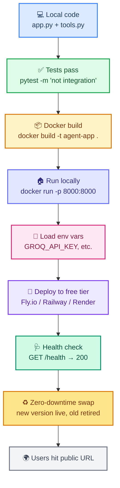
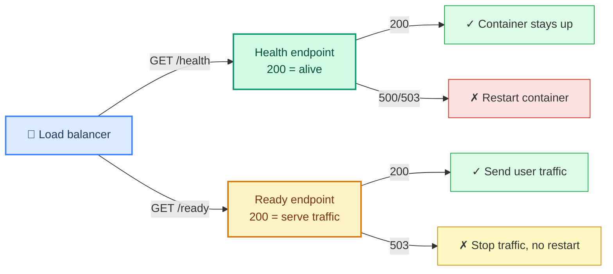
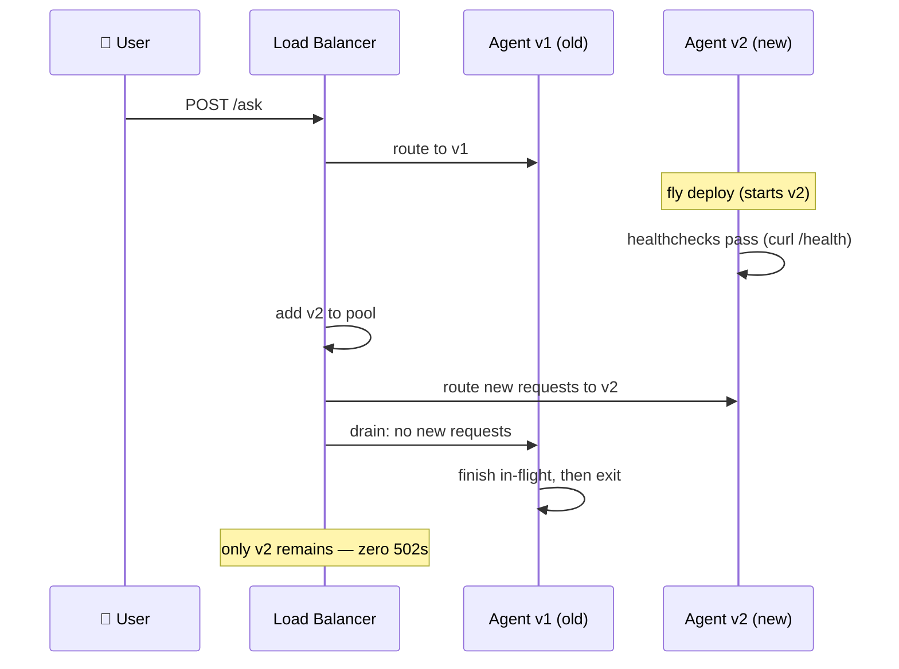

# Deploying Your Agent to Production

> **Course Navigation:** Previous: [44-testing-agents.md](./44-testing-agents.md) | Next: [46-cicd-for-ai-agents.md](./46-cicd-for-ai-agents.md)

---

## Why This Lesson Matters

You have a tested agent from [Lesson 44](./44-testing-agents.md). It works on your laptop. But your laptop sleeps, reboots, and lives behind a NAT. To let real users reach it, you need to **wrap, containerize, run, and deploy**.

This lesson takes you from "Python file on my machine" to "public URL serving real users" — using only free tools and our Groq `openai/gpt-oss-120b` model. You will:

- Wrap your agent in **FastAPI** with a streaming endpoint.
- Containerize with **Docker** so it runs anywhere.
- Add **health check** endpoints autoscalers expect.
- Manage **dev / staging / prod** environments.
- Deploy to a **free hosting tier** (Fly.io / Railway / Render).
- Do **zero-downtime** deploys so users never see a dropped request.

---

## The Deployment Flow



Every step in this diagram is one command. By the end you will have run all of them.

---

## Step 1: Wrap Your Agent in FastAPI

FastAPI gives you a clean HTTP interface, automatic request validation (via Pydantic), and native streaming. Here is the complete production-style `app.py`:

```python
# -- app.py --
import os
import json
import asyncio
from typing import AsyncGenerator

from fastapi import FastAPI, HTTPException
from fastapi.middleware.cors import CORSMiddleware
from pydantic import BaseModel
from dotenv import load_dotenv

from langchain_groq import ChatGroq
from langchain_core.tools import tool
from langgraph.prebuilt import create_react_agent
from langgraph.checkpoint.memory import MemorySaver

load_dotenv()

# --- Tools ---------------------------------------------------------------
@tool
def calculator(expression: str) -> str:
    """Evaluate a math expression and return the result as a string."""
    try:
        return str(eval(expression, {"__builtins__": {}}, {}))
    except Exception as e:
        return f"Error: {e}"


@tool
def echo(text: str) -> str:
    """Echo back the given text — useful for debugging the agent loop."""
    return f"Echo: {text}"


# --- Agent ---------------------------------------------------------------
model = ChatGroq(
    model="openai/gpt-oss-120b",
    temperature=0.7,
    max_tokens=512,
)
agent = create_react_agent(
    model,
    [calculator, echo],
    checkpointer=MemorySaver(),
)

# --- FastAPI app --------------------------------------------------------
app = FastAPI(title="LangChain agents course API", version="1.0.0")
app.add_middleware(
    CORSMiddleware,
    allow_origins=["*"],
    allow_methods=["*"],
    allow_headers=["*"],
)


class AskRequest(BaseModel):
    question: str
    thread_id: str = "default"


class AskResponse(BaseModel):
    answer: str
    thread_id: str


@app.get("/health")
def health():
    """Liveness probe — process is alive. Autoscalers ping this."""
    return {"status": "ok", "version": "1.0.0"}


@app.get("/ready")
def ready():
    """Readiness probe — dependencies (model key) are configured."""
    if not os.getenv("GROQ_API_KEY"):
        raise HTTPException(status_code=503, detail="GROQ_API_KEY not set")
    return {"status": "ready"}


@app.post("/ask", response_model=AskResponse)
def ask(req: AskRequest):
    """Synchronous endpoint — returns the full answer once done."""
    result = agent.invoke(
        {"messages": [{"role": "user", "content": req.question}]},
        config={"configurable": {"thread_id": req.thread_id}},
    )
    answer = result["messages"][-1].content
    return {"answer": answer, "thread_id": req.thread_id}


@app.post("/ask/stream")
async def ask_stream(req: AskRequest):
    """Streaming endpoint — yields answer chunks as SSE-style JSON lines."""
    from fastapi.responses import StreamingResponse

    async def _gen() -> AsyncGenerator[str, None]:
        async for event, chunk in agent.astream(
            {"messages": [{"role": "user", "content": req.question}]},
            config={"configurable": {"thread_id": req.thread_id}},
            stream_mode="messages",
        ):
            if hasattr(chunk, "content") and chunk.content:
                yield json.dumps({"chunk": str(chunk.content)}) + "\n"
        yield json.dumps({"done": True}) + "\n"

    return StreamingResponse(_gen(), media_type="application/x-ndjson")
```

Run locally with:

```bash
pip install fastapi uvicorn python-dotenv langchain-groq langgraph
uvicorn app:app --reload --port 8000
```

Hit it:

```bash
curl -X POST http://localhost:8000/ask \
     -H "Content-Type: application/json" \
     -d '{"question": "What is 15 + 27?", "thread_id": "demo"}'
```

---

## Step 2: The Dockerfile (Universal Artifact)

One Dockerfile runs on Fly.io, Railway, Render, VPS, or even K8s. The platform is just a host.

```dockerfile
# -- Dockerfile --
FROM python:3.11-slim

ENV PYTHONUNBUFFERED=1 \
    PYTHONDONTWRITEBYTECODE=1 \
    PIP_NO_CACHE_DIR=1

WORKDIR /app

# System deps (curl for healthcheck, build-essential for any C-extensions)
RUN apt-get update && apt-get install -y --no-install-recommends \
    curl build-essential \
    && rm -rf /var/lib/apt/lists/*

# Python deps — keep this layer cached by copying requirements first
COPY requirements.txt .
RUN pip install --upgrade pip && pip install -r requirements.txt

# App code
COPY app.py .

EXPOSE 8000

# Healthcheck: every 30s, allow 10s timeout, retry 3 times
HEALTHCHECK --interval=30s --timeout=10s --retries=3 \
  CMD curl -fsS http://localhost:8000/health || exit 1

CMD ["uvicorn", "app:app", "--host", "0.0.0.0", "--port", "8000"]
```

A minimal `requirements.txt`:

```text
fastapi==0.115.0
uvicorn[standard]==0.30.0
python-dotenv==1.0.1
langchain-groq==0.2.0
langgraph==0.2.0
```

Build and run locally:

```bash
docker build -t agent-app .
docker run --env-file .env -p 8000:8000 agent-app
curl http://localhost:8000/health   # → {"status":"ok","version":"1.0.0"}
```

---

## Step 3: Health Check Endpoints

The Dockerfile's `HEALTHCHECK` and the autoscaler's probes both target `/health` (liveness) and `/ready` (readiness). They mean different things:

| Endpoint | Means | Probe type | When failing |
|----------|-------|------------|--------------|
| `/health` | "The process is alive." | Liveness | Restart the container |
| `/ready`  | "I can serve requests." | Readiness | Stop sending traffic, but don't restart |



This separation is why a missing `GROQ_API_KEY` returns 503 from `/ready` but 200 from `/health`: the process is fine, it just can't serve yet.

---

## Step 4: Environment Management (Dev / Staging / Prod)

Never ship the same env vars everywhere. Use one `.env.dev`, one `.env.staging`, one `.env.prod`. The Docker image stays identical — only the injected env changes.

```python
# -- config.py --
import os


def _load_env_file(path: str):
    """Tiny .env loader — avoids the python-dotenv runtime dep in prod."""
    if not os.path.exists(path):
        return
    with open(path) as f:
        for line in f:
            line = line.strip()
            if not line or line.startswith("#") or "=" not in line:
                continue
            k, v = line.split("=", 1)
            os.environ.setdefault(k.strip(), v.strip().strip('"'))


ENV = os.getenv("APP_ENV", "dev")
_load_env_file(f".env.{ENV}")
_load_env_file(".env")  # optional overrides


def config():
    """Return a stable config dict for the current environment."""
    return {
        "env": ENV,
        "groq_model": os.getenv("GROQ_MODEL", "openai/gpt-oss-120b"),
        "max_tokens": int(os.getenv("MAX_TOKENS", "512")),
        "temperature": float(os.getenv("TEMPERATURE", "0.7")),
        "log_level": os.getenv("LOG_LEVEL", "INFO" if ENV != "prod" else "WARNING"),
    }


SETTINGS = config()
print(f"[boot] env={SETTINGS['env']} model={SETTINGS['groq_model']}")
```

Convention:

| File | Used by | Has real secrets? |
|------|---------|-------------------|
| `.env.dev`    | local dev   | yes — your dev key |
| `.env.staging`| staging URL | yes — a throwaway key |
| `.env.prod`   | production  | yes — never commit, never log |
| `.env.example`| committed | no — placeholder values only |

**Gitignore all real `.env.*` files.** Commit only `.env.example`. Inject real secrets via the hosting platform's dashboard, not the repo.

---

## Step 5: Deploy to a Free Hosting Tier

Pick one of three free-friendly hosts. All take Docker; all give you a public HTTPS URL within minutes.

### Option A: Fly.io (recommended for this course)

```bash
# 1. Install the Fly CLI
brew install flyctl        # macOS
# or: curl -L https://fly.io/install.sh | sh

# 2. Log in and launch
fly auth login
fly launch --no-deploy     # generates fly.toml from your Dockerfile

# 3. Set your Groq key as a secret (stored encrypted, never in the repo)
fly secrets set GROQ_API_KEY=gsk_...

# 4. Deploy
fly deploy

# 5. Open the public URL
fly open
```

A minimal `fly.toml`:

```toml
# -- fly.toml --
app = "my-langchain-agent"
primary_region = "bom"          # Mumbai; pick the closest region

[build]

[http_service]
  internal_port = 8000
  force_https = true
  auto_stop_machines = true     # stop when idle (free tier)
  auto_start_machines = true
  min_machines_running = 0      # 0 = free tier; 1 = no cold starts but paid
  [http_service.concurrency]
    type = "requests"
    hard_limit = 100
    soft_limit = 50

[[http_service.checks]]
  interval = "30s"
  timeout = "5s"
  grace_period = "10s"
  method = "GET"
  path = "/health"
```

### Option B: Railway

```bash
# 1. Install the Railway CLI
npm install -g @railway/cli

# 2. Link and deploy
railway login
railway init                 # creates a new project
railway up --detach          # builds and deploys the Dockerfile

# 3. Set env vars in the Railway dashboard (or via CLI)
railway variables set GROQ_API_KEY=gsk_...

# 4. Generate a public domain
railway domain
```

### Option C: Render

1. Push your code to a GitHub repo.
2. New → **Web Service** → connect the repo.
3. Runtime: **Docker**. Render reads your `Dockerfile` automatically.
4. Add `GROQ_API_KEY` under **Environment**.
5. Click **Create Web Service**. Render gives you `https://your-app.onrender.com`.

> Render's free tier **sleeps after 15 min idle** — first request after sleep takes ~30s. Pick Fly.io or Railway for a project that needs to stay warm.

---

## Step 6: Zero-Downtime Deployment Basics

"Downtime" = users see a 502 while you swap versions. Zero-downtime means **the new version boots fully before the old version goes away**. The flow on Fly.io:



How to do it on each free platform:

| Platform | Zero-downtime mechanism | Command |
|----------|------------------------|---------|
| Fly.io   | Blue-green via machines | `fly deploy` (automatic) |
| Railway  | Rolling deployments    | `railway up --detach` (automatic) |
| Render   | Health-check-gated swap | git push (automatic) |

To **roll back** on Fly.io:

```bash
fly versions             # list past versions
fly deploy -i <image-ref>:<prev-tag>   # redeploy previous image
```

To roll back on Railway: open the dashboard, find the previous deployment, click **Promote to Production**.

**Always tag your images** (`agent-app:v1.2.3`) so rollbacks are one command, not a git revert.

---

## Step 7: Verify the Production Deploy

Once deployed:

```bash
# 1. Hit the health endpoint from a different machine (your phone!)
curl https://your-app.fly.dev/health
# expected: {"status":"ok","version":"1.0.0"}

# 2. Hit readiness — should be 200 with the key set
curl -i https://your-app.fly.dev/ready
# expected: HTTP/1.1 200 OK

# 3. Run the agent end-to-end
curl -X POST https://your-app.fly.dev/ask \
     -H "Content-Type: application/json" \
     -d '{"question":"What is 15 + 27?","thread_id":"prod-test"}'
# expected: {"answer":"The answer is 42.","thread_id":"prod-test"}

# 4. Break readiness: unset the key in the dashboard, then:
curl -i https://your-app.fly.dev/ready
# expected: HTTP/1.1 503 Service Unavailable
#           {"detail":"GROQ_API_KEY not set"}

# 5. Streaming endpoint
curl -N -X POST https://your-app.fly.dev/ask/stream \
     -H "Content-Type: application/json" \
     -d '{"question":"Tell me a one-sentence fun fact.","thread_id":"stream-test"}'
# expected: newline-delimited JSON chunks, ending with {"done":true}
```

If all five pass, you have a production agent.

---

## Try It Yourself

1. **Wrap and run locally.** Save `app.py`, `requirements.txt`, and the `Dockerfile`. Run `uvicorn app:app --reload` and confirm `curl http://localhost:8000/health` returns 200. Then `docker build -t agent-app .` and `docker run --env-file .env -p 8000:8000 agent-app`. Confirm both routes work.

2. **Add a flow test.** Hit `/ask` with a math question and assert the response contains the right number. Then hit `/ask/stream` and confirm you receive at least 2 chunks before `{"done":true}`.

3. **Deploy to Fly.io free tier.** Install `flyctl`, run `fly launch --no-deploy`, `fly secrets set GROQ_API_KEY=...`, and `fly deploy`. Run all 5 verification curls from a different machine than the one you deployed from.

4. **Trigger a redeploy with zero downtime.** Change the version string in `app.py` to `"1.1.0"`, then in one terminal run `fly deploy`, and in another run `while true; do curl -s https://your-app.fly.dev/health; echo; sleep 1; done`. Confirm no `502`s appear during the swap — only the version string changes from `1.0.0` to `1.1.0` mid-stream.

5. **Simulate a key loss.** Remove `GROQ_API_KEY` from Fly secrets (`fly secrets unset GROQ_API_KEY`). Curl `/ready` — you should get 503. Curl `/health` — you should still get 200. Restore the key. Curl `/ready` — back to 200. This proves your probes are wired correctly.

---

## Common Mistakes

- **Shipping `MemorySaver` to production.** Every restart wipes user conversation history. Use `SqliteSaver` (or Postgres) at minimum.

- **One endpoint that does both liveness and readiness.** Then the load balancer can't tell "broken process" from "OK but warming up." Split them: `/health` vs `/ready`.

- **Loading `.env` in production.** Real secrets belong in the platform's secret store (`fly secrets set`), never in a file inside the image.

- **No `EXPOSE` and no `internal_port`.** The container runs but the load balancer can't reach it. Fly: `internal_port = 8000` in `fly.toml`. Render: same in the dashboard.

- **Build dependencies committed to the wrong layer.** Copy `requirements.txt` *before* your app code so Docker can cache the slow pip layer. Otherwise every code edit re-downloads all packages.

- **Using the dev Groq key in prod.** Dev keys get burned by your test runs; prod keys should be separate, rate-limited, and rotated.

- **Forgetting to set `LANGSMITH_TRACING`.** Set it to `"true"` in staging and prod — you'll thank yourself when a production agent goes off the rails and you can replay the trace.

- **No rolling strategy.** If you `fly deploy` without healthchecks configured, Fly may route traffic to a container still booting — users see 502s. Always configure the `[[http_service.checks]]` block.

- **Hardcoding `localhost` inside the Dockerfile's `HEALTHCHECK`.** It must be `http://localhost:8000/health` (the *inside* of the container), never the public URL.

---

## What You Learned

- The **deployment flow** is one command per step: build → run locally → set env → deploy → check → swap.
- **FastAPI** wraps your LangGraph agent with REST endpoints, request validation, and a streaming SSE-style response — all in ~80 lines.
- A single **Dockerfile** is the universal artifact: identical on Fly.io, Railway, Render, VPS, and K8s.
- **`/health` (liveness)** and **`/ready` (readiness)** must be separate endpoints — autoscalers and orchestrators depend on that distinction to decide restart vs drain.
- **Environment files** (`.env.dev` / `.env.staging` / `.env.prod`) keep the image identical across stages while secrets stay out of the repo.
- **Fly.io free tier** is the course default: `fly deploy` gives you HTTPS, autoscaling, and zero-downtime restarts in ~5 minutes.
- **Zero-downtime deploys** happen automatically on managed platforms *if* healthchecks are configured — the new container boots, passes checks, then the old one drains.
- **Rollbacks are one command** when you tag images (`agent-app:v1.2.3`) — never rely on git reverts in production.
- Every production deploy should be **health-checked, observable (LangSmith tracing on), and reversible**.

---

> **Next:** [46-cicd-for-ai-agents.md](./46-cicd-for-ai-agents.md) — Learn the full CI/CD plan: eval gates, versioned artifacts, rollback, API gateway, LLM provider routing, and model tiers.