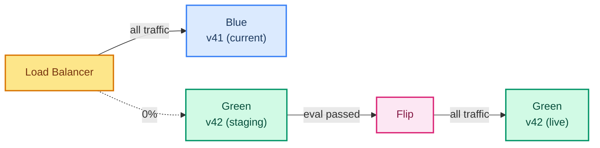
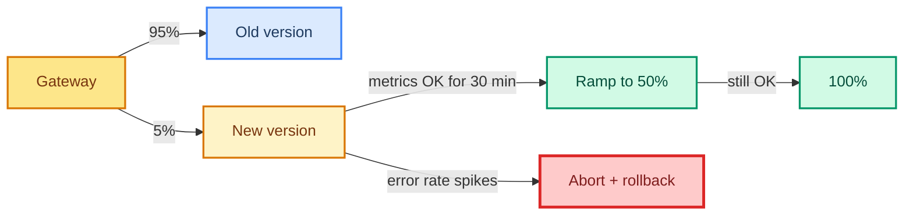
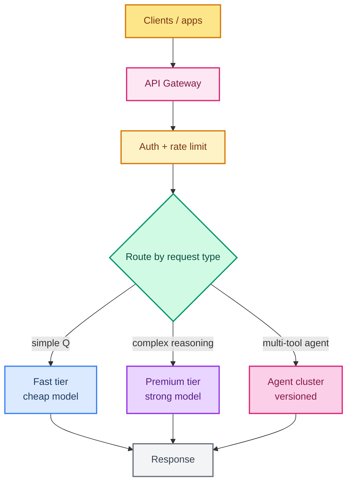
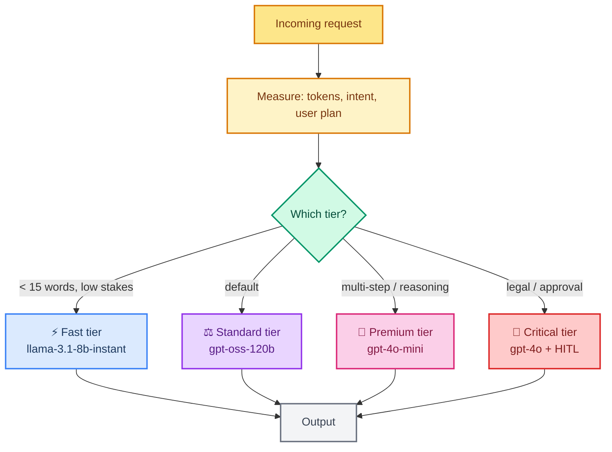

# Chapter 46: CI/CD for AI Agents — Deployment Pipeline, Rollback, API Gateway, and Model Routing

> **Course Navigation:** Previous: [45-deployment-guide.md](./45-deployment-guide.md) | Next: [Project 1 - Podman Troubleshooting Agent](./project-1-podman-troubleshooting-agent.md)

---

## Why This Lesson Matters

Shipping an AI agent is **not** the same as shipping a REST API. A normal service changes when code changes. An AI agent changes when:

- The **code** changes (new tool, new graph edge).
- The **prompt** changes (a single sentence can flip behavior).
- The **model** changes (Groq `openai/gpt-oss-120b` today, a better model next quarter).
- The **tools** change (new MCP server, removed endpoint).
- The **data / RAG store** changes (re-indexed Chroma).

Any of those five — not just code — can silently degrade your agent. That is why you need a **CI/CD pipeline designed for AI**: every change is versioned, every change is validated against evaluation gates before it reaches users, and every release can be **rolled back** in seconds, not hours.

This chapter builds a complete CI/CD plan for AI agent deployment, covering:

1. The **pipeline stages** — what runs on every commit and every release.
2. **Evaluation gates** — how to stop a prompt change that breaks quality.
3. **Deployment strategies** — blue/green, canary, and feature flags.
4. **Rollback** — the safety net when something slips through.
5. The **API gateway** — where agents live behind a single entry point.
6. **LLM provider routing** — fallback chains when a provider is down.
7. **Model tiers** — cheap/fast/premium routing based on request type.

All examples stay within the free-tier stack used across this course: Groq, Chroma, GitHub Actions, FastAPI.

---

## The Big Picture

```mermaid
graph LR
    DEV["👨‍💻 Dev pushes code<br/>prompt / model / tools"] --> CI["CI Pipeline<br/>(every commit)"]
    CI --> EVAL["Evaluation Gates<br/>unit + eval + safety"]
    EVAL -->|"pass"| ART["Versioned Artifact<br/>agent + config + prompts"]
    ART --> GATEWAY["API Gateway<br/>single entry point"]
    GATEWAY --> CANARY["Canary 5%"]
    CANARY --> FULL["Rollout 100%"]
    FULL --> MON["Monitor / LangSmith"]
    MON -->|"regression detected"| RB["Rollback<br/>switch to last-good version"]
    RB --> GATEWAY

    style DEV fill:#fde68a,stroke:#d97706,stroke-width:2px,color:#78350f
    style CI fill:#dbeafe,stroke:#3b82f6,stroke-width:2px,color:#1e3a5f
    style EVAL fill:#d1fae5,stroke:#059669,stroke-width:2px,color:#064e3b
    style ART fill:#e9d5ff,stroke:#9333ea,stroke-width:2px,color:#581c87
    style GATEWAY fill:#fce7f3,stroke:#db2777,stroke-width:2px,color:#831843
    style CANARY fill:#fef3c7,stroke:#d97706,stroke-width:2px,color:#78350f
    style FULL fill:#d1fae5,stroke:#059669,stroke-width:2px,color:#064e3b
    style MON fill:#e0e7ff,stroke:#4f46e5,stroke-width:2px,color:#312e81
    style RB fill:#fecaca,stroke:#dc2626,stroke-width:3px,color:#7f1d1d
```



The core idea: **every deployable unit is a versioned bundle** — code, prompts, model config, tool list, and vector index version. Rollback is then simply "route traffic to the previous bundle", which is fast and safe.

---

## Step 1 — The CI Pipeline (Every Commit)

The pipeline runs on every push and pull request. It is **fast** (minutes, not hours) because heavy evaluation is reserved for releases.

```yaml
# .github/workflows/ci.yml
name: CI

on:
  pull_request:
  push:
    branches: [main]

jobs:
  test:
    runs-on: ubuntu-latest
    steps:
      - uses: actions/checkout@v4

      - uses: actions/setup-python@v5
        with:
          python-version: "3.11"
          cache: "pip"

      - name: Install dependencies
        run: pip install -r requirements.txt -r requirements-dev.txt

      - name: Lint
        run: ruff check agents/ tests/

      - name: Type check
        run: mypy agents/

      - name: Unit tests
        run: pytest tests/unit -q --tb=short

      - name: Tool contract tests
        run: pytest tests/tools -q --tb=short

      - name: Build versioned artifact
        run: ./scripts/build_artifact.sh
```

### What "unit test" means for an agent

An agent is not a pure function, but you can still test the pieces:

```python
# tests/unit/test_comparator.py  (from Project 4)
from comparator import compare

def test_finds_instance_type_drift():
    declared = {"instance_type": "t3.micro"}
    live     = {"instance_type": "t3.large"}
    drifts   = compare(declared, live)
    assert len(drifts) == 1
    assert drifts[0].field == "instance_type"
```

```python
# tests/tools/test_shell_allowlist.py  (from Project 1)
from run_shell import run_shell

def test_blocks_destructive_command():
    result = run_shell("rm -rf /")
    assert result.startswith("[refused]")
```

Never mock your tool contract *so loosely* that a removed tool still passes. Each tool should have a smoke test that calls it against a stub and asserts the exact signature.

---

## Step 2 — Evaluation Gates (The AI-Specific Part)

Unit tests catch broken code, but they do **not** catch "the agent now gives worse answers". That is what evaluation gates are for. They run a fixed set of questions through the candidate agent and compare against a baseline.

```python
# evals/gate.py
import json
from langchain_groq import ChatGroq
from agent import build_agent

GOLDEN_SET = [
    {"input": "What is 15 * 37?",          "expected_tool": "multiply"},
    {"input": "Book me a flight to NYC",   "expected_tool": "book_flight", "needs_hitl": True},
    {"input": "Summarize our Q3 report",   "must_not_use": "delete_records"},
]

def run_gate(tag: str) -> dict:
    """Run golden set against the candidate agent, return pass/fail summary."""
    results = []
    for case in GOLDEN_SET:
        agent = build_agent()
        trace = agent.invoke(case["input"])
        results.append({
            "input": case["input"],
            "used_tool": trace.get("tool_calls"),
            "passed": _check(case, trace),
        })
    return {"tag": tag, "results": results,
            "pass_rate": sum(r["passed"] for r in results) / len(results)}
```

```yaml
# .github/workflows/release.yml (excerpt)
  eval-gates:
    runs-on: ubuntu-latest
    needs: test
    steps:
      - uses: actions/checkout@v4
      - uses: actions/setup-python@v5
        with: { python-version: "3.11", cache: "pip" }
      - run: pip install -r requirements.txt
      - name: Run evaluation gates
        env:
          GROQ_API_KEY: ${{ secrets.GROQ_API_KEY }}
        run: python evals/gate.py --tag $GITHUB_SHA
      - name: Gate policy - at least 95% pass
        run: python evals/check_threshold.py --min 0.95
```

**Gate policy example:** every candidate must score >= 95% on the golden set *and* must not have regressed more than 2% versus the previous release's score. If either fails, the release is blocked.

> The golden set is itself versioned and lives in the repo. When the product changes, you update the golden set in a separate PR — never silently with the agent change, or the gate becomes a rubber stamp.

---

## Step 3 — The Versioned Artifact

A release bundles everything the agent needs so it can be reconstructed exactly:

```yaml
# artifact.yaml (generated by build_artifact.sh)
version: 2026-08-02-1420
model:
  provider: groq
  name: openai/gpt-oss-120b
  temperature: 0.0
prompts:
  supervisor: prompts/supervisor_v12.txt
  diagnostic: prompts/diagnostic_v9.txt
tools:
  - name: run_shell
    checksum: a3f9c1...
  - name: search_fault_kb
    checksum: 77e0a2...
rag_index_version: 41
git_commit: 8f2a9c0d
```

This file is stored in object storage (S3 / GCS / a simple folder) keyed by version. The API gateway reads it at boot to know **which** bundle a given request should run.

```python
# registry.py
import yaml

REGISTRY = "s3://agent-releases/"

def load_artifact(version: str) -> dict:
    import requests
    url = f"{REGISTRY}{version}/artifact.yaml"
    return yaml.safe_load(requests.get(url).text)

def build_agent(version: str):
    cfg = load_artifact(version)
    llm = ChatGroq(model=cfg["model"]["name"], temperature=cfg["model"]["temperature"])
    return create_agent(llm, tools=[...], prompt=open(cfg["prompts"]["supervisor"]).read())
```

---

## Step 4 — Deployment Strategies

You have a versioned artifact. Now decide **how** to put it in front of users. Three strategies, in increasing order of safety:

### 4.1 Blue/Green

Two identical environments (`blue` = current, `green` = new). Run the gate against `green`, then flip the gateway traffic all at once.



**Rollback = flip back.** Zero code changes, zero redeploys.

### 4.2 Canary

Ship to a small percentage (5%), watch metrics, then ramp up.



### 4.3 Feature Flags

The most surgical: every behavior change ships behind a flag (`enable_new_prompt_v12`), and you flip flags per-tenant or per-request without any deploy.

```python
# flags.py
FLAGS = {
    "prompt_v12":  True,   # default on
    "rag_index_41": False, # canary group only
}

def get_flags(user_id: str) -> dict:
    # 5% of users get the new RAG index first.
    return {"rag_index_41": int(user_id) % 20 == 0}
```

---

## Step 5 — Rollback: The Safety Net

Even with gates and canaries, regressions slip through. Rollback must be **instant** and **complete**.

### What you roll back

| Layer | What is rolled back | How fast |
|-------|--------------------|----------|
| Agent code | Previous Docker image | seconds (blue/green) |
| Prompts | Previous prompt file in artifact | seconds (config swap) |
| Model config | Previous model / temperature | seconds |
| RAG index | Previous index version | seconds (pointer swap) |
| Tool list | Previous tool set | seconds (if gateway controls) |

### The rollback playbook

```yaml
# runbook: rollback.md
trigger:
  - error_rate > 5% for 5 consecutive minutes
  - P95 latency > 5s for 10 minutes
  - agent_eval_score drops > 5% vs baseline
  - user reports confirmed regression

actions:
  1. Freeze deploys (CI releases paused).
  2. Gateway: switch active_version to previous known-good.
  3. Confirm error_rate returns to baseline (5 min).
  4. Keep new artifact labeled "degraded" - do NOT delete.
  5. Investigate root cause; fix in a new commit, not by re-deploying the bad one.

post-mortem:
  - what changed
  - why the gate missed it
  - which metric caught it
  - how the golden set should grow
```

### Automatic rollback

In the gateway, wire a watchdog:

```python
# gateway/rollback.py
import time
from registry import load_artifact

def watch_and_rollback(metrics_client):
    while True:
        error_rate = metrics_client.query("agent_error_rate", minutes=5)
        if error_rate > 0.05:
            previous = metrics_client.last_good_version()
            set_active_version(previous)
            alert("Auto-rolled back to", previous)
        time.sleep(60)
```

> Rule of thumb: **always prefer rollback over forward-fix.** Forward-fixing under load means two changes flying at once — the broken one and the fix — and you can't tell which caused the next incident. Roll back, stabilize, then fix calmly.

---

## Step 6 — The API Gateway

The gateway is the single entry point in front of all agent instances. It handles:

1. **Auth** — API keys / OAuth before anything runs.
2. **Routing** — which version / model tier handles the request.
3. **Rate limiting** — per-key, per-tenant budgets.
4. **Canary** — traffic splitting during rollout.
5. **Fallback** — provider failover (next section).
6. **Observability** — every request traced to LangSmith.



A minimal FastAPI gateway:

```python
# gateway/app.py
import os
from fastapi import FastAPI, Header, HTTPException
from registry import build_agent

app = FastAPI()
ACTIVE_VERSION = os.getenv("ACTIVE_VERSION", "2026-08-02-1420")

@app.post("/v1/agent")
async def agent_endpoint(request: dict, x_api_key: str = Header(...)):
    if not is_valid_key(x_api_key):
        raise HTTPException(status_code=401, detail="invalid key")

    version = get_flag_for(x_api_key, "agent_version") or ACTIVE_VERSION
    agent = build_agent(version)
    result = await agent.ainvoke(request["messages"])
    return {"version": version, "output": result}
```

The killer feature: the gateway reads `ACTIVE_VERSION` at **request time**, so switching versions is a config change — not a redeploy.

---

## Step 7 — LLM Provider Routing (Fallback Chains)

Your agent must not die when Groq (or any provider) has an outage. A **model gateway** wraps the LLM and tries providers in order.

```python
# model_gateway.py
from langchain_groq import ChatGroq
from langchain_openai import ChatOpenAI
from langchain_ollama import ChatOllama

def make_routed_llm() -> "BaseChatModel":
    """Try providers in priority order; fall through on failure."""
    providers = [
        ChatGroq(model="openai/gpt-oss-120b", temperature=0.0),          # 1st choice
        ChatOpenAI(model="gpt-4o-mini", temperature=0.0),                # 2nd (paid)
        ChatOllama(model="llama3.2", temperature=0.0),                   # 3rd (local)
    ]

    import itertools
    for provider in itertools.cycle(providers):
        try:
            yield provider
            break
        except Exception:
            continue
```

Because `create_agent` accepts any chat model, you can inject the routed model into the same agent:

```python
from langgraph.prebuilt import create_react_agent

agent = create_agent(next(make_routed_llm()), tools=[...])
```

### Provider health check

Before sending the request, the gateway checks each provider's status and routes around outages:

```python
# router.py
import requests

def healthy_provider() -> str:
    for name, url in [("groq", "https://api.groq.com/openai/v1/models"),
                      ("openai", "https://api.openai.com/v1/models")]:
        try:
            r = requests.get(url, timeout=3)
            if r.status_code == 200:
                return name
        except requests.RequestException:
            continue
    raise RuntimeError("no healthy provider")
```

### What this buys you

| Event | Without routing | With routing |
|-------|----------------|--------------|
| Groq rate limit (429) | Users get errors | Falls through to next provider |
| Groq outage (5xx) | Agent is down | Auto-failover |
| Premium model cost spike | Uncontrolled | Route simple requests to cheap tier |

---

## Step 8 — Model Tiers

Not every request needs the strongest model. Routing by tier cuts costs **dramatically** while keeping quality where it matters.

### The tier table

| Tier | Model (Groq) | Use for | Latency | Cost |
|------|-------------|---------|---------|------|
| Fast | `llama-3.1-8b-instant` | Simple Q&A, classification, tool-name checks | lowest | ~0 |
| Standard | `openai/gpt-oss-120b` | Default agent work, most tool calls | low | ~0 (free tier) |
| Premium | `openai/gpt-4o-mini` (paid) or routed strong model | Complex reasoning, multi-step planning, RAG synthesis | higher | $ |
| Critical | `openai/gpt-4o` (paid) | Legal/financial answers, escalation | highest | $$$ |

### How to route

```python
# tiering.py
TIER_RULES = [
    ("simple",  lambda q: len(q.split()) < 15),
    ("standard", lambda q: True),                     # default
]

def pick_tier(query: str) -> str:
    if len(query.split()) < 15:      return "fast"
    if any(k in query for k in ["reason", "plan", "compare", "summarize"]):
        return "premium"
    if any(k in query for k in ["legal", "compliance", "approve"]):
        return "critical"
    return "standard"

def model_for(tier: str):
    return {
        "fast":     ChatGroq(model="llama-3.1-8b-instant", temperature=0.0),
        "standard": ChatGroq(model="openai/gpt-oss-120b", temperature=0.0),
        "premium":  ChatGroq(model="openai/gpt-4o-mini", temperature=0.0),
        "critical": ChatGroq(model="openai/gpt-4o", temperature=0.0),
    }[tier]
```



### Guardrails for tiering

- **Never send PII to a tier you cannot audit.** Route `critical` requests through the logged, premium path only.
- **Tier downgrade must be explicit**, never silent. Log `"tier: standard (rule: simple)"` on every request so cost spikes are explainable.
- **Pin the model name in the artifact** — a "standard" tier in March may differ from July; the artifact pins it so rollback works.

---

## Step 9 — Observability + Rollback Trigger

You cannot roll back what you cannot see. Wire every request into LangSmith (from [28 - Observability](./28-observability-langsmith.md)) and export the key metrics:

| Metric | Meaning | Rollback if |
|--------|---------|-------------|
| `agent_error_rate` | % of requests ending in error | > 5% for 5 min |
| `agent_latency_p95` | Slow tail | > 5s for 10 min |
| `agent_eval_score` | Golden-set pass rate (sampled) | drops > 5% |
| `tool_failure_rate` | Tool calls failing | > 10% |
| `hitl_approval_rate` | Humans overriding/rejecting | drops sharply (trust lost) |

```python
# monitoring/export.py
from langsmith import Client

client = Client()
traces = client.list_runs(project_name="my-agent", end_time=now, limit=100)
errors = [t for t in traces if t.error]
error_rate = len(errors) / max(len(traces), 1)
print("error_rate", round(error_rate, 4))
```

---

## Putting It All Together

The complete lifecycle, from commit to production:

```yaml
# .github/workflows/release.yml (full)
name: Release
on:
  push:
    tags: ["v*"]

jobs:
  ci:
    uses: ./.github/workflows/ci.yml        # lint, type, unit, tool tests
  eval:
    needs: ci
    runs-on: ubuntu-latest
    steps:
      - uses: actions/checkout@v4
      - run: pip install -r requirements.txt
      - run: python evals/gate.py --tag $GITHUB_SHA
      - run: python evals/check_threshold.py --min 0.95
  build:
    needs: eval
    runs-on: ubuntu-latest
    steps:
      - run: ./scripts/build_artifact.sh
      - run: ./scripts/push_to_registry.sh
  deploy:
    needs: build
    runs-on: ubuntu-latest
    steps:
      - run: ./scripts/deploy_canary.sh 5%         # canary first
      - run: ./scripts/watch_metrics.sh 30         # watch 30 min
      - run: ./scripts/deploy_blue_green.sh full   # then full
  rollback-on-fail:
    needs: deploy
    if: failure()
    runs-on: ubuntu-latest
    steps:
      - run: ./scripts/rollback.sh
```

---

## Portfolio Value for a 4YOE Engineer

| What hiring managers look for | What this chapter shows |
|---|---|
| Production ownership | You can define release gates, canary rollout, and an automatic-rollback playbook — not just "deploy and hope". |
| AI-specific thinking | You know an agent changes via prompts/models/tools, not just code, and designed versioned artifacts + eval gates accordingly. |
| Cost awareness | Model tiers + routing rules show you control spend by design, not after the bill arrives. |
| Resilience | Provider failover chains mean your agent survives a Groq outage. |
| Architecture | The API gateway separates auth, routing, tiering, and observability into one clean entry point. |

In an interview, be ready to explain: *"A rollback for an agent is switching `ACTIVE_VERSION` — because everything is in a versioned artifact — and that's why our rollback takes seconds, not a redeploy."*

---

## Pitfalls and How to Avoid Them

| Pitfall | Fix |
|---|---|
| Prompt change bypasses CI | Treat prompt files as code: version them, gate them, diff them in PRs. |
| Golden set goes stale | Update the eval set in its own PR; block release if eval set itself changed in the same commit. |
| Rollback only covers code | Bundle model + prompts + tools + RAG index version in one artifact so rollback restores *everything*. |
| Canary on agents but not tools | A new tool is a behavioral change too — canary the tool rollout. |
| No rollback trigger metrics | Define the 5 metrics *before* you ship, or you won't know when to roll back. |
| Tiering leaks PII to cheap path | Force `critical` requests through the audited premium path with an explicit route rule. |
| Fallback hides quality loss | Log which provider served each request; if failover is frequent, investigate root cause rather than normalizing it. |

---

## What to Try Next

- Build the golden eval set for **your** Project 4 or Project 5 agent and wire it into GitHub Actions.
- Add a **semantic canary**: route a fixed 1% of real traffic and compare responses against the old version using an LLM judge (see [29 - Agent Evaluation](./29-agent-evaluation.md)).
- Implement the **model gateway** as a FastMCP server so every agent in your repo shares the same routing rules.
- Add **cost accounting**: tag every request with tier + model + token count, and alert when daily cost exceeds a budget.

---

## Recap

You now have a complete CI/CD plan for AI agents:

- A **fast CI pipeline** (lint, type, unit, tool contracts) on every commit.
- **Evaluation gates** that block prompt/model changes that degrade quality.
- **Versioned artifacts** bundling code, prompts, model config, tools, and RAG index.
- **Deployment strategies** — blue/green, canary, and feature flags.
- **Instant rollback** via `ACTIVE_VERSION` switch, with a written playbook.
- An **API gateway** handling auth, routing, rate limits, and traffic splits.
- **LLM provider routing** with fallback chains for outages.
- **Model tiers** (fast/standard/premium/critical) that cut cost without cutting quality.

This is the operational layer that separates a demo agent from a production system — and it is exactly what your portfolio projects (Parts 12) need to look production-ready.

---

> Next up: [Project 1 - Podman Troubleshooting Agent](./project-1-podman-troubleshooting-agent.md) applies these deployment ideas to a real multi-agent system with human-in-the-loop approval.
