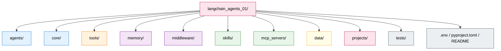
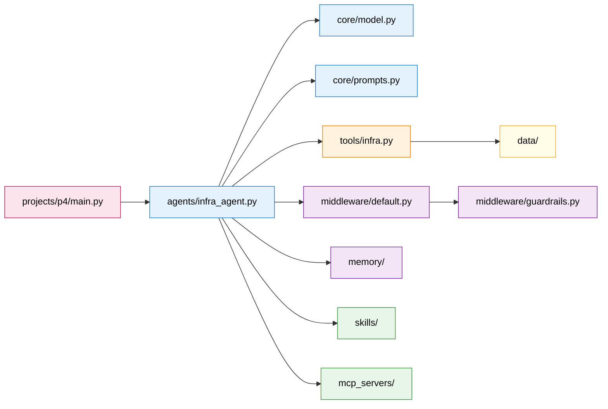

# Production Directory Structure Guide

> **Goal:** A single layout that scales from your first multi-tool agent to a multi-agent production system.
> **Previous chapter:** [Appendix B - Troubleshooting Guide](./appendix-B-troubleshooting.md)
> **Next chapter:** [Appendix D - Glossary of Agentic AI Terms](./appendix-D-glossary.md)

---

## Why A Directory Layout Matters

Tutorials put everything in one `main.py` file. That works for 50 lines. Past 500 lines, you start re-importing tools, copy-pasting middleware, and losing track of which agent uses which `thread_id`. A consistent layout fixes three real problems:

1. **Findability** — you know exactly where the SQL tool lives.
2. **Reusability** — every agent shares the same model factory and checkpointer.
3. **Separation of concerns** — tools, memory, middleware, and agents stay isolated, so you can test them in isolation.

This appendix gives you one layout that fits the entire course.

---

## The Layout at a Glance



```text
langchain_agents_01/
├── agents/
├── core/
├── tools/
├── memory/
├── middleware/
├── skills/
├── mcp_servers/
├── data/
├── projects/
├── tests/
└── docs/
```

---

## Folder-by-Folder

### 1. `agents/` — Agent Factory Functions

**Why it exists:** Every agent is built with `create_agent(...)`. Once you have more than one agent, you will copy the boilerplate. Centralising it in a factory function means the model, system prompt, and middleware wiring live in exactly one place.

**What goes here:**
- One file per agent (or per agent family). Each file exports a `build_<name>_agent()` function, not an instance.
- A `factories.py` with shared builders (e.g. `build_chat_agent(model, tools, **overrides)`).
- A `multi_agent.py` if you compose sub-agents with `SubAgentMiddleware` or LangGraph orchestration.

```python
# agents/infra_agent.py
from langchain.agents import create_agent
from core.model import build_model
from core.prompts import INFRA_SYSTEM_PROMPT
from tools.infra import ALL_INFRA_TOOLS
from middleware.default import DEFAULT_MIDDLEWARE

def build_infra_agent():
    return create_agent(
        model=build_model(),
        tools=ALL_INFRA_TOOLS,
        system_prompt=INFRA_SYSTEM_PROMPT,
        middleware=DEFAULT_MIDDLEWARE,
        name="infra_agent",
        checkpointer=...,
        store=...,
    )
```

```text
agents/
├── __init__.py
├── factories.py            # shared builders
├── infra_agent.py
├── rag_agent.py
├── multi_agent.py          # parent / Orchestrator
└── README.md
```

---

### 2. `core/` — Config, Model, Base Schemas

**Why it exists:** Configuration (API keys, base URLs, temperature) and shared schemas (state, context) are used everywhere. Putting them in `core/` means imports stay stable: `from core.model import build_model`.

**What goes here:**
- `model.py` — the `init_chat_model` factory wrapping Groq `openai/gpt-oss-120b`.
- `config.py` — environment variables, config loader, dataclass or `pydantic-settings` `Settings`.
- `state.py` — base `AgentState` and `RequestContext` schemas reused across agents.
- `prompts.py` — long system prompts, kept out of agent files for editing ease.

```python
# core/model.py
import os
from langchain.chat_models import init_chat_model

def build_model(temperature: float = 0.3):
    return init_chat_model(
        model="openai/gpt-oss-120b",
        model_provider="openai",
        base_url="https://api.groq.com/openai/v1",
        api_key=os.environ["GROQ_API_KEY"],
        temperature=temperature,
    )
```

```text
core/
├── __init__.py
├── model.py
├── config.py
├── state.py
└── prompts.py
```

---

### 3. `tools/` — Custom `@tool` Definitions, Grouped by Domain

**Why it exists:** A 30-tool agent file is unreadable. Grouping by domain (infra, sql, search, slack) means a teammate can find a tool by intent without grepping.

**What goes here:**
- One Python file per domain.
- Each file exports a `list[Tool]` constant (e.g. `ALL_SQL_TOOLS`) for easy import.
- Shared utilities (logging, retries) live in `tools/_utils.py`.

```python
# tools/sql.py
from langchain_core.tools import tool, ToolRuntime

@tool
def run_query(sql: str) -> str:
    """Run a read-only SQL query against the analytics warehouse."""
    runtime = ToolRuntime()
    db_url = runtime.context.db_url        # trusted context, never sent by the model
    return _execute(db_url, sql, read_only=True)

ALL_SQL_TOOLS = [run_query]
```

```text
tools/
├── __init__.py
├── _utils.py
├── infra.py
├── sql.py
├── search.py
└── slack.py
```

---

### 4. `memory/` — Checkpointer and Store Setup, Migrations

**Why it exists:** Short-term memory (`checkpointer`) and long-term memory (`store`) are infrastructure choices. Swapping `InMemorySaver` for `PostgresSaver` should not require touching any agent code.

**What goes here:**
- `checkpointer.py` — factory `build_checkpointer()` returning `InMemorySaver` in dev, `PostgresSaver` in prod based on env.
- `store.py` — factory `build_store()` doing the same for the cross-thread store.
- `migrations.py` — schema diffs when you adopt Postgres (Pg schemas evolve).
- `migrations/` — migration scripts.

```python
# memory/checkpointer.py
import os
from langgraph.checkpoint.memory import InMemorySaver
from langgraph.checkpoint.postgres import PostgresSaver

def build_checkpointer():
    if os.environ.get("ENV") == "prod":
        return PostgresSaver.from_conn_string(os.environ["DATABASE_URL"])
    return InMemorySaver()
```

```text
memory/
├── __init__.py
├── checkpointer.py
├── store.py
├── migrations.py
└── migrations/
```

---

### 5. `middleware/` — Custom Middleware, Guardrails, HITL Logic

**Why it exists:** Middleware is reusable across every agent. Keep the framework's built-ins chained here; add custom ones as separate files.

**What goes here:**
- `default.py` — the canonical `DEFAULT_MIDDLEWARE` list imported by every agent.
- `guardrails.py` — producer functions for input validation.
- `hitl.py` — interrupt/resume helpers for human approval.
- `custom/` — one file per bespoke middleware (e.g. `custom/audit_log.py`).

```python
# middleware/default.py
from langchain.agents.middleware import (
    SummarizationMiddleware,
    ModelRetryMiddleware,
    ToolRetryMiddleware,
)
from .guardrails import input_guardrail

DEFAULT_MIDDLEWARE = [
    input_guardrail,                       # outermost
    ModelRetryMiddleware(max_retries=5),
    SummarizationMiddleware(max_tokens=60000),
    ToolRetryMiddleware(max_retries=2),
]
```

```text
middleware/
├── __init__.py
├── default.py
├── guardrails.py
├── hitl.py
└── custom/
    ├── audit_log.py
    └── rate_limit.py
```

---

### 6. `skills/` — Agent Skills as Markdown Files

**Why it exists:** Skills are `.md` files loaded at runtime by `SkillsMiddleware`. They let you change agent behaviour without redeploys. Keeping them in `skills/` keeps them version-controlled and grepable.

**What goes here:**
- One `.md` per skill, with YAML frontmatter (title, description, when_to_use).
- Optionally grouped into subfolders by domain.

```markdown
---
title: Postmortem Writer
description: Helps draft a service postmortem from incident notes.
when_to_use: user asks about root cause or postmortem
---

# Postmortem Writer

## When To Use This Skill
...

## Steps
1. ...
```

```text
skills/
├── postmortem.md
├── drift_audit.md
└── infra/
    └── terraform_audit.md
```

---

### 7. `mcp_servers/` — FastMCP Server Definitions

**Why it exists:** When you build your own MCP servers (e.g. wrapping internal APIs), treat them like microservices with their own code and tests.

**What goes here:**
- One subfolder per server, each with its own `server.py` and `pyproject.toml` (or `setup.py`).
- Documented list of tools the server exposes in `README.md`.

```python
# mcp_servers/audit/server.py
from fastmcp import FastMCP

mcp = FastMCP(name="audit")

@mcp.tool
def list_findings(severity: str = "high") -> str:
    """List audit findings filtered by severity."""
    return "..."

if __name__ == "__main__":
    mcp.run()
```

```text
mcp_servers/
├── audit/
│   ├── server.py
│   ├── README.md
│   └── pyproject.toml
└── billing/
    └── ...
```

---

### 8. `data/` — RAG Documents, SQLite DBs, Vector DB Files

**Why it exists:** Tests and demos need sample data; production needs vector indexes. Keeping them under `data/` keeps them out of source tree (add to `.gitignore` for the production artifacts).

**What goes here:**
- `raw/` — original documents (PDFs, markdown) for RAG ingestion.
- `chunks/` — pre-split chunks for deterministic embeddings.
- `vectors/` — Chroma / FAISS index files (gitignored in prod, kept for tutorials).
- `dbs/` — SQLite files used by store/checkpointer in dev.

```text
data/
├── raw/
│   └── runbooks/
├── chunks/
├── vectors/           # gitignore in prod
└── dbs/
    └── agent_memory.db
```

Add `.gitignore` lines:
```gitignore
data/vectors/
data/dbs/
```

---

### 9. `projects/` — Full Project Entry Points

**Why it exists:** Each course project (Project 1 through Project 5) has a runnable demo. The `projects/` folder hosts these entry points so they don't clutter the package code.

**What goes here:**
- One subfolder per project.
- Each contains `main.py` plus any project-specific fixtures (mock data, sample prompts).
- Agent builders stay in `agents/`; `main.py` imports and wires them.

```python
# projects/p4_drift/main.py
from agents.infra_agent import build_infra_agent
from memory.checkpointer import build_checkpointer
from memory.store import build_store
from langchain_core.messages import HumanMessage

agent = build_infra_agent()
config = {"configurable": {"thread_id": "demo"}}

for chunk in agent.stream({"messages": [HumanMessage("check ec2 drift")]}, config,
                         stream_mode="messages"):
    print(chunk[0].content, end="")
```

```text
projects/
├── p1_podman/
│   ├── main.py
│   └── README.md
├── p2_etl/
├── p3_search/
└── p4_drift/
```

---

## Putting It All Together



The blue nodes (`core/` and `agents/`) are the spine. Orange (`tools/`) is the action surface. Purple (`memory/`, `middleware/`) is runtime configuration. Green (`skills/`, `mcp_servers/`) is capability extension. Yellow (`data/`) is offline input. Pink (`projects/`) is the user-facing entrypoint.

---

## Minimal Starter `template/`

To bootstrap a new agent from this layout:

```bash
mkdir -p agents core tools memory middleware skills mcp_servers data projects/tests tests
touch agents/__init__.py core/__init__.py tools/__init__.py memory/__init__.py \
      middleware/__init__.py tests/__init__.py
```

Copy that into every new repo.

---

> **Next:** [Appendix D - Glossary of Agentic AI Terms](./appendix-D-glossary.md) defines every term used in the course in plain English.