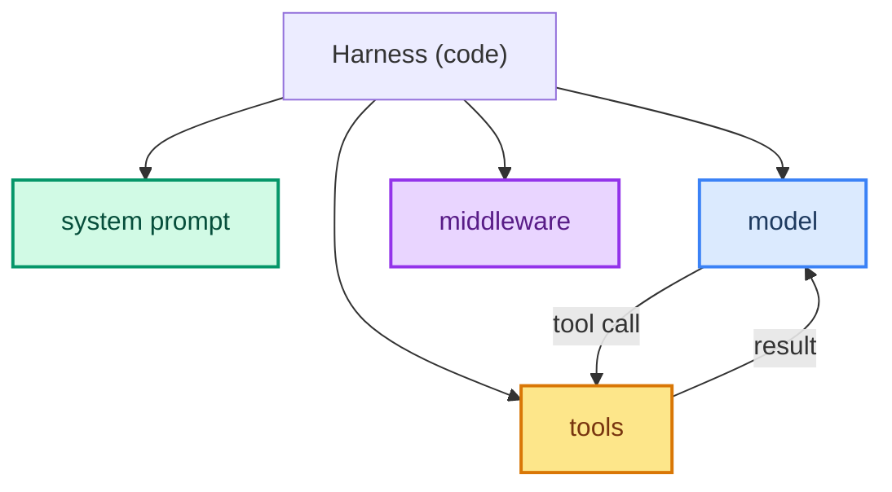

# Harness Engineering: Shaping the Code Around the Model

> **What this is:** Detailed engineering notes on the **harness** — the code that wraps and drives the model to turn it into an agent. The short version of the idea: **Agent = Model + Harness** (ch 14). The harness is everything *around* the model: the system prompt, the tools, and especially the **middleware** that reshapes every request and response.

---

## Harness vs Loop

These two folders are two halves of the same engine. Read them together.

| | Harness engineering (this folder) | Loop engineering (sibling folder) |
|--|-----------------------------------|-----------------------------------|
| Scope | The structure **around** each model/tool call | The repeating **cycle** of calls |
| Lens | Per-event, per-call | Whole-run, per-step state |
| Tools | Middleware hooks, prompts, tool schema | Graph edges, checkpoints, budgets |
| Answer | *"What runs before/after each call?"* | *"When does the whole run stop?"* |

An engine needs both: the harness makes each event safe and well-formed; the loop makes the run finite and resumable. See [sibling folder root](./loop-engineering/00-readme.md).

---

## Folder Map

```
docs/harness-engineering/
├── 00-readme.md              ← you are here
├── 01-model-and-harness.md   ← the model+harness decomposition
├── 02-the-pipeline.md        ← middleware hooks before/after model+tool
├── 03-tools.md               ← exposing functions as tools
├── 04-memory.md              ← short-term vs long-term state
├── 05-guardrails.md          ← input/output guards on the harness
├── 06-prompt-engineering.md  ← how the system prompt steers behavior
└── 07-production-hardening.md ← making the harness production-ready
```

---

## The One Idea

Model alone has no agency — it answers once. Add a **harness** (tools + prompt + middleware) and you get an agent that *does* things. The model is the brain; the harness is the spine, limbs, and nerves that act on its command.



Start here: [01 - Model + Harness](./01-model-and-harness.md)