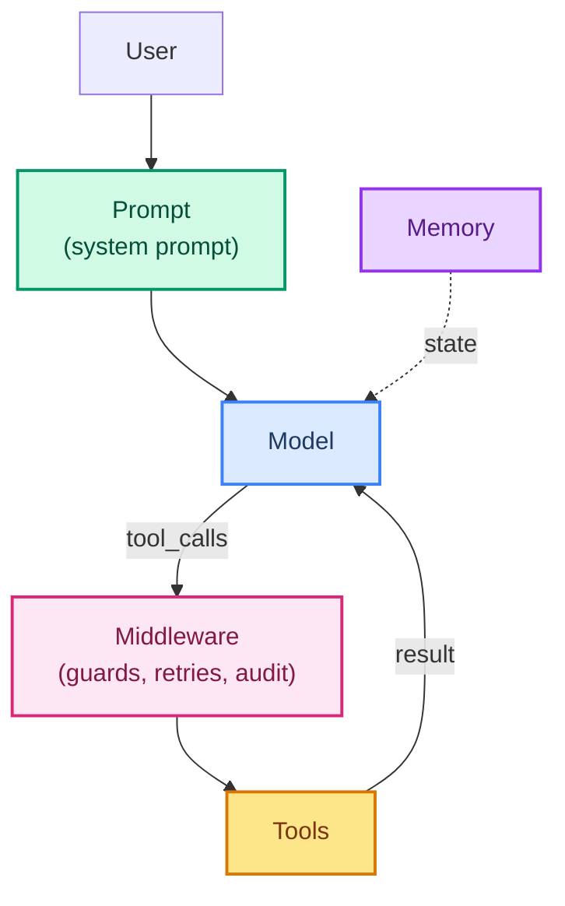

# 01: Model + Harness — the Decomposition

> **Part of the [Harness Engineering](./00-readme.md) notes.** This note pins down what "harness" means in LangChain and why it is the real thing you build.

---

## Agent = Model + Harness

LangChain's clean idea (from ch 14): an agent is not a special model. It is a normal model, plus a **harness** — the surrounding code that gives it tools, memory, instructions, and middleware.

```python
from langchain.agents import create_agent
from langchain_groq import ChatGroq

llm = ChatGroq(model="openai/gpt-oss-120b", temperature=0)

# The harness: everything in this call that is NOT the model
agent = create_agent(
    model=llm,
    tools=[...],                       # what it can do
    system_prompt="...",               # how it behaves
    middleware=[...],                  # how each call is wrapped
    checkpointer=InMemorySaver(),      # its memory
)
```

`llm` is the **model**. The rest is the **harness**. Every upgrade you make — better tools, guardrails, memory, retries — is harness work.

---

## The Five Harness Parts



1. **Prompt** — the standing instructions; the personality and policy (note 06).
2. **Model** — the LLM itself (note on model choice, ch 02).
3. **Tools** — functions exposed to the model (note 03).
4. **Middleware** — code around every model/tool call (note 02, 05).
5. **Memory** — state carried between calls and turns (note 04).

---

## Why "Harness" Matters as a Concept

Separating model from harness changes how you engineer:

- **The model is a commodity** — you can swap `ChatGroq` for another model and keep the whole harness (ch 40 model routing).
- **The harness is your property** — your tools, prompts, guardrails, and memory are the differentiating value.
- **You can test the harness alone** — a harness with no model is inspectable logic; a model with no harness is a chat box.

This is why the course emphasizes middleware and tools: that is the code with real work in it.

---

## Common Mistakes

- Treating the model wrapper as "the agent" and ignoring the harness.
- Gluing prompt, tools, and memory into one opaque blob (not testable).
- Swapping the model and expecting identical behavior — the harness must stay tuned.

---

## What You Learned

- Agent = model + harness; the harness is the surrounding code.
- The five parts: prompt, model, tools, middleware, memory.
- Model is a commodity; harness is the leverage.

**Next:** [02 - The Middleware Pipeline](./02-the-pipeline.md)