# 02: The Middleware Pipeline — Hooks Around Every Call

> **Part of the [Harness Engineering](./00-readme.md) notes.** Middleware is the spine of the harness: the place where every model call and tool call gets wrapped, guarded, logged, and shaped. Build on ch 14 and 17.

---

## The Hook Model

Middleware lets you run code **before** and **after** the two events that matter: model calls and tool calls. LangChain exposes these as hooks (ch 17):

| Hook | When it runs | What you do there |
|------|--------------|-------------------|
| `before_model` | right before the model is invoked | inject context, trim history, add guardrails |
| `after_model` | right after the model responds | validate output, count tokens, route |
| `before_tool_call` | right before a tool runs | validate args, check permissions, rate limit |
| `after_tool_call` | right after a tool returns | check success, truncate, audit |

```python
from langchain_core.middleware import (
    BaseMiddleware, BeforeModel, AfterModel, BeforeToolCall, AfterToolCall,
)

class AuditAndGuard(BaseMiddleware):
    async def before_tool_call(self, tc: BeforeToolCall):
        if tc.tool_name == "delete":
            raise PermissionError("delete is blocked")     # block early

    async def after_tool_call(self, tc: AfterToolCall):
        log_step(tc)                                       # audit (ch 35)
```

The order of hooks is fixed per call: `before_model → model → after_model → before_tool → tool → after_tool`. Middleware in the list run in sequence around those points.

---

## Pipeline Diagram

```mermaid
graph LR
    A["User message"] --> B1["before_model<br/>#1"]
    B1 --> B2["before_model<br/>#2"]
    B2 --> M["MODEL"]
    M --> A1["after_model #1"]
    A1 --> A2["after_model #2"]
    A2 --> T1["before_tool #1"]
    T1 --> T2["before_tool #2"]
    T2 --> TOOL["TOOL"]
    TOOL --> AT1["after_tool #1"]
    AT1 --> AT2["after_tool #2"]

    style M fill:#dbeafe,stroke:#3b82f6,stroke-width:2px,color:#1e3a5f
    style TOOL fill:#fde68a,stroke:#d97706,stroke-width:2px,color:#78350f
    style B1 fill:#e9d5ff,stroke:#9333ea,stroke-width:1px,color:#581c87
    style B2 fill:#e9d5ff,stroke:#9333ea,stroke-width:1px,color:#581c87
    style A1 fill:#e9d5ff,stroke:#9333ea,stroke-width:1px,color:#581c87
    style A2 fill:#e9d5ff,stroke:#9333ea,stroke-width:1px,color:#581c87
    style T1 fill:#fce7f3,stroke:#db2777,stroke-width:1px,color:#831843
    style T2 fill:#fce7f3,stroke:#db2777,stroke-width:1px,color:#831843
    style AT1 fill:#fce7f3,stroke:#db2777,stroke-width:1px,color:#831843
    style AT2 fill:#fce7f3,stroke:#db2777,stroke-width:1px,color:#831843
```



Notice: **the order of the middleware list matters**. Early middleware sees the raw input; later middleware sees what earlier ones changed.

---

## Real Middleware You Already Know

| Middleware | Category | Does what |
|-----------|----------|-----------|
| `ModelRetryMiddleware` | Fault tolerance | retries failed model calls (ch 15) |
| `ToolRetryMiddleware` | Fault tolerance | retries failed tools (ch 15) |
| `SummarizationMiddleware` | Context | compresses long history (ch 10) |
| `SubAgentMiddleware` | Delegation | spawns subagents (ch 26) |
| `TodoListMiddleware` | Planning | adds task tracking |
| Custom guards | Security | input/output validation (ch 16, 32) |

---

## The Two Middleware Styles

LangChain offers **function-style** (decorators) and **class-style** (async hooks) middleware. Both are in the harness, and both can coexist:

```python
from langchain.agents.middleware import wrap_model_call, wrap_tool_call

@wrap_model_call
async def trim_history(model, state):
    # shorten state["messages"] before the real call
    return await model(state)

@wrap_tool_call
async def guard_tool(tool, args):
    if tool.name in BLOCKED: return "BLOCKED"
    return await tool(args)
```

Class-style gives finer control (both pre- and post-hook on the same middleware); function-style is simpler for one-liner guards.

---

## Common Mistakes

- Assuming middleware order doesn't matter (it does).
- Doing side effects (sending emails, billing) inside `before_*` hooks — use `after_*` so the actual event confirmed first.
- Swallowing exceptions in middleware silently — keep the failure visible to the loop (see sibling [loop-engineering/03-error-recovery.md](../loop-engineering/03-error-recovery.md)).
- Reinventing built-ins (`ToolRetryMiddleware`) — use them first.

---

## What You Learned

- The four hook points and what each is for.
- Ordering of hooks and middleware list.
- Known prebuilt middleware; the two styles of writing your own.

**Next:** [03 - Tools](./03-tools.md) — the functions you hand the model.