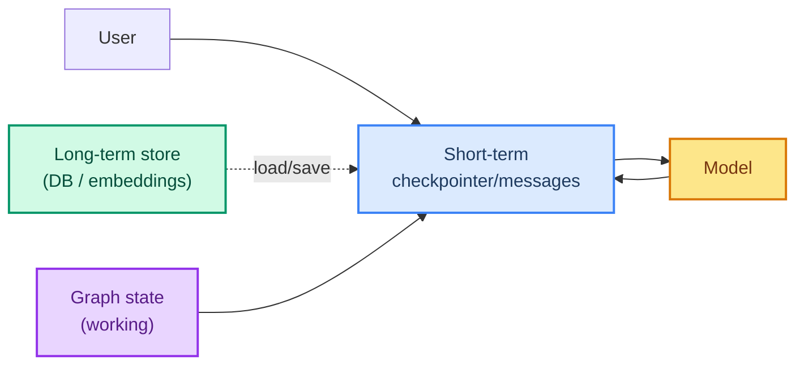

# 04: Memory — Holding State Across Calls and Turns

> **Part of the [Harness Engineering](./00-readme.md) notes.** Memory is the part of the harness that lets the agent carry context — across tool calls, across turns, and across sessions. Build on ch 07 and ch 08.

---

## Three Kinds of Memory

| Memory | Scope | Where it lives | Course |
|--------|-------|----------------|--------|
| **Short-term** | within a conversation/run | messages / checkpointer | ch 07 |
| **Long-term** | across sessions/conversations | a store / DB | ch 08 |
| **Working** | within a single loop step | graph state | loop-engineering |



## Short-Term Memory: The Checkpointer

LangGraph's `checkpointer` persists the run state (messages) so the loop can be paused, resumed, and continued across turns — this is the "memory" that makes HITL work (ch 18) and that the loop notes use for replay.

```python
from langgraph.checkpoint.memory import InMemorySaver

checkpointer = InMemorySaver()      # in-memory; swap for Postgres in prod
config = {"configurable": {"thread_id": "user-7"}}

# each invoke with the same thread_id continues the same conversation
first = agent.invoke({"messages": [("user", "hi")]}, config=config)
second = agent.invoke({"messages": [("user", "and now?")]}, config=config)
```

Same `thread_id` → same conversation memory. A new id starts fresh. In-memory saver is fine for dev; production uses a durable checkpointer (ch 30).

## Long-Term Memory: The Store

When an agent must *remember* facts across conversations (that a user prefers French, that a past task was done), use the `store` (ch 08). Semantic memory can also be retrieved by embedding (ch 21 RAG).

```python
from langgraph.store.memory import InMemoryStore

store = InMemoryStore(namespace=("user_prefs",))
store.put(("user_prefs", user_id), "tone",
          {"language": "french", "verbosity": "low"})
# load it back at conversation start
prefs = store.get(("user_prefs", user_id), "tone")
```

## Working Memory: Graph State (bridge to the loop)

Inside a single run, the **graph state** is working memory: counts, flags, accumulated results the model and nodes read each step. This is where loop boundaries (sibling notes) track step counts, token budgets, and error counts.

## Context Sliding / Truncation

Left alone, short-term memory grows every turn and **inflates tokens**. The harness trims it: `SummarizationMiddleware` (ch 10) compresses the head of the conversation, and you can truncate tool results before they re-enter state (as in the tools + loop notes).

```python
from langchain.agents.middleware import SummarizationMiddleware
agent = create_agent(model=llm, middleware=[
    SummarizationMiddleware(model=llm, max_tokens_before_summary=4000),
])
```

## Common Mistakes

- Reusing the same `thread_id` for unrelated tasks (mixing memory).
- Using in-memory checkpointers in production (lost on restart).
- Forgetting to **trim** — memory grows unbounded, eating the whole token budget (loop note 04).
- Storing secrets in the store (ch 36).

---

## What You Learned

- Short-term (checkpointer), long-term (store), working (graph state).
- `thread_id` controls conversation memory.
- Trimming/summarization keeps memory from blowing the budget.
- The loop carries working memory in graph state.

**Next:** [05 - Guardrails](./05-guardrails.md) — input/output guards