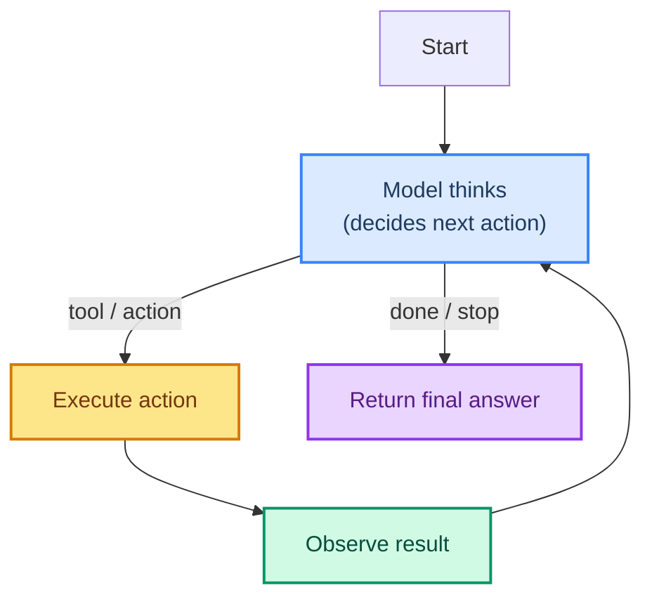

# Loop Engineering: Mastering the Agent's Control Loop

> **What this is:** Detailed engineering notes on the **agent loop** — the repeating cycle of *observe → reason → act* that sits at the heart of every LangChain agent. Whereas **harness engineering** (ch 14, 17) covers the pipeline *around* the model (middleware, memory, tools), **loop engineering** covers the *logic inside* that drives decisions: when to stop, how long to think, how to recover from mistakes, and how to keep the cycle safe, bounded, and observable.

---

## How to Use These Notes

Read them in order. Each note builds on the previous and ends with a short exercise. They assume you have already completed the core course up through [14 - Middleware Overview](../14-middleware-overview.md) and [27 - LangGraph Orchestration](../27-langgraph-orchestration.md).

```
docs/loop-engineering/
├── 00-readme.md            ← you are here
├── 01-what-is-the-loop.md  ← the observe-act loop anatomy
├── 02-loop-termination.md  ← when does the agent stop?
├── 03-error-recovery.md    ← retries, fallbacks, self-correction
├── 04-loop-boundaries.md   ← tokens, time, steps, cost limits
├── 05-loop-observability.md← tracing the loop (LangSmith hook-in)
├── 06-loop-vs-graph.md     ← free-form loop vs LangGraph state machines
└── 07-loop-security.md     ← prompt injection inside the loop
```

---

## The One Idea to Remember

An agent is not a single model call. It is a **loop**: the model proposes an action, a tool executes it, the result feeds back in, and the model proposes again — until a stopping condition is met.



That loop is tiny, but the discipline of engineering it — deciding **when it may run**, **how long it may run**, and **how it learns from its own mistakes** — is exactly what separates a demo from a production agent. That discipline is **loop engineering**.

---

## Why a Separate Folder?

The main course covers what each part does. These notes cover **how the parts interact as a system over time**:

| Aspect | Harness engineering (ch 14/17) | Loop engineering (this folder) |
|--------|--------------------------------|-------------------------------|
| Scope | Wraps a single model/tool event | Wraps the whole *cycle* of events |
| Question | What runs *around* each call? | When does the *whole process* stop? |
| Focus | Hooks: before/after model & tool | State: what is true at each step |
| Risk lens | Individual call failures | Runaway loops, budget blowout |
| Tool | Middleware decorators | Graph state, reducers, limits, checkpoints |

Both are needed. Middleware is your **per-event** control; loop engineering is your **whole-run** control.

Now start the notes: [01 - What Is the Loop](./01-what-is-the-loop.md)